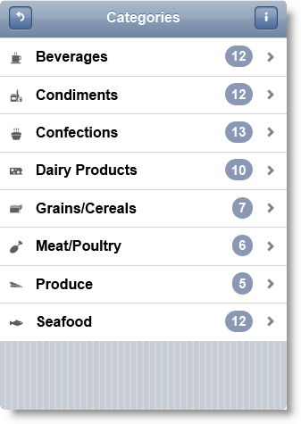
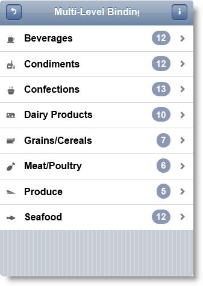
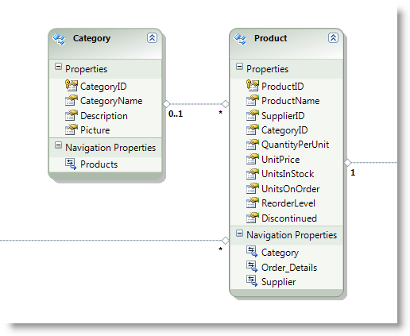
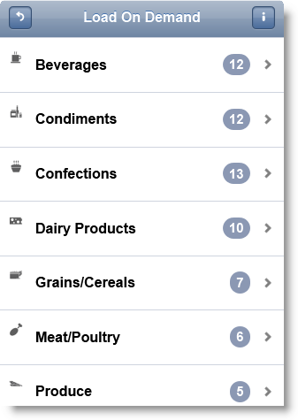

<!--
|metadata|
{
    "fileName": "iglistview-configuring-multi-level-data-binding",
    "controlName": "igListView",
    "tags": ["Data Binding","Drilldown","How Do I","MVC"]
}
|metadata|
-->

# Configuring Multi-Level Data Binding (igListView)

## Topic Overview

### Purpose

This topic shows how to bind `igListView`™ to hierarchical data.

#### Required Background

The following table lists the topics required as a prerequisite to understanding this topic.

- [igListView Overview](igListView-Overview.html): This topic explains the features of `igListView`™.

- [Adding igListView to a Web Page](igListView-Adding-igListView-to-a-Web-Page.html): This topic explains how you can add `igListView`™ mobile control to a web page.

- [Data Attributes Reference](igListView-Data-Attributes-Reference.html): This topic lists all `igListView`™ data attributes. You can use these attributes to initialize `igListView` in markup.


### In This Topic

This topic contains the following sections:

-   [Introduction](#introduction)
-   [Configuring igListView Multi-Level Data Binding in JavaScript](#js-multi-level)
-   [Configuring igListView with Hierarchical Data in MVC](#mvc-hierarchical)
-   [Configuring igListView with Load on Demand for Hierarchical Data in MVC](#mvc-load-on-demand)
-   [Related Content](#related-content)


## <a id="introduction"></a> Introduction
The `igListView` control can be bound to hierarchical data. Load on demand feature can be used to load the child levels.




## <a id="js-multi-level"></a> Configuring igListView Multi-Level Data Binding in JavaScript

This procedure initializes `igListView` for two-level hierarchy and binds it to a JavaScript array.

### Preview

The following screenshot is a preview of the final result.


### Requirements

To complete the procedure, you need to have installed %%ProductName%% %%ProductVersionShort%% product.

### Overview

This topic takes you step-by-step toward configuring `igListView` for a two-level hierarchy. The following is a conceptual overview of the process:

1.  [Adding the script references using Infragistics loader](#js-references)
2.  [Defining the data source](#js-data-source)
3.  [Creating a declarative configuration of igListView with multi-level data binding](#js-init-markup)
4.  [Optional: Instantiating igListView with multi-level data binding in JavaScript](#js-init-javascript)

### Steps

The following steps demonstrate how to configure `igListView` with sorting feature in JavaScript.

1. Add the script references using Infragistics loader <a id="js-references"></a>

	Following is a list of references needed for initializing `igListView`.
	
	**In HTML:**
	
	```html
	<link rel="stylesheet" href="jquery.mobile.structure.min.css" />
	<script type="text/javascript" src="jquery.min.js"></script>
	<script type="text/javascript" src="jquery.mobile.min.js"></script>
	<script type="text/javascript" src="infragistics.mobile.loader.js"></script>
	```
	
	**In JavaScript:**
	
	```js
	<script type="text/javascript">
	    $.ig.loader({
	        scriptPath: "../js/",
	        cssPath: "../css/",
	        resources: "igmList",
	        theme: "ios"
	    });
	</script>
	```

2. Define the data source <a id="js-data-source"></a>

	You need to define a `northwindCategoriesProducts` JavaScript as in the code snippet below. The array has a hierarchical relationship between `Categories` and `Products`.
	
	**In JavaScript:**
	
	```js
	var northwindCategoriesProducts = [
	    {"ImageUrl":"../content/images/nw/categories/1.png","ProductCount":12,
	        "CategoryName":"Beverages","Products":[
	        {"ImageUrl":"../content/images/nw/categories/1.png","InStock":39,
	            "ProductName":"Chai","CategoryName":"Beverages"},
	        {"ImageUrl":"../content/images/nw/categories/1.png","InStock":17,
	            "ProductName":"Chang","CategoryName":"Beverages"},
	        {"ImageUrl":"../content/images/nw/categories/1.png","InStock":20,
	            "ProductName":"Guaraná Fantástica","CategoryName":"Beverages"},
	        {"ImageUrl":"../content/images/nw/categories/1.png","InStock":111,
	            "ProductName":"Sasquatch Ale","CategoryName":"Beverages"},
	        {"ImageUrl":"../content/images/nw/categories/1.png","InStock":20,
	            "ProductName":"Steeleye Stout","CategoryName":"Beverages"},
	        {"ImageUrl":"../content/images/nw/categories/1.png","InStock":17,
	            "ProductName":"Côte de Blaye","CategoryName":"Beverages"},
	        {"ImageUrl":"../content/images/nw/categories/1.png","InStock":69,
	            "ProductName":"Chartreuse verte","CategoryName":"Beverages"},
	        {"ImageUrl":"../content/images/nw/categories/1.png","InStock":17,
	            "ProductName":"Ipoh Coffee","CategoryName":"Beverages"},
	        {"ImageUrl":"../content/images/nw/categories/1.png","InStock":52,
	            "ProductName":"Laughing Lumberjack Lager","CategoryName":"Beverages"},
	        {"ImageUrl":"../content/images/nw/categories/1.png","InStock":15,
	            "ProductName":"Outback Lager","CategoryName":"Beverages"},
	        {"ImageUrl":"../content/images/nw/categories/1.png","InStock":125,
	            "ProductName":"Rhönbräu Klosterbier","CategoryName":"Beverages"},
	        {"ImageUrl":"../content/images/nw/categories/1.png","InStock":57,
	            "ProductName":"Lakkalikööri","CategoryName":"Beverages"}
	    ]},
	    {"ImageUrl":"../content/images/nw/categories/2.png","ProductCount":12,
	        "CategoryName":"Condiments","Products":[]},
	    {"ImageUrl":"../content/images/nw/categories/3.png","ProductCount":13,
	        "CategoryName":"Confections","Products":[]},
	    {"ImageUrl":"../content/images/nw/categories/4.png","ProductCount":10,
	        "CategoryName":"Dairy Products","Products":[]},
	    {"ImageUrl":"../content/images/nw/categories/5.png","ProductCount":7,
	        "CategoryName":"Grains/Cereals","Products":[]},
	    {"ImageUrl":"../content/images/nw/categories/6.png","ProductCount":6,
	        "CategoryName":"Meat/Poultry","Products":[]},
	    {"ImageUrl":"../content/images/nw/categories/7.png","ProductCount":5,
	        "CategoryName":"Produce","Products":[]},
	    {"ImageUrl":"../content/images/nw/categories/8.png","ProductCount":12,
	        "CategoryName":"Seafood","Products":[]}
	]
	```

3. Create a declarative configuration of `igListView` with multi-level data binding <a id="js-init-markup"></a>

	In this step you need to define two nested UL (Unordered list) HTML elements with a lot of data-* attributes. Data-bindings-* are used to bind the list view predefined placeholders to the data source fields. Outer UL defines the Categories `igListView` and inner UL defines the `Products` `igListView`. The relationship between the two is defined in data-key attribute in the inner UL element. This means that this child layout will get its data from the `Products` property of each object in `northwindCategoriesProducts` array.
	
	**In HTML:**
	
	```html
	<ul id="listViewMultiLevel"
	    data-role="iglistview"
	    data-image-mode="icon"
	    data-data-source="northwindCategoriesProducts" 
	    data-bindings-text-key="CategoryName"
	    data-bindings-details-title-key="CategoryName"
	    data-bindings-image-url-key="ImageUrl"
	    data-bindings-count-key="ProductCount">
	    <li>    
	        <ul data-role="childLayout"
	        data-key="Products"
	        data-image-mode="icon"
	        data-bindings-description-key="CategoryName"
	        data-bindings-text-key="ProductName"
	        data-bindings-image-url-key="ImageUrl"
	        data-bindings-count-key="InStock">
	        </ul>
	    </li>
	</ul>
	```

4. Optional: Instantiate `igListView` with multi-level data binding in JavaScript <a id="js-init-javascript"></a>
​	
	1. Define the DOM (Document Object Model) Html element placeholder.

		**In HTML:**
		
		```html
		<div id="listViewMultiLevel"></div>
		```

	2. Instantiate an `igListView` in JavaScript.
	
		**In JavaScript:**
		
		```js
		$.ig.loader(function() {
		    $("#listViewMultiLevel").igListView({
		        dataSource: northwindCategoriesProducts,
		        iconMode: "icon",
		        bindings: {
		            detailsTitleKey: "CategoryName",
		            textKey: "CategoryName",
		            imageUrlKey: "ImageUrl",
		            countKey: "ProductCount"
		        },
		        childLayout: {
		            key: "Products",
		            iconMode: "icon",
		            descriptionKey: "CategoryName",
		            textKey: "ProductName",
		            imageUrlKey: "ImageUrl",
		            countKey: "InStock"
		        }
		    });
		});
		```


## <a id="mvc-hierarchical"></a> Configuring igListView with Hierarchical Data in MVC

This procedure initializes `igListView` in Razor code with hierarchical data from `Categories` and `Products` tables in Northwind database. Two custom model classes are defined `ProductViewModel` and `CategoryViewModel` which basically resemble entity model classes `Product` and `Category`. Data is transferred through strongly typed Model to the View.

### Preview

The following screenshot is a preview of the final result.



### Requirements

To complete the procedure, you need the following:

-   Microsoft ®Visual Studio 2010 or newer installed
-   MVC 3 Framework installed
-   Northwind Database installed
-   *Infragistics.Web.Mvc.Mobile.dll* added
-   %%ProductName%% jQuery Mobile Files added

### Overview

This topic takes you step-by-step toward configuring `igListView` with hierarchical data in MVC. The following is a conceptual overview of the process:

1. [Defining the Model](#mvc-local-model)
2. [Defining the View](#mvc-local-view)
3. [Defining the Controller](#mvc-local-controller)

### Steps

The following steps demonstrate how to define Model, View and Controller for configuring `igListView`.

1. Define the Model <a id="mvc-local-model"></a>

	1.  Add ADO.NET Entity Data Model for `Product` and `Category` tables in Northwind Database and name it `NorthwindModel`.
		
		

	2.  Add a new Class to folder Models and name it *ProductViewModel.cs*.

	    **In C#:**
	
	    ```csharp
	    public class ProductViewModel
	    {
	        public string ProductName { get; set; }
	        public string CategoryName { get; set; }
	        public string ImageUrl { get; set; }
	        public int InStock { get; set; }
	    }
	    ```

	3.  Add a new Class to folder Models and name it *CategoryViewModel.cs*.

	    **In C#:**
	
	    ```csharp
	    public class CategoryViewModel
	    {
	        public string CategoryName { get; set; }
	        public List<ProductViewModel> Products { get; set; }
	        public string ImageUrl { get; set; }
	        private int _productCount = 0;
	        public int ProductCount
	        {
	            get
	            {
	                return this.Products.Count;
	            }
	        }
	        public CategoryViewModel()
	        {
	            this.Products = new List<ProductViewModel>();
	        }
	    }
	    ```

2. Define the View <a id="mvc-local-view"></a>

	Add a new View to the Views folder. Name it *igListViewMultiLevel.cshtml*.
	
	**In C#:**
	
	```csharp
	@model IQueryable<CategoryViewModel>
	<script type="text/javascript" src="infragistics.mobile.loader.js"></script>
	@(Html.InfragisticsMobile().
	    Loader().
	    ScriptPath("../js/").
	    CssPath("../css/").
	    Render())
	@(Html
	    .InfragisticsMobile()
	    .ListView(Model)
	    .ID("multiLevelListView")
	    .ImageMode(ImageMode.Icon)
	    .Bindings(b =>
	    {
	        b.TextKey("CategoryName")
	        .ImageUrlKey("ImageUrl")
	        .DetailsTitleKey("CategoryName") 
	        .CountKey("ProductCount");
	    })
	    .ChildLayout(layout =>
	    {
	        layout.For(c => c.Products)
	        .Key("Products")
	        .ImageMode(ImageMode.Icon)
	        .Bindings(b =>
	        {
	            b.TextKey("ProductName")
	            .ImageUrlKey("ImageUrl")
	            .DescriptionKey("CategoryName")
	            .CountKey("InStock");
	        });
	    })
	    .DataBind()
	    .Render()
	)
	```

3. Define the Controller <a id="mvc-local-controller"></a>

	1. Add a new Controller to the *Controllers* folder. Name it *ListViewController.cs*.

	2. Add a new Action to the controller which will initialize the `igListView`. Name it `igListViewMultiLevel`.

	3. `GetCategoriesAndProducts` is helper method which is transforming database model schema into the custom model classes defined in step 1.

	**In C#:**

	```csharp
	public class ListViewController : Controller
	{
	    public ActionResult igListViewMultiLevel()
	    {
	        var categoryModels = GetCategoriesAndProducts();
	        return View(categoryModels.AsQueryable());
	    }
	    
	    public IQueryable<CategoryViewModel> GetCategoriesAndProducts()
	    {
	        var categories = (from c in new NorthwindEntities().Categories.Include("Products")
	                select c);
	        var categoryModels = new List<CategoryViewModel>();
	        foreach (var category in categories)
	        {
	            string imageUrl = _url.Content(
	                String.Format("~/content/images/mobile/categories/{0}.png",
	                category.CategoryID));
	            var categoryModel = new CategoryViewModel
	            {
	                CategoryName = category.CategoryName,
	                ImageUrl = imageUrl
	            };
	            foreach (var product in category.Products)
	            {
	                categoryModel.Products.Add(new ProductViewModel
	                {
	                    CategoryName = category.CategoryName,
	                    ProductName = product.ProductName,
	                    InStock = int.Parse(product.UnitsInStock.ToString()),
	                    ImageUrl = imageUrl
	                });
	            }
	            categoryModels.Add(categoryModel);
	        }
	        return categoryModels.AsQueryable();
	    }
	}
	```


## <a id="mvc-load-on-demand"></a> Configuring igListView with Load on Demand for Hierarchical Data in MVC

This procedure initializes `igListView` in Razor code with Load on Demand feature enabled for the child layout. Hierarchical data is taken from Categories and Products tables in Northwind database. Tree custom model classes are defined `ProductViewModel` and `CategoryViewModel` which basically resemble entity model classes `Product` and `Category` and `LoadOnDemandViewModel` which is used for Json serialization. Data for the Categories view is transferred through strongly typed Model to the View. Data for the child layout (Products) is transferred on demand with Json by the `ProductJSONOnDemand` action method which returns `JsonResult`.

### Preview

The following screenshot is a preview of the final result.



### Requirements

To complete the procedure, you need the following:

-   Microsoft® Visual Studio 2010 or newer installed
-   MVC 3 Framework installed
-   Northwind Database installed
-   *Infragistics.Web.Mvc.Mobile.dll* added
-   %%ProductName%% jQuery Mobile Files added

### Overview

This topic takes you step-by-step toward configuring `igListView` in MVC. The following is a conceptual overview of the process:

1.  [Defining the Model](#mvc-on-demand-model)
2.  [Defining the View](#mvc-on-demand-view)
3.  [Defining the Controller](#mvc-on-demand-controller)

### Steps

The following steps demonstrate how to define Model, View and Controller for configuring `igListView`.

1. Define the Model <a id="mvc-on-demand-model"></a>

	1.  Add an ADO.NET Entity Data Model for Product and Category tables in Northwind Database and name it NorthwindModel.

		

	2.  Add a new Class to folder Models and name it *ProductViewModel.cs*.
	
	    **In C#:**
	
	    ```csharp
	    public class ProductViewModel
	    {
	        public string ProductName { get; set; }
	        public string CategoryName { get; set; }
	        public string ImageUrl { get; set; }
	        public int InStock { get; set; }
	    }
	    ```
	
	3.  Add a new Class to folder Models and name it *CategoryViewModel.cs*.
	
	    **In C#:**
	
	    ```csharp
	    public class CategoryViewModel
	    {
	        public string CategoryName { get; set; }
	        public List<ProductViewModel> Products { get; set; }
	        public string ImageUrl { get; set; }
	        private int _productCount = 0;
	        public int ProductCount
	        {
	            get
	            {
	                return this.Products.Count;
	            }
	        }
	        public CategoryViewModel()
	        {
	            this.Products = new List<ProductViewModel>();
	        }
	    }
	    ```
	
	4.  Add a new Class to folder Models and name it *LoadOnDemandViewModel.cs*.
	
	    **In C#:**
	
	    ```csharp
	    public class LoadOnDemandViewModel
	    {
	        public IEnumerable<object> Records { get; set; }
	        public int TotalRecordsCount { get; set; }
	    }
	    ```

2. Define the View <a id="mvc-on-demand-view"></a>

	Add a new View to the Views folder. Name it *igListViewLoadOnDemand.cshtml*.
	
	**In C#:**
	
	```csharp
	@model IQueryable<CategoryViewModel>
	<script type="text/javascript" src="infragistics.mobile.loader.js"></script>
	@(Html.InfragisticsMobile().
	    Loader().
	    ScriptPath("../js/").
	    CssPath("../css/").
	    Resources("igmList.LoadOnDemand").
	    Render())
	@(Html
	    .InfragisticsMobile()
	    .ListView(Model)
	    .ID("loadOnDemandListView")
	    .ImageMode(ImageMode.Icon)
	    //Configures children to be requested from the server
	    .LoadChildrenOnDemand(true)
	    .Bindings(b =>
	    {
	        b.HeaderKey("CategoryName")
	        .PrimaryKey("CategoryName")
	        .CountKey("ProductCount")
	        .ImageUrlKey("ImageUrl")
	        .DetailsTitleKey("CategoryName");
	    })
	    .ChildLayout(layout =>
	    {
	        layout.For(c => c.Products)
	        .Key("Products")
	        .ImageMode(ImageMode.Icon)
	        .Bindings(b =>
	        {
	            b.TextKey("ProductName")
	            .DescriptionKey("CategoryName")
	            .ImageUrlKey("ImageUrl");
	        })
	        .DataSourceUrl(Url.Action("ProductJSONOnDemand"));
	    })
	    .DataBind()
	    .Render()
	)
	```

3. Define the Controller <a id="mvc-on-demand-controller"></a>

	1.  Add a new Controller to the *Controllers* folder. Name it *ListViewController.cs*.
	2.  Add a new Action to the controller which will initialize the `igListView` . Name it `igListViewLoadOnDemand`.
	3.  Add a new Action to the controller which will return load on demand data. Name it `ProductJSONOnDemand`.
	
	`GetProductsOnDemand` is helper method which is transforming database model schema into our custom model classes defined in step 1.
	
	**In C#:**
	
	```csharp
	public class ListViewController : Controller
	{
	    public ActionResult igListViewLoadOnDemand()
	    {
	        var categoryModels = new ViewModelCollectionHelper(Url.RequestContext).GetCategories();
	        return View(categoryModels.AsQueryable());
	    }
	    
	    public JsonResult ProductJSONOnDemand()
	    {
	        var query = this.HttpContext.Request.QueryString;
	        // extract Category Name from the query string
	        var category = query["path"].Substring("CategoryName:".Length);
	        var loadOnDemandModel = GetProductsOnDemand(category);
	        return Json(loadOnDemandModel, JsonRequestBehavior.AllowGet);
	    }
	    public LoadOnDemandViewModel GetProductsOnDemand(string category)
	    {
	        var products = (from p in new NorthwindEntities().Products.Include("Category")
	                        where (p.Category.CategoryName == category)
	                        select p).OrderBy(p => p.CategoryID);
	        var productCount = (from p in new NorthwindEntities().Products.Include("Category")
	                            where (p.Category.CategoryName == category)
	                            select p).Count();
	        var productModels = new List<ProductViewModel>();
	        UrlHelper urlHelper = new UrlHelper(Url.RequestContext);
	        foreach (var product in products)
	        {
	            productModels.Add(
	                new ProductViewModel
	                {
	                    CategoryName = product.Category.CategoryName,
	                    ProductName = product.ProductName,
	                    InStock = int.Parse(product.UnitsInStock.ToString()),
	                    ImageUrl = urlHelper.Content(
	                        String.Format("~/content/images/mobile/categories/{0}.png",
	                        product.CategoryID))
	                });
	        }
	        var results = new LoadOnDemandViewModel
	        {
	            Records = productModels.AsQueryable(),
	            TotalRecordsCount = productCount
	        };
	        return results;
	    }
	}
	```


## <a id="related-content"></a> Related Content

### <a id="topics"></a> Topics

The following topics provide additional information related to this topic.

- [Configuring Sorting](igListView-Configuring-Sorting.html): This topic shows how to use sorting feature of `igListView`™.

- [Configuring Filtering](igListView-Configuring-Filtering.html): This topic shows how to use filtering feature of `igListView`™.

- [Configuring Grouping](igListView-Configuring-Grouping.html): This topic shows how to use grouping feature of `igListView`™.

- [Configuring Load-on-Demand](igListView-Configuring-Load-on-Demand.html): This topic shows how to use load on demand feature of `igListView`™.


### <a id="samples"></a> Samples

The following samples provide additional information related to this topic.

- [Load on Demand](%%SamplesUrl%%/mobile-list-view/load-on-demand): This sample shows remote load on demand feature.


 

 


