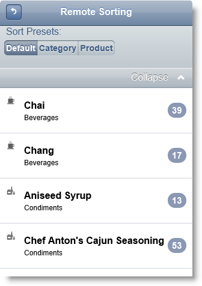
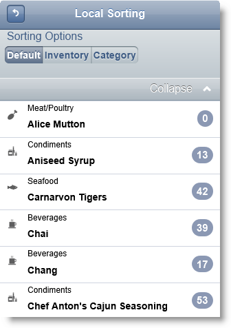
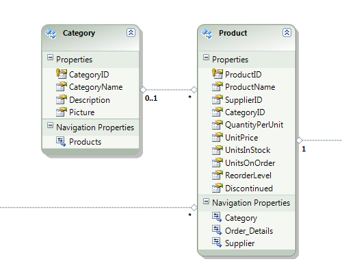
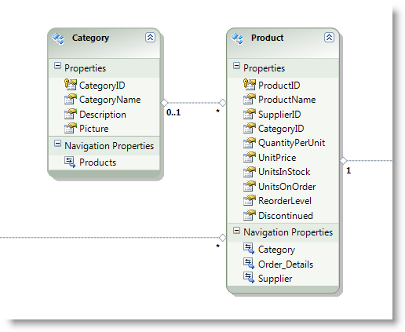

<!--
|metadata|
{
    "fileName": "iglistview-configuring-sorting",
    "controlName": "igListView",
    "tags": ["How Do I","Sorting"]
}
|metadata|
-->

# Configuring Sorting (igListView)

## Topic Overview

### Purpose

This topic shows how to use sorting feature of `igListView`™.

### Required background

The following lists the topics required as a prerequisite to understanding this topic.

- [igListView Overview](igListView-Overview.html): This topic explains the features of `igListView`™.

- [Adding igListView to a Web Page](igListView-Adding-igListView-to-a-Web-Page.html): This topic explains how you can add `igListView`™ mobile control to a web page.

- [Data Attributes Reference](igListView-Data-Attributes-Reference.html): This topic lists all `igListView`™ data attributes. You can use these attributes to initialize `igListView` in markup.


### In this topic

This topic contains the following sections:

-   [**Introduction**](#introduction)
-   [**Property Reference**](#property-reference)
-   [**Method Reference**](#method-reference)
-   [**Events Reference**](#events-reference)
-   [**Configuring igListView Sorting in JavaScript**](#js)
    -   [Preview](#js-preview)
    -   [Requirements](#js-requirements)
    -   [Overview](#js-overview)
    -   [Steps](#js-steps)
-   [**Configuring igListView with Local Sorting in MVC**](#mvc-local)
    -   [Preview](#mvc-local-preview)
    -   [Requirements](#mvc-local-requirements)
    -   [Overview](#mvc-local-overview)
    -   [Steps](#mvc-local-steps)
-   [**Configuring igListView with Remote Sorting in MVC**](#mvc-remote)
    -   [Preview](#mvc-remote-preview)
    -   [Requirements](#mvc-remote-requirements)
    -   [Overview](#mvc-remote-overview)
    -   [Steps](#mvc-remote-steps)
-   [**Related Content**](#related-content)
    -   [Topics](#topics)
    -   [Samples](#samples)


## <a id="introduction"></a> Introduction

The `igListView` control has a built-in sorting functionality. Sorting is defined by presets. Presets can be auto generated (`autoGenerateSortPresets: true`) or manually defined. Preset is predefined sorting condition which is visualized like a radio button group. Sorting can be local for the page and remote on the server. For MVC 3 scenarios `igListView` MVC wrapper functionality has remote sorting support out of the box. Configuring remote sorting is easy. You just need to add `ListViewDataSourceAction` attribute to your action method.

Sorting has a grouping functionality which can be set for individual presets or for the sorted fields. For more information on grouping refer to the [Related Content](#related-content) section.

Apart from grouping you can create list dividers to group the list items. List dividers are read-only items which are enabled by setting the `isDividerKey` property in the bindings setting. However this property works only if `sortedFields` property is empty. The `isDividerKey` property is applied only if data comes directly from the data source and is not modified from `igListView` feature.

> **Note:** When `isDividerKey` is set in the bindings property, divider items are rendered for the default preset (`sortedFields` property must be empty). When sorting is applied from a preset or custom applied sorting, divider items are stripped out from the list. This is because dividers would no longer be in the correct order.




## <a id="property-reference"></a> Property Reference

This section describes the various properties of `igListView` Sorting feature.

The following table summarizes the purpose and functionality of the `igListView` Sorting control’s featured properties.

Property | Description
---|---
[autoGenerateSortPresets](%%jQueryApiUrl%%/mobile.igListViewSorting#options:autoGenerateSortPresets) | When true, and presets array is null, a preset will be generated for every binding.
[caseSensitive](%%jQueryApiUrl%%/mobile.igListViewSorting#options:caseSensitive) | Case sensitivity of the sorting.
[customSortFunction](%%jQueryApiUrl%%/mobile.igListViewSorting#options:customSortFunction) | Custom sort function accepting three parameters: <br /> <ul> <li>the data to be sorted</li><li>an array of data source field definitions</li><li>the direction to sort with (optional).</li></ul>  The function should return the sorted data array.
[groupComparerFunction](%%jQueryApiUrl%%/mobile.igListViewSorting#options:groupComparerFunction) | Specifies a custom group by function, which accepts the first and the second value to compare and returns a `bool` indicating whether they are in the same group.
[groupingSettings](%%jQueryApiUrl%%/mobile.igListViewSorting#options:groupingSettings) | An object with settings that control how grouping appears for default fields and all presets.
[groupNameFunction](%%jQueryApiUrl%%/mobile.igListViewSorting#options:groupNameFunction) | Specifies a custom group name function, which accepts a value of the group and returns the name that should be displayed.
[showGrouping](%%jQueryApiUrl%%/mobile.igListViewSorting#options:showGrouping) | Use this property to apply grouping for the sorted items.
[sortedFields](%%jQueryApiUrl%%/mobile.igListViewSorting#options:sortedFields) | A list of key/value pairs (fieldName and direction) representing the sorted fields and their direction.
[sortPresetsLabel](%%jQueryApiUrl%%/mobile.igListViewSorting#options:sortPresetsLabel) | The text that is displayed above the sort presets.
[sortState](%%jQueryApiUrl%%/mobile.igListViewSorting#options:sortState) | The number of the preset which will be initially selected. Use default when no preset should be selected.
[presets](%%jQueryApiUrl%%/mobile.igListViewSorting#options:presets) | A list of preset sorting options.
[type](%%jQueryApiUrl%%/mobile.igListViewSorting#options:type) | Defines local or remote sorting.


## <a id="method-reference"></a> Method Reference

This section describes the methods of `igListView` Sorting feature.

The following table summarizes the purpose and functionality of the `igListView` Sorting control’s featured properties.

<table class="table table-striped">
	<thead>
		<tr>
            <th>
Method
			</th>
            <th>
Description
			</th>
            <th>
Parameters
			</th>
        </tr>
	</thead>
	<tbody>
        <tr>
            <td>
[group](%%jQueryApiUrl%%/mobile.igListViewSorting#methods:group)
			</td>
            <td>
This method applies grouping to the items.
			</td>
            <td>
                <ul>
                    <li>
fields – array of field definitions
					</li>
                    <li>
defaultDirection – direction of the sorting (asc or desc)
					</li>
                    <li>
trayText – text in the tray area
					</li>
                    <li>
groupFx – group function
					</li>
                    <li>
groupNameFx – group name function
					</li>
                </ul>
            </td>
        </tr>
        <tr>
            <td>
[sort](%%jQueryApiUrl%%/mobile.igListViewSorting#methods:sort)
			</td>
            <td>
This method applies sorting to the items.
			</td>
            <td>
                <ul>
                    <li>
fields – array of field definitions
					</li>
                    <li>
defaultDirection – direction of the sorting (asc or desc)
					</li>
                    <li>
trayText – text in the tray area
					</li>
                </ul>
            </td>
        </tr>
        <tr>
            <td>
[destroy](%%jQueryApiUrl%%/mobile.igListViewSorting#methods:destroy)
			</td>
            <td>
Destroys the widget.
			</td>
            <td>
N/A
			</td>
        </tr>
    </tbody>
</table>


## <a id="events-reference"></a> Events Reference

This section lists the events fired by `igListView` Sorting feature.

The following table summarizes the purpose and functionality of the `igListView` control’s events.

Event | Description | Cancellable
---|---|---
[presetChanging](%%jQueryApiUrl%%/mobile.igListViewSorting#events:presetChanging) | This event is fired before sort preset is changed. | true
[presetChanged](%%jQueryApiUrl%%/mobile.igListViewSorting#events:presetChanged) | This event is fired after the preset has been changed and the data re-rendered. | false


## <a id="js"></a> Configuring igListView Sorting in JavaScript

This procedure initializes `igListView` with sorting feature enabled and binds it to a JavaScript array. Sorting is enabled for `CategoryName` and `InStock` columns.

### <a id="js-preview"></a> Preview

The following screenshot is a preview of the final result.



### <a id="js-requirements"></a> Requirements

To complete the procedure, you need to have installed %%ProductName%% %%ProductVersionShort%% product.

### <a id="js-overview"></a> Overview

This topic takes you step-by-step toward configuring `igListView` with sorting feature in JavaScript. The following is a conceptual overview of the process:

1.  [Adding the script references using Infragistics loader](#js-add-references)
2.  [Defining the data source](#js-define-data-source)
3.  [Making a declarative configuration of igListView with sorting feature](#js-init-markup)
4.  [Optional: Instantiating igListView with sorting feature in JavaScript](#js-init-javascript)

### <a id="js-steps"></a> Steps

The following steps demonstrate how to configure `igListView` with sorting feature in JavaScript.

1. Add the script references using Infragistics loader <a id="js-add-references"></a>

	Following is a list of references needed for initializing `igListView` with sorting feature enabled. To enable sorting feature with loader you need to set resources property to `igmList.Sorting`.
	
	**In HTML:**
	
	```html
	<link rel="stylesheet" href="jquery.mobile.structure.min.css" />
	<script type="text/javascript" src="jquery.min.js"></script>
	<script type="text/javascript" src="jquery.mobile.min.js"></script>
	<script type="text/javascript" src="infragistics.mobile.loader.js"></script>
	```
	
	**In JavaScript:**
	
	```js
	<script type="text/javascript">
	    $.ig.loader({
	        scriptPath: "../js/",
	        cssPath: "../css/",
	        resources: "igmList.Sorting",
	        theme: "ios"
	    });
	</script>
	```

2. Define the data source <a id="js-define-data-source"></a>

	You need to define a `northwindProducts` JavaScript array with `ProductName`, `CategoryName`, `ImageUrl` and `InStock` fields.
	
	**In JavaScript:**
	
	```js
	var northwindProducts = [
	
	    { "ProductName": "Chai", "CategoryName": "Beverages", 
	
	        "ImageUrl": "../content/images/nw/categories/1.png", "InStock": 39 },
	
	    { "ProductName": "Chang", "CategoryName": "Beverages", 
	
	        "ImageUrl": "../content/images/nw/categories/1.png", "InStock": 17 },
	
	    { "ProductName": "Uncle Bobu0027s Organic Dried Pears", "CategoryName": "Produce", 
	
	        "ImageUrl": "../content/images/nw/categories/7.png", "InStock": 15 },
	
	    { "ProductName": "Ikura", "CategoryName": "Seafood", 
	
	        "ImageUrl": "../content/images/nw/categories/8.png", "InStock": 31 },
	
	    { "ProductName": "Queso Cabrales", "CategoryName": "Dairy Products", 
	
	        "ImageUrl": "../content/images/nw/categories/4.png", "InStock": 22 },
	
	    { "ProductName": "Rössle Sauerkraut", "CategoryName": "Produce", 
	
	        "ImageUrl": "../content/images/nw/categories/7.png", "InStock": 26 },
	
	    { "ProductName": "Thüringer Rostbratwurst", "CategoryName": "Meat/Poultry", 
	
	        "ImageUrl": "../content/images/nw/categories/6.png", "InStock": 0 },
	
	    { "ProductName": "Nord-Ost Matjeshering", "CategoryName": "Seafood", 
	
	        "ImageUrl": "../content/images/nw/categories/8.png", "InStock": 10 }
	
	]
	```

3. Make a declarative configuration of `igListView` with sorting feature <a id="js-init-markup"></a>

	You need to define an UL HTML element with a lot of data-* attributes. Data-bindings-* are used to bind the list view predefined placeholders to data source fields. Data-sorting-* attributes are used to configure the sorting feature.
	
	Refer to the data-sorting-presets attribute so you can configure an array of presets as JavaScript code.
	
	**In HTML:**
	
	```html
	<ul id="igListViewSorting"
	    data-role="iglistview" 
	    data-data-source="northwindProducts"                 
	    data-auto-generate-layouts="False" 
	    data-bindings-text-key="ProductName"
	    data-bindings-description-key="CategoryName"
	    data-bindings-image-url-key="ImageUrl"
	    data-bindings-count-key="InStock"
	    data-sorting-name="Sorting" 
	    data-sorting="true" 
	    data-sorting-type="local"
	    data-sorting-sort-presets-label="Sorting options" 
	    data-sorting-auto-generate-sort-presets="false" 
	    data-sorting-presets='[ {"text":"Inventory","sortedFields":[ {"fieldName":"InStock","direction":"desc"} ]}, {"text":"Category","sortedFields":[ {"fieldName":"CategoryName","direction":"asc"} ]} ]'>
	</ul>
	```

4. Optional: Instantiate `igListView` with sorting feature in JavaScript <a id="js-init-javascript"></a>

	1. Define the DOM Html element placeholder.
	
		**In HTML:**
		
		```html
		<div id="igListViewSorting"></div>
		```
	
	2. Instantiate an `igListView` in JavaScript.
	
		**In JavaScript:**
		
		```js
		<script type="text/javascript">
		    $(function () {
		        $("#igListViewSorting").igListView({
		            dataSource: northwindProducts,
		            bindings: {
		                descriptionKey: "CategoryName",
		                textKey: "ProductName",
		                imageUrlKey: "ImageUrl",
		                countKey: "InStock"
		            },
		            features: [
		                {
		                    name: "Sorting",
		                    type: "local",
		                    autoGenerateSortPresets: false,
		                    presets: [
		                        {
		                            text: "Inventory",
		                            sortedFields: [
		                                {
		                                    fieldName: "InStock",
		                                    direction: "desc"
		                                }
		                            ]
		                        },
		                        {
		                            text: "Category",
		                            sortedFields: [
		                                {
		                                    fieldName: "CategoryName",
		                                    direction: "asc"
		                                }
		                            ]
		                        }
		                    ]
		                }
		            ]
		        });
		    });
		</script>
		```


## <a id="mvc-local"></a> Configuring igListView with Local Sorting in MVC

This procedure initializes `igListView` in Razor code with sorting feature enabled and binds it to Json object. Actual sorting operations are done on the client. Two presets are manually configured: `Inventory` and `Category`. Sorting is enabled for `CategoryName` and `InStock` columns.

### <a id="mvc-local-preview"></a> Preview

The following screenshot is a preview of the final result.


### <a id="mvc-local-requirements"></a> Requirements

To complete the procedure, you need the following:

-   Microsoft ® Visual Studio 2010 or newer installed
-   MVC 3 Framework installed
-   Northwind Database installed
-   *Infragistics.Web.Mvc.Mobile.dll* added
-   %%ProductName%% jQuery Mobile Files added

### <a id="mvc-local-overview"></a> Overview

This topic takes you step-by-step toward configuring `igListView` in MVC. The following is a conceptual overview of the process:

1.  [Defining the Model](#mvc-local-model)
2.  [Defining the View](#mvc-local-view)
3.  [Defining the Controller](#mvc-local-controller)

### <a id="mvc-local-steps"></a> Steps

The following steps demonstrate how to define Model, View and Controller for configuring `igListView`.

1. Define the Model <a id="mvc-local-model"></a>

	1.  Add an ADO.NET Entity Data Model for `Product` and `Category` tables in *Northwind Database* and name it `NorthwindModel`.
	
		
	
	2.  Add a new Class to folder Models and name it *ProductViewModel.cs*.
	
	    **In C#:**
	
	    ```csharp
	    public class ProductViewModel
	    {
	        public string ProductName { get; set; }
	        public string CategoryName { get; set; }
	        public string ImageUrl { get; set; }
	        public int InStock { get; set; }
	    }
	    ```

2. Define the View <a id="mvc-local-view"></a>

	Add a new View to the Views folder. Name it *igListViewSorting.cshtml*.
	
	**In C#:**
	
	```csharp
	@(Html
	    .InfragisticsMobile()
	    .ListView(Model)
	    .ID("sortingPresetsListView")
	    .ResponseDataKey("")
	    .ImageMode(ImageMode.Icon)
	    .Bindings(b =>
	    {
	        b.TextKey("ProductName")
	        .DescriptionKey("CategoryName")
	        .ImageUrlKey("ImageUrl")
	        .CountKey("InStock");
	    })
	    .Features(features =>
	    {
	        features
	            .Sorting()
	            .AutoGenerateSortPresets(false)
	            .Type(OpType.Local)
	            .SortPresetsLabel("Default")
	            .Presets(p =>
	            {
	                p.Preset()
	                    .Text("Inventory")
	                    .SortedFields(f =>
	                    {
	                        f.SortedField()
	                            .FieldName("InStock")
	                            .Direction(SortMode.Descending);
	                    });
	                p.Preset()
	                    .Text("Category")
	                    .SortedFields(f =>
	                    {
	                        f.SortedField()
	                            .FieldName("CategoryName")
	                            .Direction(SortMode.Ascending);
	                    });
	            });
	    })
	    .DataSourceUrl(@Url.Action("productjson", "sampledatajson"))
	    .DataBind()
	    .Render()
	)
	```

3. Define the Controller <a id="mvc-local-controller"></a>

	1. Add a new Controller to the *Controllers* folder. Name it *SampleDataJsonController.cs*.
	
	2. Add a new Action to the controller which will return `JsonResult`. Name it `ProductJSON`.
	
	**In C#:**
	
	```csharp
	public class SampleDataJsonController : Controller
	{
	    public JsonResult ProductJSON()
	    {
	        var products = GetProducts(30);
	        return Json(products, JsonRequestBehavior.AllowGet);
	    }
	    
	    private IQueryable<ProductViewModel> GetProducts(int count)
	    {
	        var products = (from e in new NorthwindEntities().Products.Include("Category")
	                         select e).Take<Product>(count);
	        var productModels = new List<ProductViewModel>();
	        foreach (var product in products)
	        {
	            productModels.Add(
	                new ProductViewModel
	                {
	                    CategoryName = product.Category.CategoryName,
	                    ProductName = product.ProductName,
	                    InStock = int.Parse(product.UnitsInStock.ToString()),
	                    ImageUrl = _url.Content(
	                        String.Format("~/content/images/mobile/categories/{0}.png", 
	                        product.CategoryID))
	                });
	        }
	        return productModels.AsQueryable();
	    }
	}
	```


## <a id="mvc-remote"></a> Configuring igListView with Remote Sorting in MVC

This procedure initializes `igListView` in Razor code with sorting feature enabled and binds it to Json object. Actual sorting operations are done on the server. Two presets are manually configured: `Inventory` and `Category`. Sorting is enabled for `CategoryName` and `InStock` columns.

### <a id="mvc-remote-preview"></a> Preview

The following screenshot is a preview of the final result.


### <a id="mvc-remote-requirements"></a> Requirements

To complete the procedure, you need the following:

-   Microsoft® Visual Studio 2010 or newer installed
-   MVC 3 Framework installed
-   Northwind Database installed
-   *Infragistics.Web.Mvc.Mobile.dll* added
-   %%ProductName%% jQuery Mobile Files added

### <a id="mvc-remote-overview"></a> Overview

This topic takes you step-by-step toward configuring `igListView` in MVC.
The following is a conceptual overview of the process:

1. [Defining the Model](#mvc-remote-model)
2. [Defining the View](#mvc-remote-view)
3. [Defining the Controller](#mvc-remote-controller)

### <a id="mvc-remote-steps"></a> Steps

The following steps demonstrate how to define Model, View and Controller for configuring `igListView`.

1. Define the Model <a id="mvc-remote-model"></a>

	1.  Add an ADO.NET Entity Data Model for Product and Category tables in Northwind Database and name it NorthwindModel.
	
		
	
	2.  Add a new Class to folder Models and name it *ProductViewModel.cs*.
	
		**In C#:**
	
	    ```csharp
	    public class ProductViewModel
	    {
	        public string ProductName { get; set; }
	        public string CategoryName { get; set; }
	        public string ImageUrl { get; set; }
	        public int InStock { get; set; }
	    }
	    ```

3. Define the View <a id="mvc-remote-view"></a>

	Add a new View to the Views folder. Name it *igListViewRemoteSorting.cshtml*.
	
	**In C#:**
	
	```csharp
	@model IQueryable<ProductViewModel>
	@(Html
	    .InfragisticsMobile()
	    .ListView(Model)
	    .ID("remoteListView")
	    .ImageMode(ImageMode.Icon)
	    .Bindings(b =>
	    {
	        b.HeaderKeyFor(p => p.ProductName)
	        .DescriptionKeyFor(p => p.CategoryName)
	        .CountKeyFor(p => p.InStock)
	        .ImageUrlKeyFor(p => p.ImageUrl);
	    })
	    .Features(features =>
	    {
	        features
	            .Sorting()
	            .Type(OpType.Remote)
	            .AutoGenerateSortPresets(false)
	            .Presets(sp =>
	            {
	                sp.Preset()
	                    .Text("Category")
	                    .SortedFields(f =>
	                    {
	                        f.SortedFieldFor(p => p.CategoryName, 
	                            SortMode.Ascending);
	                    });
	                sp.Preset()
	                    .Text("Product")
	                    .SortedFields(f =>
	                    {
	                        f.SortedFieldFor(p => p.ProductName, 
	                            SortMode.Ascending);
	                    });
	            });
	    })
	    .DataSourceUrl(Url.Action("RemoteListViewOperations"))
	    .DataBind()
	    .Render()
	)
	```

4. Define the Controller <a id="mvc-remote-controller"></a>

	**In C#:**
	
	```csharp
	public class ListViewController : Controller
	{
	    public ActionResult IgListViewRemoteSorting()
	    {
	        var productModels = GetProducts(30);
	        return View(productModels);
	    }
	    
	    [ListViewDataSourceAction]
	    public ActionResult RemoteListViewOperations()
	    {
	        var productModels = GetProducts(30);
	        return View(productModels);
	    }
	    
	    private IQueryable<ProductViewModel> GetProducts(int count)
	    {
	        var products = (from e in new NorthwindEntities().Products.Include("Category")
	                         select e).Take<Product>(count);
	        var productModels = new List<ProductViewModel>();
	        foreach (var product in products)
	        {
	            productModels.Add(
	                new ProductViewModel
	                {
	                    CategoryName = product.Category.CategoryName,
	                    ProductName = product.ProductName,
	                    InStock = int.Parse(product.UnitsInStock.ToString()),
	                    ImageUrl = _url.Content(
	                        String.Format("~/content/images/mobile/categories/{0}.png",
	                        product.CategoryID))
	                });
	        }
	        return productModels.AsQueryable();
	    }
	}
	```


## <a id="related-content"></a> Related Content

### <a id="topics"></a> Topics

The following topics provide additional information related to this topic.

- [Configuring Filtering](igListView-Configuring-Filtering.html): This topic shows how to use filtering feature of `igListView`™.

- [Configuring Grouping](igListView-Configuring-Grouping.html): This topic shows how to use grouping feature of `igListView`™.

- [Configuring Load-on-Demand](igListView-Configuring-Load-on-Demand.html): This topic shows how to use load on demand feature of `igListView`™.


### <a id="samples"></a> Samples

The following samples provide additional information related to this topic.

- [Sort and Group Presets](%%SamplesUrl%%/mobile-list-view/sort-group-presets): This sample shows local sorting in combination with grouping.

- [Remote Features](%%SamplesUrl%%/mobile-list-view/remote-features): This sample shows remote sorting in combination with filtering.


 

 


