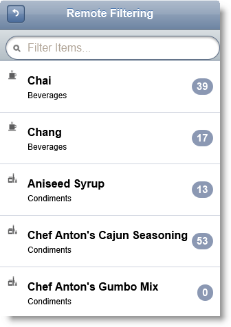
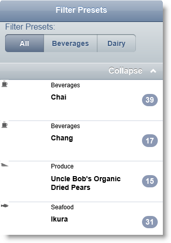
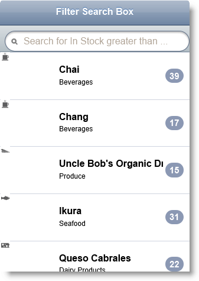
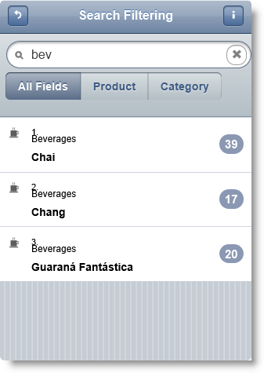

<!--
|metadata|
{
    "fileName": "iglistview-configuring-filtering",
    "controlName": "igListView",
    "tags": ["Events","Filtering","How Do I","MVC"]
}
|metadata|
-->

# Configuring Filtering (igListView)

## Topic Overview

### Purpose

This topic shows how to use filtering feature of `igListView`™.

### Required background

The following lists the topics required as a prerequisite to understanding this topic.

- [igListView Overview](igListView-Overview.html): This topic explains the features of `igListView`™.

- [Adding igListView to a Web Page](igListView-Adding-igListView-to-a-Web-Page.html): This topic explains how you can add `igListView`™ mobile control to a web page.

- [Data Attributes Reference](igListView-Data-Attributes-Reference.html): This topic lists all `igListView`™ data attributes. You can use these attributes to initialize `igListView` in markup. 


### In this topic

This topic contains the following sections:

-   [**Introduction**](#introduction)
-   [**Property Reference**](#property-reference)
-   [**Method Reference**](#method-reference)
-   [**Events Reference**](#events-reference)
-   [**Configuring ListView Filter Presets in HTML**](#presets)
    -   [Requirements](#presets-requirements)
    -   [Overview](#presets-overview)
    -   [Steps](#presets-steps)
-   [**Configuring ListView filter search box in HTML**](#search-box)
    -   [Requirements](#search-box-requirements)
    -   [Overview](#search-box-overview)
    -   [Steps](#search-box-steps)
-   [**Configuring igListView Remote Filtering in MVC**](#remote-filtering)
    -   [Requirements](#remote-filtering-requirements)
    -   [Overview](#remote-filtering-overview)
    -   [Steps](#remote-filtering-steps)
-   [**Configuring igListView Filtering for Set of Fields in MVC**](#set-fields)
    -   [Requirements](#set-fields-requirements)
    -   [Overview](#set-fields-overview)
    -   [Steps](#set-fields-steps)
-   [**Related Content**](#related-content)
    -   [Topics](#topics)
    -   [Samples](#samples)


## <a id="introduction"></a> Introduction

The `igListView` control has a built-in filtering functionality. There are the following types of filter:

-   using the search box
-   using filter presets – which is a predefined filtering condition visualized like a radio button group.

Filtering can be local for the page and remote on the server. For MVC 3 scenarios `igListView` MVC wrapper functionality has remote filtering support out of the box. Configuring remote filtering is easy. You just need to add `ListViewDataSourceAction` attribute to your action method. This attribute does the actual remote operations behind the scenes and makes configuration of the feature easier and transparent.

For each preset you can set text of the preset and `filteredFields` properties. For each field in `filteredFields` array you can set `fieldname`, `searchValue` and `condition` properties.

Search bar filter can be set for single field, set of fields or all fields. However at the end you can search only one field at a time or all of them at the same time.

-   To filter by single field set `searchBarFieldName` property to the name of the field. You can also set `searchBarCondition` property in combination with `searchBarFieldName`.
-   To filter by set of fields set the `searchBarFields` property to the array of fields you want to filter. Each field can have `fieldName`, `text` and `condition` properties. When the search string is typed into the search field preset buttons are shown (below the search filter) for each search field as well as an All fields button. These buttons define the scope of the filter. So you can choose between individual field and all fields, but not set of fields. After the filter is cleared preset buttons disappear.
-   You can also set the search filter placeholder. This is done by `searchBarPlaceHolder` property.

-   Search bar and filter presets can work together. To do this you have to define presets array in the filtering feature and set the `searchBarEnabled` to true.




## <a id="property-reference"></a> Property Reference

This section describes the various properties of `igListView` Sorting feature.

The following table summarizes the purpose and functionality of the `igListView` Sorting control’s featured properties.


Property | Description
---|---
[type](%%jQueryApiUrl%%/mobile.igListViewFiltering#options:type) | Defines local or remote filtering.
[caseSensitive](%%jQueryApiUrl%%/mobile.igListViewFiltering#options:caseSensitive) | Enables/disables filtering case sensitivity.
[filterExprUrlKey](%%jQueryApiUrl%%/mobile.igListViewFiltering#options:filterExprUrlKey) | URL key name that specifies how the filtering expressions will be encoded for remote requests, e.g. `&filter('col') = startsWith`. Default is `OData`.
[searchBarEnabled](%%jQueryApiUrl%%/mobile.igListViewFiltering#options:searchBarEnabled) | Determines whether to enable the search bar in the tray or not.
[searchBarFields](%%jQueryApiUrl%%/mobile.igListViewFiltering#options:searchBarFields) | A list of the fields in the source to allow end user keyword search configuration.
[searchBarFieldName](%%jQueryApiUrl%%/mobile.igListViewFiltering#options:searchBarFieldName) | The field to search through for keyword search. When empty, it will search all the fields.
[searchBarPlaceHolder](%%jQueryApiUrl%%/mobile.igListViewFiltering#options:searchBarPlaceHolder) | The placeholder to display in the search bar when it is empty.
[searchBarCondition](%%jQueryApiUrl%%/mobile.igListViewFiltering#options:searchBarCondition) | Filtering condition for the column defined in `searchBarFieldName`.
[filteredFields](%%jQueryApiUrl%%/mobile.igListViewFiltering#options:filteredFields) | A list of key/value pairs (`fieldName`, `searchValue`, `condition`, `logic`) representing the filtered fields.
[filterPresetsLabel](%%jQueryApiUrl%%/mobile.igListViewFiltering#options:filterPresetsLabel) | The text that is displayed above the filter presets.
[filterState](%%jQueryApiUrl%%/mobile.igListViewFiltering#options:filterState) | The index of the preset that should be used, `default` for none.
[presets](%%jQueryApiUrl%%/mobile.igListViewFiltering#options:presets) | A list of preset filtering options.


## <a id="method-reference"></a> Method Reference
This section describes the methods of `igListView` Sorting feature.

The following table summarizes the purpose and functionality of the `igListView` Sorting control’s featured properties.

<table class="table table-striped">
    <thead>
        <tr>
            <th> Method </th>
            <th> Description </th>
            <th>Parameters </th>
        </tr>
    </thead>
    <tbody>
        <tr>
            <td>
[filter](%%jQueryApiUrl%%/mobile.igListViewFiltering#methods:filter)
            </td>
            <td> Applies filter condition. </td>
            <td>
                <ul>
                    <li> `fieldExpressions` </li>
                    <li>`trayText` </li>
                </ul>
            </td>
        </tr>
        <tr>
            <td>
[destroy](%%jQueryApiUrl%%/mobile.igListViewFiltering#methods:destroy)
            </td>
            <td> Destroys igListView Filtering. </td>
            <td> N/A </td>
        </tr>
    </tbody>
</table>


## <a id="events-reference"></a> Event Reference

This section lists the events fired by `igListView` Sorting feature.

The following table summarizes the purpose and functionality of the `igListView` control’s events.

Event | Description | Cancellable
---|---|---
[presetChanging](%%jQueryApiUrl%%/mobile.igListViewFiltering#events:presetChanging) | This event is fired before sort preset is changed in the filter. | true
[presetChanged](%%jQueryApiUrl%%/mobile.igListViewFiltering#events:presetChanged) | This event is fired after the preset has been changed and the data re-rendered. | false
[keywordChanging](%%jQueryApiUrl%%/mobile.igListViewFiltering#events:keywordChanging) | This event is fired before the keyword in the search bar has been changed. | true
[keywordChanged](%%jQueryApiUrl%%/mobile.igListViewFiltering#events:keywordChanged) | This event is fired after the keyword in the search bar has beenchanged. | false
[scopeChanging](%%jQueryApiUrl%%/mobile.igListViewFiltering#events:scopeChanging) | This event is fired before scope preset is changed in the filter. | true
[scopeChanged](%%jQueryApiUrl%%/mobile.igListViewFiltering#events:scopeChanged) | This event is fired after the scope preset has been changed and the data (possibly) re-rendered. | false


## <a id="presets"></a> Configuring ListView Filter Presets in HTML

This procedure initializes `igListView` with filtering feature enabled and binds it to a JavaScript array. Filtering is local and uses presets. Two filtering presets are defined: Beverages and Dairy.

### Preview

The following screenshot is a preview of the final result.



### <a id="presets-requirements"></a> Requirements

To complete the procedure, you need to have installed Ignite UI %%ProductVersionShort%% product.

### <a id="presets-overview"></a> Overview

This topic takes you step-by-step toward configuring `igListView` with filter presets. The following is a conceptual overview of the process:

1.  [Adding the script references using Infragistics loader](#js-add-references)
2.  [Defining the data source](#js-data-source)
3.  [Making a declarative configuration of igListView with filtering presets](#js-define-markup)
4.  [Optional: Instantiating igListView with filtering presets in JavaScript](#js-define-javascript)

### <a id="presets-steps"></a> Steps

The following steps demonstrate how to configure `igListView` local filter using the filter presets.

1. Add the script references using Infragistics loader <a id="js-add-references"></a>

    Following is a list of references needed for initializing `igListView` with filtering feature enabled. To enable filtering feature with loader you need to set `resources` property to `igmList.Filtering`.
    
    **In HTML:**
    
    ```html
    <link rel="stylesheet" href="jquery.mobile.structure.min.css" />
    <script type="text/javascript" src="jquery.min.js"></script>
    <script type="text/javascript" src="jquery.mobile.min.js"></script>
    <script type="text/javascript" src="infragistics.mobile.loader.js"></script>
    ```
    
    **In JavaScript:**
    
    ```js
    <script type="text/javascript">
        $.ig.loader({
            scriptPath: "../js/",
            cssPath: "../css/",
            resources: "igmList.Filtering",
            theme: "ios"
        });
    </script>
    ```

2. Define the data source <a id="js-data-source"></a>

    **In JavaScript:**
    
    ```js
    var northwindProducts = [
        { "ProductName": "Chai", "CategoryName": "Beverages", 
            "ImageUrl": "../content/images/nw/categories/1.png", "InStock": 39 },
        { "ProductName": "Chang", "CategoryName": "Beverages", 
            "ImageUrl": "../content/images/nw/categories/1.png", "InStock": 17 },
        { "ProductName": "Uncle Bobu0027s Organic Dried Pears", "CategoryName": "Produce", 
            "ImageUrl": "../content/images/nw/categories/7.png", "InStock": 15 },
        { "ProductName": "Ikura", "CategoryName": "Seafood", 
            "ImageUrl": "../content/images/nw/categories/8.png", "InStock": 31 },
        { "ProductName": "Queso Cabrales", "CategoryName": "Dairy Products", 
            "ImageUrl": "../content/images/nw/categories/4.png", "InStock": 22 },
        { "ProductName": "Rössle Sauerkraut", "CategoryName": "Produce", 
            "ImageUrl": "../content/images/nw/categories/7.png", "InStock": 26 },
        { "ProductName": "Thüringer Rostbratwurst", "CategoryName": "Meat/Poultry", 
            "ImageUrl": "../content/images/nw/categories/6.png", "InStock": 0 },
        { "ProductName": "Nord-Ost Matjeshering", "CategoryName": "Seafood", 
            "ImageUrl": "../content/images/nw/categories/8.png", "InStock": 10 }
    ]
    ```

3. Make a declarative configuration of `igListView` with filtering presets <a id="js-define-markup"></a>

    You need to define an UL (Unordered List) HTML element with a lot of data-* attributes. Data-bindings-* are used to bind the list view predefined placeholders to data source fields. Data-filtering-* attributes are used to configure the filtering feature.
    
    Refer to the data-filtering-presets attribute, to configure an array of presets as JavaScript code.
    
    **In HTML:**
    
    ```html
    <ul id="filterPresetsListView"
        data-role="iglistview" 
        data-auto-generate-layouts="False" 
        data-bindings-header-key="ProductName"
        data-bindings-description-key="CategoryName"
        data-bindings-count-key="InStock"
        data-bindings-image-url-key="ImageUrl"
        data-data-source="northwindProducts" 
        data-data-source-type="json" 
        data-filtering="true" 
        data-filtering-name="Filtering" 
        data-filtering-presets='[         {"text":"Beverages","filteredFields":[{"fieldName":"CategoryName","searchValue":"Beverages","condition":"equals"} ]},         {"text":"Dairy","filteredFields":[ {"fieldName":"CategoryName","searchValue":"Dairy Products","condition":"equals"} ]},         {"text":"Seafood","filteredFields":[ {"fieldName":"CategoryName","searchValue":"Seafood","condition":"equals"} ]},         {"text":"Confections","filteredFields":[ {"fieldName":"CategoryName","searchValue":"Confections","condition":"equals"} ]} ]' 
        data-filtering-search-bar-enabled="false">
    </ul>
    ```

4. Optional: Instantiate `igListView` with filtering presets in JavaScript <a id="js-define-javascript"></a>

    1. Define the HTML placeholder
        
        **In HTML:**
        
        ```html
        <div id="filterPresetsListView"></div>
        ```
    
    2. Initialize an `igListView` in JavaScript
    
        **In JavaScript:**
        
        ```js
        $(function () {
            $("#filterPresetsListView").igListView({
                dataSource: northwindProducts,
                // bind igListView predefined placeholders to data properties
                bindings: {
                    descriptionKey: "CategoryName",
                    textKey: "ProductName",
                    imageUrlKey: "ImageUrl",
                    countKey: "InStock"
                },
                features: [
                    {
                        // declare local filtering with 2 presets for "Beverages" and "Dairy"
                        name: "Filtering",
                        type: "local",
                        searchBarEnabled: false,
                        presets: [
                            {
                                // declare "Beverages" preset to match "CategoryName"
                                // column for string "Beverages"
                                text: "Beverages",
                                filteredFields: [
                                    {
                                        fieldName: "CategoryName",
                                        searchValue: "Beverages",
                                        condition: "equals"
                                    }
                                ]
                            },
                            {
                                // declare "Dairy" preset to match "CategoryName" 
                                // column for string "Dairy Products"
                                text: "Dairy",
                                filteredFields: [
                                    {
                                        fieldName: "CategoryName",
                                        searchValue: "Dairy Products",
                                        condition: "equals"
                                    }
                                ]
                            }
                        ]
                    }
                ]
            });
        });
        ```


## <a id="search-box"></a> Configuring ListView filter search box in HTML

This procedure initializes `igListView` with filtering feature enabled and binds it to a JavaScript array. Filtering is local and uses search box. Search box is defined to search in `InStock` column with `greaterThan` condition.

### Preview

The following screenshot is a preview of the final result.



### <a id="search-box-requirements"></a> Requirements

To complete the procedure, you need to have installed Ignite UI %%ProductVersionShort%% product.

### <a id="search-box-overview"></a> Overview

This topic takes you step-by-step toward configuring `igListView` with
filter presets. The following is a conceptual overview of the process:

1.  [Adding the script references using Infragistics loader](#js-search-box-add-references)
2.  [Defining the data source](#js-search-box-data-source)
3.  [Making a declarative configuration of igListView with search box](#js-search-box-define-markup)
4.  [Optional: Instantiating igListView with filtering search box in JavaScript](#js-search-box-define-javascript)

### <a id="search-box-steps"></a> Steps

The following steps demonstrate how to configure `igListView` local filter using the filter presets.

1. Add the script references using Infragistics loader <a id="js-search-box-add-references"></a>

    Following is a list of refereces needed for initializing `igListView` with filtering feature enabled. To enable filtering feature with loader you need to set `resources` property to `igmList.Filtering`.
    
    **In HTML:**
    
    ```html
    <link rel="stylesheet" href="jquery.mobile.structure.min.css" />
    <script type="text/javascript" src="jquery.min.js"></script>
    <script type="text/javascript" src="jquery.mobile.min.js"></script>
    <script type="text/javascript" src="infragistics.mobile.loader.js"></script>
    ```
    
    **In JavaScript:**
    
    ```js
    <script type="text/javascript">
        $.ig.loader({
            scriptPath: "../js/",
            cssPath: "../css/",
            resources: "igmList.Filtering",
            theme: "ios"
        });
    </script>
    ```

2. Define the data source <a id="js-search-box-data-source"></a>
    
    **In JavaScript:**
    
    ```js
    var northwindProducts = [
        { "ProductName": "Chai", "CategoryName": "Beverages", 
            "ImageUrl": "../content/images/nw/categories/1.png", "InStock": 39 },
        { "ProductName": "Chang", "CategoryName": "Beverages", 
            "ImageUrl": "../content/images/nw/categories/1.png", "InStock": 17 },
        { "ProductName": "Uncle Bobu0027s Organic Dried Pears", "CategoryName": "Produce", 
            "ImageUrl": "../content/images/nw/categories/7.png", "InStock": 15 },
        { "ProductName": "Ikura", "CategoryName": "Seafood", 
            "ImageUrl": "../content/images/nw/categories/8.png", "InStock": 31 },
        { "ProductName": "Queso Cabrales", "CategoryName": "Dairy Products", 
            "ImageUrl": "../content/images/nw/categories/4.png", "InStock": 22 },
        { "ProductName": "Rössle Sauerkraut", "CategoryName": "Produce", 
            "ImageUrl": "../content/images/nw/categories/7.png", "InStock": 26 },
        { "ProductName": "Thüringer Rostbratwurst", "CategoryName": "Meat/Poultry", 
            "ImageUrl": "../content/images/nw/categories/6.png", "InStock": 0 },
        { "ProductName": "Nord-Ost Matjeshering", "CategoryName": "Seafood", 
            "ImageUrl": "../content/images/nw/categories/8.png", "InStock": 10 }
    ]
    ```

3. Make a declarative configuration of `igListView` with search box <a id="js-search-box-define-markup"></a>

    You need to define an UL HTML element with a lot of data-* attributes. Data-bindings-* are used to bind the list view predefined placeholders to data source fields. Data-filtering-* attributes are used to configure the filtering feature.
    
    **In HTML:**
    
    ```html
    <ul id="filterListView"
        data-role="iglistview" 
        data-auto-generate-layouts="False" 
        data-bindings-header-key="ProductName"
        data-bindings-description-key="CategoryName"
        data-bindings-count-key="InStock"
        data-bindings-image-url-key="ImageUrl"
        data-data-source="northwindProducts" 
        data-data-source-type="json" 
        data-filtering="true" 
        data-filtering-name="Filtering" 
        data-filtering-search-bar-enabled="true"
        data-filtering-search-bar-place-holder="Search for In Stock greater than ..."
        data-filtering-search-bar-field-name="InStock"
        data-filtering-search-bar-condition="greaterThan">
    </ul>
    ```

4. Optional: Instantiate `igListView` with filtering search box in JavaScript <a id="js-search-box-define-javascript"></a>

    1. Define the HTML placeholder.
    
    **In HTML:**
    
    ```html
    <div id="filterPresetsListView"></div>
    ```
    
    2. Initialize an `igListView` in JavaScript.
    
    **In JavaScript:**
    
    ```js
    <script type="text/javascript">
        $(function () {
            $("#filterListView").igListView({
                dataSource: northwindProducts,
                // bind igListView predefined placeholders to data properties
                bindings: {
                    descriptionKey: "CategoryName",
                    textKey: "ProductName",
                    imageUrlKey: "ImageUrl",
                    countKey: "InStock"
                },
                features: [
                    {
                        // declare local filtering for InStock field with greaterThan condition
                        name: "Filtering",
                        type: "local",
                        searchBarEnabled: true,
                        searchBarPlaceHolder: "Search for In Stock greater than ...",
                        searchBarFieldName: "InStock",
                        searchBarCondition: "greaterThan"
                    }
                ]
            });
        });
    </script>
    ```


## <a id="remote-filtering"></a> Configuring igListView Remote Filtering in MVC

This procedure initializes `igListView` in Razor code with filtering feature enabled with search box. Filtering operations are done on the server. Searching is done in all fields.

### Preview

The following screenshot is a preview of the final result.


### <a id="remote-filtering-requirements"></a> Requirements

To complete the procedure, you need the following:

-   Microsoft® Visual Studio 2010 or newer installed
-   MVC 3 Framework installed
-   Northwind Database installed
-   *Infragistics.Web.Mvc.Mobile.dll* added
-   Ignite UI jQuery Mobile Files added

### <a id="remote-filtering-overview"></a> Overview

This topic takes you step-by-step toward configuring `igListView` in MVC. The following is a conceptual overview of the process:

1.  [Defining the Model](#mvc-remote-model)
2.  [Defining the View](#mvc-remote-view)
3.  [Defining the Controller](#mvc-remote-controller)

### <a id="remote-filtering-steps"></a> Steps

The following steps demonstrate how to define Model, View and Controller for configuring `igListView`.

1. Define the Model <a id="mvc-remote-model"></a>

    1.  Add an ADO.NET Entity Data Model for Product and Category tables in Northwind Database and name it `NorthwindModel`.
    
        
    
    2.  Add a new Class to folder Models and name it *ProductViewModel.cs*.
    
        **In C#:**
    
        ```csharp
        public class ProductViewModel
        {
            public string ProductName { get; set; }
            public string CategoryName { get; set; }
            public string ImageUrl { get; set; }
            public int InStock { get; set; }
        }
        ```

2. Define the View <a id="mvc-remote-view"></a>

    Add a new View to the Views folder. Name it *igListViewRemoteFiltering.cshtml*.
    
    **In C#:**
    
    ```csharp
    @model IQueryable<ProductViewModel>
    <script type="text/javascript" src="infragistics.mobile.loader.js"></script>
    @(Html.InfragisticsMobile().
        Loader().
        ScriptPath("../js/").
        CssPath("../css/").
        Render())
    @(Html
        .InfragisticsMobile()
        .ListView(Model)
        .ID("remoteListView")
        .ImageMode(ImageMode.Icon)
        .Bindings(b =>
        {
            b.HeaderKeyFor(p => p.ProductName)
            .DescriptionKeyFor(p => p.CategoryName)
            .CountKeyFor(p => p.InStock)
            .ImageUrlKeyFor(p => p.ImageUrl);
        })
        .Features(features =>
        {
            features
                .Filtering()
                .Type(OpType.Remote);
        })
        .DataSourceUrl(Url.Action("RemoteListViewOperations"))
        .DataBind()
        .Render()
        )
    ```

3. Define the Controller <a id="mvc-remote-controller"></a>

    1. Add a new Controller to the Controllers folder. Name it *ListViewController.cs*.
    
    2. Add a new Action to the controller which will initialize the filtering feature. Name it `IgListViewRemoteFiltering`.
    
    3. Add another Action to the controller which will do the filtering. Name it `RemoteListViewOperations`. Add a `ListViewDataSourceAction` attribute to it.
    
    **In C#:**
    
    ```csharp
    public class ListViewController : Controller
    {
        public ActionResult IgListViewRemoteFiltering()
        {
            var productModels = GetProducts(30);
            return View(productModels);
        }
        
        [ListViewDataSourceAction]
        public ActionResult RemoteListViewOperations()
        {
            var productModels = GetProducts(30);
            return View(productModels);
        }
        
        private IQueryable<ProductViewModel> GetProducts(int count)
        {
            var products = (from e in new NorthwindEntities().Products.Include("Category")
                             select e).Take<Product>(count);
            var productModels = new List<ProductViewModel>();
            foreach (var product in products)
            {
                productModels.Add(
                    new ProductViewModel
                    {
                        CategoryName = product.Category.CategoryName,
                        ProductName = product.ProductName,
                        InStock = int.Parse(product.UnitsInStock.ToString()),
                        ImageUrl = _url.Content(
                            String.Format("~/content/images/mobile/categories/{0}.png", 
                            product.CategoryID))
                    });
            }
            return productModels.AsQueryable();
        }
    }
    ```
    


## <a id="set-fields"></a> Configuring igListView Filtering for Set of Fields in MVC

This procedure initializes `igListView` in Razor code with filtering feature enabled with search box. Filtering operations are done on the server. Searching is done for `ProductName` and `CategoryName` fields.

### Preview

The following screenshot is a preview of the final result.



### <a id="set-fields-requirements"></a> Requirements

-   To complete the procedure, you need the following:
-   -   Microsoft® Visual Studio 2010 or newer installed
    -   MVC 3 Framework installed
    -   Northwind Database installed
    -   *Infragistics.Web.Mvc.Mobile.dll* added
    -   Ignite UI jQuery Mobile Files added

### <a id="set-fields-overview"></a> Overview

This topic takes you step-by-step toward configuring `igListView` in MVC.
The following is a conceptual overview of the process:

1.  [Defining the Model](#mvc-set-model)
2.  [Defining the View](#mvc-set-view)
3.  [Defining the Controller](#mvc-set-controller)

### <a id="set-fields-steps"></a> Steps

The following steps demonstrate how to define Model, View and Controller for configuring `igListView`.

1. Define the Model <a id="mvc-set-model"></a>

    1.  Add an ADO.NET Entity Data Model for Product and Category tables in Northwind Database and name it `NorthwindModel`.
    
        
    
    2.  Add a new Class to folder Models and name it *ProductViewModel.cs*.
    
        **In C#:**
    
        ```csharp
        public class ProductViewModel
        {
            public string ProductName { get; set; }
            public string CategoryName { get; set; }
            public string ImageUrl { get; set; }
            public int InStock { get; set; }
        }
        ```

2. Define the View <a id="mvc-set-view"></a>

    Add a new View to the Views folder. Name it *igListViewRemoteFiltering.cshtml*.
    
    **In C#:**
    
    ```csharp
    @model IQueryable<ProductViewModel>
    <script type="text/javascript" src="infragistics.mobile.loader.js"></script>
    @(Html.InfragisticsMobile().
        Loader().
        ScriptPath("../js/").
        CssPath("../css/").
        Render())
    @(Html
        .InfragisticsMobile()
        .ListView(Model)
        .NumberedList(true)
        .ID("basicFilteringListView")
        .ImageMode(ImageMode.Icon)
        .Bindings(b =>
        {
            b.TextKey("ProductName")
            .DescriptionKey("CategoryName")
            .CountKey("InStock")
            .ImageUrlKey("ImageUrl");
        })
        .Features(features =>
            features
            .Filtering()
            .SearchBarPlaceHolder("Search for Product or Category ...")
            .SearchBarFields(fields =>
            {
                fields.SearchBarFieldFor(p => p.ProductName).Text("Product");
                fields.SearchBarFieldFor(p => p.CategoryName).Text("Category");
            })
            .Type(OpType.Remote);
        )
        .DataSourceUrl(Url.Action("RemoteListViewOperations"))
        .DataBind()
        .Render()
    )
    ```

3. Define the Controller <a id="mvc-set-controller"></a>

    1. Add a new Controller to the Controllers folder. Name it *ListViewController.cs*.
    
    2. Add a new Action to the controller which will initialize the filtering feature. Name it `IgListViewRemoteFiltering`.
    
    3. Add another Action to the controller which will do the filtering. Name it `RemoteListViewOperations`.
    
    Add a `ListViewDataSourceAction` attribute to it.
    
    **In C#:**
    
    ```csharp
    public class ListViewController : Controller
    {
        public ActionResult IgListViewRemoteFiltering()
        {
            var productModels = GetProducts(30);
            return View(productModels);
        }
        
        [ListViewDataSourceAction]
        public ActionResult RemoteListViewOperations()
        {
            var productModels = GetProducts(30);
            return View(productModels);
        }
        
        private IQueryable<ProductViewModel> GetProducts(int count)
        {
            var products = (from e in new NorthwindEntities().Products.Include("Category")
                             select e).Take<Product>(count);
            var productModels = new List<ProductViewModel>();
            foreach (var product in products)
            {
                productModels.Add(
                    new ProductViewModel
                    {
                        CategoryName = product.Category.CategoryName,
                        ProductName = product.ProductName,
                        InStock = int.Parse(product.UnitsInStock.ToString()),
                        ImageUrl = _url.Content(
                            String.Format("~/content/images/mobile/categories/{0}.png",
                            product.CategoryID))
                    });
            }
            return productModels.AsQueryable();
        }
    }
    ```


## <a id="related-content"></a> Related Content

### <a id="topics"></a> Topics

The following topics provide additional information related to this topic.

- [Configuring Sorting](igListView-Configuring-Sorting.html): This topic explains how to configure `igListView` sorting.

- [Configuring Load on Demand](igListView-Configuring-Load-on-Demand.html): This topic explains how to configure `igListView` Load on Demand.


### <a id="samples"></a> Samples

The following samples provide additional information related to this topic.

- [Sort and Group Presets](%%SamplesUrl%%/mobile-list-view/sort-group-presets): This sample shows local sorting in combination with grouping.

- [Remote Features](%%SamplesUrl%%/mobile-list-view/remote-features): This sample shows remote sorting in combination with filtering.

- [Search](%%SamplesUrl%%/mobile-list-view/search): This sample shows how to configure filtering with a search box.


 

 


