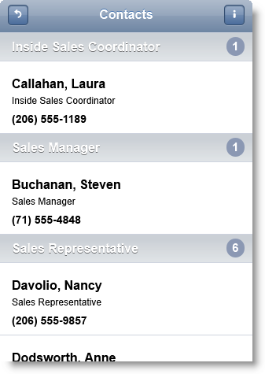
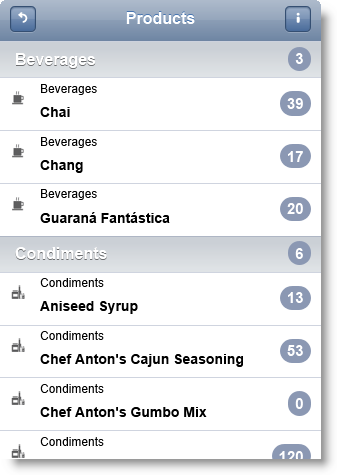
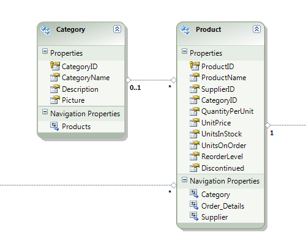

<!--
|metadata|
{
    "fileName": "iglistview-configuring-grouping",
    "controlName": "igListView",
    "tags": ["Grouping","How Do I"]
}
|metadata|
-->

# Configuring Grouping (igListView)

## Topic Overview

### Purpose

This topic shows how to use grouping feature of `igListView`™.

### Required background

The following table lists the topics required as a prerequisite to understanding this topic.

- [igListView Overview](igListView-Overview.html): This topic explains the features of `igListView`™.

- [Adding igListView to a Web Page](igListView-Adding-igListView-to-a-Web-Page.html): This topic explains how you can add `igListView`™ mobile control to a web page.

- [Configuring Sorting](igListView-Configuring-Sorting.html): This topic shows how to use sorting feature of `igListView`™.

- [Data Attributes Reference](igListView-Data-Attributes-Reference.html): This topic lists all `igListView`™ data attributes. You can use these attributes to initialize `igListView` in markup. 


### In this topic

This topic contains the following sections:

-   [**Introduction**](#introduction)
-   [**Configuring igListView Grouping in JavaScript**](#js)
    -   [Requirements](#js-requirements)
    -   [Overview](#js-overview)
    -   [Steps](#js-steps)
-   [**Configuring igListView with Grouping in MVC**](#mvc)
    -   [Requirements](#mvc-requirements)
    -   [Overview](#mvc-overview)
    -   [Steps](#mvc-steps)
-   [**Configuring igListView Grouping with a Custom Function in JavaScript**](#custom-function)
    -   [Requirements](#custom-function-requirements)
    -   [Overview](#custom-function-overview)
    -   [Steps](#custom-function-steps)
-   [**Related Content**](#related-content)
    -   [Topics](#topics)
    -   [Samples](#samples)


## <a id="introduction"></a> Introduction

The `igListView` control has a built-in grouping functionality It works side by side with sorting functionality.

You can define a group for the sorted fields (if there are any) or as a part of the sorting preset. Each preset has `showGrouping` property as well as `groupComparerFunction` and `groupNameFunction` properties.

> **Note:** `isDividerKey` is ignored when `sortedFields` property is set.




## <a id="js"></a> Configuring igListView Grouping in JavaScript

This procedure initializes `igListView` with sorting feature and grouping enabled and binds it to a JavaScript array. Sorting is configured for the *Title* and *Name* columns. When grouping is enabled it takes the first field from the `sortedFields` array. In this example, the grouping is done on the `Title` column.

### Preview

The following screenshot is a preview of the final result.


### <a id="js-requirements"></a> Requirements

To complete the procedure, you need to have installed %%ProductName%% %%ProductVersionShort%% product.

### <a id="js-overview"></a> Overview

This topic takes you step-by-step toward configuring `igListView` with sorting and grouping features in JavaScript. The following is a conceptual overview of the process:

1.  [Adding the script references using Infragistics loader](#js-add-references)
2.  [Defining the data source](#js-define-data-source)
3.  [Making a declarative configuration of igListView with grouping feature](#js-init-markup)
4.  [Optional: Instantiating an igListView with grouping feature in JavaScript](#js-init-javascript)

### <a id="js-steps"></a> Steps

The following steps demonstrate how to configure `igListView` with sorting feature in JavaScript.

1. Add the script references using Infragistics loader <a id="js-add-references"></a>

	Following is a list of references needed for initializing `igListView` with sorting feature enabled. Grouping functionality is part of the sorting feature. To enable sorting feature with loader you need to set `resources` property to `igmList.Sorting`.
	
	**In HTML:**
	
	```html
	<link rel="stylesheet" href="jquery.mobile.structure.min.css" />
	<script type="text/javascript" src="jquery.min.js"></script>
	<script type="text/javascript" src="jquery.mobile.min.js"></script>
	<script type="text/javascript" src="infragistics.mobile.loader.js"></script>
	```
	
	**In JavaScript:**
	
	```js
	<script type="text/javascript">
	    $.ig.loader({
	        scriptPath: "../js/",
	        cssPath: "../css/",
	        resources: "igmList.Sorting",
	        theme: "ios"
	    });
	</script>
	```

2. Define the data source <a id="js-define-data-source"></a>

	You need to define a `northwindEmployees` JavaScript array with `ProductName`, `CategoryName`, `ImageUrl` and `InStock` fields.
	
	**In JavaScript:**
	
	```js
	<script type="text/javascript">
	var northwindEmployees = [
	    { "ID": 1, "Name": "Davolio, Nancy", "Title": "Sales Representative", "ImageUrl": "../content/images/nw/employees/1.png", "Phone": "(206) 555-9857", "PhoneUrl": "tel:(206) 555-9857" },
	    { "ID": 2, "Name": "Fuller, Andrew", "Title": "Vice President, Sales", "ImageUrl": "../content/images/nw/employees/2.png", "Phone": "(206) 555-9482", "PhoneUrl": "tel:(206) 555-9482" },
	    { "ID": 3, "Name": "Leverling, Janet", "Title": "Sales Representative", "ImageUrl": "../content/images/nw/employees/3.png", "Phone": "(206) 555-3412", "PhoneUrl": "tel:(206) 555-3412" },
	    { "ID": 4, "Name": "Peacock, Margaret", "Title": "Sales Representative", "ImageUrl": "../content/images/nw/employees/4.png", "Phone": "(206) 555-8122", "PhoneUrl": "tel:(206) 555-8122" },
	    { "ID": 5, "Name": "Buchanan, Steven", "Title": "Sales Manager", "ImageUrl": "../content/images/nw/employees/5.png", "Phone": "(71) 555-4848", "PhoneUrl": "tel:(71) 555-4848" },
	    { "ID": 6, "Name": "Suyama, Michael", "Title": "Sales Representative", "ImageUrl": "../content/images/nw/employees/6.png", "Phone": "(71) 555-7773", "PhoneUrl": "tel:(71) 555-7773" },
	    { "ID": 7, "Name": "King, Robert", "Title": "Sales Representative", "ImageUrl": "../content/images/nw/employees/7.png", "Phone": "(71) 555-5598", "PhoneUrl": "tel:(71) 555-5598" },
	    { "ID": 8, "Name": "Callahan, Laura", "Title": "Inside Sales Coordinator", "ImageUrl": "../content/images/nw/employees/8.png", "Phone": "(206) 555-1189", "PhoneUrl": "tel:(206) 555-1189" },
	    { "ID": 9, "Name": "Dodsworth, Anne", "Title": "Sales Representative", "ImageUrl": "../content/images/nw/employees/9.png", "Phone": "(71) 555-4444", "PhoneUrl": "tel:(71) 555-4444" }
	]</script>
	```

3. Make a declarative configuration of `igListView` with grouping feature <a id="js-init-markup"></a>

	1. You need to define an UL (Unordered List) HTML element with a lot of data-* attributes. Data-bindings-* are used to bind the list view predefined placeholders to data source fields. Data-sorting-* attributes are used to configure the sorting feature.
	
	2. To enable grouping, set `data-sorting-show-grouping="true"`. This setting enables grouping for the `sortedFields` array.
	
	3. In order for grouping to work, set data-sorting-sorted-fields attribute in which you define the sorted fields. In this case `Title` and `Name` fields will be sorted ascending. When grouping is applied it uses only the first column from the `sortedFields` array.
	
	**In HTML:**
	
	```html
	<ul id="igListViewGrouping"
	    data-role="iglistview"
	    data-icon-mode="thumbnail"
	    data-data-source="northwindEmployees" 
	    data-bindings-description-key="Title"
	    data-bindings-header-key="Name"
	    data-bindings-primary-key="ID"
	    data-bindings-text-key="Phone"
	    data-sorting="true" 
	    data-sorting-type="local"
	    data-sorting-show-grouping="true"
	    data-sorting-auto-generate-sort-presets="false"
	    data-sorting-sorted-fields='[{"fieldName":"Title","direction":"asc"},{"fieldName":"Name","direction":"asc"}]'>
	</ul>
	```

4. Optional: Instantiate `igListView` with grouping feature in JavaScript <a id="js-init-javascript"></a>

	1. Define the DOM (Document Object Model) Html element placeholder.
	
		**In HTML:**
		
		```html
		<div id="igListViewGrouping"></div>
		```
	
	2. Instantiate `igListView` in JavaScript.
		
		**In JavaScript:**
		
		```js
		<script type="text/javascript">
		    $.ig.loader(function() {
		        $("#igListViewGrouping").igListView({
		            dataSource: northwindEmployees,
		            bindings: {
		                descriptionKey: "Title",
		                headerKey: "Name",
		                textKey: "Phone",
		                primaryKey: "ID"
		            },
		            features: [
		                {
		                    name: "Sorting",
		                    type: "local",
		                    showGrouping: true,
		                    autoGenerateSortPresets: false,
		                    sortedFields: [
		                        {
		                            fieldName: "Title",
		                            direction: "asc"
		                        },
		                        {
		                            fieldName: "Name",
		                            direction: "asc"
		                        }
		                    ]
		                }
		            ]
		        });
		    });
		</script>
		```


## <a id="mvc"></a> Configuring igListView with Grouping in MVC

This procedure initializes `igListView` in Razor code with sorting feature with grouping enabled and binds it to Json object. Grouping is done for `CategoryName` column.

### Preview

The following screenshot is a preview of the final result.



### <a id="mvc-requirements"></a> Requirements

To complete the procedure, you need the following:

-   Microsoft® Visual Studio 2010 or newer installed
-   MVC 3 Framework installed
-   Northwind Database installed
-   *Infragistics.Web.Mvc.Mobile.dll* added
-   %%ProductName%% jQuery Mobile Files added

### <a id="mvc-overview"></a> Overview

This topic takes you step-by-step toward configuring `igListView` Grouping in MVC. The following is a conceptual overview of the process:

1.  [Defining the Model](#mvc-local-model)
2.  [Defining the View](#mvc-local-view)
3.  [Defining the Controller](#mvc-local-controller)

### <a id="mvc-steps"></a> Steps

The following steps demonstrate how to define Model, View and Controller for configuring `igListView`.

1. Define the Model <a id="mvc-local-model"></a>

	Add ADO.NET Entity Data Model for `Product` and `Category` tables in Northwind Database and name it `NorthwindModel`.
	
	
	
	Add a new Class to folder Models and name it *ProductViewModel.cs*.
	
	**In C#:**
	
	```csharp
	public class ProductViewModel
	{
	    public string ProductName { get; set; }
	    public string CategoryName { get; set; }
	    public string ImageUrl { get; set; }
	    public int InStock { get; set; }
	}
	```

2. Define the View <a id="mvc-local-view"></a>

	Add a new View to the Views folder. Name it *igListViewGrouping.cshtml*. Add the following code to the view. The defined `igListView` will get its data from the `SampleDataJson` controller’s `ProductJSON` action method.
	
	**In C#:**
	
	```csharp
	@model IQueryable<ProductViewModel>
	<script type="text/javascript" src="infragistics.mobile.loader.js"></script>
	@(Html.InfragisticsMobile().
	    Loader().
	    ScriptPath("../js/").
	    CssPath("../css/").
	    Render())
	@(Html
	    .InfragisticsMobile()
	    .ListView(Model)
	    .ID("sortingPresetsListView")
	    .ResponseDataKey("")
	    .ImageMode(ImageMode.Icon)
	    .Bindings(b =>
	    {
	        b.TextKey("ProductName")
	        .DescriptionKey("CategoryName")
	        .ImageUrlKey("ImageUrl")
	        .CountKey("InStock");
	    })
	    .Features(features =>
	    {
	        features
	            .Sorting()
	            .ShowGrouping(true)
	            //Configuring the SortedFields here creates the default grouping
	            .SortedFields(sf =>
	            {
	                sf.SortedFieldFor(p => p.CategoryName, 
	                    SortMode.Ascending);
	            })
	            .AutoGenerateSortPresets(false)
	            .Type(OpType.Local);
	    })
	    .DataSourceUrl(@Url.Action("productjson", "sampledatajson"))
	    .DataBind()
	    .Render()
	)
	```

3. Define the Controller <a id="mvc-local-controller"></a>

	1. Add a new Controller to the Controllers folder. Name it *SampleDataJsonController.cs*.
	
	2. Add a new Action to the controller which will return `JsonResult`. Name it `ProductJSON`.
	
	**In C#:**
	
	```csharp
	public class SampleDataJsonController : Controller
	{
	    public JsonResult ProductJSON()
	    {
	        var products = GetProducts(30);
	        return Json(products, JsonRequestBehavior.AllowGet);
	    }
	    
	    private IQueryable<ProductViewModel> GetProducts(int count)
	    {
	        var products = (from e in new NorthwindEntities().Products.Include("Category")
	                         select e).Take<Product>(count);
	        var productModels = new List<ProductViewModel>();
	        foreach (var product in products)
	        {
	            productModels.Add(
	                new ProductViewModel
	                {
	                    CategoryName = product.Category.CategoryName,
	                    ProductName = product.ProductName,
	                    InStock = int.Parse(product.UnitsInStock.ToString()),
	                    ImageUrl = _url.Content(String.Format("~/content/images/mobile/categories/{0}.png", product.CategoryID))
	                });
	        }
	        return productModels.AsQueryable();
	    }
	}
	```


## <a id="custom-function"></a> Configuring igListView Grouping with a Custom Function in JavaScript

This procedure initializes `igListView` with sorting feature with grouping enabled and binds it to JavaScript array. Sorting is configured for `ProductName` column. Grouping is configured through a custom comparer function.

### Preview

The following screenshot is a preview of the final result.


### <a id="custom-function-requirements"></a> Requirements

To complete the procedure, you need to have installed %%ProductName%% %%ProductVersionShort%% product.

### <a id="custom-function-overview"></a> Overview

This topic takes you step-by-step toward configuring `igListView` with sorting feature in JavaScript. The following is a conceptual overview of the process:

1.  [Adding the script references using Infragistics loader](#js-custom-group-references)
2.  [Defining the data source](#js-custom-group-data-source)
3.  [Defining custom grouping functions](#js-custom-group-functions)
4.  [Making a declarative configuration of igListView with grouping feature](#js-custom-group-markup)
5.  [Optional: Instantiating igListView with grouping feature in JavaScript](#js-custom-group-javascript)

### <a id="custom-function-steps"></a> Steps

The following steps demonstrate how to configure `igListView` with a sorting feature in JavaScript.

1. Add the script references using Infragistics loader <a id="js-custom-group-references"></a>

	Following is a list of references needed for initializing `igListView` with the sorting feature enabled. Groping functionality is a part of the sorting feature. To enable sorting feature with loader you need to set `resources` property to `igmList.Sorting`.
	
	**In HTML:**
	
	```html
	<link rel="stylesheet" href="jquery.mobile.structure.min.css" />
	<script type="text/javascript" src="jquery.min.js"></script>
	<script type="text/javascript" src="jquery.mobile.min.js"></script>
	<script type="text/javascript" src="infragistics.mobile.loader.js"></script>
	```
	
	**In JavaScript:**
	
	```js
	<script type="text/javascript">
	    $.ig.loader({
	        scriptPath: "../js/",
	        cssPath: "../css/",
	        resources: "igmList.Sorting",
	        theme: "ios"
	    });
	</script>
	```

2. Define the data source <a id="js-custom-group-data-source"></a>

	You need to define a `northwindProducts` JavaScript array with `ProductName`, `CategoryName`, `ImageUrl` and `InStock` fields.
	
	**In JavaScript:**
	
	```js
	<script type="text/javascript">
	    var northwindProducts = [
	        { "ProductName": "Chai", "CategoryName": "Beverages", "ImageUrl": "../content/images/nw/categories/1.png", "InStock": 39 },
	        { "ProductName": "Chang", "CategoryName": "Beverages", "ImageUrl": "../content/images/nw/categories/1.png", "InStock": 17 },
	        { "ProductName": "Uncle Bobu0027s Organic Dried Pears", "CategoryName": "Produce", "ImageUrl": "../content/images/nw/categories/7.png", "InStock": 15 },
	        { "ProductName": "Ikura", "CategoryName": "Seafood", "ImageUrl": "../content/images/nw/categories/8.png", "InStock": 31 },
	        { "ProductName": "Queso Cabrales", "CategoryName": "Dairy Products", "ImageUrl": "../content/images/nw/categories/4.png", "InStock": 22 },
	        { "ProductName": "Rössle Sauerkraut", "CategoryName": "Produce", "ImageUrl": "../content/images/nw/categories/7.png", "InStock": 26 },
	        { "ProductName": "Thüringer Rostbratwurst", "CategoryName": "Meat/Poultry", "ImageUrl": "../content/images/nw/categories/6.png", "InStock": 0 },
	        { "ProductName": "Nord-Ost Matjeshering", "CategoryName": "Seafood", "ImageUrl": "../content/images/nw/categories/8.png", "InStock": 10 }
	    ]
	</script>
	```

3. Define custom grouping functions <a id="js-custom-group-functions"></a>

	1. Define a custom group comparer function
	
		This function compares two strings for equality in the first letter. Comparing is case insensitive.
		
		**In JavaScript:**
		
		```js
		//Logic to sort by first letter
		function byFirstLetter(val1, val2) {
		    if (val1 === null && val2 === null)
		        return true;
		    if (val1 === null || val2 === null)
		        return false;
		    return typeof val1 === "string" &&
		typeof val2 === "string" &&
		val1.toUpperCase().charCodeAt(0) === val2.toUpperCase().charCodeAt(0);
		}
		```
	
	2. Define a custom group name function
	
		This function will return a group name. In this case this will be the first letter of the `ProductName` field.
		
		**In JavaScript:**
		
		```js
		//Logic determines group names
		function returnFirstLetter(val) {
		    if (!val || val.length === 0)
		        return "Empty";
		    return val.toUpperCase()[0];
		}
		```

4. Make a declarative configuration of `igListView` with grouping feature <a id="js-custom-group-markup"></a>

	1.  You need to define an UL HTML element with a lot of data-* attributes. Data-bindings-* are used to bind the list view predefined placeholders to data source fields. Data-sorting-* attributes are used to configure the sorting feature.
	2.  To enable grouping, set `data-sorting-show-grouping="true"`. This setting enables grouping for the `sortedFields` array.
	3.  In order for grouping to work, set `data-sorting-sorted-fields` attribute in which you define the sorted fields. In this case `ProductName` will be sorted ascending.
	4.  To enable custom grouping, set `data-sorting-group-comparer-function` and `data-sorting-group-name-function` to the names of the functions you have defined in step 3.
	
	**In HTML:**
	
	```html
	<ul id="igListViewGrouping"
	    data-auto-generate-layouts="False" 
	    data-image-mode="icon"
	    data-bindings='{"textKey":"ProductName","descriptionKey":"CategoryName","imageUrlKey":"ImageUrl"}' 
	    data-data-source="northwindProducts" 
	    data-image-mode="icon" 
	    data-role="iglistview" 
	    data-sorting="true" 
	    data-sorting-auto-generate-sort-presets="false" 
	    data-sorting-divider-template="<div>${Name} - ${Count} {{if ${Count} == 1}}Item{{else}}Items{{/if}}</div>" 
	    data-sorting-group-comparer-function="byFirstLetter" 
	    data-sorting-group-name-function="returnFirstLetter" 
	    data-sorting-name="Sorting" 
	    data-sorting-show-grouping="true" 
	    data-sorting-sorted-fields='[ {"fieldName":"ProductName","direction":"asc"} ]'
	    data-sorting-type="local" >
	</ul>
	```

5. Optional: Instantiate `igListView` with grouping feature in JavaScript <a id="js-custom-group-javascript"></a>

	1. Define the DOM Html element placeholder.
	
	**In HTML:**
	
	```html
	<div id="igListViewGrouping"></div>
	```
	
	2. Instantiate an `igListView` in JavaScript.
	
	**In JavaScript:**
	
	```js
	<script type="text/javascript">
	    $.ig.loader(function() {
	        $("#igListViewGrouping").igListView({
	            imageMode: "icon",
	            dataSource: northwindProducts,
	            autoGenerateLayouts: false,
	            bindings: {
	                descriptionKey: "CategoryName",
	                textKey: "ProductName",
	                imageUrlKey: "ImageUrl"
	            },
	            features: [
	                {
	                    name: "Sorting",
	                    type: "local",
	                    showGrouping: true,
	                    autoGenerateSortPresets: false,
	                    dividerTemplate: "<div>${Name} - ${Count} {{if ${Count} == 1}}Item{{else}}Items{{/if}}</div>",
	                    groupComparerFunction: "byFirstLetter",
	                    groupNameFunction: "returnFirstLetter",
	                    sortedFields: [
	                        {
	                            fieldName: "ProductName",
	                            direction: "asc"
	                        }
	                    ]
	                }
	            ]
	        });
	    });
	</script>
	```


## <a id="related-content"></a> Related Content

### <a id="topics"></a> Topics

The following topics provide additional information related to this topic.

- [Configuring Filtering](igListView-Configuring-Filtering.html): This topic explains how to configure `igListView` filtering.

- [Configuring Load on Demand](igListView-Configuring-Load-on-Demand.html): This topic explains how to configure `igListView` Load on Demand.


### <a id="samples"></a> Samples

The following samples provide additional information related to this topic.

- [Sort and Group Presets](%%SamplesUrl%%/mobile-list-view/sort-group-presets): This sample shows local sorting in combination with grouping.

- [Remote Sorting and Filtering](%%SamplesUrl%%/mobile-list-view/remote-features): This sample shows remote sorting in combination with filtering.


 

 


