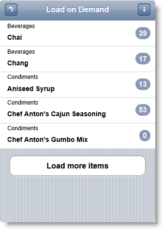
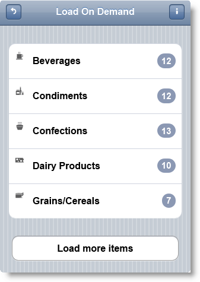

<!--
|metadata|
{
    "fileName": "iglistview-configuring-load-on-demand",
    "controlName": "igListView",
    "tags": ["How Do I","MVC","Performance"]
}
|metadata|
-->

# Configuring Load-on-Demand (igListView)

## Topic Overview

### Purpose

This topic shows how to use load on demand feature of `igListView`™.

### Required background

The following table lists the topics required as a prerequisite to understanding this topic.

- [igListView Overview](igListView-Overview.html): This topic explains the features of `igListView`™.

- [Adding igListView to a Web Page](igListView-Adding-igListView-to-a-Web-Page.html): This topic explains how you can add `igListView`™ mobile control to a web page.

- [Data Attributes Reference](igListView-Data-Attributes-Reference.html): This topic lists all `igListView`™ data attributes. You can use these attributes to initialize `igListView` in markup. 


#### In this topic

This topic contains the following sections:

-   [**Introduction**](#introduction)
-   [**Property Reference**](#property-reference)
-   [**Events Reference**](#events-reference)
-   [**Configuring igListView Local Load on demand in JavaScript**](#js)
    -   [Requirements](#js-requirements)
    -   [Overview](#js-overview)
    -   [Steps](#js-steps)
-   [**Configuring igListView with Local Load on Demand in MVC**](#mvc)
    -   [Requirements](#mvc-requirements)
    -   [Overview](#mvc-overview)
    -   [Steps](#mvc-steps)
-   [**Configuring igListView with Remote Load on Demand in MVC**](#mvc-remote)
    -   [Requirements](#mvc-remote-requirements)
    -   [Overview](#mvc-remote-overview)
    -   [Steps](#mvc-remote-steps)
-   [**Related Content**](#related-content)
    -   [Topics](#topics)
    -   [Samples](#samples)


## <a id="introduction"></a> Introduction

The `igListView` control has a load on demand feature. This feature can be used for flat data where user can request more items by pressing a button. Load on demand can be local or remote.

Configuring remote Load on Demand is easy. Just apply `ListViewDataSourceAction` attribute to your action method which returns the data. This attribute does the actual remote operations behind the scenes and makes configuration of the feature easier and transparent.




## <a id="property-reference"></a> Property Reference

This section describes the various properties of `igListView` Load on Demand feature.

The following table summarizes the purpose and functionality of the `igListView` Load on Demand control’s featured properties.

Property | Description
---|---
[type](%%jQueryApiUrl%%/mobile.igListViewLoadOnDemand#options:type) | Defines local or remote load on demand.
[pageSize](%%jQueryApiUrl%%/mobile.igListViewLoadOnDemand#options:pageSize) | When greater than *0*, controls how many items are initially fetched and loaded.
[recordCountKey](%%jQueryApiUrl%%/mobile.igListViewLoadOnDemand#options:recordCountKey) | The property in the response that will hold the total number of records in the data source.
[pageSizeUrlKey](%%jQueryApiUrl%%/mobile.igListViewLoadOnDemand#options:pageSizeUrlKey) | Denotes the name of the encoded URL parameter that will state what the currently requested page size is.
[pageIndexUrlKey](%%jQueryApiUrl%%/mobile.igListViewLoadOnDemand#options:pageIndexUrlKey) | Denotes the name of the encoded URL parameter that will state what the currently requested page index is.
[mode](%%jQueryApiUrl%%/mobile.igListViewLoadOnDemand#options:mode) | Defines whether to show a button to load more items or whether they should be fetched automatically.
[autoHideButtonAtEnd](%%jQueryApiUrl%%/mobile.igListViewLoadOnDemand#options:autoHideButtonAtEnd) | When true and there are no pages left (according to data source), the **Load more items** button and automatic loading will stop working.


## <a id="events-reference"></a> Events Reference

This section lists the events fired by `igListView` Load on Demand feature.

The following table summarizes the purpose and functionality of the `igListView` Load on Demand feature events.

Event | Description | Cancellable
---|---|---
[itemsRequesting](%%jQueryApiUrl%%/mobile.igListViewLoadOnDemand#events:itemsRequesting) | This event is fired before a new page of data is fetched and appended to the `dataView`. | true
[itemsRequested](%%jQueryApiUrl%%/mobile.igListViewLoadOnDemand#events:itemsRequested) | This event is fired after a new page of data is appended to the `dataView`. | false


## <a id="js"></a> Configuring igListView Local Load on Demand in JavaScript

This procedure initializes `igListView` with load on demand feature enabled and binds it to a JavaScript array. Load on demand is done for flat data on the client and page size is set to 5 items.

### Preview

The following screenshot is a preview of the final result.


### <a id="js-requirements"></a> Requirements

To complete the procedure, you need to have installed Ignite UI %%ProductVersionShort%% product.

### <a id="js-overview"></a> Overview

This topic takes you step-by-step toward configuring `igListView` with Load on Demand feature in JavaScript. The following is a conceptual overview of the process:

1.  [Adding the script references using Infragistics loader](#js-add-references)
2.  [Defining the data source](#js-define-data-source)
3.  [Making a declarative configuration of igListView with Load on Demand feature](#js-init-markup)
4.  [Optional: Instantiating igListView with Load on Demand feature in JavaScript](#js-init-javascript)

### <a id="js-steps"></a> Steps

The following steps demonstrate how to configure `igListView` with Load on Demand feature in JavaScript.

1. Add the script references using Infragistics loader <a id="js-add-references"></a>

	Following is a list of references needed for initializing `igListView` with Load on Demand feature enabled. To enable Load on Demand feature with loader you need to set `resources` property to `igmList.LoadOnDemand`.
	
	**In HTML:**
	
	```html
	<link rel="stylesheet" href="jquery.mobile.structure.min.css" />
	<script type="text/javascript" src="jquery.min.js"></script>
	<script type="text/javascript" src="jquery.mobile.min.js"></script>
	<script type="text/javascript" src="infragistics.mobile.loader.js"></script>
	```
	
	**In JavaScript:**
	
	```js
	<script type="text/javascript">
	    $.ig.loader({
	        scriptPath: "../js/",
	        cssPath: "../css/",
	        resources: "igmList.LoadOnDemand",
	        theme: "ios"
	    });
	</script>
	```

2. Define the data source <a id="js-define-data-source"></a>

	You need to define a `northwindProducts` JavaScript array with `ProductName`, `CategoryName`, `ImageUrl` and `InStock` fields.
	
	**In JavaScript:**
	
	```js
	<script type="text/javascript">
	    var northwindProducts = [
	        { "ProductName": "Chai", "CategoryName": "Beverages", "ImageUrl": "../content/images/nw/categories/1.png", "InStock": 39 },
	        { "ProductName": "Chang", "CategoryName": "Beverages", "ImageUrl": "../content/images/nw/categories/1.png", "InStock": 17 },
	        { "ProductName": "Uncle Bobu0027s Organic Dried Pears", "CategoryName": "Produce", "ImageUrl": "../content/images/nw/categories/7.png", "InStock": 15 },
	        { "ProductName": "Ikura", "CategoryName": "Seafood", "ImageUrl": "../content/images/nw/categories/8.png", "InStock": 31 },
	        { "ProductName": "Queso Cabrales", "CategoryName": "Dairy Products", "ImageUrl": "../content/images/nw/categories/4.png", "InStock": 22 },
	        { "ProductName": "Rössle Sauerkraut", "CategoryName": "Produce", "ImageUrl": "../content/images/nw/categories/7.png", "InStock": 26 },
	        { "ProductName": "Thüringer Rostbratwurst", "CategoryName": "Meat/Poultry", "ImageUrl": "../content/images/nw/categories/6.png", "InStock": 0 },
	        { "ProductName": "Nord-Ost Matjeshering", "CategoryName": "Seafood", "ImageUrl": "../content/images/nw/categories/8.png", "InStock": 10 }
	    ]
	</script>
	```

3. Make a declarative configuration of `igListView` with Load on Demand feature <a id="js-init-markup"></a>

	You need to define an UL HTML element with a lot of data-* attributes. Data-bindings-* are used to bind the list view predefined placeholders to data source fields. Data-load-on-demand-* attributes are used to configure the Load on Demand feature.
	
	**In HTML:**
	
	```html
	<ul id="loadOnDemandListView"
	    data-role="iglistview" 
	    data-image-mode="icon"
	    data-auto-generate-layouts="False" 
	    data-bindings-header-key="ProductName"
	    data-bindings-description-key="CategoryName"
	    data-bindings-count-key="InStock"
	    data-data-source="northwindProducts" 
	    data-data-source-type="json" 
	    data-load-on-demand="true" 
	    data-load-on-demand-page-size="5">
	</ul>
	```

4. Optional: Instantiate `igListView` with Load on Demand feature in JavaScript <a id="js-init-javascript"></a>

	1. Define the DOM html element placeholder.
	
		**In HTML:**
		
		```html
		<div id="loadOnDemandListView"></div>
		```
	
	2. Instantiate an `igListView` in JavaScript.
	
		**In JavaScript:**
		
		```js
		$.ig.loader(function() {
		    $("#loadOnDemandListView").igListView({
		        dataSource: northwindProducts,
		        bindings: {
		            descriptionKey: "CategoryName",
		            textKey: "ProductName",
		            countKey: "InStock"
		        },
		        features: [
		            {
		                name:'LoadOnDemand',
		                type: 'local', 
		                pageSize: 5
		            }
		        ]
		    });
		});
		```


## <a id="mvc"></a> Configuring igListView with Local Load on Demand in MVC

This procedure initializes `igListView` in Razor code with Load on Demand feature enabled. Data is taken from the model and Load on Demand feature is configured to be local. This means that data is requested only the first time from the `igListViewLoadOnDemand` action method.

### Preview

The following screenshot is a preview of the final result.



### <a id="mvc-requirements"></a> Requirements

To complete the procedure, you need the following:

-   Microsoft® Visual Studio 2010 or newer installed
-   MVC 3 Framework installed
-   Northwind Database installed
-   *Infragistics.Web.Mvc.Mobile.dll* added
-   Ignite UI jQuery Mobile Files added

### <a id="mvc-overview"></a> Overview

This topic takes you step-by-step toward configuring `igListView` in MVC. The following is a conceptual overview of the process:

1.  [Defining the Model](#mvc-local-model)
2.  [Defining the View](#mvc-local-view)
3.  [Defining the Controller](#mvc-local-controller)

### <a id="mvc-steps"></a> Steps

The following steps demonstrate how to define Model, View and Controller for configuring `igListView`.

1. Define the Model <a id="mvc-local-model"></a>

	1.  Add an ADO.NET Entity Data Model for `Product` and `Category` tables in *Northwind Database* and name it `NorthwindModel`.
	
		
	
	2.  Add a new Class to folder Models and name it *ProductViewModel.cs*.
	
	    **In C#:**
	
	    ```csharp
	    public class ProductViewModel
	    {
	        public string ProductName { get; set; }
	        public string CategoryName { get; set; }
	        public string ImageUrl { get; set; }
	        public int InStock { get; set; }
	    }
	    ```
	
	3.  Add a new Class to folder Models and name it *CategoryViewModel.cs*.
	
	    **In C#:**
	
	    ```csharp
	    public class CategoryViewModel
	    {
	        public string CategoryName { get; set; }
	        public List<ProductViewModel> Products { get; set; }
	        public string ImageUrl { get; set; }
	        private int _productCount = 0;
	        public int ProductCount
	        {
	            get
	            {
	                return this.Products.Count;
	            }
	        }
	        public CategoryViewModel()
	        {
	            this.Products = new List<ProductViewModel>();
	        }
	    }
	    ```

2. Define the View <a id="mvc-local-view"></a>

	Add a new View to the Views folder. Name it *igListViewLoadOnDemand.cshtml*.
	
	In the following code snippet a strongly typed model of type `IQueryable<CategoryViewModel>` is defined. When defining the `igListView`, use that model to define the bindings.
	
	**In C#:**
	
	```csharp
	@model IQueryable<CategoryViewModel>
	<script type="text/javascript" src="infragistics.mobile.loader.js"></script>
	@(Html.InfragisticsMobile().
	    Loader().
	    ScriptPath("../js/").
	    CssPath("../css/").
	    Resources("igmList.LoadOnDemand").
	    Render())
	@(Html
	    .InfragisticsMobile()
	    .ListView(Model)
	    .ID("loadOnDemandListView")
	    .Inset(true)
	    .ImageMode(ImageMode.Icon)
	    .Bindings(b =>
	    {
	        b.HeaderKey("CategoryName")
	        .PrimaryKey("CategoryName")
	        .CountKey("ProductCount")
	        .ImageUrlKey("ImageUrl")
	        .DetailsTitleKey("CategoryName");
	    })
	    .Features(f =>
	    {
	        f.LoadOnDemand()
	        .Type(OpType.Local)
	        .PageSize(5);
	    })
	    .DataBind()
	    .Render()
	)
	```

3. Define the Controller <a id="mvc-local-controller"></a>

	1.  Add a new Controller to the Controllers folder. Name it *ListViewController.cs*.
	2.  Add a new Action to the controller which will initialize the `igListView`. Name it `igListViewLoadOnDemand`.
	
	`GetCategories` is helper method which is transforming database model schema into our custom model class `CategoryViewModel` defined in step 1.
	
	**In C#:**
	
	```csharp
	public class ListViewController : Controller
	{
	    public ActionResult igListViewLoadOnDemand()
	    {
	        var categoryModels = GetCategories();
	        return View(categoryModels.AsQueryable());
	    }
	    
	    public IQueryable<CategoryViewModel> GetCategories()
	    {
	        var categories = from c in new NorthwindEntities().Categories.Include("Products")
	                select c;
	        var categoryModels = new List<CategoryViewModel>();
	        foreach (var category in categories)
	        {
	            var categoryModel = new CategoryViewModel
	            {
	                CategoryName = category.CategoryName,
	                ProductCount = category.Products.Count,
	                ImageUrl = _url.Content(String.Format("~/content/images/mobile/categories/{0}.png", category.CategoryID))
	            };
	            categoryModels.Add(categoryModel);
	        }
	        return categoryModels.AsQueryable();
	    }
	}
	```


## <a id="mvc-remote"></a> Configuring igListView with Remote Load on Demand in MVC

This procedure initializes `igListView` in Razor code with Load on Demand feature enabled. Initial data is taken from the model which is set in `igListViewLoadOnDemand` action method and Load on Demand feature is configured to be remote. Subsequent data is requested from `RemoteListViewCategories` action method. This is done by setting `DataSourceUrl` for the `igListView`. `ListViewDataSourceAction` attribute is added to `RemoteListViewCategories`.

### Preview

The following screenshot is a preview of the final result.


### <a id="mvc-remote-requirements"></a> Requirements

-   To complete the procedure, you need the following:
-   -   Microsoft® Visual Studio 2010 or newer installed
    -   MVC 3 Framework installed
    -   Northwind Database installed
    -   *Infragistics.Web.Mvc.Mobile.dll* added
    -   Ignite UI jQuery Mobile Files added

### <a id="mvc-remote-overview"></a> Overview

This topic takes you step-by-step toward configuring `igListView` in MVC.
The following is a conceptual overview of the process:

1.  [Defining the Model](#mvc-remote-model)
2.  [Defining the View](#mvc-remote-view)
3.  [Defining the Controller](#mvc-remote-controller)

### <a id="mvc-remote-steps"></a> Steps

The following steps demonstrate how to define Model, View and Controller for configuring `igListView`.

1. Define the Model <a id="mvc-remote-model"></a>

	1.  Add an ADO.NET Entity Data Model for `Product` and `Category` tables in *Northwind Database* and name it `NorthwindModel`.
	
		
	
	2.  Add a new Class to folder Models and name it *ProductViewModel.cs*.
	
	    **In C#:**
	
	    ```csharp
	    public class ProductViewModel
	    {
	        public string ProductName { get; set; }
	        public string CategoryName { get; set; }
	        public string ImageUrl { get; set; }
	        public int InStock { get; set; }
	    }
	    ```
	
	3.  Add a new Class to folder Models and name it *CategoryViewModel.cs*. 
	
		**In C#:**
	
	    ```csharp
	    public class CategoryViewModel
	    {
	        public string CategoryName { get; set; }
	        public List<ProductViewModel> Products { get; set; }
	        public string ImageUrl { get; set; }
	        private int _productCount = 0;
	        public int ProductCount
	        {
	            get
	            {
	                return this.Products.Count;
	            }
	        }
	        public CategoryViewModel()
	        {
	            this.Products = new List<ProductViewModel>();
	        }
	    }
	    ```

2. Define the View <a id="mvc-remote-view"></a>

	Add a new View to the Views folder. Name it *igListViewLoadOnDemand.cshtml*.
	
	**In C#:**
	
	```csharp
	@model IQueryable<CategoryViewModel>
	<script type="text/javascript" src="infragistics.mobile.loader.js"></script>
	@(Html.InfragisticsMobile().
	    Loader().
	    ScriptPath("../js/").
	    CssPath("../css/").
	    Resources("igmList.LoadOnDemand").
	    Render())
	@(Html
	    .InfragisticsMobile()
	    .ListView(Model)
	    .ID("loadOnDemandListView")
	    .Inset(true)
	    .ImageMode(ImageMode.Icon)
	    .Bindings(b =>
	    {
	        b.HeaderKey("CategoryName")
	        .PrimaryKey("CategoryName")
	        .CountKey("ProductCount")
	        .ImageUrlKey("ImageUrl")
	        .DetailsTitleKey("CategoryName");
	    })
	    .Features(f =>
	    {
	        f.LoadOnDemand()
	        .Type(OpType.Remote)
	        .PageSize(5);
	    })
	    .DataSourceUrl(Url.Action("RemoteListViewCategories"))
	    .DataBind()
	    .Render()
	)
	```

3. Define the Controller <a id="mvc-remote-controller"></a>

	1. Add a new Controller to the Controllers folder. Name it *ListViewController.cs*.
	
	2. Add a new Action to the controller which will initialize the `igListView`. Name it `igListViewLoadOnDemand`.
	
	3. Add a new Action to the controller which will return load on demand data. Name it `RemoteListViewCategories`. Add a `ListViewDataSourceAction` attribute to it. `GetCategories` is a helper method which is transforming database model schema into our custom model class `CategoryViewModel` defined in step 1.
	
	**In C#:**
	
	```csharp
	public class ListViewController : Controller
	{
	    public ActionResult igListViewLoadOnDemand()
	    {
	        var categoryModels = GetCategories();
	        return View(categoryModels.AsQueryable());
	    }
	    
	    [ListViewDataSourceAction]
	    public ActionResult RemoteListViewCategories()
	    {
	        var categoryModels = new ViewModelCollectionHelper(Url.RequestContext).GetCategories();
	        return View(categoryModels);
	    }
	    
	    public IQueryable<CategoryViewModel> GetCategories()
	    {
	        var categories = from c in new NorthwindEntities().Categories.Include("Products")
	                select c;
	        var categoryModels = new List<CategoryViewModel>();
	        foreach (var category in categories)
	        {
	            var categoryModel = new CategoryViewModel
	            {
	                CategoryName = category.CategoryName,
	                ProductCount = category.Products.Count,
	                ImageUrl = _url.Content(String.Format("~/content/images/mobile/categories/{0}.png", category.CategoryID))
	            };
	            categoryModels.Add(categoryModel);
	        }
	        return categoryModels.AsQueryable();
	    }
	}
	```


## <a id="related-content"></a> Related Content

### <a id="topics"></a> Topics

The following topics provide additional information related to this topic.

- [Configuring Sorting](igListView-Configuring-Sorting.html): This topic shows how to use sorting feature of `igListView`™.

- [Configuring Filtering](igListView-Configuring-Filtering.html): This topic shows how to use filtering feature of `igListView`™.

- [Configuring Grouping](igListView-Configuring-Grouping.html): This topic shows how to use grouping feature of `igListView`™.


### <a id="samples"></a> Samples

The following samples provide additional information related to this topic.

- [Load on Demand](%%SamplesUrl%%/mobile-list-view/load-on-demand): This sample shows remote load on demand feature.

- [Remote Features](%%SamplesUrl%%/mobile-list-view/remote-features): This sample shows remote sorting in combination with filtering.


 

 


