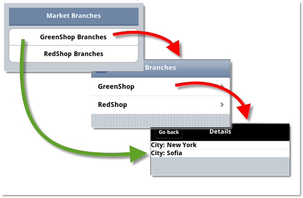

<!--
|metadata|
{
    "fileName": "iglistview-generating-direct-links-to-child-layouts",
    "controlName": "igListView",
    "tags": ["How Do I"]
}
|metadata|
-->

# Generating Direct Links to Child Layouts

## Topic Overview

### Purpose

This topic explains, with code examples, how to generate direct links to child layouts of the `igListView`™ control.

### Required background

The following topics are prerequisites to understanding this topic:

- [Adding igListView to a Web Page](igListView-Adding-igListView-to-a-Web-Page.html): This topic explains how you can add `igListView`™ mobile control to a web page.

### In this topic

This topic contains the following sections:

-   [**Generating Direct Links to Child Layouts – Conceptual Overview**](#overview)
-   [**Generating Direct Links to Child Layouts – Code Example**](#example)
-   [**Related Content**](#related-content)


## <a id="overview"></a> Generating Direct Links to Child Layouts – Conceptual Overview 
### Overview

The `igListView` control enables you to generate static links for its child layouts. Having static links for child layouts makes it possible to navigate directly to them from some external web page.



In the picture above, the red arrows indicate the route the user would normally need to follow (if no direct links to child layouts are used): they need to first navigate to the listview and then to its children. When direct links are employed, the user navigates to the child layout directly (the green arrow).

Static link generation is managed by an option of the `igListView` control – `generateSubPagesOnInit`. Setting the `generateSubPagesOnInit` option to true enables direct link generation.

The generated direct links of an `igListView` instance are unique for all its child layouts. Uniqueness is ensured by using the primary key field from the database in the formation of the links (see *Direct link syntax*).

### Direct link syntax

The pattern by which direct links are formed is as follows:

```
<target web page URL>&ui-page=<ID of the listview>-<PrimaryKey>/< PrimaryKey value >
```

For example, if the `id` of the `igListview` is `listView1`, the primary key database field is `MarketID`, and the value of the primary key of the first parent item is *1*, then the direct link URL is `Markets.html&ui-page=listView1-MarketID/1`.

### Requirements

Following are the general requirements for generating direct link URLs to child layouts:

-   Both the external (starting) page and the child layout (destination) pages must be AJAX-enabled
-   The data source must be local
-   The data source must be available on both the external (starting) page and the child layout (destination) page

> **Note:**
>
> The data can be supplied to the pages as either of the following:
> 
> -   in a script tag
> -   a link to a JavaScript file

### Property settings

The following table maps the desired property settings for generating direct link URLs.

Property | Setting
---- | -----
[CreateSubPagesOnInit Property](Infragistics.Web.Mvc.Mobile~Infragistics.Web.Mvc.Mobile.ListViewModel~CreateSubPagesOnInit.html) | true


## <a id="example"></a> Generating Direct Links to Child Layouts – Code Example

In the following example, two HTML pages are shown. The first one (the starting page) contains links to the child layouts of the `igListVIew` on the second HTML page (the landing page). By configuring the `igListView` to accept direct URL links to child layouts, the links on the first page take the user to specific child layouts on the second page. To illustrate this behavior, the `igListView` binds local JSON data defined in a script block on the second page.

### Prerequisites

To complete the procedure, you need the following:

-   A HTML page named Home.html, with Html, Head and Body tags included.
-   A HTML page named Markets.html, with Html, Head and Body tags included.
-   The required JavaScript and CSS files referenced in both pages. For details, refer to [Adding igListView to a Web Page.](igListView-Adding-igListView-to-a-Web-Page.html)

### Overview

Following is a conceptual overview of the process:

1.  [Preparing the Markets page](#prepare-markets-page)
2.  [Preparing the Home page](#prepare-home-page)
3.  [Verifying the result](#verify-results)

### Steps

1. Prepare the Markets page.<a id="prepare-markets-page"></a>

	1. Add the local data source on the page.Open the *Markets.html* file for editing and inside the HEAD tag, add the following script containing the data:
		
		**In JavaScript:**
		
		```js
		var markets = [{
		        "MarketID": 1,
		        "Name": "GreenShop",
		        "Branches": [
		      { "chid": 1, "City": "New York" },
		      { "chid": 5, "City": "Sofia"}]
		    }, {
		        "MarketID": 2,
		        "Name": "RedShop",
		        "Branches": [
		      { "chid": 2, "City": "Rio" },
		      { "chid": 3, "City": "Moscow"}]
		    }];
		```

	2. Add the `igListView` control and set the `generateSubPagesOnInit` option to true.
		
		Create the `igListView` and set the data source to the markets array from the snippet above.
		
		**In HTML:**
		
		```html
		<body>
		    <div data-role="page">
		            <div data-role="header">
		                  <h1>Branches</h1>
		                  <a href="#" data-icon="home" data-iconpos="notext">Home</a>
		            </div>
		            <div data-role="content">
		            <div id="listView1" data-role="iglistview"
		                        data-data-source="markets" data-bindings-primary-key="MarketID" 
		                        data-data-source-type="json" data-bindings-text-key="Name"
		                        data-show-count="true" data-local-schema-transform="true" 
		                        data-create-sub-pages-on-init="true">
		                        <ul>
		                        <li>
		                              <ul data-role="childLayout" data-key="Branches" 
		                                    data-data-source-type="json" data-data-bind-text-key="City" 
		                                    data-item-template="City: ${City}">
		                              </ul>                              
		                              </li>
		                        <ul>
		                  </div>
		            </div>
		    </div> 
		</body>
		```

	3. Save the HTML file.

2. Prepare the Home page.<a id="prepare-home-page"></a>

	1. Add the data source of the destination page.Open the *Home.html* file for editing and inside the HEAD tag, add the following script containing the data:
	
		> **Note**
		>
		> You must include the same data source used for the Home page. This is required because when AJAX is enabled for page requests, the head content from the response is not used. For more information see [Scripting pages in](http://jquerymobile.com/test/docs/pages/page-scripting.html)
		
		**In JavaScript:**
		
		```js
		var markets = [{
		      "MarketID": 1,
		      "Name": "GreenShop",
		      "Branches": [
		      { "chid": 1, "City": "New York"},
		      { "chid": 5, "City": "Sofia"}]
		}, {
		      "MarketID": 2,
		      "Name": "RedShop",
		      "Branches": [
		      { "chid": 2, "City": "Rio"},
		      { "chid": 3, "City": "Moscow"}]
		}];
		```

	2. Add the links to the destination page.
		
		In the following code snippet, the `id` of the `igListview` is `listView1`, the primary key database field is `MarketID` and the value of the primary key of the first parent item is *1*, so the link is:
		
		```
		Markets.html&ui-page=listView1-MarketID/1
		```

		**In HTML:**
		
		```html
		<body>
		      <div data-role="page" id="myID">
		            <div data-role="content">
		                  <div data-role="header" >
		                        <h1>Market Branches</h1>
		                  </div>
		                  <div data-role="controlgroup">
		                        <a data-role="button"
		                        href="Markets.html&ui-page=listView1-MarketID/1">GreenShop Branches</a>
		                        <a data-role="button"
		                        href="Markets.html&ui-page=listView1-MarketID/2">RedShop Branches</a>
		                  </div>      
		            </div>
		      </div>
		</body>
		```
	
	3. Save the HTML file.

3. Verify the result.<a id="verify-results"></a>

	Open the Home.html file in your browser and click any of the two link buttons. If you have implemented the code correctly, you will be taken directly to the respective child layout of the `igListView` on the Markets.html page.


## <a id="related-content"></a> Related Content

### <a id="topics"></a> Topics


The following topics provide additional information related to this topic.

- [*igListView* Overview](igListView-Overview.html): This topic explains the features of `igListView`.


 

 


