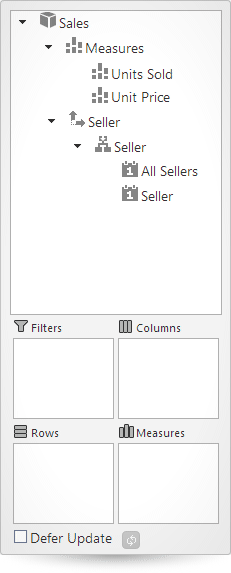
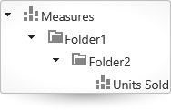
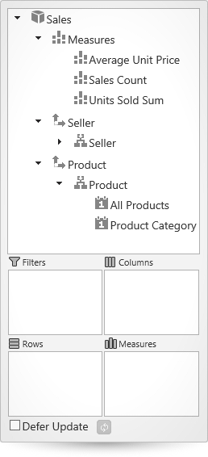

<!--
|metadata|
{
    "fileName": "igolapflatdatasource-defining-metadata",
    "controlName": "igOlapFlatDataSource",
    "tags": ["Data Binding","Data Presentation","How Do I","Tips and Tricks"]
}
|metadata|
-->

# Defining Metadata (igOlapFlatDataSource)

## Topic Overview
### Purpose

This topic explains how to define metadata for the data used with `igOlapFlatDataSource`™ so that flat data can be presented in multidimensional (OLAP) form.

### Required background

The following topics are prerequisites to understanding this topic:

- [igOlapFlatDataSource Overview](igOlapFlatDataSource-Overview.html): This topic provides an overview of the `igOlapFlatDataSource` component and its main features.

- [Adding igOlapFlatDataSource](igOlapFlatDataSource-Adding.html): This is a group of topics about adding of the `igOlapFlatDataSource` component to an HTML page and an ASP.NET MVC View.


### In this topic

This topic contains the following sections:

-   [**Introduction**](#introduction)
    -   [Defining metadata summary](#defining-metadata)
    -   [Minimum metadata definition requirements](#min-metadata)
    -   [Steps](#steps)
-   [**Metadata Configuration Summary**](#metadata-config-summary)
-   [**Configuring the Metadata Cube**](#config-metadata-cube)
    -   [Overview](#metadata-cube-overview)
    -   [Property settings](#metadata-cube-settings)
    -   [Example](#metadata-cube-example)
-   [**Configuring the Measures’ Dimension**](#config-measures-dimension)
    -   [Overview](#measures-dimension-overview)
    -   [Property settings](#measures-dimension-settings)
-   [**Configuring Measures**](#config-measures)
    -   [Overview](#config-measures-overview)
    -   [Property settings](#config-measures-settings)
-   [**Configuring Dimensions**](#config-dimentions)
    -   [Overview](#config-dimentions-overview)
    -   [Property settings](#config-dimentions-settings)
-   [**Configuring Hierarchies**](#config-hierarchies)
    -   [Overview](#hierarchies-overview)
    -   [Property settings](#hierarchies-settings)
-   [**Configuring Levels**](#config-levels)
    -   [Overview](#levels-overview)
    -   [Property settings](#levels-settings)
-   [**Code Example: Defining Metadata for igOlapFlatDataSource**](#code-example)
    -   [Description](#description)
    -   [Code](#code)
-   [**Related Content**](#related-content)
    -   [Topics](#topics)
    -   [Samples](#samples)


## <a id="introduction"></a>Introduction
### <a id="defining-metadata"></a>Defining metadata summary

The `igOlapFlatDataSource` component constructs a multidimensional (OLAP) data cube from the “flat” or hierarchical data with which it is supplied from the data source component ([igDataSource](igDataSource-igDataSource.html)™). In order to construct the cube, you need to define metadata for one or more dimensions. Each of the dimensions must have an identifier (name) and one or more hierarchies. Each of the hierarchies, too, has a name and one or more levels. In addition to these, metadata for the measures must be defined as well. Each measure must have a name and an aggregator that will be used for calculating the cell values. For most of these metadata items, additional optional properties are available. When the `igOlapFlatDataSource` is initialized and at run-time, it uses these metadata definitions to create the cube with all of its child items (dimensions, hierarchies, measures etc.).

In the context of `igOlapFlatDataSource`, metadata refers to a set of user-defined rules that determine how the input flat data will be presented in multidimensional (OLAP) form. These rules are implemented through metadata definitions that specify how the metadata items (cube, dimensions, hierarchies, levels, members, and measures) are generated and which properties of the input data objects should be utilized for this purpose. The metadata definitions are achieved by specifying metadata item objects that are to be used when [$.ig.MetadataTreeItem](%%jQueryApiUrl%%/ig.OlapMetadataTreeItem) objects are generated. The [$.ig.MetadataTreeItem](%%jQueryApiUrl%%/ig.OlapMetadataTreeItem) objects are organized in in a tree-like structure and are needed for visualizing the metadata tree in the `igPivotDataSelector`™ component. The structure of the metadata can be obtained through the [metadataTree()](%%jQueryApiUrl%%/ig.OlapFlatDataSource#methods) property of a multidimensional (OLAP) data source.

### <a id="min-metadata"></a>Minimum metadata definition requirements

For all metadata items you specify names (to be used in the code as identifiers) and captions (optional, to be displayed in the metadata tree of the `igPivotDataSelector` when one is attached to the data source). In addition to names and captions, there are some specific configuration items that need to be defined as follows:

-   For **dimensions**: one or more hierarchies have to be specified
-   For **hierarchies**: one or more levels have to be specified
-   For **levels**: a member provider function has to be set

(This function is called for every data item in the input data, when members for the particular level are generated. It is called with one parameter that is a data item. Based on the data item, you have to return a string to be used as caption for the member corresponding to the data item.)

-   For **measures**: an aggregator has to be specified.

(An aggregator is a function that is called when calculating the value of a result cell. The function you need to define accepts two parameters: (1) an array of the items that participate in the evaluation of the cell’s value and (2) a `CellMetadata` object containing information about the cell, for example, its column and row indexes. In this function, you perform the required calculations on the supplied items and return the value to be used, e.g. if you need to define a sum aggregator function for a numeric property of the data objects, you should return the sum of all the values of the property in the supplied objects.)

For hierarchies and measures, optionally a display folder setting can be configured. The display folder setting specifies where the hierarchy or measure is positioned in the metadata tree.

### <a id="steps"></a>Steps

Following are the general conceptual steps for specifying and configuring the metadata.

1. Configuring the metadata cube

2. Configuring dimensions

3. Configuring measures

4. Configuring hierarchies

5. Configuring levels 


## <a id="metadata-config-summary"></a>Metadata Configuration Summary

The following table explains briefly the configurable aspects of the metadata for the `igOlapFlatDataSource` component and maps them to properties that configure them.

<table class="table table-bordered">
	<thead>
		<tr>
            <th>
Configurable aspect
			</th>

            <th>
Details
			</th>

            <th>
Properties
			</th>
        </tr>
	</thead>
	<tbody>
        

        <tr>
            <td>
[Metadata cube](#config-metadata-cube)
			</td>

            <td>
Defines the name and caption for the cube; it is also used for defining the measures’ dimension and all other dimensions.
			</td>

            <td>
                <ul>
                    <li>
`cube`
					</li>

                    <li>
`name`
					</li>

                    <li>
`caption`
					</li>

                    <li>
`measuresDimension`
					</li>

                    <li>
`measures`
					</li>
                </ul>
            </td>
        </tr>

        <tr>
            <td>
[Measures’ dimensions](#config-measures-dimension)
			</td>

            <td>
Defines the name and caption for the measures’ dimension. Used for specifying the measures.
			</td>

            <td>
                <ul>
                    <li>
`measuresDimension`
					</li>

                    <li>
`name`
					</li>

                    <li>
`caption`
					</li>

                    <li>
`measures`
					</li>
                </ul>
            </td>
        </tr>

        <tr>
            <td>
[Measures](#config-measures)
			</td>

            <td>
Defines the names, captions, and aggregator functions of measures.
			</td>

            <td>
                <ul>
                    <li>
`measures`
					</li>

                    <li>
`name`
					</li>

                    <li>
`caption`
					</li>

                    <li>
`displayFolder`
					</li>

                    <li>
`aggregator`
					</li>
                </ul>
            </td>
        </tr>

        <tr>
            <td>
[Dimensions](#config-dimentions)
			</td>

            <td>
Defines the names, captions, and hierarchies for the dimensions.
			</td>

            <td>
                <ul>
                    <li>
`dimensions`
					</li>

                    <li>
`name`
					</li>

                    <li>
`caption`
					</li>

                    <li>
`hierarchies`
					</li>
                </ul>
            </td>
        </tr>

        <tr>
            <td>
[Hierarchies](#config-hierarchies)
			</td>

            <td>
Defines the names, captions, and levels for the hierarchies of a measure.
			</td>

            <td>
                <ul>
                    <li>
`hierarchies`
					</li>

                    <li>
`name`
					</li>

                    <li>
`caption`
					</li>

                    <li>
`displayFolder`
					</li>

                    <li>
`levels`
					</li>
                </ul>
            </td>
        </tr>

        <tr>
            <td>
[Levels](#config-levels)
			</td>

            <td>
Defines the names, captions, and member provider functions for the levels of a hierarchy.
			</td>

            <td>
                <ul>
                    <li>
`levels`
					</li>

                    <li>
`name`
					</li>

                    <li>
`caption`
					</li>

                    <li>
`memberProvider`
					</li>
                </ul>
            </td>
        </tr>
    </tbody>
</table>


## <a id="config-metadata-cube"></a>Configuring the Metadata Cube
### <a id="metadata-cube-overview"></a>Overview

The metadata cube is the root of the metadata tree containing the measures’ dimension and all the remaining dimensions. The metadata cube specifies the name and caption for the individual cubes; it is also used for defining the measures’ dimension and all measures.

### <a id="metadata-cube-settings"></a>Property settings

The following table maps the desired configuration to the respective property settings.

In order to: | Use this property: | Of type: | And set it to: | Required?
---|---|---|---|---
Set the cube’s name | name | string | A string containing the desired name. |Yes
Set the cube’s caption (displayed in the pivot data selector) | caption |string | A string containing the desired caption. | No
Configure set metadata for the measures dimension|measuresDimension |object| A `measuresDimensionMetadata` object containing the metadata for the measures’ dimension.|Yes
Configure metadata for the dimensions|dimensions|array|An array of `dimensionsMetadata` objects containing the metadata each of the dimensions.|Yes


### <a id="metadata-cube-example"></a>Example

The screenshot below visualizes a `MeasuresDimensionMetadata` object containing metadata for one measure and a `DimensionsMetadata` object containing metadata for one hierarchy with two levels as a result of the following cube settings:


- `name` : Sales
- `measuresDimension` : 

**In JavaScript:** 
```jsmeasuresDimension 
   measuresDimension:{
  		measures [ { 
			name: "Units Sold", 
			aggregator: function (items, cellMetadata) { 
				var sum = 0; 
				$.each(items, function (index, item) { 
					sum += item.UnitsSold; 
				}); 
			return sum; 	
			} 
		}], 
	}
``` 
- `dimensions`

**In JavaScript:**
```js
dimensions
dimensions: [ { 
	name: "Seller", 
	hierarchies: [{ 
		name: "Seller", 
		levels: [ { 
			name: "All Sellers", 
			memberProvider: function (item) { return "All Sellers"; } }, { 
				name: "Seller", 
				memberProvider: function (item) { 
					return item.SellerName; 
				} 
			}] 
		}] 
	} ]
```




Following is the code that implements this example.

**In JavaScript:**

```js
cube: {
    name: "Sales",
    measuresDimension: {
        measures: [
            {
                name: "Units Sold",
                aggregator: function (items, cellMetadata) {
                    var sum = 0;
                    $.each(items, function (index, item) {
                        sum += item.UnitsSold;
                    });
                    return sum;
                }
            }],
    },
    dimensions: [
        {
            name: "Seller", hierarchies:
               [{
                   name: "Seller", levels: [
                     {
                         name: "All Sellers",
                         memberProvider: function (item) { return "All Sellers"; }
                     },
                     {
                         name: "Seller",
                         memberProvider: function (item) { return item.SellerName; }
                     }]
               }]
        }
    ]
}
```


## <a id="config-measures-dimension"></a>Configuring the Measures’ Dimension
### <a id="measures-dimension-overview"></a>Overview

The measures’ dimension is used to group all the measures. There is only one measures’ dimension in the cube. The measures’ dimension defines the names, captions, and hierarchies for the dimensions. For the measuresDimension property, measures are specified instead of hierarchies.

### <a id="measures-dimension-settings"></a>Property settings

The following table maps the desired configuration to the respective
property settings.

In order to: | Use this property: | Of type: |And set it to: | Required?
---|---|---|---|---
Set the name of the measures’ dimension|name|string|A string containing the desired name. (The default is “`Measures`”.) Used for identifying the measures’ dimension.|No
Set the caption for the measures’ dimension.|caption|string|A string containing the desired caption. Used for displaying a label for that measures’ dimension in the pivot data selector. (If the caption is not set, the value of the name will be used.)|No
Specify metadata for the measures|measures|array|An array of `measureMetadata` objects|Yes


## <a id="config-measures"></a>Configuring Measures
### <a id="config-measures-overview"></a>Overview

Configuring measures consists of defining of the names, captions, and aggregator the functions for the measures. Metadata for the measures is specified in the [measures](%%jQueryApiUrl%%/ig.OlapFlatDataSource#options:measures) array of the [measuresDimension](%%jQueryApiUrl%%/ig.OlapFlatDataSource#options:measuresDimension). The property settings must be applied to each of the `measureMetadata` objects in the measures array.

### <a id="config-measures-settings"></a>Property settings

The following table maps the desired configuration to the respective
property settings.

<table class="table">
	<thead>
		<tr>
            <th>
In order to:
			</th>

            <th>
Use this property:
			</th>

            <th>
Of type:
			</th>

            <th>
And set it to:
			</th>

            <th>
Required?
			</th>
        </tr>
	</thead>
	<tbody>
        

        <tr>
            <td>
Set the name of the measure
			</td>

            <td>
name
			</td>

            <td>
string
			</td>

            <td>
A string containing the desired caption. Used for identifying the measure.
			</td>

            <td>
Yes
			</td>
        </tr>

        <tr>
            <td>
Set the caption for the measure.
			</td>

            <td>
caption
			</td>

            <td>
string
			</td>

            <td>
A string containing the desired caption. Used for displaying a label for that measure in the pivot grid. (If a caption is not set, the value of the name is used.)
			</td>

            <td>
No
			</td>
        </tr>

        <tr>
            <td>
Specify the position of the measure in the display hierarchy
			</td>

            <td>
displayFolder
			</td>

            <td>
string
			</td>

            <td>
A string in the following format:

                `“Folder\\Inner Folder”`.

                In an igPivotDataSelector such a measure will be displayed like this:

                
                    
			</td>

            <td>
No
			</td>
        </tr>

        <tr>
            <td>
Specify a callback to be invoked when each cell result is evaluated
			</td>

            <td>
aggregator
			</td>

            <td>
function
			</td>

            <td>
                A function returning a value to be displayed in a result cell. Returning null results in no cell being created in the result. The function accepts two parameters:

                <ul>
                    <li>
`items` – an array of the data source objects that must participate in calculating the value for the cell
					</li>

                    <li>
`cellMetadata` – a `CellMetadata` object containing additional information about the cell
					</li>
                </ul>

                For sample implementations of average, count and sum aggregators, refer to [Code Example: Defining Metadata for igOlapFlatDataSource](#code-example).
            </td>

            <td>
Yes
			</td>
        </tr>
    </tbody>
</table>


## <a id="config-dimentions"></a>Configuring Dimensions
### <a id="config-dimentions-overview"></a>Overview

Dimensions are used to group hierarchies. Each dimension must have at least one hierarchy specified. Configuring dimensions consists of defining the names, captions, and hierarchies for the dimensions. All dimensions, except for the measures’ dimension, are specified in the dimensions property of the cube as an array of objects. The property settings apply to each of the `measureMetadata` objects that you specify in the dimensions array.

### <a id="config-dimentions-settings"></a>Property settings

The following table maps the desired configuration to the respective
property settings.

In order to: | Use this property: | Of type: | And set it to: | Required?
---|---|---|---|---
Set the name of the dimension | *name* | string |A string containing the desired name. Used for identifying the dimension. | Yes
Set the caption for the dimension | *caption* | string |A string containing the desired caption. Used for displaying a label for that dimension in the pivot data selector. (If the caption is not set, the value of the name will be used.) | No
Specify metadata for the hierarchies belonging to this measure | *hierarchies* | array |An array of `dimensionMetadata` objects containing metadata for the dimension. |Yes


## <a id="config-hierarchies"></a>Configuring Hierarchies
### <a id="hierarchies-overview"></a>Overview

Hierarchies for a dimension are specified in the `hierarchies` property of a `dimension`. For each dimension at least one hierarchy must be defined. The property settings listed below must be applied to each of the `hierarchyMetadata` objects in the hierarchies array.

### <a id="hierarchies-settings"></a>Property settings

The following table maps the desired configuration to property settings.

In order to: | Use this property: | Of type: | And set it to: | Required?
---|---|---|---|---
Set the name of the hierarchy | name | String | A string containing the desired name. Used for identifying the hierarchy. | Yes
Set the caption for the hierarchy | caption | string | A string containing the desired caption. Used for displaying a label for that hierarchy in the pivot grid. (If the caption is not set, the value of the name will be used.) | No
Specify the hierarchy’s position | displayFolder | string | A string in the following format: `“Folder\\Inner Folder”` In an `igPivotDataSelector` such a hierarchy will be displayed like this:  | No
Specify metadata for the levels belonging to this hierarchy | levels | Array | An array of `levelMetadata` objects containing the metadata for the hierarchy. | Yes


## <a id="config-levels"></a>Configuring Levels
### <a id="levels-overview"></a>Overview

Levels for a hierarchy are specified in the `levels` property of a `hierarchy`. For each hierarchy at least one level must be defined. The property settings listed below must be applied to each of the `levelMetadata` objects in the levels array.

### <a id="levels-settings"></a>Property settings

The following table maps the desired configuration to the respective
property settings.

In order to: | Use this property: | Of type: | And set it to: | Required?
---|---|---|---|---
Set the name of the level | name | string |A string containing the desired name. Used for identifying the level. |Yes 
Set the caption for the level | caption |string |A string containing the desired caption. Used for displaying a label for that level in the pivot grid. (If the caption is not set, the value of the name will be used.) |No
Configure the callback to be invoked for each item of the data source array when level members are created | memberProvider |function |A function accepting an item from the data source as parameter and based on it and returning a string to be used as the name and caption for the respective member. |Yes


## <a id="code-example"></a>Code Example: Defining Metadata for igOlapFlatDataSource
### <a id="description"></a>Description

The following code example configures metadata for the `igOlapFlatDataSource` component by defining three measures using different aggregator functions and two dimensions with one hierarchy for each. Each of the hierarchies has two levels.



### <a id="code"></a>Code

Following is the full code of the example demonstrates including a complete declaration of an `igOlapFlatDataSource` instance.

**In JavaScript:**

```js
Var dataSource = new $.ig.FlatDataSource({
                dataOptions: {
                    dataSource:
                        [{ "ProductCategory": "Clothing", "UnitPrice": 12.81, "SellerName": "Stanley Brooker", "Country": "Bulgaria", "City": "Plovdiv", "Date": "2007-01-01", "UnitsSold": 282 },
                        { "ProductCategory": "Clothing", "UnitPrice": 49.57, "SellerName": "Elisa Longbottom", "Country": "US", "City": "New York", "Date": "2007-01-05", "UnitsSold": 296 },
                        { "ProductCategory": "Bikes", "UnitPrice": 3.56, "SellerName": "Lydia Burson", "Country": "Uruguay", "City": "Ciudad de la Costa", "Date": "2007-01-06", "UnitsSold": 68 },
                        { "ProductCategory": "Accessories", "UnitPrice": 85.58, "SellerName": "David Haley", "Country": "UK", "City": "London", "Date": "2007-01-07", "UnitsSold": 293 },
                        { "ProductCategory": "Components", "UnitPrice": 18.13, "SellerName": "John Smith", "Country": "Japan", "City": "Yokohama", "Date": "2007-01-08", "UnitsSold": 240 },
                        { "ProductCategory": "Clothing", "UnitPrice": 68.33, "SellerName": "Larry Lieb", "Country": "Uruguay", "City": "Ciudad de la Costa", "Date": "2007-01-12", "UnitsSold": 456 },
                        { "ProductCategory": "Components", "UnitPrice": 16.05, "SellerName": "Walter Pang", "Country": "Bulgaria", "City": "Sofia", "Date": "2007-02-09", "UnitsSold": 492 }]
                },
                metadata: {
                    cube: {
                        name: "Sales",
                        measuresDimension: {
                            measures: [
                                {
                                    // example for sum aggreagor
                                    name: "Units Sold Sum",
                                    aggregator: function (items, cellMetadata) {
                                        var sum = 0;
                                        $.each(items, function (index, item) {
                                            sum += item.UnitsSold;
                                        });
                                        return sum;
                                    }
                                },
                                {
                                    // example for average aggreagor
                                    name: "Average Unit Price",
                                    aggregator: function (items, cellMetadata) {
                                        var sum = 0;
                                        $.each(items, function (index, item) {
                                            sum += item.UnitPrice;
                                        });
                                        return sum / items.length;
                                    }
                                },
                                {
                                    // example for count aggregator
                                    name: "Sales Count",
                                    aggregator: function (items, cellMetadata) {
                                        var count = 0;
                                        $.each(items, function (index, item) {
                                            if (item.UnitsSold !== undefined &&
                                                item.UnitsSold !== null &&
                                                item.UnitsSold > 0) {
                                                count++;
                                            }
                                        });
                                        return count;
                                    }
                                }
                            ],
                        },
                        dimensions: [
                            {
                                name: "Seller", hierarchies:
                                   [{
                                       name: "Seller", levels: [
                                         {
                                             name: "All Sellers",
                                             memberProvider: function (item) { return "All Sellers"; }
                                         },
                                         {
                                             name: "Seller",
                                             memberProvider: function (item) { return item.SellerName; }
                                         }]
                                   }]
                            },
                            {
                                caption: "Product", name: "Product", hierarchies: [
                                    {
                                        name: "Product", levels: [
                                            {
                                                name: "All Products",
                                                memberProvider: function (item) { return "All Products"; }
                                            },
                                            {
                                                name: "Product Category",
                                                memberProvider: function (item) { return item.ProductCategory; }
                                            }
                                        ]
                                    }]
                            }
                        ]
                    }
                }
            });
```


## <a id="related-content"></a>Related Content
### <a id="topics"></a>Topics

The following topics provide additional information related to this topic.

- [igPivotDataSelector Overview](igPivotDataSelector-Overview.html): This topic provides conceptual information about the igPivotDataSelector control including its main features, minimum requirements, and user functionality.

- [Adding igPivotDataSelector to an ASP.NET MVC Application](igPivotDataSelector-Adding-Using-the-MVC-Helper.html): This topic explains, in both conceptual and step-by-step form, how to add the `igPivotDataSelector` control to an ASP.NET MVC application using ASP.NET MVC helper.

### <a id="samples"></a>Samples

The following samples provide additional information related to this topic.

- [Binding to Flat Data Source](%%SamplesUrl%%/pivot-grid/binding-to-flat-data-source): This sample demonstrates how to bind the `igPivotGrid` to an `igOlapFlatDataSource` and uses an `igPivotDataSelector` for data selection.


 

 


