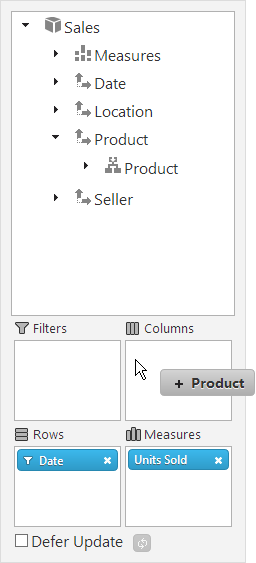
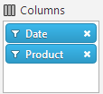
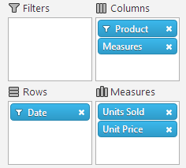
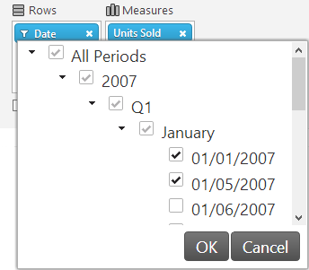

<!--
|metadata|
{
    "fileName": "configuring-the-tabular-view",
    "controlName": "",
    "tags": ["Data Presentation","How Do I","Tips and Tricks"]
}
|metadata|
-->

# Configuring the Tabular View of the Pivot Grid Result Set

## Topic Overview
### Purpose

This topic explains how to configure the tabular View of the OLAP cube result set by arranging the hierarchies of the pivot grid columns, rows, filters, and measures, either from the grid’s interface or programmatically in the code.

> **Note:** The information in this topic is relevant to the following controls: `igOlapFlatDataSource`, `igOlapXmlaDataSource`, `igPivotDataSelector`, `igPivotGrid`, `igPivotView`.

### Required background

The following topics are prerequisites to understanding this topic:

- [igOlapXmlaDataSource Overview](igOlapXmlaDataSource-Overview.html): This topic provides an overview of the `igOlapXmlaDataSource`™ component and its main features.

- [Adding igOlapXmlaDataSource](igOlapXmlaDataSource-Adding.html): The topics in this group cover adding the `igOlapXmlaDataSource` component to an HTML page and an ASP.NET MVC View.

- [igOlapFlatDataSource Overview](igOlapFlatDataSource-Overview.html): This topic provides an overview of the `igOlapFlatDataSource`™ component and its main features.

- [Adding igOlapFlatDataSource](igOlapFlatDataSource-Adding.html): The topics in this group cover adding `igOlapFlatDataSource` to an HTML page and an ASP.NET MVC View.

- [igPivotDataSelector Overview](igPivotDataSelector-Overview.html): This topic provides conceptual information about the `igPivotDataSelector`™ control including its main features, minimum requirements, and user functionality.


### In this topic

This topic contains the following sections:

-   [Specifying an OLAP Data Slice by Arranging the Columns, Rows, Filters, and Measures](#specifying-olap-data-slice)
    -   [Specifying an OLAP data slice summary](#summary)
    -   [Specifying an OLAP data slice summary chart](#summary-chart)
-   [User Configuration Through the Interface of the Pivot Grid (igPivotDataSelector, igPivotGrid, igPivotView)](#user-configuration)
    -   [User configuration summary](#user-config-summary)
    -   [Configuring of the user configuration options](#user-config-options)
-   [Programmatic Configuring upon Data Source Initialization (igOlapFlatDataSource, igOlapXmlaDataSource)](#programmatic-configuration)
    -   [Programmatic configuring upon data source initialization summary](#programmatic-config-summary)
    -   [Property settings](#programmatic-config-settings)
    -   [Code example](#programmatic-config-example)
-   [Programmatic Configuring at Run-Time (igOlapFlatDataSource, igOlapXmlaDataSource)](#programmatic-configuration-run-time)
    -   [Overview](#run-time-overview)
    -   [Method settings](#programmatic-config-settings)
    -   [Code example](#programmatic-config-example)
-   [Related Content](#related-content)
    -   [Samples](#samples)


## <a id="specifying-olap-data-slice"></a>Specifying an OLAP Data Slice by Arranging the Columns, Rows, Filters, and Measures
### <a id="summary"></a>Specifying an OLAP data slice summary

The starting point for performing data analysis of a multi-dimensional (OLAP) data set is presenting the OLAP cube in tabular form with various levels of filtering and aggregation of the data. This filtering and aggregation is based on selecting certain data categories and data aggregation criteria. In a pivot grid, the particular tabular view meeting the desired criteria is achieved through the specific choice and arrangement of the rows, columns, filters, and measures of the grid. This arrangement filters the result set to configure a particular slice based the desired data categories levels of aggregation and display it in tabular view. So specifying and displaying a particular data slice (view) is a matter of configuring (= selecting and arranging) the hierarchies for the rows, columns, filters, and measures.

In the %%ProductName%%™ OLAP components, the configuring of these hierarchies can be done on the following levels:

-   From the user interface of the respective UI widgets (`igPivotDataSelector`, `igPivotGrid`™, `igPivotView`™) (user configuration)
-   Programmatically with the `igOlapFlatDataSource` or `igOlapXmlaDataSource` API, which can be:
    -   Pre-setting columns, rows, filters, and measures (a specific arrangement to be loaded upon initialization)
    -   Changing the arrangement of columns, rows, filters and measures run-time

### <a id="summary-chart"></a>Specifying an OLAP data slice summary chart

The following table provides an overview of the existing ways to configure a particular tabular view of the result set in a pivot grid by configuring the grid’s rows, columns, filters.

Method | Details
---|---
[User Configuration Through the Interface of the Pivot Grid (igPivotDataSelector, igPivotGrid, igPivotView)](#user-configuration)|Users can configure the desired tabular view by the selecting hierarchies and measures with drag-and-drop from the user interface of the pivot grid.
[Programmatic Configuring upon Data Source Initialization (igOlapFlatDataSource, igOlapXmlaDataSource)](#programmatic-configuration)|You can programmatically configure the tabular view that will be generated when the pivot grid initializes by setting rows, columns, hierarchies, and measures through the initialization options of the data source component.
[Programmatic Configuring at Run-Time (igOlapFlatDataSource, igOlapXmlaDataSource)](#programmatic-configuration-run-time)|You can programmatically configure the tabular view at run-time by setting rows, columns, hierarchies, and measures through the API of the `igOlapFlatDataSource` and `igOlapXmlaDataSource` components.


##<a id="user-configuration"></a> User Configuration Through the Interface of the Pivot Grid (igPivotDataSelector, igPivotGrid, igPivotView)
### <a id="user-config-summary"></a>User configuration summary

The `igPivotDataSelector` control (and, respectively, the `igPivotView` control in which the `igPivotDataSelector` is internally used) has a user interface that enables selecting and arranging of hierarchies and measures. (The `igPivotGrid` provides some functionality, (albeit limited). This selecting and arranging is done by dragging items from the metadata tree to the columns, rows, filters, and measures areas beneath it.

The screenshot below demonstrates, an `igPivotDataSelector` control in which a data slice is being defined and arranged by dragging the Product hierarchy from its metadata tree node to the Columns drop-area. The result of this user action would be the hierarchy being added to the columns collection of the data source and, providing the `igPivotGrid` is bound to the same data source, the root member(s) of this hierarchy displayed in the column headers area.



#### Related content

The User Interactions and Usability section of the following topics:

-   [igPivotDataSelector Overview](igPivotDataSelector-Overview.html)
-   [igPivotGrid Overview](igPivotGrid-Overview.html)
-   [igPivotView Overview](igPivotView-Overview.html)

### <a id="user-config-options"></a>Configuring of the user configuration options

By default, all hierarchies are allowed to be dropped to the columns, rows, and filters and all measures can be drag-and-dropped from the metadata tree to the measures area. You can however enforce custom restrictions on this behavior using the [customMoveValidation](%%jQueryApiUrl%%/ui.igPivotGrid#options:customMoveValidation) option of the respective OLAP data visualization control (`igPivotDataSelector`, `igPivotGrid`, or `igPivotView`).


## <a id="programmatic-configuration"></a>Programmatic Configuring upon Data Source Initialization (igOlapFlatDataSource, igOlapXmlaDataSource)
### <a id="programmatic-config-summary"></a>Programmatic configuring upon data source initialization summary

You can programmatically configure the tabular view that will be generated when the pivot grid initializes by setting rows, columns, hierarchies, and measures through the initialization options of the data source component. The `igOlapFlatDataSource` and `igOlapXmlaDataSource` components support this through a set of properties for specifying the hierarchies and their members to display in the view.

The `igOlapFlatDataSource` and `igOlapXmlaDataSource` components have a result property that contains the current view of the data. This property is used by the OLAP data presentation controls (`igPivotDataSelector`, `igPivotGrid`, or `igPivotView`) for displaying the current state of the data source.

To specify the initial hierarchies and/or measures, you need to set the respective properties to the unique names of the hierarchies (= the [uniqueName](%%jQueryApiUrl%%/ig.Hierarchy#methods:uniqueName) property values).The syntax requirements are:

-   Separating individual hierarchy names with commas, if more than one hierarchy or measure per area is present.
-   The members of a hierarchy to be selected and therefore present in the result view (all the remaining non-selected members will not be present), must be listed with their unique names in curly braces ({})after the unique name of their hierarchy and separated with commas.

>**Note:** For `igOlapXmlaDataSource`, the unique names are determined by the server’s settings.  For igOlapFlatDataSource, the unique name of a hierarchy is generated using the following pattern:  [dimensionMetadata.name].[hierarchyMetadata.name]. The unique names of the members are generated using the following pattern:

[dimensionMetadata.name].[hierarchyMetadata.name].[levelMetadata.name].parentMembersPath&[membername]  where parentMembersPath is the concatenation of all the names of the members that are parents to the particular member and the &[memberName] pattern is used for all these names. An example for a valid member unique name could be:  [Date].[Date].[SaleDateDay].&[2007]&[Q 1]&[January]&[Jan 1]

### <a id="programmatic-config-settings"></a>Property settings

The following table maps the desired configuration tasks to property settings that set them up.

<table class="table table-bordered">
	<thead>
		<tr>
            <th>
In order to:
			</th>

            <th>
Use this property:
			</th>

            <th>
And set it to:
			</th>
        </tr>
	</thead>
	<tbody>
        

        <tr>
            <td>
Set the column hierarchies
			</td>

            <td>
[columns](%%jQueryApiUrl%%/ig.OlapFlatDataSource#options:columns)
			</td>

            <td rowspan="4">
A string containing comma-separated unique names of the desired hierarchies or measures.

                The left-to-right arrangement of the names in the string corresponds to top-to-bottom arrangement of the items in the hierarchy (visualized in igPivotGrid as right-to-left). For example, the following arrangement `“[Date].[Date],[Product].[Product]”` results
                    in:

                
                    
                

                Every hierarchy can be used in any one of the three dimensional roles in the pivot grid: Columns, Rows, Filters.
			</td>
        </tr>

        <tr>
            <td>
Set the row hierarchies
			</td>

            <td>
[rows](%%jQueryApiUrl%%/ig.OlapFlatDataSource#options:rows)
			</td>
        </tr>

        <tr>
            <td>
Set the filter hierarchies
			</td>

            <td>
[filters](%%jQueryApiUrl%%/ig.OlapFlatDataSource#options:filters)
			</td>
        </tr>

        <tr>
            <td>
Set the measures
			</td>

            <td>
[measures](%%jQueryApiUrl%%/ig.OlapFlatDataSource#options:measures)
			</td>
        </tr>
    </tbody>
</table>


### <a id="programmatic-config-example"></a>Code example

The following code example demonstrates how to setup initial rows, columns, and measures for an `igOlapFlatDataSource` instance as defined in the [Adding igPivotDataSelector to an HTML Page](igPivotDataSelector-Adding-to-HTML-Page.html) topic. In an `igPivotDataSelector` control bound to the data source described in that topic, this will display as in the following picture:



 

**In C#:**

```csharp
var dataSource = new $.ig.OlapFlatDataSource({ 
   //…
   rows: "[Date].[Date]",
   columns: "[Product].[Product]",
   measures: "[Measures].[UnitsSold],[Measures].[UnitPrice]"
});
```

The following snippet specifies the selected members for the Date hierarchy:

**In C#:**

```csharp
var dataSource = new $.ig.OlapFlatDataSource({ 
   //…
   rows: "[Date].[Date]{ [Date].[Date].[SaleDateDay].&[All Periods]&[2007]&[Q 1]&[January]&[Jan 1], [Date].[Date].[SaleDateDay].&[All Periods]&[2007]&[Q 1]&[January]&[Jan 5]}",
   columns: "[Product].[Product]",
   measures: "[Measures].[UnitsSold],[Measures].[UnitPrice]"
});
```

The result would be as follows:




## <a id="programmatic-configuration-run-time"></a>Programmatic Configuring at Run-Time (igOlapFlatDataSource, igOlapXmlaDataSource)
### <a id="run-time-overview"></a>Overview

You can programmatically configure the tabular view at run-time by setting rows, columns, hierarchies, and measures through the API of the `igOlapFlatDataSource` and `igOlapXmlaDataSource` components. This API supports the adding and removing items to/from the measures area through a dedicated API.

### <a id="programmatic-config-settings"></a>Method settings

The following table maps the desired configuration task to the specific methods in the `igOlapFlatDataSource` and `igOlapXmlaDataSource` API through which it is achieved.

In order to: | Use this method:
---|---
Add an item to columns, rows, filters, or measures|[addColumnItem(item) or insertColumnItem(index, item)](%%jQueryApiUrl%%/ig.OlapFlatDataSource#methods) <br> [addRowItem(item) or insertRowItem(index, item)](%%jQueryApiUrl%%/ig.OlapFlatDataSource#methods) <br> [addFilterItem(item) or insertFilterItem(index, item)](%%jQueryApiUrl%%/ig.OlapFlatDataSource#methods) <br> [addMeasureItem(item) or insertMeasureItem(index, item)](%%jQueryApiUrl%%/ig.OlapFlatDataSource#methods)
Remove an item from columns, rows, filters, or measures|[removeColumnItem(item)](%%jQueryApiUrl%%/ig.OlapFlatDataSource#methods) <br> [removeRowItem(item)](%%jQueryApiUrl%%/ig.OlapFlatDataSource#methods) <br> [removeFilterItem(item)](%%jQueryApiUrl%%/ig.OlapFlatDataSource#methods) <br> [removeMeasureItem(item)](%%jQueryApiUrl%%/ig.OlapFlatDataSource#methods)

### <a id="programmatic-config-example"></a>Code example

The following code example demonstrates how to add and remove an item to/from the columns and measures of an OLAP data source instance using the `dataSource` identifier.

**In JavaScript:**

```js
// get a reference to the hierarchy you want to add
var hierarchy = dataSource.getHierarchy("[Date].[Date]");// orvar hierarchy = dataSource.getCoreElement(function (element) { return element.uniqueName() === "[Date].[Date]" }, $.ig.Hierarchy.prototype.getType());

// add it to the columns
dataSource.addColumnItem(hierarchy);
// get a reference to the measure you want to add
var measure = dataSource.getMeasure"[Measures].[UnitsSold]");// orvar measure = dataSource.getCoreElement(function (element) { return element.uniqueName() === "[Measures].[UnitsSold]" }, $.ig.Measure.prototype.getType());
// add it to the measures
dataSource.addMeasureItem(measure);
// update the data source
dataSource.update()
```


## <a id="related-content"></a>Related Content
### <a id="samples"></a>Samples

The following samples provide additional information related to this topic.

- [Binding to Flat Data Source](%%SamplesUrl%%/pivot-grid/binding-to-flat-data-source): This sample demonstrates how to bind the `igPivotGrid` to an `igOlapFlatDataSource` and uses an `igPivotDataSelector` for data selection.

- [Custom Move Validation](%%SamplesUrl%%/pivot-grid/custom-drag-drop-validation): This sample shows how to configure custom move validation with the Pivot Grid and the Pivot Data Selector. When using a custom validation function, dropping items to the columns is forbidden. Also any hierarchy that contains the word "Seller" in its name will not be accepted by the drop areas in the Pivot Grid and the Data Selector.


 

 


