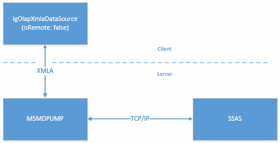
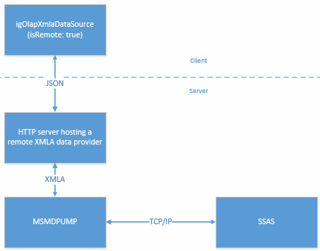
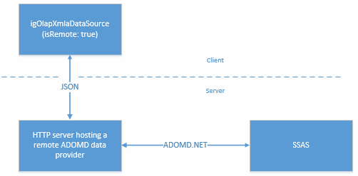

<!--
|metadata|
{
    "fileName": "igolapxmladatasource-data-provider-configuration-overview",
    "controlName": "igOlapXmlaDataSource",
    "tags": ["Getting Started","How Do I"]
}
|metadata|
-->

# Data Provider Configuration Overview (igOlapXmlaDataSource)

## Topic Overview
### Purpose

This topic provides an overview of the supported data providers for the `igOlapXmlaDataSource`™ component and conceptual-level information on how to configure them. For configuration specifics and concrete instructions, refer to [Configuring igOlapXmlaDataSource Through a Remote Provider](igOlapXmlaDataSource-Configuring-Through-a-Remote-Provider.html) and [Adding igOlapXmlaDataSource to an HTML Page](igOlapXmlaDataSource-Adding-to-an-HTML-Page.html).

### Required background

The following table lists the topics and articles required as a prerequisite to understanding this topic.

- [igOlapXmlaDataSource Overview](igOlapXmlaDataSource-Overview.html): This topic provides an overview of the `igOlapXmlaDataSource` component and its main features.

### In this topic

This topic contains the following sections:

-   [**Data Provider Configuration Summary**](#data-provider)
    -   [Data providers configuration types](#config-types)
    -   [Direct data provider configuration](#direct-data-provider)
    -   [Remote data provider configuration](#remote-data-provider)
    -   [Configuring igOlapXmlaDataSource for a remote provider](#remote-provider)
-   [**Related Content**](#related-content)
    -   [Topics](#topics)
    -   [Samples](#samples)

## Data Provider Configuration Summary
### Data providers configuration types

The possible types of configurations for obtaining data from a SSAS server by the `igOlapXmlaDataSource` component are listed in the table below. A conceptual-level overview of each configuration type is available in the paragraphs after the table.

Configuration type | Description
---|---
[Direct](#direct-data-provider) | The `igOlapXmlaDataSource` connects to an msmdpump HTTP data provider.
[Remote](#remote-data-provider) | An Infragistics® remote data provider is used to proxy all the communication between the `igOlapXmlaDataSource` and the SSAS server.

### Direct data provider configuration

In the direct data provider configuration, the `igOlapXmlaDataSource` communicates with SSAS through the msmdpump HTTP data provider. All the communication between the `igOlapXmlaDataSource` and the data provider is done via XMLA as illustrated in the picture.

The main advantages of using direct data providers (as contrasted to remote ones) are:

-   No need for an ASP.NET server-side component (data provider). This makes possible for direct data providers to be used in any web application.
-   Even though the amount of data being sent between the client and server larger, direct data providers may still be faster in some situations.

In order to configure the `igOlapXmlaDataSource` for direct use, it needs to be supplied with the URL of the msmdpump data provider. For the configuration specifics and concrete instructions, refer to [Configuring IIS for MSMDPUMP for igOlapXmlaDataSource](igOlapXmlaDataSource-Configuring-IIS-for-Msmdpump.html) and [Adding igOlapXmlaDataSource to an HTML Page](igOlapXmlaDataSource-Adding-to-an-HTML-Page.html)

### Remote data provider configuration

The remote providers for `igOlapXmlaDataSource` are server-side components which enable the so called remote configuration. With this type of configuration, the `igOlapXmlaDataSource` does not communicate directly with the msmdpump HTTP data provider for the SSAS server (default) but with a server application that proxies the communication to SSAS.

The main advantages of using remote data providers (as contrasted to direct ones) are:

-   Having all the communication between the client (`igOlapXmlaDataSource`) and the server (HTTP server) done in JSON and not XMLA, which results in less network traffic

Avoiding some of the [configuring required for server-side configurations](igOlapXmlaDataSource-Configuring-IIS-for-Msmdpump.html).

The following table lists the types of remote data providers supported by the `igOlapXmlaDataSource` component and briefly explains them.

Remote data provider type | Description
---|---
XMLA|Connects to an HTTP data provider (msmdpump) for SSAS.
ADOMD.NET|Connects directly to an SSAS instance using Microsoft® ADOMD.NET.

The following diagrams present conceptually the data flow with each provider type.

**XMLA data provider**

**ADOMD.NET data provider**

### Configuring igOlapXmlaDataSource for a remote provider

To configure the `igOlapXmlaDataSource` for a remote data provider, you need to first add the data provider to your ASP.NET MVC application and then configure `igOlapXmlaDataSource` to use a remote provider and supply it with the provider URL.

For configuration specifics and concrete instructions, refer to [Configuring `igOlapXmlaDataSource` Through a Remote Provider](igOlapXmlaDataSource-Configuring-Through-a-Remote-Provider.html) and [Adding `igOlapXmlaDataSource` to an HTML Page](igOlapXmlaDataSource-Adding-to-an-HTML-Page.html).

## Related Content
### Topics

The following topics provide additional information related to this topic.

- [Adding `igOlapXmlaDataSource` to an HTML Page](igOlapXmlaDataSource-Adding-to-an-HTML-Page.html): This topic explains how to add the `igOlapXmlaDataSource` to and HTML page and how to configure it for retrieving data from a Microsoft SQL Server Analysis Services (SSAS) Server.

- [Configuring `igOlapXmlaDataSource` Through a Remote Provider](igOlapXmlaDataSource-Configuring-Through-a-Remote-Provider.html): This topic explains how to configure the `igOlapXmlaDataSource` with a remote data provider.

### Samples

The following samples provide additional information related to this topic.

- [Binding to XMLA Data Source](%%SamplesUrl%%/pivot-grid/binding-to-xmla-data-source): This sample demonstrates how to bind the `igPivotGrid`™ to an `igOlapXmlaDataSource`.

- [Remote Xmla Provider](%%SamplesUrl%%/pivot-grid/remote-xmla-provider): This sample demonstrates reducing the network traffic using a remote provider with the `igOlapXmlaDataSource` component.

- [ADOMD.NET Remote Data Provider](%%SamplesUrl%%/pivot-grid/remote-adomd-provider): This sample demonstrates using the ADOMD.NET remote provider with the `igPivotGrid` control.

 

 

