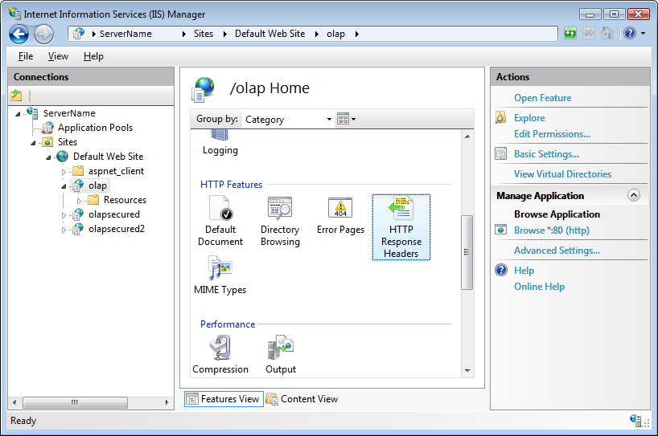
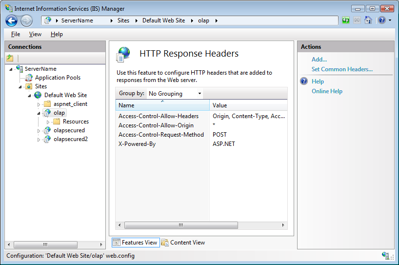
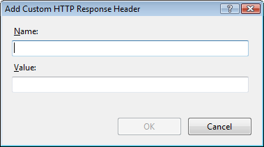
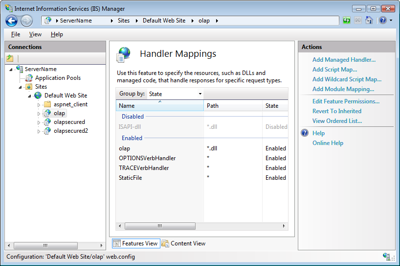
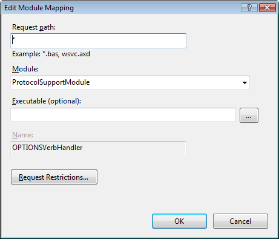
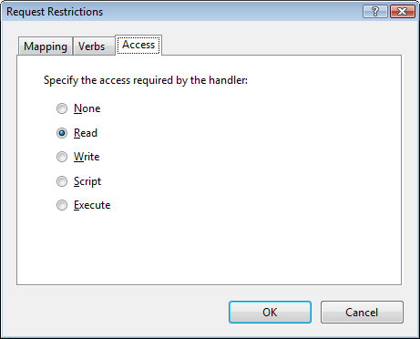
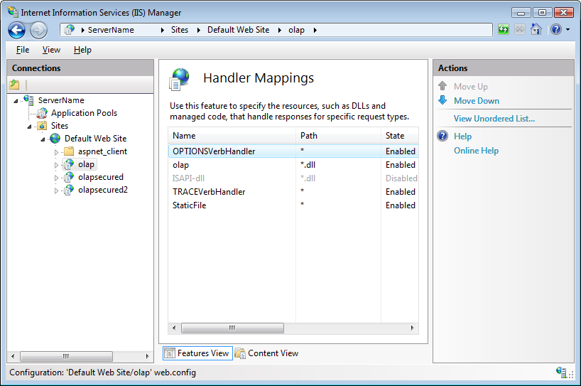

<!--
|metadata|
{
    "fileName": "igolapxmladatasource-configuring-iis-for-cross-domain-olap-data",
    "controlName": "igOlapXmlaDataSource",
    "tags": ["How Do I","Tips and Tricks"]
}
|metadata|
-->

# Configuring IIS for Cross-Domain OLAP Data (igOlapXmlaDataSource)

## Topic Overview
### Purpose

This topic explains how to configure Internet Information Services (IIS) hosting HTTP data provider (`msmdpump.dll`) for SQL Server Analysis Services (SSAS), for cross-domain access (both authenticated and non-authenticated access). These settings are required for certain usage scenarios of the [igOlapXmlaDataSource](igOlapXmlaDataSource-Overview.html) control.

For configuring of authenticated access for the Mozilla Firefox browser (version 17 at this writing), which constitutes a special case, refer to the [Configuring Authenticated Access for the Mozilla Firefox Browser (igOlapXmlaDataSource)](igOlapXmlaDataSource-Configuring-Authenticated-Access-for-Firefox.html) topic.

### Required background

The following table lists the concepts and topics required as a prerequisite to understanding this topic.

**Concepts**

-   [SQL Server Analysis Services (SSAS)](http://msdn.microsoft.com/en-us/library/ms175609%28v=sql.90%29.aspx)
-   [XML for Analysis (XMLA)](http://en.wikipedia.org/wiki/XML_for_Analysis)
-   [Online Analytical Processing (OLAP)](http://en.wikipedia.org/wiki/OLAP)

**Topics**

- [igOlapXmlaDataSource Overview](igOlapXmlaDataSource-Overview.html): This topic provides an overview of the `igOlapXmlaDataSource` component which uses SSAS instances for retrieving data.

### In this topic

This topic contains the following sections:

-   [Configuring IIS for Cross-Domain OLAP Data (Non-Authenticated Access) – Conceptual Overview](#conceptual-overview)
    -   [Configuring IIS for cross-domain OLAP data (non-authenticated access) summary](#summary)
    -   [Steps](#overview-steps)
    -   [HTTP response headers’ settings](#http-response)
    -   [OPTIONSVerbHandler mapping settings](#mapping-settings)
-   [Configuring IIS for Cross-Domain OLAP Data (Non-Authenticated Access) – Procedure](#procedure)
    -   [Introduction](#introduction)
    -   [Prerequisites](#prerequisites)
    -   [Overview](#overview)
    -   [Steps](#steps)
-   [Related Content](#related-contnt)
    -   [Samples](#samples)
    -   [Resources](#resources)

## Configuring IIS for Cross-Domain OLAP Data – Conceptual Overview
### Configuring IIS for cross-domain OLAP data summary

The `igOlapXmlaDataSource` control allows cross-domain access to the HTTP access provider (`msmdpump.dll`). However, there are a few settings which need to be done on the IIS application running the HTTP access provider (unless you want to allow access from trusted domains only, in which case no settings to the IIS are required).

For cross-domain access, you need to specify the domains that will be allowed to make these data requests, the method through which data will be transferred, the fields that control what headers can be used in the requests, and, in case of authenticated access, indicate that user credentials need to be provided. All this is handled by configuring several HTTP response handlers.

In addition to that, you need to configure the server response to the OPTIONS method requests. This is achieved by configuring the OPTIONSVerbHandler.

Each of the three HTTP response headers consist of a name and a value. The name is mandatory as defined by the [World Wide Web Consortium (W3C)](http://www.w3.org/) (in their [Cross-Origin Resource Sharing](http://www.w3.org/TR/access-control/) document) and the value specifies a certain behavior for the requests. The following table briefly explains the purpose of each HTTP response header.

Header Name | Description
---|---
Access-Control-Allow-Headers | As a part of a preflight request, manages which header field names can be used in the actual request.
Access-Control-Allow-Origin|Configures the domains from which requests will be accepted.
Access-Control-Request-Method|Specifies the method to be used in the actual request as part of the pre-flight request.
Access-Control-Request-Method  (Authenticated access only)|Specifies the method to be used in the actual request as part of the pre-flight request.

Further configuration details are provided in the rest of the topic as follows:

-   For details on how to create and configure the custom headers, refer to the [HTTP response headers’ settings](#http-response) block.
-   For details on how to configure the OPTIONSVerbHandler, refer to the [OPTIONSVerbHandler mapping settings](#mapping-settings) block.
-   For step-by-step instructions, see [Configuring IIS for Cross-Domain OLAP Data (Non-Authenticated Access) – Procedure](#procedure).

### Steps

Following are the general conceptual steps for Configuring IIS for Cross-Domain OLAP Data without authentication.

1. Configuring the HTTP Response Headers

2. Configuring the OPTIONSVerbHandler

### HTTP response headers’ settings

The following table lists the required settings of the HTTP response headers for configuring ISS for cross-domain OLAP Data without authentication. The settings are configured as custom headers from the HTTP Response Headers option of the application that is hosting the HTTP access provider.

<table class="table">
	<thead>
		<tr>
            <th>
Header Name
			</th>

            <th>
Value
			</th>

            <th>
Details
			</th>
        </tr>
	</thead>
	<tbody>
        

        <tr>
            <td>
**Access-Control-Allow-Headers**
			</td>

            <td>
Origin, Content-Type, Accept
			</td>

            <td>
                These are the names of the fields required to be used in the actual request, separated with commas.

                These particular fields are required by the `igOlapXmlaDataSource` control. If any of these is not set, the cross-origin requests will fail.

                <ul>
                    <li>
Origin – this header field indicates where the cross-origin request or preflight request originates from. This setting is required so that the origin of the requests is known to the server.
					</li>

                    <li>
Content-Type – this header field indicates the content (MIME) type of the entity body sent to the recipient. The actual content type used in the communication between the server and `igOlapXmlaDataSource` is
                        text/xml.
					</li>

                    <li>
Accept – this header field specifies the media types which are acceptable for the response. Accept headers are used to indicate that the request is specifically limited to a small set of desired types.
					</li>
                </ul>
            </td>
        </tr>

        <tr>
            <td>
**Access-Control-Allow-Origin**
			</td>

            <td>
The names of the allowed domains or asterisk (\*) for allowing all domains
			</td>

            <td>
To grant access from several domains, type the domain names separated by comma (,).
			</td>
        </tr>

        <tr>
            <td>
**Access-Control-Request-Method**
			</td>

            <td>
POST
			</td>

            <td>
The name of the HTTP method to be used in the actual request.

                The `igOlapXmlaDataSource` control requires that the request method is POST.
			</td>
        </tr>

        <tr>
            <td>
**Access-Control-Allow-Credentials** (Authenticated access only)
			</td>

            <td>
true
			</td>

            <td>
                The allowed values are:

                <ul>
                    <li>
true – allows suppliying of credentials with the request
					</li>

                    <li>
false – disallows supplying of credentials with the request. Equivalent to not defining the header at all.
					</li>
                </ul>
            </td>
        </tr>
    </tbody>
</table>

### OPTIONSVerbHandler mapping settings

The following table lists the required settings of the HTTP handler.

HTTP handler name | Required Access Level | Details
---|---|---
*OPTIONSVerbHandler*|Read|Specifies that the handler requires read access to the requests.

## Configuring IIS for Cross-Domain OLAP Data (Non-Authenticated Access) – Procedure
### Introduction

This procedure configures an IIS application to accept HTTP headers from any domain. The access can be either authenticated or non-authenticated (The additional settings required for authenticated access are provided.).

### Prerequisites

To complete the procedure, you need the following:

-   Access to the IIS OLAP application that is hosting the HTTP access provider

### Overview

Following is a conceptual overview of the process:

1. Accessing the IIS OLAP application

2. Configuring the HTTP Response Headers

3. Configuring the OPTIONSVerbHandler

### Steps

The following steps demonstrate how to setup the IIS for accepting HTTP headers.

1. Access the IIS OLAP application.

	1. Connect to your server.
	
		Using a tool like Remote Desktop Connection, connect to your remote server where your application resides.
	
	2. Launch the IIS Manager.
	
		Run the IIS Manager on the server.
	
	3. Navigate to your IIS application.
	
		Using the IIS Manager interface, navigate to your application that is hosting the HTTP access provider (msmdpump.dll). In this case, you will be accessing the OLAP application.

		

2. Configure the HTTP Response Headers.

	In the application, add and configure the required headers.
	
	The following table specifies the settings to use in for each header. For the sake of this example, requests from any domain will be accepted (* for Access-Control-Allow-Origin); if you need to accept requests only from certain domains, then put the domain names in the place of the asterisk (*). For enabling anonymous access do not define the Access-Control-Allow-Credentials header. For explanation of the values, refer to [HTTP response headers’ settings](#http-response).
	
	<table class="table">
	    <thead>
	        <tr>
	            <th>Name</th>
	            <th>Value</th>
	        </tr>
	    </thead>
	    <tbody>
	        <tr>
	            <td>Access-Control-Allow-Headers</td>
	            <td>Origin, Content-Type, Accept</td>
	        </tr>
	        <tr>
	            <td>Access-Control-Allow-Origin</td>
	            <td>\*</td>
	        </tr>
	        <tr>
	            <td>Access-Control-Request-Method</td>
	            <td>POST</td>
	        </tr>
	        <tr>
	            <td>Access-Control-Allow-Credentials(Authenticated access only)</td>
	            <td>true</td>
	        </tr>
	    </tbody>
	</table>	
		
	 **To add and configure the headers:**

	1. In your application, in the Home pane, double-click **HTTP Response Headers**.

		The HTTP Response Headers module opens.
		
		

	2. Add a custom HTTP response header.

		A. In the **Action** pane, click the **Add …** link.
		
		The **Add Custom HTTP Response Header** dialog appears.
		
		
		
		B. Configure the header.
		
		In the **Name** field, **type** **the name of the HTTP response header**, e.g.` Access-Control-Allow-Headers`. In the Value field, type the **desired value for the HTTP response header**, e.g. `Origin`, `Content-Type`, `Accept`.
		
		C. Click OK.
		
		D. Repeat steps A÷C with the respective settings for the other headers.

3. Configure the OPTIONSVerbHandler.

	1. Access the **Handler Mappings** module.
	
		Navigate back to the OLAP application and double-click **HandlerMappings**. The Handler Mappings module opens:
		
		
	
	2. Double-click the OPTIONSVerbHandler. The Edit Module Mapping dialog opens.
	
		
	
	3. Allow Read access.
	
		A. Click the **Request Restrictions** button. The Request Restrictions dialog appears.
		
		
		
		B. In the Access tab, set the access setting to Read.
		
		C. Click OK. The Request Restrictions **button** dialog closes and you are taken back to Edit Module Mapping dialog.
		
		D. Click OK again. The **Edit** Module Mapping dialog now closes and you are taken back to the calling screen.

4. Make sure that OPTIONSVerbHandler is at the top of the Handler Mappings list.

	To access the Handler Mappings, from the Actions menu, click View Ordered List…. The OPTIONSVerbHandler must be at the top of the Handler Mappings list. If it isn’t, select the OPTIONSVerbHandler and use the Move Up command from the Actions menu to move it to the top.

	

## Related Content
### Samples

The following samples provide additional information related to this topic.

- [Binding to XMLA to Show KPIs](%%SamplesUrl%%/pivot-view/binding-to-xmla-data-source): This sample demonstrates how to bind the `igPivotView` to an `igOlapXmlaDataSource`.

- [Remote Xmla Provider](%%SamplesUrl%%/pivot-grid/remote-xmla-provider): This sample demonstrates one of the benefits of using the remote provider feature of the `igOlapXmlaDataSource` - less network traffic. All requests are proxied through the server application to avoid cross domain problems. In addition, the data is translated to JSON reducing the size of the response.

### Resources

The following material (available outside the Infragistics family of content) provides additional information related to this topic.

- [List of HTTP header fields](http://en.wikipedia.org/wiki/List_of_HTTP_header_fields): List of all HTTP header fields with explanations.

- [Provisional Message Header Field Names](http://www.iana.org/assignments/message-headers/prov-headers.html): The official list of header field names.

- [Cross-Origin Resource Sharing](http://www.w3.org/TR/access-control/): This document defines a mechanism to enable client-side cross-origin requests.

- [Working with Online Analytical Processing (OLAP)](http://msdn.microsoft.com/en-US/library/ms175367%28v=SQL.90%29.aspx): This article is an introduction to working with OLAP data.

- [Walkthrough: Creating and Registering a Custom HTTP Module](http://msdn.microsoft.com/en-us/library/ms227673%28v=vs.100%29.aspx): This walkthrough illustrates the basic functionality of a custom HTTP module.

 

 

