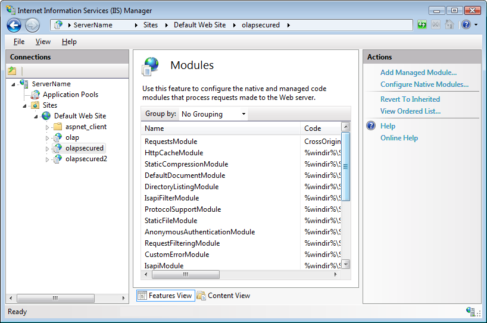

<!--
|metadata|
{
    "fileName": "igolapxmladatasource-configuring-authenticated-access-for-firefox",
    "controlName": "igOlapXmlaDataSource",
    "tags": ["How Do I"]
}
|metadata|
-->

# Configuring Authenticated Access for the Mozilla Firefox Browser
(igOlapXmlaDataSource)

## Topic Overview
### Purpose

This topic provides a workaround for configuring IIS for cross-domain authenticated access for the Mozilla® Firefox® browser. (At this writing, due to a bug, the current version of Firefox (17.0.1) does not support the standard IIS configuration (provided [here](igOlapXmlaDataSource-Configuring-IIS-for-Cross-Domain-OLAP-Data.html))).

If you need to configure non-authenticated access or compatibility with the Firefox browser is not an issue, refer for guidance to the [Configuring IIS for Cross-Domain OLAP Data (igOlapXmlaDataSource)](igOlapXmlaDataSource-Configuring-IIS-for-Cross-Domain-OLAP-Data.html) topic.

### Required background

The following table lists the concepts and topics required as a prerequisite to understanding this topic.

**Concepts**

-   [SQL Server Analysis Services (SSAS)](http://msdn.microsoft.com/en-us/library/ms175609%28v=sql.90%29.aspx)
-   [XML for Analysis (XMLA)](http://en.wikipedia.org/wiki/XML_for_Analysis)
-   [Working with Online Analytical Processing (OLAP)](http://msdn.microsoft.com/en-us/library/ms175367%28v=sql.90%29.aspx)
-   [Internet Information Services (IIS)](http://technet.microsoft.com/en-us/library/hh831725)
-   [IIS Managed Handlers](http://technet.microsoft.com/en-us/library/cc753249%28v=ws.10%29.aspx)

**Topics**

- [igOlapXmlaDataSource Overview](igOlapXmlaDataSource-Overview.html): This topic provides a conceptual overview of the `igOlapXmlaDataSource` framework.

- [Configuring IIS for Cross-Domain OLAP Data (igOlapXmlaDataSource)](igOlapXmlaDataSource-Configuring-IIS-for-Cross-Domain-OLAP-Data.html): This topic explains how to configure Internet Information Services (IIS) hosting HTTP data provider (`msmdpump.dll`) for SQL Server Analysis Services (SSAS), for cross-domain access (both authenticated and non-authenticated access).


### In this topic

This topic contains the following sections:

-   [Configuring IIS for Cross-Domain OLAP Data with Authenticated Access for Firefox](#authenticated-access-firefox)
-   [Configuring IIS for Accepting Managed Handlers](#accepting-managed-handlers)
    -   [Introduction](#introduction)
    -   [Prerequisites](#prerequisites)
    -   [Overview](#overview)
    -   [Steps](#steps)
-   [Related Content](#related-content)
    -   [Samples](#samples)
    -   [Resources](#resources)


## <a id="authenticated-access-firefox"></a>Configuring IIS for Cross-Domain OLAP Data with Authenticated Access for Firefox
### Configuring IIS for cross-domain OLAP data with authenticated access for Firefox summary

By default, the current version of Mozilla Firefox (17.0.1) does not send authorization request for cross-domain data. In order to be able to use authentication with the `igOlapXmlaDataSource` control in Firefox, a custom IIS module needs be built to assist with this. It will capture the Mozilla Firefox ® OPTIONS verb and complete the response with an authorization header. The IIS response is controlled through a managed handler which you need to specify and configure.

For details and step-by-step instructions, see to the [Configuring IIS for Accepting Managed Handlers](#accepting-managed-handlers) procedure.

### Requirements

Following are the general requirements for Configuring IIS for accepting managed handlers:

-   Internet Information Services (IIS) version 7 or higher
-   References to the following assemblies:
	-   System.Web
	-   Microsoft.Web.Management
	-   Microsoft.Web.Administration


## <a id="accepting-managed-handlers"></a>Configuring IIS for Accepting Managed Handlers
### <a id="introduction"></a>Introduction

The following procedure configures authenticated access to your OLAP application using a managed handler module.

The procedure creates a module that captures the OPTIONS request from the Mozilla browser and adds an authorization header to the response, thus enabling further authenticated communication. The module consists of two classes – one is the actual module handling the requests and the other is a helper class used for obtaining the server settings. This helper class implements the IHttpModule interface. When an application begins sending requests to the server it checks the first one and performs the following:

1. Checks whether the request contains an Origin header. If such a header exists, an Access-Control-Allow-Origin header with the value of the Origin header is appended to the response.

2. Checks whether the context contains an Access-Control-Request-Method and if it does, appends to the response an Access-Control-Request-Method with value of POST, GET.

3. Checks whether the request contains Access-Control-Request-Headers header and if it has a value it is saved to the `accessControlRequestHeaders` variable.

4. Using the `ConfigHelper` class methods, determines whether authentication is enabled for IIS and if so, saves the supported `authentication` types to the authentication string.

5. If authentication is enabled, appends an *Access-Control-Allow-Credentials* header with the value of *true* to the response. If the `accessControlRequestHeaders` variable has value, appends the `authorization` string to it, meaning that the actual requests can contain the *Authorization* header.

6. If the `accessControlRequestHeaders` variable has value, the *Access-Control-Allow-Headers* header is appended to the response using the `accessControlRequestHeaders` as its value.

7. Checks if the method of the request is OPTIONS and if so, writes Authentication: followed by the supported authentication types (saved in the authentication string) to the response.

8. Completes the request.

### <a id="prerequisites"></a>Prerequisites

In order to complete the procedure you will need the following:

-   An empty class library MS Visual Studio® project with references to the following assemblies:
    -   *System.Web*
    -   *Microsoft.Web.Management*
    -   *Microsoft.Web.Administration*
-   Access to the IIS server where the HTTP data provider (`msmdpump.dll`) is hosted

In this procedure, the class library is project is called `CrossOriginRequestModule` and therefore the namespace in the example code is the same.

### <a id="overview"></a>Overview

Following is a conceptual overview of the process:

1. Creating a custom HTTP module

2. Copying the custom HTTP module to the Web application folder

3. Configuring the custom HTTP module as a managed module

### <a id="steps"></a>Steps

The following steps demonstrate how to setup IIS for accepting managed handlers.

1. Create a custom HTTP module.

	You need to add two classes. In this procedure, the two classes to add to the class library, one for handling the requests and the other to retrieve the server settings, are named `ConfigHelper` and `RequestsModule`, respectively.

	1. Create the class to retrieve the server settings.
	
		Add the code below to the ConfigHelper file. The `IsAuthenticated` method of this class checks whether authentication is enabled for the OLAP application in its `web.config` file or in the `ApplicationHost.config` file.
	
		**In C#:**
		
		```csharp
		using Microsoft.Web.Administration;
		using System;
		namespac CrossOriginRequestModule
		{
		    internal class ConfigHelper
		    {
		        public static bool IsAuthenticated(out string authentication, bool applicationHost = true)
		        {
		            return IsAuthenticated(out authentication, applicationHost, "IIS7");
		        }
		        public static bool IsAuthenticated(out string authentication, bool applicationHost, string iisVersion)
		        {
		            authentication = null;
		            string leadPathPart = iisVersion.ToUpper() == "IIS7"
		                                  ? "system.webServer/security/"
		                                  : "system.web/";
		            string[] authPaths = new string[4];
		            authPaths[0] = leadPathPart + "authentication/anonymousAuthentication";
		            authPaths[1] = leadPathPart + "authentication/basicAuthentication";
		            authPaths[2] = leadPathPart + "authentication/digestAuthentication";
		            authPaths[3] = leadPathPart + "authentication/windowsAuthentication";
		            ServerManager serverManager = new ServerManager();
		            Configuration appHostConfig = serverManager.GetApplicationHostConfiguration();
		            ConfigurationSection configSection = null;
		            for (int i = 0; i < authPaths.Length; i++)
		            {
		                try
		                {
		                    if (applicationHost)
		                    {
		                        configSection = appHostConfig.GetSection(authPaths[i]);
		                    }
		                    else
		                    {
		                        configSection = WebConfigurationManager.GetSection(authPaths[i]);
		                    }
		                }
		                catch (Exception)
		                {
		                }
		                if (configSection != null)
		                {
		                    bool enabled = Convert.ToBoolean(configSection.GetAttributeValue("enabled"));
		                    if (enabled)
		                    {
		                        authentication = authPaths[i];
		                        // do nothing for anonymousAuthentication 
		                        if (i > 0)
		                        {
		                            return true;
		                        }
		                        return false;
		                    }
		                }
		            }
		            return false;
		        }
		    }
		}
		```
	
		**In Visual Basic:**
		
		```vb
		Imports Microsoft.Web.Administration
		Namespace CrossOriginRequestModule
		      Friend Class ConfigHelper
		            Public Shared Function IsAuthenticated(ByRef authentication As String, Optional applicationHost As Boolean = True) As Boolean
		                  Return IsAuthenticated(authentication, applicationHost, "IIS7")
		            End Function
		            Public Shared Function IsAuthenticated(ByRef authentication As String, applicationHost As Boolean, iisVersion As String) As Boolean
		                  authentication = Nothing
		                  Dim leadPathPart As String = If(iisVersion.ToUpper() = "IIS7", "system.webServer/security/", "system.web/")
		                  Dim authPaths As String() = New String(3) {}
		                  authPaths(0) = leadPathPart & "authentication/anonymousAuthentication"
		                  authPaths(1) = leadPathPart & "authentication/basicAuthentication"
		                  authPaths(2) = leadPathPart & "authentication/digestAuthentication"
		                  authPaths(3) = leadPathPart & "authentication/windowsAuthentication"
		                  Dim serverManager As New ServerManager()
		                  Dim appHostConfig As Configuration = serverManager.GetApplicationHostConfiguration()
		                  Dim configSection As ConfigurationSection = Nothing
		                  For i As Integer = 0 To authPaths.Length - 1
		                        Try
		                              If applicationHost Then
		                                    configSection = appHostConfig.GetSection(authPaths(i))
		                              Else
		                                    configSection = WebConfigurationManager.GetSection(authPaths(i))
		                              End If
		                        Catch generatedExceptionName As Exception
		                        End Try
		                        If configSection IsNot Nothing Then
		                              Dim enabled As Boolean = Convert.ToBoolean(configSection.GetAttributeValue("enabled"))
		                              If enabled Then
		                                    authentication = authPaths(i)
		                                    ' do nothing for anonymousAuthentication 
		                                    If i > 0 Then
		                                          Return True
		                                    End If
		                                    Return False
		                              End If
		                        End If
		                  Next
		                  Return False
		            End Function
		      End Class
		End Namespace
		```
	
	2. Create the class to handle the requests.
	
		Add the following code to the respective file.
		
		**In C#:**
		
		```csharp
		using System;
		using System.Web;
		namespace CrossOriginRequestModule
		{
		    public class RequestsModule : IHttpModule
		    {
		        public void Dispose()
		        {
		        }
		        public void Init(HttpApplication app)
		        {
		            // register for events created by the pipeline 
		            app.BeginRequest += new EventHandler(this.OnBeginRequest);
		        }
		        void OnBeginRequest(object sender, EventArgs e)
		        {
		            HttpApplication context = (HttpApplication)sender;
		            try
		            {
		                string origin = context.Request.Headers.Get("Origin");
		                if (string.IsNullOrEmpty(origin))
		                {
		                    origin = context.Request.Headers.Get("origin");
		                }
		                if (!string.IsNullOrEmpty(origin))
		                {
		                    context.Response.AppendHeader("Access-Control-Allow-Origin", origin);
		                }
		                if (!string.IsNullOrEmpty(context.Request.Headers.Get("Access-Control-Request-Method")))
		                {
		                    context.Response.AppendHeader("Access-Control-Request-Method", "POST, GET");
		                }
		                string accessControlRequestHeaders = context.Request.Headers.Get("Access-Control-Request-Headers");
		                string authentication = null;
		                bool isAuthenticated = ConfigHelper.IsAuthenticated(out authentication, false);
		                // no auth section in web.config
		                if (authentication == null)
		                {
		                    isAuthenticated = false;
		                    isAuthenticated = ConfigHelper.IsAuthenticated(out authentication);
		                }
		                if (isAuthenticated)
		                {
		                    context.Response.AppendHeader("Access-Control-Allow-Credentials", "true");
		                    if (!string.IsNullOrEmpty(accessControlRequestHeaders) &&
		                        !accessControlRequestHeaders.Contains("authorization"))
		                    {
		                        accessControlRequestHeaders = accessControlRequestHeaders + ", authorization";
		                    }
		                }
		                if (!string.IsNullOrEmpty(accessControlRequestHeaders))
		                {
		                    context.Response.AppendHeader("Access-Control-Allow-Headers", accessControlRequestHeaders);
		                }
		                if (context.Request.HttpMethod == "OPTIONS")
		                {
		                    if (authentication != null)
		                    {
		                        context.Response.Write(string.Format("Authentication: {0}", authentication));
		                    }
		                    HttpContext.Current.ApplicationInstance.CompleteRequest();
		                }
		            }
		            catch (Exception ex)
		            {
		                context.Response.Write(ex.Message);
		                HttpContext.Current.ApplicationInstance.CompleteRequest();
		            }
		        }
		    }
		}
		```
		
		**In Visual Basic:**
		
		```vb
		Imports System.Web
		Namespace CrossOriginRequestModule
		      Public Class RequestsModule
		            Implements IHttpModule
		            Public Sub Dispose() Implements IHttpModule.Dispose
		            End Sub
		            Public Sub Init(app As HttpApplication) Implements IHttpModule.Init
		                  ' register for events created by the pipeline 
		                  AddHandler app.BeginRequest, New EventHandler(AddressOf Me.OnBeginRequest)
		            End Sub
		            Private Sub OnBeginRequest(sender As Object, e As EventArgs)
		                  Dim context As HttpApplication = DirectCast(sender, HttpApplication)
		                  Try
		                        Dim origin As String = context.Request.Headers.[Get]("Origin")
		                        If String.IsNullOrEmpty(origin) Then
		                              origin = context.Request.Headers.[Get]("origin")
		                        End If
		                        If Not String.IsNullOrEmpty(origin) Then
		                              context.Response.AppendHeader("Access-Control-Allow-Origin", origin)
		                        End If
		                        If Not String.IsNullOrEmpty(context.Request.Headers.[Get]("Access-Control-Request-Method")) Then
		                              context.Response.AppendHeader("Access-Control-Request-Method", "POST, GET")
		                        End If
		                        Dim accessControlRequestHeaders As String = context.Request.Headers.[Get]("Access-Control-Request-Headers")
		                        Dim authentication As String = Nothing
		                        Dim isAuthenticated As Boolean = ConfigHelper.IsAuthenticated(authentication, False)
		                        ' no auth section in web.config
		                        If authentication Is Nothing Then
		                              isAuthenticated = False
		                              isAuthenticated = ConfigHelper.IsAuthenticated(authentication)
		                        End If
		                        If isAuthenticated Then
		                              context.Response.AppendHeader("Access-Control-Allow-Credentials", "true")
		                              If Not String.IsNullOrEmpty(accessControlRequestHeaders) AndAlso Not accessControlRequestHeaders.Contains("authorization") Then
		                                    accessControlRequestHeaders = accessControlRequestHeaders & ", authorization"
		                              End If
		                        End If
		                        If Not String.IsNullOrEmpty(accessControlRequestHeaders) Then
		                              context.Response.AppendHeader("Access-Control-Allow-Headers", accessControlRequestHeaders)
		                        End If
		                        If context.Request.HttpMethod = "OPTIONS" Then
		                              If authentication IsNot Nothing Then
		                                    context.Response.Write(String.Format("Authentication: {0}", authentication))
		                              End If
		                              HttpContext.Current.ApplicationInstance.CompleteRequest()
		                        End If
		                  Catch ex As Exception
		                        context.Response.Write(ex.Message)
		                        HttpContext.Current.ApplicationInstance.CompleteRequest()
		                  End Try
		            End Sub
		      End Class
		End Namespace
		```
	
	3. Build the project.

2. Copy the custom HTTP module to a Web application folder.

	1. Connect to your server.
	
		Using a tool like Remote Desktop Connection, connect to your remote server where your application resides.
	
	2. Launch the IIS Manager.
	
		Run the Internet Information Services Manager on the server.
	
	3. Navigate to your OLAP IIS application.
	
		Using the IIS Manager interface, navigate to your application which is hosting the HTTP access provider (e.g. `msmdpump.dll`). In the screenshot below, the olapsecured application is being accessed.
		
		
	
	4. Open the folder in which your application resides on the server.
	
		**Right-click** on your application from IIS and then **click Explore** from the context menu.
		
		Windows Explorer opens the folder in which your application resides on the server.
	
	5. Copy the HTTP module to the bin folder.
	
		Copy the `CrossOriginRequestModule.dll` module (that you built in step 1) to the bin folder. If the bin folder does not exist, create it.

3. Configure the custom HTTP module as a managed module.

	1. Access the Modules module for your IIS.
	
		In the Internet Information Services manager, access Modules.
		
		
	
	2. Add your custom HTTP module.
	
		A. From the Actions menu, **click** Add Managed Module….
		
			The Add Managed Module window opens.
		
		B. Provide the name and the type of the module.
		
		​a. For Name, type RequestsModule.
			
		​b. For Type, select the custom HTTP module you added in the previous step( CrossOriginRequestModule.RequestsModule).
			
		

## <a id="related-content"></a>Related Content
### <a id="samples"></a>Samples

The following samples provide additional information related to this topic.

- [Binding to XMLA to Show KPIs](%%SamplesUrl%%/pivot-view/binding-to-xmla-data-source): This sample demonstrates how to bind the `igPivotView` to an `igOlapXmlaDataSource`.

- [Remote Xmla Provider](%%SamplesUrl%%/pivot-grid/remote-xmla-provider): This sample demonstrates one of the benefits of using the remote provider feature of the `igOlapXmlaDataSource` - less network traffic. All requests are proxied through the server application to avoid cross domain problems. In addition, the data is translated to JSON reducing the size of the response.


### <a id="resources"></a>Resources

The following material (available outside the Infragistics family of content) provides additional information related to this topic.

- [XML for Analysis (XMLA)](http://msdn.microsoft.com/en-us/library/ms187178%28v=SQL.90%29.aspx): This article explains the basics of the XML for Analysis protocol.

- [SQL Server Analysis Services](http://msdn.microsoft.com/en-us/library/ms175609%28v=sql.90%29.aspx): This page is the introductory point for the SQL Server Analysis Services (SSAS) in MSDN.

- [Working with Online Analytical Processing (OLAP)](http://msdn.microsoft.com/en-US/library/ms175367%28v=SQL.90%29.aspx): This article is an introduction to working with OLAP data.

- [Walkthrough: Creating and Registering a Custom HTTP Module](http://msdn.microsoft.com/en-us/library/ms227673%28v=vs.100%29.aspx): This walkthrough illustrates the basic functionality of a custom HTTP module.


 

 


