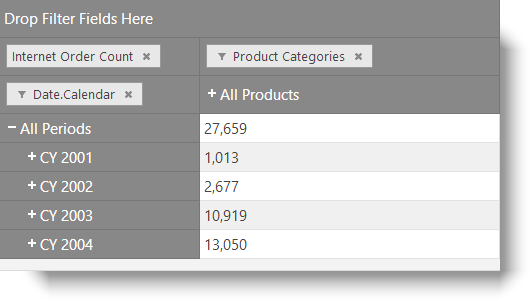

<!--
|metadata|
{
    "fileName": "igolapxmladatasource-configuring-through-a-remote-provider",
    "controlName": "igOlapXmlaDataSource",
    "tags": ["Getting Started","How Do I"]
}
|metadata|
-->

# Configuring igOlapXmlaDataSource Through a Remote Provider

## Topic Overview
### Purpose

This topic explains how to configure a remote data provider for the `igOlapXmlaDataSource`™ component.

### Required background

The following table lists the topics and articles required as a prerequisite to understanding this topic.

**Topics**

- [igOlapXmlaDataSource Overview](igOlapXmlaDataSource-Overview.html): This topic provides an overview of the `igOlapXmlaDataSource` component and its main features.

- [Adding igOlapXmlaDataSource to an HTML Page](igOlapXmlaDataSource-Adding-to-an-HTML-Page.html): This topic explains how to add the `igOlapXmlaDataSource` to and HTML page and how to configure it for retrieving data from a Microsoft® SQL Server Analysis Services (SSAS) Server.

- [Data Provider Configuration Overview (igOlapXmlaDataSource)](igOlapXmlaDataSource-Data-Provider-Configuration-Overview.html): This topic provides an overview of the supported data providers for the `igOlapXmlaDataSource` component and conceptual-level information on how to configure them.

**External Resources**

- [Developing with ADOMD.NET](http://technet.microsoft.com/en-us/library/ms123483.aspx): This is a group of topics related the ADOMD.NET.

- [Configure HTTP Access to Analysis Services on Internet Information Services (IIS) 7.0](http://technet.microsoft.com/en-us/library/gg492140.aspx): An article explaining how to configure an HTTP data provider (`msmdpump.dll`) for your SSAS Server.


### In this topic

This topic contains the following sections:

-   [**Introduction**](#introduction)
-   [**Configuring a Remote Data Provider – Conceptual Overview**](#conceptual-overview)
    -   [Remote data provider configuration summary](#remote-data-provider-summary)
    -   [Requirements](#requirements)
    -   [Steps](#steps)
-   [**Configuring a Remote Data Provider – Example**](#remote-data-provider-example)
    -   [Introduction](#introduction)
    -   [Preview](#preview)
    -   [Prerequisites](#prerequisites)
    -   [Overview](#overview)
    -   [Steps](#example-steps)
    -   [Full code – Controller](#code-controller)
    -   [Full code – View](#code-view)
-   [**Related Content**](#related-content)
    -   [Topics](#topics)
    -   [Samples](#samples)
    -   [Resources](#resources)


## <a id="introduction"></a>Introduction

To configure the `igOlapXmlaDataSource` for a remote data provider, you need to first add the data provider to your ASP.NET MVC application and then configure `igOlapXmlaDataSource` to use a remote provider and supply it with the provider URL.

For conceptual explanation of configuring remote data providers, refer to [Data Provider Configuration Overview (igOlapXmlaDataSource)](igOlapXmlaDataSource-Data-Provider-Configuration-Overview.html)


## <a id="conceptual-overview"></a>Configuring a Remote Data Provider – Conceptual Overview
### <a id="remote-data-provider-summary"></a>Remote data provider configuration summary

The following table lists the types of remote data providers supported by the `igOlapXmlaDataSource` component and briefly explains them.

Remote data provider type | Description
---|---
XMLA| Connects to an HTTP data provider (msmdpump) for SSAS.
ADOMD.NET|Connects directly to an SSAS instance using Microsoft® ADOMD.NET.


### <a id="requirements"></a>Requirements

Following are the general requirements for configuring `igOlapXmlaDataSource` through a remote data provider.

-   A MS SSAS Server with at least one database
-   (Conditional – ADOMD provider only) [ADOMD.NET Client](http://www.microsoft.com/en-us/download/confirmation.aspx?id=16978) (`Microsoft.AnalysisServices.AdomdClient.dll` assembly version 10.0.0.0) installed on the server
-   (Conditional – XMLA provider only) The HTTP server having read access to the MS SQL Server instance
-   An ASP.NET MVC application with references to the following assemblies:
    -   `Infragistics.Web.Mvc.dll`
    -   (Conditional – ADOMD provider only) `Infragistics.Olap.DataProvider.Adomd.Mvc.dll`

### <a id="steps"></a>Steps

Following are the general conceptual steps for configuring `igOlapXmlaDataSource` through a remote data provider.

1. Configuring the endpoint

2. Configuring `igOlapXmlaDataSource`

For a concrete example of this procedure, see [Configuring a Remote Data Provider – Example](#remote-data-provider-example).


## <a id="remote-data-provider-example"></a>Configuring a Remote Data Provider – Example
### <a id="introduction"></a>Introduction

This procedure sets up either an ADOMD.NET remote data provider or an XMLA remote data provider in an ASP.NET MVC Application, and configures an `igOlapXmlaDataSource` that consumes the data from the data provider and visualizes it in an `igPivotGrid`™. (Optionally you can preload a catalog, cube, rows, columns, and measures or further configure the data source. In this procedure, a pivot grid is added for displaying the result.)

### <a id="preview"></a>Preview

The following screenshot is a preview of the final result: the pivot grid fed with data from the remote data provider.



### <a id="prerequisites"></a>Prerequisites

To complete the procedure, you need the following:

-   The required JS/CSS resources, as listed in Adding `igPivotGrid` to an HTML Page or the JavaScript and CSS combined files

### <a id="overview"></a>Overview

Following is a conceptual overview of the process:

1. Configuring the endpoint

2. Configuring the `igOlapXmlaDataSource`

### <a id="example-steps"></a>Steps

The following steps demonstrate how to configure the `igOlapXmlaDataSource` through a remote data provider.

1. Configure the endpoint.

	To make the remote data provider available to the `igOlapXmlaDataSource`, configure an Action in the Controller to which the `igOlapXmlaDataSource` will connect.
	
	For ADOMD remote provider
	
	The Action requires applying the [AdomdDataSourceActionAttribute](Infragistics.Olap.DataProvider.Adomd.Mvc~Infragistics.Web.Mvc.AdomdDataSourceActionAttribute_members.html). In the Action’s body, return a new View passing an [AdomdDataSourceModel](Infragistics.Olap.DataProvider.Adomd.Mvc~Infragistics.Web.Mvc.AdomdDataSourceModel_members.html) instance with its [ConnectionString](Infragistics.Olap.DataProvider.Adomd.Mvc~Infragistics.Web.Mvc.AdomdDataSourceModel~ConnectionString.html) property set accordingly.
	
	**In C#:**
	
	```csharp
	[AdomdDataSourceAction]
	public ActionResult RemoteAdomdProviderEndpoint()
	{
	    return View(new AdomdDataSourceModel { ConnectionString = "Provider=MSOLAP.4;Persist Security Info=True;Data Source=http://sampledata.infragistics.com/olap/msmdpump.dll;Initial Catalog=Adventure Works DW Standard Edition;MDX Compatibility=1;Safety Options=2;MDX Missing Member Mode=Error"});
	}
	```
	
	If you do not have version 10.0.0.0 of the `Microsoft.AnalysisServices.AdomdClient` assembly installed on your server, but you have another version already installed, you can add the following binding redirect section to the `web.config` file of your web application and use the version you have:
	
	**In XML:**
	
	```xml
	<runtime>
	  <assemblyBinding xmlns="urn:schemas-microsoft-com:asm.v1">
	    <dependentAssembly>
	      <assemblyIdentity name="Microsoft.AnalysisServices.AdomdClient" publicKeyToken="89845dcd8080cc91" culture="neutral" />
	      <bindingRedirect oldVersion="0.0.0.0-65535.65535.65535.65535" newVersion="[your version]" />
	    </dependentAssembly>
	  </assemblyBinding>
	</runtime>
	```
	
	For XMLA remote provider
	
	The Action requires applying the [XmlaDataSourceActionAttribute](Infragistics.Web.Mvc~Infragistics.Web.Mvc.XmlaDataSourceActionAttribute_members.html). In the Action’s body, return a new View passing an [XmlaDataSourceModel](Infragistics.Web.Mvc~Infragistics.Web.Mvc.XmlaDataSourceModel_members.html) instance with its [ServerUrl](Infragistics.Web.Mvc~Infragistics.Web.Mvc.XmlaDataSourceModel~ServerUrl.html) property set to the URL of the mdsmdpump data provider.
	
	**In C#:**
	
	```csharp
	[XmlaDataSourceAction]
	public ActionResult RemoteXmlaProviderEndpoint()
	{
	    return View(new XmlaDataSourceModel{ ServerUrl = "http://sampledata.infragistics.com/olap/msmdpump.dll" });
	}
	```

2. Configure `igOlapXmlaDataSource`.

	For `igOlapXmlaDataSource` to work with the remote data provider, set the [serverUrl](%%jQueryApiUrl%%/ig.OlapXmlaDataSource#options:serverUrl) to the URL of the action defined in step 1 and set the [isRemote](%%jQueryApiUrl%%/ig.OlapXmlaDataSource#options:isRemote) option to true.
	
	For this example procedure, add a pivot grid for displaying the result. (Optionally you can preload a catalog, cube, rows, columns, and measures or further configure the data source.)
	
	**In JavaScript:**
	
	```js
	$(function () {
	    var remoteDataSource = new $.ig.OlapXmlaDataSource({
	        isRemote: true,
	        // if using ADOMD
	        serverUrl: '@Url.Action("RemoteAdomdProviderEndpoint")',
	        // if using XMLA
	        //serverUrl: '@Url.Action("RemoteXmlaProviderEndpoint")',
	        catalog: 'Adventure Works DW 2008',
	        cube: 'Adventure Works',
	        rows: '[Date].[Calendar]',
	        columns: '[Product].[Product Categories]',
	        measures: '[Measures].[Internet Order Count]'
	    });
	    $("#pivotGrid").igPivotDataSelector({
	        dataSource: remoteDataSource,
	        width: "900px",
	        height: "500px"
	    });
	});
	```


### <a id="code-controller"></a>Full code – Controller

Following is the full code code for the PivotGridController.

**In C#:**

```csharp
using System.Web.Mvc;
using Infragistics.Web.Mvc;
namespace OlapAdomdMvc.Controllers
{
    public class PivotGridController : Controller
    {
        [AdomdDataSourceAction]
        public ActionResult RemoteAdomdProviderEndpoint()
        {
            return View(new AdomdDataSourceModel { ConnectionString = "Provider=MSOLAP.4;Persist Security Info=True;Data Source=http://sampledata.infragistics.com/olap/msmdpump.dll;Initial Catalog=Adventure Works DW Standard Edition;MDX Compatibility=1;Safety Options=2;MDX Missing Member Mode=Error" });
        }
        [XmlaDataSourceAction]
        public ActionResult RemoteXmlaProviderEndpoint()
        {
            return View(new XmlaDataSourceModel { ServerUrl = "http://sampledata.infragistics.com/olap/msmdpump.dll" });
        }
        public ActionResult RemoteDataProvider()
        {
            return View("RemoteDataProvider");
        }
    }
}
```

### <a id="code-view"></a>Full code – View

Following is the code for the RemoteDataProviderSample View.

**In HTML:**

```html
<!DOCTYPE html>
<html>
<head>
    <title></title>
    <!-- Ignite UI Required Combined CSS Files -->
    <link href="@Url.Content("[IG root]/css/themes/infragistics/infragistics.theme.css")" rel="stylesheet" />
    <link href="@Url.Content("[IG root]/css/structure/infragistics.css")" rel="stylesheet" />
    <script src="@Url.Content("~/js/modernizr.min.js")"></script>
    <script src="@Url.Content("~/js/jquery.min.js")"></script>
    <script src="@Url.Content("~/js/jquery-ui.min.js")"></script>
    <!-- Ignite UI Required Combined JavaScript Files -->
    <script src="@Url.Content("[IG root]/js/infragistics.core.js")"></script>
    <script src="@Url.Content("[IG root]/js/infragistics.lob.js")"></script>
</head>
<body>
    <script type="text/javascript">
        $.support.cors = true;
        $(function () {
            var remoteDataSource = new $.ig.OlapXmlaDataSource({
                isRemote: true,
                serverUrl: '@Url.Action("RemoteXmlaProviderEndpoint")',
                catalog: 'Adventure Works DW 2008',
                cube: 'Adventure Works',
                rows: '[Date].[Calendar]',
                columns: '[Product].[Product Categories]',
                measures: '[Measures].[Internet Order Count]'
            });
            $("#pivotGrid").igPivotGrid({
                dataSource: remoteDataSource,
                width: "500px",
                height: "270px"
            });
        });
    </script>
    <div id="pivotGrid"></div>
</body>
</html>
```


## <a id="related-content"></a>Related Content
### <a id="topics"></a>Topics

The following topics provide additional information related to this topic.

- [Configuring the Tabular View of the Result Set by Arranging the Columns, Rows, Filters, and Measures of the Pivot Grid (igOlapFlatDataSource, igOlapXmlaDataSource, igPivotDataSelector, igPivotGrid, igPivotView)](Configuring-the-Tabular-View.html): This topic explains how to configure the tabular View of the OLAP cube result set by arranging the hierarchies of the pivot grid columns, rows, filters, and measures, either from the grid’s interface or programmatically in the code.


### <a id="samples"></a>Samples

The following samples provide additional information related to this topic.

- [Remote Xmla Provider](%%SamplesUrl%%/pivot-grid/remote-xmla-provider): This sample demonstrates reducing the network traffic using a remote provider with the igOlapXmlaDataSource component.

- [ADOMD.NET Remote Data Provider](%%SamplesUrl%%/pivot-grid/remote-adomd-provider): This sample demonstrates using the ADOMD.NET remote provider with the igPivotGrid control.

### <a id="resources"></a>Resources

The following material (available outside the Infragistics family of content) provides additional information related to this topic.

- [ADOMD.NET Download Page](http://www.microsoft.com/en-us/download/details.aspx?id=23089): Microsoft’s download page for ADOMD.NET.


 

 


