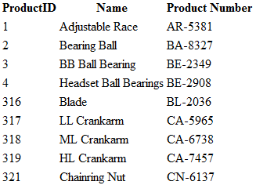

<!--
|metadata|
{
    "fileName": "igdatasource-igdatasource-overview",
    "controlName": "igDataSource",
    "tags": ["Getting Started"]
}
|metadata|
-->

# igDataSource Overview

## About the igDataSource
The `igDataSource` is a jQuery-based component which serves as an intermediate layer between the data bound controls (including the `igGrid` control) and the actual data source. Sources of data for the component may include:

-   Web service (connect through REST GET, WCF, etc.)
-   Local data – JSON, XML, HTML Table, JavaScript array (including strings of JSON and XML)
-   Function returning data

>**Note:** As opposed to the `igGrid` control, the `igDataSource` component is implemented as a plain JavaScript class and does not extend the base jQuery widget.

## Features
The `igDataSource` component supports the following features out-of-the-box:

-   Local (the data is defined on the client-side) and remote (the data is coming from a server) data binding
-   Paging
-   Sorting
-   Filtering
-   Data schema support: translate data from many sources into a consistent format
	- Schema field's mapper 
	
###  <a id="schema-fields-mapper"></a>Schema field's mapper 

The schema field definition allow setting a mapper function for columns with dataType "object", which will be used for all data operations on a data source level (sorting, filtering, etc.). 
This is useful in scenarios where we want to apply data operations on a specific value from the complex object. For instance if we have the following data source structure:

**In Javascript:**
	
```js 
var data = [
	{ "ID": 0, "Name": "Bread", "Description": "Whole grain bread", "Category":  { "ID": 0, "Name": "Food", , "Date": "\/Date(1159660800000)\/"  } }
	...
];
```

Out of the box the data source would not be able to apply data operations on the Category field as it has a complex object structure. 
The [field's](%%jQueryApiUrl%%/ig.datasource#options:settings.fields) mapper option allows defining a data extraction function, which will allow specifying the data to be used for the field - it could be a sub-field or combined data from the complex object.
For instance if you'd like the data operations to be executed based on the ID sub-field you can set a mapper function, which will return the ID value. You can refer to the example in Listing 1. 

Listing 1: Defining mapper function for schema field

**In Javascript:**
	
```js
var ds = new $.ig.DataSource({
	type: "json", 
	dataSource: data, 
		schema: {
		fields: [{
			name: "ID", type:"number"
		}, {
			name: "Name", type:"string"
		}, {
			name: "Category" , type:"object", mapper: function(record){							
				return record.Category.ID;
			}
		}]         
	}
});
```

The function accepts a single paratmeter, which holds a reference to the data record, and should return a primitive value, which will be used for any data operation on the related field.
Note that since the dataType of the field is "object" no additional data transfromation will be applied for field  and the returned value will be used as is. Due to this additional data type conversion should be done in the function.
For example date values, which may be stored in string format in the client data source, would need to be processed before being returned in the mapper, otherwise they will be considered as string values.

Converting string to date in the mapper function:

**In Javascript:**

```js
var ds = new $.ig.DataSource({
	type: "json", 
	dataSource: data, 
		schema: {
		fields: [{
			name: "ID", type:"number"
		}, {
			name: "Name", type:"string"
		}, {
			name: "Category" , type:"object", mapper: function(record){							
					var ticks = record.Category.Date.replace("Date(", "").replace(")", "");
					return new Date( parseInt(ticks)) ;
			}
		}]         
	}
});
```

> **Note:** The function will be invoked each time the data source needs to extract data from the related field. This includes any data manipulation operations related to the field.
 Due to this note that complex data extraction and/or calculation logic may impact performance.


## Adding Data Source to a Web Page
1.  On your HTML page, reference the required JavaScript libraries: 

	**In HTML:**
	
```html
<script type="text/javascript" src="jquery-1.4.4.min.js"></script>
<script type="text/javascript" src="jquery-ui.min.js"></script>
<script type="text/javascript" src="infragistics.core.js"></script>	
```

2.  Next, create a JSON array which serves as a data source for the `igDataSource`.

	**In Javascript:**
	
```js
var products = [];
products[0] = { "ProductID": 1, "Name": "Adjustable Race", "ProductNumber": "AR-5381" };
products[1] = { "ProductID": 2, "Name": "Bearing Ball", "ProductNumber": "BA-8327" };
products[2] = { "ProductID": 3, "Name": "BB Ball Bearing", "ProductNumber": "BE-2349" };
products[3] = { "ProductID": 4, "Name": "Headset Ball Bearings", "ProductNumber": "BE-2908" };
products[4] = { "ProductID": 316, "Name": "Blade", "ProductNumber": "BL-2036" };
products[5] = { "ProductID": 317, "Name": "LL Crankarm", "ProductNumber": "CA-5965" };
products[6] = { "ProductID": 318, "Name": "ML Crankarm", "ProductNumber": "CA-6738" };
products[7] = { "ProductID": 319, "Name": "HL Crankarm", "ProductNumber": "CA-7457" };
products[8] = { "ProductID": 320, "Name": "Chainring Bolts", "ProductNumber": "CB-2903" };
products[8] = { "ProductID": 321, "Name": "Chainring Nut", "ProductNumber": "CN-6137" };
```

3.  In your HTML document, in your body tag, add a HTML table.
    
	**In HTML:**
	
```html
<table id="table1">
</table>
```

4.  Create the following jQuery template:

	**In Javascript:**

```js
var rowTemplate = "<tr> <td> ${ProductID} </td> <td> ${Name} </td> <td> ${ProductNumber}</td></tr>"
```

5.  Inside the `$(document).ready()` event handler, create a new  `igDataSource` instance, binding it to the local JSON string and apply its data to the table element using the jQuery template.

	**In Javascript:**
	
```js
<script type="text/javascript">
	$(document).ready(function () {
		var ds = new $.ig.DataSource({ type: "json", dataSource: products });
		ds.dataBind();
		$($.ig.tmpl(rowTemplate, ds.dataView())).appendTo("#table1 tbody");
	});
</script>
```

	>**Note:** The datasource property is set to products variable, which holds the JSON data. 

6.  Save and run your HTML document.
	
	

###  <a id="filter-by-text"></a>Filter by Text 
The `igDataSource` component provides a way to search for a specific words or phrases in all of its fields. This is done by the [filterByText](%%jQueryApiUrl%%/ig.datasource#options:methods.filterByText) method.

**In Javascript:**
	
```js
var ds = new $.ig.DataSource({
	type: "json", 
	dataSource: data, 
	schema: {
		fields: [{
			name: "ID", type:"number"
		}, {
			name: "Name", type:"string"
		}]         
	}
}), fd;
ds.filterByText("bread");
fd = ds.dataView();
// Result:
// fd = [{
//	 ID: 0,
// 	 Name: "Bread"
// }]
```    

If a field has a formatter function the method will take it into account and it will find the records that has the corresponding value. 

**In Javascript:**

```js
var ds = new $.ig.DataSource({
	type: "json", 
	dataSource: data, 
	schema: {
		fields: [{
			name: "ID", type:"number"
		}, {
			name: "Name", type:"string", formatter: function(val, record) {
				return val == "Bread" ? "Tasty Bread" : val;
			}
		}]         
	}
}), fd;
fd = ds.filterByText("tasty");
fd = ds.dataView();
// Result:
// fd = [{
//	 ID: 0,
// 	 Name: "Bread"
// }]
```

There are a few specific cases that are worth pointing out:

1.  Search for several words at a time - if the expression consists of 2 or more words separated by space the method will search for a value that contains all of the words regardless of the order.

**In Javascript:**

```js
ds.filterByText("bread tasty");
```

2.  Search for a phrase - surrounding the text with double quotes will make the method search for the words in the order they were passed. This also includes the formatted values.

**In Javascript:**

```js
ds.filterByText('"tasty bread"');
```

3.  Filter a set of fields - the method provides a way to search for text only in specific fields. They are passed as a parameter in the form of an array.

**In Javascript:**

```js
ds.filterByText("bread", [{name: "Name", type: "string"}]);
```
 
4. If some of the words in the expression are a substring of another word they will be ignored. For example if the expression looks like this: "1 2 12", the method will filter by "12" only.

Example of how this functionality works could be found below :

**In Javascript:**

<div style="700px; overflow-y: scroll">
<div >

```js
<!DOCTYPE html>
<html>
	<head>
		<title> Filter By Text </title>
		<script type="text/javascript" src="jquery-1.4.4.min.js"></script>
		<script type="text/javascript" src="jquery-ui.min.js"></script>
		<script type="text/javascript" src="infragistics.core.js"></script>
		
		<script type="text/javascript">
			$(function () {
				var products = [], ds, table,
					rowTemplate = "<tr> <td> ${ProductID} </td> <td> ${Name} </td> <td> ${ProductNumber}</td> </tr>";
				
				products[0] = { "ProductID": 1, "Name": "Adjustable Race", "ProductNumber": "AR-5381" };
				products[1] = { "ProductID": 2, "Name": "Bearing Ball", "ProductNumber": "BA-8327" };
				products[2] = { "ProductID": 3, "Name": "BB Ball Bearing", "ProductNumber": "BE-2349" };
				products[3] = { "ProductID": 4, "Name": "Headset Ball Bearings", "ProductNumber": "BE-2908" };
				products[4] = { "ProductID": 316, "Name": "Blade", "ProductNumber": "BL-2036" };
				products[5] = { "ProductID": 317, "Name": "LL Crankarm", "ProductNumber": "CA-5965" };
				products[6] = { "ProductID": 318, "Name": "ML Crankarm", "ProductNumber": "CA-6738" };
				products[7] = { "ProductID": 319, "Name": "HL Crankarm", "ProductNumber": "CA-7457" };
				products[8] = { "ProductID": 320, "Name": "Chainring Bolts", "ProductNumber": "CB-2903" };
				products[9] = { "ProductID": 321, "Name": "Chainring Nut", "ProductNumber": "CN-6137" };
				
				ds = new $.ig.DataSource({ 
					type: "json", 
					dataSource: products,
					schema: {
						fields: [{
							name: "ProductID", type:"number"
						}, {
							name: "Name", type:"string"
						}, {
							name: "ProductNumber", type:"string"
						}]         
					}
				});
				ds.dataBind();
				table = $("#table1 tbody")
				$($.ig.tmpl(rowTemplate, ds.dataView())).appendTo(table);
				$("#btn").on("click", function(e) {
					var val = $('#searchBox').val();
					ds.filterByText(val);
					table.empty();
					$($.ig.tmpl(rowTemplate, ds.dataView())).appendTo(table);
				});
			});
		</script>
		<style>
			#table1 {
				border:1px solid #000000; 
				border-spacing: 0;
			}
			#table1 th {
				background-color: #b1b1b1;			
			}
			#table1 th, #table1 td {
				text-align:left; 
				border:1px solid #000000; 
				padding:4px;
			}
		</style>
	</head>
	<body>
		<input type="text" id="searchBox" />
		<input id="btn" type="button" value="Filter" />
		<div style="width: 10px; height: 10px;"></div>
		<table id="table1">
			<thead>
				<tr>
					<th>Product ID</th>
					<th>Name</th>
					<th>Product Number</th>
				</tr>
			</thead>
			<tbody></tbody>
		</table>
	</body>
</html>
```
</div>
</div>

## Related Topics

-   [igGrid/igDataSource Architecture Overview](igGrid-igDataSource-Architecture-Overview.html)
-   [Performing Data Transformations Using DataSchema (igDataSource)](igDataSource-Using-DataSchema.html)

 

 


