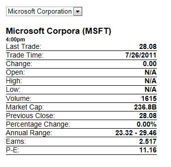
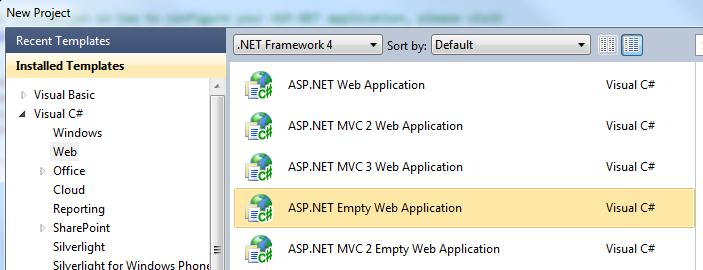
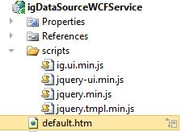

<!--
|metadata|
{
    "fileName": "igdatasource-binding-to-wcf-data-services",
    "controlName": "igDataSource",
    "tags": ["Data Binding","Getting Started","How Do I","Sample Data Source"]
}
|metadata|
-->

# Binding igDataSource to WCF Data Services

The `igDataSource` is a client-side JavaScript data source component that can bind to a variety of formats of data including XML, JSON, Atom, JavaScript arrays, and even HTML tables. You can see the different formats used in the Ignite UI [samples browser](%%SamplesUrl%%/data-source/mashup).

The `igDataSource` is ‘server agnostic’ which means that it takes no dependency on any type of server-side software platform. With that being said, developers using the .NET framework often want to leverage WCF to provide data in their RIA applications. This topic dissects one of the WCF samples from the samples browser and walks you through the process of setting up your own WCF service to deliver XML data to the `igDataSource` in an ASP.NET application.

The following is a screenshot of the finished product:



In the sample, users can select a company name from the dropdown to have the application display details about the company’s stock performance. Behind the scenes, the selection in the dropdown triggers an AJAX call to a WCF endpoint on the web server. In the production sample, the web server calls a real stock service to get the latest information about the stock which it then returns to the client. For the purposes of clearly showing how this works and how you can supply your own data, the example in this topic returns an XML string from the web server.

The following steps walk you through building the sample in Microsoft Visual Studio® 2010.


 >**Note**: [The complete sample is available for download here](http://dl.infragistics.com/community/jquery/codesamples/aaronm/2011-07-28/igDataSourceWCFService.zip).

1.  Open Visual Studio and create a new ASP.NET Empty Web Application and name it ‘igDataSourceWCFService’: **Note**: As stated above, the `igDataSource` component is server-agnostic. Therefore this exercise demonstrates how you can implement WCF support in ASP.NET WebForms as opposed to ASP.NET MVC which Ignite UI supports out-of-the-box.

    

2.  Add a reference to the Ignite UI combined and minified script file, infragistics.core.js, which comes with the product. In addition, you must reference jQuery core, jQuery UI, and jQuery templating scripts to run the sample. This [help article discusses referencing the required scripts](Deployment-Guide-JavaScript-Resources.html) and where the combined and minified scripts are available to add to your application. **Note**: You can [download the full or trial product here](http://www.infragistics.com/dotnet/netadvantage/jquery-controls.aspx#Downloads). The jQuery [templates script is available here](http://plugins.jquery.com/tag/templates/).

3.  Create a “scripts” directory in your project and copy the JavaScript files into this folder.

4.  Next you can setup the sample page. You are going to add a new html page to the application and call it ‘default.htm’. Once that is done your project will look like this:

    

5.  Open the default.htm file and include script tags for the script files:

    **In HTML:**

    ```html
    <head>
        <title>igDataSource Bound to WCF Service</title>
        <script src="scripts/jquery.min.js" type="text/javascript"></script>   
		<script src="scripts/jquery-ui.min.js" type="text/javascript"></script>
       <script src="scripts/infragistics.core.js" type="text/javascript"></script>
    </head>
    ```

6.  Into the body of your default.htm file

    **In HTML:**

    ```html
    <style type="text/css">
     #quoteContainer
     {
         width: 300px; 
         margin:20px 0;
     }
        
    .quote
    {
        font-weight: bold;
        float: right;
    }
    .quoteTime
    {
        font-weight: bold;
        font-size: 11px;
    }
    .quoteName
    {
         font-weight: bold;
         font-size: 17px;
    }
    .quoteContainer
    {
        border-bottom: 1px solid black;
    }

    </style>
     <script id="quoteTemplate" type="text/x-jquery-tmpl">
        <div class="quoteName"> ${Name} (${Symbol}) </div>
        <div class="quoteTime"> ${Time} </div>
        <div class="quoteContainer">Last Trade: <span class="quote"> ${Last} </span> </div> 
        <div class="quoteContainer">Trade Time:  <span class="quote"> ${Date}</span>  </div> 
        <div class="quoteContainer">Change:  <span class="quote"> ${Change} </span> </div> 
        <div class="quoteContainer">Open:    <span class="quote">  ${Open}</span>  </div> 
        <div class="quoteContainer">High:    <span class="quote">  ${High}</span>  </div> 
        <div class="quoteContainer">Low:     <span class="quote"> ${Low}</span>  </div> 
        <div class="quoteContainer">Volume:  <span class="quote"> ${Volume}</span>  </div> 
        <div class="quoteContainer">Market Cap:  <span class="quote"> ${MktCap}</span>  </div> 
        <div class="quoteContainer">Previous Close: <span class="quote"> ${PreviousClose}</span>  </div> 
        <div class="quoteContainer">Percentage Change:  <span class="quote"> ${PercentageChange}</span>  </div> 
        <div class="quoteContainer">Annual Range:  <span class="quote"> ${AnnRange} </span> </div> 
        <div class="quoteContainer">Earns: <span class="quote">   ${Earns} </span> </div>
        <div class="quoteContainer">P-E: <span class="quote">  ${PE} </span>  </div> 
    </script>
    <script type="text/javascript">
        var ds,
            quoteSchema,
            render;
        $(function () {
            var url;
            render = function (success, error) {

                if (success) {
                    $("#quoteContainer").empty();
                    $("#quoteTemplate").tmpl(ds.dataView()).appendTo("#quoteContainer");
                } else {
                    alert(error);
                }
            };

            url= "StockQuoteService.svc/GetStockQuoteGET?symbol=MSFT";

            quoteSchema = new $.ig.DataSchema("xml", { fields: [
                  { name: "Name", xpath: "Name" },
                  { name: "Symbol", xpath: "Symbol" },
                  { name: "Last", xpath: "Last" },
                  { name: "Date", xpath: "Date" },
                  { name: "Time", xpath: "Time" },
                  { name: "Change", xpath: "Change" },
                  { name: "Open", xpath: "Open" },
                  { name: "High", xpath: "High" },
                  { name: "Low", xpath: "Low" },
                  { name: "Volume", xpath: "Volume" },
                  { name: "MktCap", xpath: "MktCap" },
                  { name: "PreviousClose", xpath: "PreviousClose" },
                  { name: "PercentageChange", xpath: "PercentageChange" },
                  { name: "AnnRange", xpath: "AnnRange" },
                  { name: "Earns", xpath: "Earns" },
                  { name: "PE", xpath: "P-E"}],
                searchField: "//StockQuotes/Stock"
            });
            ds = new $.ig.DataSource({ callback: render, dataSource: url, schema: quoteSchema }).dataBind();
        });

        function GetQuote(elem) {
            var url= "StockQuoteService.svc/GetStockQuoteGET?symbol=" + $(elem).val();
            ds = new $.ig.DataSource({ callback: render, dataSource: url, schema: quoteSchema }).dataBind();
        }

    </script>
    <div>
    <select id="quotes" onchange="GetQuote(this);">
        <option selected="selected" value="MSFT">Microsoft Corporation</option>
        <option value="AAPL">Apple Inc.</option>
        <option value="GOOG">Google Inc.</option>
        <option value="INTC">Intel Corporation</option>
        <option value="GE">General Electric Co.</option>
    </select>
    </div>

    <div id="quoteContainer">

    </div>
    ```

7.  The next step is to setup your web service. Add an assembly reference to the `System.ServiceModel.Web` assembly. Also, add a new WCF Service to the project called ‘StockQuoteService.svc’. This gives you the `.svc` file in addition to the interface for setting up the service contract, `IStockQuoteService`.

8.  Open the `IStockQuoteService.cs` file and define a method named ‘GetStockQuoteGET’ and decorate it with the `WebGet` attribute in order to allow GET access.

    **In C#:**

    ```csharp
    using System.ServiceModel;
    using System.ServiceModel.Web;
    using System.Xml;

    [OperationContract]
    [WebGet]
    XmlElement GetStockQuoteGET(string symbol);
    ```

9.  Next, implement the method on the `StockQuoteService` to return data. The following code demonstrates to implement GetStockQuoteGET: **Note**: Only one company’s data is shown here but sample data for all of the companies is in the downloadable sample found at the end of this article.

    **In C#:**

    ```csharp
    using System.Xml;

    public XmlElement GetStockQuoteGET(string symbol)
    {
        XmlDocument stockQuoteXmlDoc = new XmlDocument();
        string stockXmlData = string.Empty;

        switch (symbol)
        {
            case "MSFT":
                stockXmlData =
                    "<StockQuotes>" +
                        "<Stock>" +
                            "<Symbol>MSFT</Symbol>" +
                            "<Last>28.08</Last>" +
                            "<Date>7/26/2011</Date>" +
                            "<Time>4:00pm</Time>" +
                            "<Change>0.00</Change>" +
                            "<Open>N/A</Open>" +
                            "<High>N/A</High>" +
                            "<Low>N/A</Low>" +
                            "<Volume>500</Volume>" +
                            "<MktCap>236.8B</MktCap>" +
                            "<PreviousClose>28.08</PreviousClose>" +
                            "<PercentageChange>0.00%</PercentageChange>" +
                            "<AnnRange>23.32 - 29.46</AnnRange>" +
                            "<Earns>2.517</Earns>" +
                            "<P-E>11.16</P-E>" +
                            "<Name>Microsoft Corporation</Name>" +
                        "</Stock>" +
                    "</StockQuotes>";
                break;
			default:
			    stockXmlData =
			        "<StockQuotes>" +
			            "<Stock>" +
			                "<Symbol>!!!</Symbol>" +
			                "<Name>No Information Found</Name>" +
			            "</Stock>" +
			        "</StockQuotes>";
			    break;
		}
		
		stockQuoteXmlDoc.LoadXml(stockXmlData);
		
		return stockQuoteXmlDoc.DocumentElement;
	}
	```

10. Next, the `web.config` file needs adjustment to enable the web service to be accessed over http:

    **In HTML:**

    ```html
    <system.serviceModel>
            <behaviors>
                <serviceBehaviors>
                    <behavior name="StockQuoteServiceBehavior">
                        <serviceMetadata httpGetEnabled="true"/>
                        <serviceDebug includeExceptionDetailInFaults="true"/>
                    </behavior>
                </serviceBehaviors>
                <endpointBehaviors>
                    <behavior name="StockQuoteServiceBehavior">
                        <webHttp/>
                    </behavior>
                </endpointBehaviors>
            </behaviors>
            <services >
                <service name="igDataSourceWCFService.StockQuoteService" behaviorConfiguration="StockQuoteServiceBehavior">
                    <endpoint address="" binding="webHttpBinding" contract="igDataSourceWCFService.IStockQuoteService" behaviorConfiguration="StockQuoteServiceBehavior"/>
                </service>
            </services>
        </system.serviceModel>
    ```

11. Run the application and the stock information for Microsoft will appear. At first, this will be the only company that has data available. To see data for all of the companies as well as the sample in its completed form, download the [full sample here](http://dl.infragistics.com/community/jquery/codesamples/aaronm/2011-07-28/igDataSourceWCFService.zip).

>**Note**: The Ignite UI script files are not included with this download. Please use the files installed with your copy of Ignite UI or download your copy [here](http://www.infragistics.com/dotnet/netadvantage/jquery-controls.aspx#Downloads).

## Related Topics
Following are some other topics you may find useful.

-   [igGrid/igDataSource Architecture Overview](igGrid-igDataSource-Architecture-Overview.html)
-   [Binding to REST Services](igDataSource-Binding-to-REST-Services.html)

 

 


