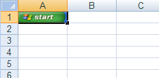

<!--
|metadata|
{
    "fileName": "excelengine-add-an-image-to-a-worksheet",
    "controlName": "Infragistics Excel Library",
    "tags": ["How Do I"]
}
|metadata|
-->

# Add an Image to a Worksheet

Microsoft® Excel® allows images and other shapes to be placed in any location on a worksheet. Using a [`WorksheetImage`](Infragistics.Web.Mvc.Documents.Excel~Infragistics.Documents.Excel.WorksheetImage.html "Link to the Web API Reference Guide to the WorksheetImage member.") object, you can also add an image to a [Worksheet](Infragistics.Web.Mvc.Documents.Excel~Infragistics.Documents.Excel.Worksheet.html "Link to the Web API Reference Guide to the Worksheet member.") . All shapes are added to a worksheet by using the following steps, in order:

1.  Create the desired shape.
2.  Set the anchors for the shape, which determine where the shape will be placed on the worksheet.
3.  Add the shape to the Worksheet's [Shapes](Infragistics.Web.Mvc.Documents.Excel~Infragistics.Documents.Excel.Worksheet~Shapes.html "Link to the Web API Reference Guide to the Shapes member.") collection.

The anchors, which need to be set before placing the shape on the worksheet, are the [TopLeftCornerCell](Infragistics.Web.Mvc.Documents.Excel~Infragistics.Documents.Excel.WorksheetShape~TopLeftCornerCell.html "Link to the Web API Reference Guide to the TopLeftCornerCell member.") and [BottomRightCornerCell](Infragistics.Web.Mvc.Documents.Excel~Infragistics.Documents.Excel.WorksheetShape~BottomRightCornerCell.html "Link to the Web API Reference Guide to the BottomRightCornerCell member.") properties of the shape. These cells determine where the shape's associated corner will appear when the worksheet is viewed in Excel. Additional anchor properties are the [TopLeftCornerPosition](Infragistics.Web.Mvc.Documents.Excel~Infragistics.Documents.Excel.WorksheetShape~TopLeftCornerPosition.html "Link to the Web API Reference Guide to the TopLeftCornerPosition member.") and [BottomRightCornerPosition](Infragistics.Web.Mvc.Documents.Excel~Infragistics.Documents.Excel.WorksheetShape~BottomRightCornerPosition.html "Link to the Web API Reference Guide to the BottomRightCornerPosition member.") properties of the shape. By using these properties, you have finer control over where the associated corner of the shape will appear in the cell. These position properties are expressed in percentages across each dimension of the cell, with (0.0, 0.0) referring with the top-left corner of the associated anchor cell, and (100.0, 100.0) referring to the bottom-right corner.

The following code demonstrates how to create an image and have it fill the entire A1 cell of a worksheet:

**In Visual Basic:**

```vb
Dim workbook As New Infragistics.Documents.Excel.Workbook()
Dim worksheet As Infragistics.Documents.Excel.Worksheet = _
  workbook.Worksheets.Add("Sheet1")

Dim image As Image = image.FromFile("C:image.bmp")
Dim imageShape As Infragistics.Documents.Excel.WorksheetImage = _
  New Infragistics.Documents.Excel.WorksheetImage(image)

Dim cellA1 As Infragistics.Documents.Excel.WorksheetCell = _
  worksheet.Rows.Item(0).Cells.Item(0)

' The top-left corner of the image should be at the 
' top-left corner of cell A1
imageShape.TopLeftCornerCell = cellA1
imageShape.TopLeftCornerPosition = New PointF(0.0F, 0.0F)

' The bottom-right corner of the image should be at 
' the bottom-right corner of cell A1
imageShape.BottomRightCornerCell = cellA1
imageShape.BottomRightCornerPosition = New PointF(100.0F, 100.0F)

worksheet.Shapes.Add(imageShape)
```

**In C#:**

```csharp
Infragistics.Documents.Excel.Workbook workbook = new Infragistics.Documents.Excel.Workbook();
Infragistics.Documents.Excel.Worksheet worksheet =
  workbook.Worksheets.Add( "Sheet1" );

Image image = Image.FromFile( "C:image.bmp" );
Infragistics.Documents.Excel.WorksheetImage imageShape = 
  new Infragistics.Documents.Excel.WorksheetImage( image );

Infragistics.Documents.Excel.WorksheetCell cellA1 = worksheet.Rows[0].Cells[0];

// The top-left corner of the image should be at the 
// top-left corner of cell A1
imageShape.TopLeftCornerCell = cellA1;
imageShape.TopLeftCornerPosition = new PointF( 0.0F, 0.0F );

// The bottom-right corner of the image should be at 
// the bottom-right corner of cell A1
imageShape.BottomRightCornerCell = cellA1;
imageShape.BottomRightCornerPosition = new PointF( 100.0F, 100.0F );

worksheet.Shapes.Add( imageShape );
```



 

 


