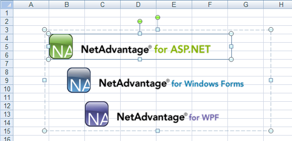

<!--
|metadata|
{
    "fileName": "excelengine-adding-shapes-to-a-worksheet",
    "controlName": "Infragistics Excel Library",
    "tags": ["How Do I"]
}
|metadata|
-->

# Adding Shapes to a Worksheet


## Before You Begin
One of the great things about the Infragistics.Documents.Excel assembly is the ability to add images and shapes to your worksheet. As in Microsoft® Excel®, you can place an image on a worksheet, position it where you want, and even group it with other shapes on the same worksheet. Using a shape is a simple process of creating the shape, setting anchors which determine where it will be positioned on the worksheet, and adding it to the worksheet.

In addition to placing shapes directly on a worksheet, you can also group shapes together on the worksheet. When shapes are grouped, the entire group can be moved as one shape, ensuring the shapes within the group are always in the same position relative to each other.

## What You Will Accomplish
This walkthrough will guide you through the steps required to add images to your worksheet and group them as one shape.

## Follow these Steps
1.  **Create a workbook with a worksheet.**
    1.  Create a new Visual Basic or C# web site project.
    2.  Add a Button to the form.
    3.  Double-click the Button to open the code-behind for its Click event.
    4.  Create a Workbook with one Worksheet:

        **In Visual Basic:**

        ```vb
        Dim workbook As New Infragistics.Documents.Excel.Workbook()
        Dim worksheet As Infragistics.Documents.Excel.Worksheet = _
          workbook.Worksheets.Add("Sheet1")
        ```

        **In C#:**

        ```csharp
        Infragistics.Documents.Excel.Workbook workbook = new Infragistics.Documents.Excel.Workbook();
        Infragistics.Documents.Excel.Worksheet worksheet = workbook.Worksheets.Add( "Sheet1" );
        ```

2.  **Create the image shapes to place on the worksheet.**
    1.  Create the images:

        **In Visual Basic:**

        ```vb
        Dim aspImage As Image = Image.FromFile("C:NA_AspNet.gif")
        Dim winImage As Image = Image.FromFile("C:NA_Win_Forms.gif")
        Dim wpfImage As Image = Image.FromFile("C:NA_WPF.gif")
        ```

        **In C#:**

        ```csharp
        Image aspImage = Image.FromFile( "C:NA_AspNet.gif" );
        Image winImage = Image.FromFile( "C:NA_Win_Forms.gif" );
        Image wpfImage = Image.FromFile( "C:NA_WPF.gif" );
        ```

    2.  Create the image shapes to place on the worksheet:

        **In Visual Basic:**

        ```vb
        Dim aspImageShape As Infragistics.Documents.Excel.WorksheetImage = _
          New Infragistics.Documents.Excel.WorksheetImage(aspImage)
        Dim winImageShape As Infragistics.Documents.Excel.WorksheetImage = _
          New Infragistics.Documents.Excel.WorksheetImage(winImage)
        Dim wpfImageShape As Infragistics.Documents.Excel.WorksheetImage = _
          New Infragistics.Documents.Excel.WorksheetImage(wpfImage)
        ```

        **In C#:**

        ```csharp
        Infragistics.Documents.Excel.WorksheetImage aspImageShape =
          new Infragistics.Documents.Excel.WorksheetImage( aspImage );
        Infragistics.Documents.Excel.WorksheetImage winImageShape =
          new Infragistics.Documents.Excel.WorksheetImage( winImage );
        Infragistics.Documents.Excel.WorksheetImage wpfImageShape =
          new Infragistics.Documents.Excel.WorksheetImage( wpfImage );
        ```

3.  **Set the position anchors on the image shapes.**

    Before adding the shapes to a group or worksheet, you must set their anchors. Position shapes relative to cells on the worksheet:

    **In Visual Basic:**

    ```vb
    aspImageShape.TopLeftCornerCell = worksheet.Rows.Item(3).Cells.Item(1)
    aspImageShape.BottomRightCornerCell = worksheet.Rows.Item(5).Cells.Item(6)
    ' The bottom-right corner of the shape should be close to the
    ' bottom-left corner of its anchor cell
    aspImageShape.BottomRightCornerPosition = New PointF(10, 100)

    winImageShape.TopLeftCornerCell = worksheet.Rows.Item(7).Cells.Item(1)
    ' The top-left corner of the shape should be in the top-middle
    ' of its anchor cell
    winImageShape.TopLeftCornerPosition = New PointF(50, 0)
    winImageShape.BottomRightCornerCell = worksheet.Rows.Item(9).Cells.Item(6)
    ' The bottom-right corner of the shape should be close to the
    ' bottom-middle of its anchor cell
    winImageShape.BottomRightCornerPosition = New PointF(60, 100)

    wpfImageShape.TopLeftCornerCell = worksheet.Rows.Item(11).Cells.Item(2)
    wpfImageShape.BottomRightCornerCell = worksheet.Rows.Item(13).Cells.Item(7)
    ' The bottom-right corner of the shape should be close to the
    ' bottom-left corner of its anchor cell
    wpfImageShape.BottomRightCornerPosition = New PointF(10, 100)
    ```

    **In C#:**

    ```csharp
    aspImageShape.TopLeftCornerCell = worksheet.Rows[3].Cells[1];
    aspImageShape.BottomRightCornerCell = worksheet.Rows[5].Cells[6];
    // The bottom-right corner of the shape should be close to the
    // bottom-left corner of its anchor cell
    aspImageShape.BottomRightCornerPosition = new PointF( 10, 100 );

    winImageShape.TopLeftCornerCell = worksheet.Rows[7].Cells[1];
    // The top-right corner of the shape should be in the top-middle
    // of its anchor cell
    winImageShape.TopLeftCornerPosition = new PointF( 50, 0 );
    winImageShape.BottomRightCornerCell = worksheet.Rows[9].Cells[6];
    // The bottom-right corner of the shape should be close to the 
    // bottom-middle of its anchor cell
    winImageShape.BottomRightCornerPosition = new PointF( 60, 100 );

    wpfImageShape.TopLeftCornerCell = worksheet.Rows[11].Cells[ 2 ];
    wpfImageShape.BottomRightCornerCell = worksheet.Rows[13].Cells[7];
    // The bottom-right corner of the shape should be close to the
    // bottom-left corner of its anchor cell
    wpfImageShape.BottomRightCornerPosition = new PointF( 10, 100 );
    ```

4.  **Group the image shapes.**
    1.  Create a shape group, which is also a shape:

        **In Visual Basic:**

        ```vb
        Dim group As Infragistics.Documents.Excel.WorksheetShapeGroup = _
          New Infragistics.Documents.Excel.WorksheetShapeGroup()
        ```

        **In C#:**

        ```csharp
        Infragistics.Documents.Excel.WorksheetShapeGroup group =
          new Infragistics.Documents.Excel.WorksheetShapeGroup();
        ```

    2.  Add the image shapes to the group. When shapes are added or removed from the shape group, it will automatically set its own anchors so it is the smallest rectangle, which completely encloses all its shapes. Because of this, the anchors for the shape group do not need to be set.

        **In Visual Basic:**

        ```vb
        group.Shapes.Add(aspImageShape)
        group.Shapes.Add(winImageShape)
        group.Shapes.Add(wpfImageShape)
        ```

        **In C#:**

        ```csharp
        group.Shapes.Add( aspImageShape );
        group.Shapes.Add( winImageShape );
        group.Shapes.Add( wpfImageShape );
        ```

    3.  Add the group, which now contains the image shapes, to the worksheet:

        **In Visual Basic:**

        ```vb
        worksheet.Shapes.Add(group)
        ```

        **In C#:**

        ```csharp
        worksheet.Shapes.Add( group );
        ```

5.  **Serialize the workbook.**
    1.  Write the workbook to a file:

        **In Visual Basic:**

        ```vb
        workbook.Serialize("C:Shapes.xls")
        ```

        **In C#:**

        ```csharp
        workbook.Serialize( "C:Shapes.xls" );
        ```




 

 


