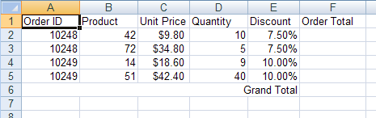

<!--
|metadata|
{
    "fileName": "excelengine-calculating-order-totals",
    "controlName": "Infragistics Excel Library",
    "tags": ["Getting Started","How Do I"]
}
|metadata|
-->

# Calculating Order Totals

## Before You Begin
A common task in a Microsoft® Excel® workbook is to store a column or row of numerical data and have a cell containing the total of these numbers. The nice thing about this total is it can automatically update when one of the numbers changes. You can create a total cell in a worksheet by applying a formula as the cell's value.

## What You Will Accomplish
Using this topic, you will learn how to create cells contains totals of data in the worksheet.

## Follow these Steps
1.  **Create a workbook with a worksheet.**
    1.  Create a new Visual Basic or C# web site project.
    2.  Add a Button to the form.
    3.  Double-click the Button to open the code-behind for its Click event.
    4.  Create a Workbook with one Worksheet:

        **In Visual Basic:**

        ```vb
        Dim workbook As New Infragistics.Documents.Excel.Workbook()
        Dim worksheet As Infragistics.Documents.Excel.Worksheet = _
          workbook.Worksheets.Add("Sheet1")
        ```

        **In C#:**

        ```csharp
        Infragistics.Documents.Excel.Workbook workbook = new Infragistics.Documents.Excel.Workbook();
        Infragistics.Documents.Excel.Worksheet worksheet = workbook.Worksheets.Add( "Sheet1" );
        ```

2.  **Define the columns for the worksheet data.**
    1.  Make column headers so the data is easily identified:

        **In Visual Basic:**

        ```vb
        Dim headersRow As Infragistics.Documents.Excel.WorksheetRow = worksheet.Rows.Item(0)
        headersRow.Cells.Item(0).Value = "Order ID"
        headersRow.Cells.Item(1).Value = "Product"
        headersRow.Cells.Item(2).Value = "Unit Price"
        headersRow.Cells.Item(3).Value = "Quantity"
        headersRow.Cells.Item(4).Value = "Discount"
        headersRow.Cells.Item(5).Value = "Order Total"
        ```

        **In C#:**

        ```csharp
        Infragistics.Documents.Excel.WorksheetRow headersRow = worksheet.Rows[ 0 ];
        headersRow.Cells[0].Value = "Order ID";
        headersRow.Cells[1].Value = "Product";
        headersRow.Cells[2].Value = "Unit Price";
        headersRow.Cells[3].Value = "Quantity";
        headersRow.Cells[4].Value = "Discount";
        headersRow.Cells[5].Value = "Order Total";
        ```

    2.  Set special formatting for any columns which require it:

        **In Visual Basic:**

        ```vb
        ' The "Unit Price" column should display its values as dollars
        worksheet.Columns.Item(2).CellFormat.FormatString = _
          """$""#,##0.00_);(""$""#,##0.00)"

        ' The "Discount" column should display its values as percentages
        worksheet.Columns.Item(4).CellFormat.FormatString = "0.00%"

        ' The "Order Total" column should display its values as dollars
        worksheet.Columns.Item(5).CellFormat.FormatString = _
          """$""#,##0.00_);(""$""#,##0.00)"
        ' Allow enough room to display the totals
        worksheet.Columns.Item(5).Width = 3000
        ```

        **In C#:**

        ```csharp
        // The "Unit Price" column should display its values as dollars
        worksheet.Columns[2].CellFormat.FormatString = ""$"#,##0.00_);("$"#,##0.00)";

        // The "Discount" column should display its values as percentages
        worksheet.Columns[4].CellFormat.FormatString = "0.00%";

        // The "Order Total" column should display its values as dollars
        worksheet.Columns[5 ].CellFormat.FormatString = ""$"#,##0.00_);("$"#,##0;00)";
        // Allow enough room to display the totals
        worksheet.Columns[5].Width = 3000;
        ```

3.  **Populate the cells with data.**
    1.  Populate the cells with data (not the cells that will contain totals; those will be calculated by formulas later):

        **In Visual Basic:**

        ```vb
        Dim currentRow As Infragistics.Documents.Excel.WorksheetRow

        currentRow = worksheet.Rows.Item(1)
        currentRow.Cells.Item(0).Value = 10248
        currentRow.Cells.Item(1).Value = 42
        currentRow.Cells.Item(2).Value = 9.8
        currentRow.Cells.Item(3).Value = 10
        currentRow.Cells.Item(4).Value = 0.075

        currentRow = worksheet.Rows.Item(2)
        currentRow.Cells.Item(0).Value = 10248
        currentRow.Cells.Item(1).Value = 72
        currentRow.Cells.Item(2).Value = 34.8
        currentRow.Cells.Item(3).Value = 5
        currentRow.Cells.Item(4).Value = 0.075

        currentRow = worksheet.Rows.Item(3)
        currentRow.Cells.Item(0).Value = 10249
        currentRow.Cells.Item(1).Value = 14
        currentRow.Cells.Item(2).Value = 18.6
        currentRow.Cells.Item(3).Value = 9
        currentRow.Cells.Item(4).Value = 0.1

        currentRow = worksheet.Rows.Item(4)
        currentRow.Cells.Item(0).Value = 10249
        currentRow.Cells.Item(1).Value = 51
        currentRow.Cells.Item(2).Value = 42.4
        currentRow.Cells.Item(3).Value = 40
        currentRow.Cells.Item(4).Value = 0.1
        ```

        **In C#:**

        ```csharp
        Infragistics.Documents.Excel.WorksheetRow currentRow;

        currentRow = worksheet.Rows[1];
        currentRow.Cells[0].Value = 10248;
        currentRow.Cells[1].Value = 42;
        currentRow.Cells[2].Value = 9.80;
        currentRow.Cells[3].Value = 10;
        currentRow.Cells[4].Value = 0.075;

        currentRow = worksheet.Rows[2];
        currentRow.Cells[0].Value = 10248;
        currentRow.Cells[1].Value = 72;
        currentRow.Cells[2].Value = 34.80;
        currentRow.Cells[3].Value = 5;
        currentRow.Cells[4].Value = 0.075;

        currentRow = worksheet.Rows[3];
        currentRow.Cells[0].Value = 10249;
        currentRow.Cells[1].Value = 14;
        currentRow.Cells[2].Value = 18.60;
        currentRow.Cells[3].Value = 9;
        currentRow.Cells[4].Value = 0.1;

        currentRow = worksheet.Rows[4];
        currentRow.Cells[0].Value = 10249;
        currentRow.Cells[1].Value = 51;
        currentRow.Cells[2].Value = 42.40;
        currentRow.Cells[3].Value = 40;
        currentRow.Cells[4].Value = 0.1;
        ```

4.  **Create a Grand Total label under the data.**
    1.  Create a merged cell, update the data, and apply a label:

        **In Visual Basic:**

        ```vb
        Dim mergedCell As Infragistics.Documents.Excel.WorksheetMergedCellsRegion = _
          worksheet.MergedCellsRegions.Add(5, 0, 5, 4)
        mergedCell.Value = "Grand Total"
        ```

        **In C#:**

        ```csharp
        Infragistics.Documents.Excel.WorksheetMergedCellsRegion mergedCell = 
          worksheet.MergedCellsRegions.Add( 5, 0, 5, 4 );
        mergedCell.Value = "Grand Total";
        ```

    2.  Adjust the text alignment so the label appears closer to where the Grand Total cell will be:

        **In Visual Basic:**

        ```vb
        mergedCell.CellFormat.Alignment = _
          Infragistics.Documents.Excel.HorizontalCellAlignment.Right
        ```

        **In C#:**

        ```csharp
        mergedCell.CellFormat.Alignment = 
          Infragistics.Documents.Excel.HorizontalCellAlignment.Right;
        ```

	

5.  **Apply a formula to calculate the sub total of each order record.**
    1.  Create a formula that calculates the order total. The formula will multiply the unit price by the quantity, and remove the discount from the total: =[UnitPrice]*[Quantity]*(1-[Discount]). The formula will be created as if it were calculating the order total for the first order (the total in cell F2). However, the formula will be created using relative cell references, so when it is applied to the other order total cells, the cell references will be correctly shifted downwards:

        **In Visual Basic:**

        ```vb
        Dim orderTotalFormula As Infragistics.Documents.Excel.Formula = _
          Infragistics.Documents.Excel.Formula.Parse("=C2*D2*(1-E2)", _
          Infragistics.Documents.Excel.CellReferenceMode.A1)
        ```

        **In C#:**

        ```csharp
        Infragistics.Documents.Excel.Formula orderTotalFormula =
        Infragistics.Documents.Excel.Formula.Parse( "=C2*D2*(1-E2)", Infragistics.Documents.Excel.CellReferenceMode.A1 );
        ```

    2.  Create a cell region that defines the cells to which the formula will be applied:

        **In Visual Basic:**

        ```vb
        Dim region As Infragistics.Documents.Excel.WorksheetRegion = _
          New Infragistics.Documents.Excel.WorksheetRegion(worksheet, 1, 5, 4, 5)
        ```

        **In C#:**

        ```csharp
        Infragistics.Documents.Excel.WorksheetRegion region =
          new Infragistics.Documents.Excel.WorksheetRegion( worksheet, 1, 5, 4, 5 );
        ```

    3.  Apply the formula to the region of order total cells:

        **In Visual Basic:**

        ```vb
        orderTotalFormula.ApplyTo(region)
        ```

        **In C#:**

        ```csharp
        orderTotalFormula.ApplyTo( region );
        ```

	

6.  **Apply a formula to determine the grand total.**
    1.  Create a formula to total all "Order Total" cells for a grand total. This formula will use absolute references by prefacing row and column identifiers with a dollar sign ($), but relative references can be used as well:

        **In Visual Basic:**

        ```vb
        Dim grandTotalFormula As Infragistics.Documents.Excel.Formula = _
          Infragistics.Documents.Excel.Formula.Parse("=SUM($F$2:$F$5)", _
          Infragistics.Documents.Excel.CellReferenceMode.A1)
        ```

        **In C#:**

        ```csharp
        Infragistics.Documents.Excel.Formula grandTotalFormula =
          Infragistics.Documents.Excel.Formula.Parse( "=SUM($F$2:$F$5)",
          Infragistics.Documents.Excel.CellReferenceMode.A1 );
        ```

    2.  Apply the formula to the grand total cell:

        **In Visual Basic:**

        ```vb
        grandTotalFormula.ApplyTo(worksheet.Rows.Item(5).Cells.Item(5))
        ```

        **In C#:**

        ```csharp
        grandTotalFormula.ApplyTo( worksheet.Rows[5].Cells[5] );
        ```

	

7.  **Save the workbook**

    Write the workbook to a file:

    **In Visual Basic:**

    ```vb
    workbook.Serialize("C:Orders.xls")
    ```

    **In C#:**

    ```csharp
    workbook.Serialize( "C:Orders.xls" );
    ```