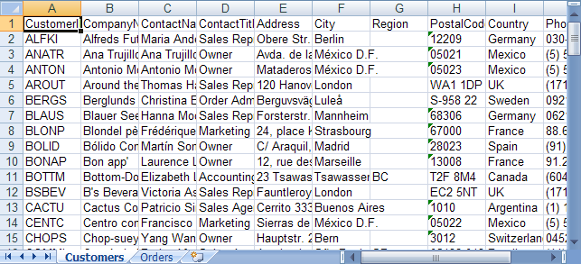

<!--
|metadata|
{
    "fileName": "excelengine-populating-a-worksheet-from-a-dataset",
    "controlName": "Infragistics Excel Library",
    "tags": ["Data Binding","How Do I"]
}
|metadata|
-->

# Populating a Worksheet from a DataSet

## Before You Begin
The main use for a Microsoft® Excel® worksheet is to display data. You can easily transfer data from an existing DataSet to a workbook so you can view it in Excel. A `DataSet` consists of one or more `DataTable` objects. Each `DataTable` can be mapped to a worksheet.

## What You Will Accomplish
This walkthrough will show you how to create a `DataSet` from some tables in a database. Then it will demonstrate how to copy the data from that `DataSet` to a workbook, creating a Worksheet object to display the data for each `DataTable` in the `DataSet`.

## Follow these Steps
1.  **Create a DataTable and populate it with data from an existing database.**
    1.  Create a new Visual Basic or C# web site project.
    2.  Add a Button to the form.
    3.  Double-click the Button to open the code-behind for its Click event.
    4.  Connect to an existing Access database and populate a `DataSet` with data from some tables in the database:

        **In Visual Basic:**

        ```vb
        Dim northWindDbConnection As New System.Data.SqlClient.SqlConnection( _
                "Data Source=.SQLEXPRESS;AttachDbFilename=""C:Program FilesMicrosoft SQL ServerMSSQL.1MSSQLDataNorthwind.mdf"";Integrated Security=True;Connect Timeout=30;User Instance=True")

        Dim dataSet As New DataSet()

        northWindDbConnection.Open()
        Try
                Dim customersSelectCommand As New System.Data.SqlClient.SqlCommand("SELECT * FROM Customers", northWindDbConnection)

                Dim customersReader As System.Data.SqlClient.SqlDataReader = customersSelectCommand.ExecuteReader()

                ' Load all data from the customers table in the database
                Dim customersTable As New DataTable("Customers")
                customersTable.Load(customersReader)
                ' Add the customers data table to the data set
                dataSet.Tables.Add(customersTable)

                Dim ordersSelectCommand As New System.Data.SqlClient.SqlCommand("SELECT * FROM Orders", northWindDbConnection)

                Dim ordersReader As System.Data.SqlClient.SqlDataReader = ordersSelectCommand.ExecuteReader()

                ' Load all data from the customers orders in the database
                Dim ordersTable As New DataTable("Orders")
                ordersTable.Load(ordersReader)
                ' Add the orders data table to the data set
                dataSet.Tables.Add(ordersTable)
        Finally
                northWindDbConnection.Close()
        End Try
        ```

        **In C#:**

        ```csharp
        System.Data.SqlClient.SqlConnection northWindDbConnection = new System.Data.SqlClient.SqlConnection(
          @"Data Source=.SQLEXPRESS;AttachDbFilename=""C:Program FilesMicrosoft SQL ServerMSSQL.1MSSQLDataNorthwind.mdf"";Integrated Security=True;Connect Timeout=30;User Instance=True");

        DataSet dataSet = new DataSet();

        northWindDbConnection.Open();
        try
        {
                System.Data.SqlClient.SqlCommand customersSelectCommand = new System.Data.SqlClient.SqlCommand(
                  "SELECT * FROM Customers", northWindDbConnection);

                System.Data.SqlClient.SqlDataReader customersReader = customersSelectCommand.ExecuteReader();

                // Load all data from the customers table in the database
                DataTable customersTable = new DataTable("Customers");
                customersTable.Load(customersReader);
                // Add the customers data table to the data set
                dataSet.Tables.Add(customersTable);

                System.Data.SqlClient.SqlCommand ordersSelectCommand = new System.Data.SqlClient.SqlCommand(
                  "SELECT * FROM Orders", northWindDbConnection);

                System.Data.SqlClient.SqlDataReader ordersReader = ordersSelectCommand.ExecuteReader();

                // Load all data from the customers orders in the database
                DataTable ordersTable = new DataTable("Orders");
                ordersTable.Load(ordersReader);
                // Add the orders data table to the data set
                dataSet.Tables.Add(ordersTable);
        }
        finally
        {
                northWindDbConnection.Close();
        }
        ```

2.  **Load the data into a workbook.**
    1.  Create a workbook to hold the data from the DataSet.

        **In Visual Basic:**

        ```vb
        Dim workbook As New Infragistics.Documents.Excel.Workbook()
        ```

        **In C#:**

        ```csharp
        Infragistics.Documents.Excel.Workbook workbook = new Infragistics.Documents.Excel.Workbook();
        ```

    2.  Iterate the data tables in the data set and create a worksheet for each one. Also, populate the worksheet with the data from the data table:

        **In Visual Basic:**

        ```vb
        For Each table As DataTable In dataSet.Tables
                ' Create the worksheet to represent this data table
                Dim worksheet As Infragistics.Documents.Excel.Worksheet = workbook.Worksheets.Add(table.TableName)
                ' Create column headers for each column
                For columnIndex As Integer = 0 To table.Columns.Count – 1
                        worksheet.Rows.Item(0).Cells.Item(columnIndex).Value = table.Columns.Item(columnIndex).ColumnName
                Next
                ' Starting at row index 1, copy all data rows in
                ' the data table to the worksheet
                Dim rowIndex As Integer = 1
                For Each dataRow As DataRow In table.Rows
                        Dim row As Infragistics.Documents.Excel.WorksheetRow = _
                          worksheet.Rows.Item(rowIndex)
                        rowIndex = rowIndex + 1
                        For columnIndex As Integer = 0 To dataRow.ItemArray.Length – 1
                                row.Cells.Item(columnIndex).Value = dataRow.ItemArray(columnIndex)
                        Next
                Next
        Next
        ```

        **In C#:**

        ```csharp
        foreach (DataTable table in dataSet.Tables)
        {
                // Create the worksheet to represent this data table
                Infragistics.Documents.Excel.Worksheet worksheet = workbook.Worksheets.Add(table.TableName);

                // Create column headers for each column
                for (int columnIndex = 0; columnIndex < table.Columns.Count; columnIndex++)
                {
                        worksheet.Rows[0].Cells[columnIndex].value = table.Columns[columnIndex].ColumnName;
                }

                // Starting at row index 1, copy all data rows in
                // the data table to the worksheet
                int rowIndex = 1;
                foreach (DataRow dataRow in table.Rows)
                {
                        Infragistics.Documents.Excel.WorksheetRow row = worksheet.Rows[rowIndex++];

                        for (int columnIndex = 0; columnIndex < dataRow.ItemArray.Length; columnIndex++)
                        {
                                row.Cells[columnIndex].value = dataRow.ItemArray[columnIndex];
                        }
                }
        }
        ```

3.  **Save the workbook.**

    Write the workbook to a file:

    **In Visual Basic:**

    ```vb
    workbook.Save("C:Data.xls")
    ```

    **In C#:**

    ```csharp
    workbook.Save( "C:Data.xls" );
    ```



 

 


