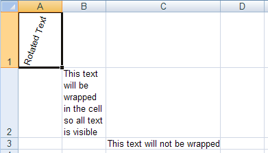

<!--
|metadata|
{
    "fileName": "excelengine-resizing-rows-and-columns",
    "controlName": "Infragistics Excel Library",
    "tags": ["Editing","How Do I"]
}
|metadata|
-->

# Resizing Rows and Columns

## Before You Begin
In a worksheet, you may have a large amount of text in a cell or a large image that you want to appear in a cell. If the default cell size cannot fit the cell's contents, you can easily increase the height and width of all cells in a row, column, or the entire worksheet.

However, in some situations the row height will automatically be increased so all content is visible. For example, if you rotate or wrap text in a cell, and the height of the row containing the cell is the default value, the row height will automatically increase to show all content. The column width is never managed automatically, and always remains constant, regardless of the content of its cells.

In addition to resizing individual rows and columns, you can resize all rows and columns by setting the Worksheet's [`DefaultRowHeight`](Infragistics.Web.Mvc.Documents.Excel~Infragistics.Documents.Excel.Worksheet~DefaultRowHeight.html "Link to the Web API Reference Guide to the DefaultRowHeight member et class.") and  [`DefaultColumnWidth`](Infragistics.Web.Mvc.Documents.Excel~Infragistics.Documents.Excel.Worksheet~DefaultColumnWidth.html "Link to the Web API Reference Guide to the DefaultColumnWidth member .") properties.

## What You Will Accomplish
This walkthrough will show you a few ways to auto-size rows. In addition, you will learn how it manually size rows and columns so a cell can completely contain its contents.

## Follow these Steps
1.  **Create a workbook with a worksheet.**
    1.  Create a new Visual Basic or C# web site project.
    2.  Add a Button to the form.
    3.  Double-click the Button to open the code-behind for its Click event.
    4.  Create a Workbook with one Worksheet:

        **In Visual Basic:**

        ```vb
        Dim workbook As New Infragistics.Documents.Excel.Workbook()
        Dim worksheet As Infragistics.Documents.Excel.Worksheet = _
          workbook.Worksheets.Add("Sheet1")
        ```

        **In C#:**

        ```csharp
        Infragistics.Documents.Excel.Workbook workbook = new Infragistics.Documents.Excel.Workbook();
        Infragistics.Documents.Excel.Worksheet worksheet = workbook.Worksheets.Add( "Sheet1" );
        ```

2.  **Auto-size the height of rows.**
    1.  Rotate the text in a cell whose row still has the default height. The row will auto-size to fit the cell's contents.

        **In Visual Basic:**

        ```vb
        worksheet.Rows.Item(0).Cells.Item(0).Value = "Rotated Text"
        worksheet.Rows.Item(0).Cells.Item(0).CellFormat.Rotation = 70
        ```

        **In C#:**

        ```csharp
        worksheet.Rows[0].Cells[0].Value = "Rotated Text";
        worksheet.Rows[0].Cells[0].CellFormat.Rotation = 70;
        ```
	
	2.  Wrap the text in a cell whose row still has the default height. The row will auto-size to fit the cell's contents.
	
	    **In Visual Basic:**
	
		```vb
	    worksheet.Rows.Item(1).Cells.Item(1).Value = _
	      "This text will be wrapped in the cell so all text is visible"
	    worksheet.Rows.Item(1).Cells.Item(1).CellFormat.WrapText = _
	      Infragistics.Documents.Excel.ExcelDefaultableBoolean.True
		```
	
	    **In C#:**
	
		```csharp
	    worksheet.Rows[1].Cells[1].Value =
	      "This text will be wrapped in the cell so all text is visible";
	    worksheet.Rows[1].Cells[1].CellFormat.WrapText =
	      Infragistics.Documents.Excel.ExcelDefaultableBoolean.True;
		```
	

3.  **Resize a column so text does not go outside its cell.**
    1.  Place enough text in a cell so the text goes outside the boundaries of its cell:

        **In Visual Basic:**

        ```vb
        worksheet.Rows.Item(2).Cells.Item(2).Value = _
          "This text will not be wrapped"
        ```

        **In C#:**

        ```csharp
        worksheet.Rows[2].Cells[2].Value = "This text will not be wrapped";
        ```
	

	2.  Although all text is visible, if a value is set in cell D3, the long text will be cut off. To increase the cell's width, increase the width of the WorksheetColumn, which is accessible from the Worksheet's Columns collection.
	
	    **In Visual Basic:**
	
		```vb
	    worksheet.Columns.Item(2).Width = 6100
		```
	
	    **In C#:**
	
		```csharp
	    worksheet.Columns[2].Width = 6100;
		```
		

4.  **Place an image in a cell and resize the cell so the image is not distorted.**
    1.  Create an image and make it occupy an entire cell:

        **In Visual Basic:**

        ```vb
        Dim image As Image = image.FromFile("C:NA_Win_Forms.gif")
        Dim imageShape As New Infragistics.Documents.Excel.WorksheetImage(image)

        imageShape.TopLeftCornerCell = worksheet.Rows.Item(3).Cells.Item(3)
        imageShape.BottomRightCornerCell = worksheet.Rows.Item(3).Cells.Item(3)
        imageShape.BottomRightCornerPosition = New PointF(100, 100)

        worksheet.Shapes.Add(imageShape)
        ```

        **In C#:**

        ```csharp
        Image image = Image.FromFile( "C:NA_Win_Forms.gif" );
        Infragistics.Documents.Excel.WorksheetImage imageShape =
          new Infragistics.Documents.Excel.WorksheetImage( image );

        imageShape.TopLeftCornerCell = worksheet.Rows[3].Cells[3];
        imageShape.BottomRightCornerCell = worksheet.Rows[3].Cells[3];
        imageShape.BottomRightCornerPosition = new PointF( 100, 100 );

        worksheet.Shapes.Add( imageShape );
        ```
	

	2.  Increase the height and width of the cell's row and column so the image is not distorted:
	
	    **In Visual Basic:**
	
		```vb
	    worksheet.Rows.Item(3).Height = 600
	    worksheet.Columns.Item(3).Width = 10000
		```
	
	    **In C#:**
	
		```csharp
	        worksheet.Rows[3].Height = 600;
	        worksheet.Columns[3].Width = 10000;
		```
	
		

5.  **Save the workbook.**

    Write the workbook to a file:

    **In Visual Basic:**

    ```vb
    workbook.Save("C:Resize.xls")
    ```

    **In C#:**

    ```csharp
    workbook.Save( "C:Resize.xls" );
    ```

 

 


