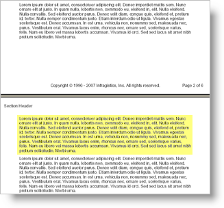

<!--
|metadata|
{
    "fileName": "documentengine-chain",
    "controlName": "Infragistics Document Library",
    "tags": ["Layouts","Reporting"]
}
|metadata|
-->

# Chain

The Chain element is very useful if you don't want content to be divided when there is not enough room to display it all on one page. Normally, when you use a Text element, if there is not enough room on the page to fit the content, it flows to the next page as displayed in the image below.


However, by using a Chain element, you can keep that content together. Instead of an element's content being split on page breaks, the entire element will carry over to the next page as shown in the screen shot below.



This is useful if you want to keep a paragraph of text on one page, or maybe you want to keep an image and its text caption together on one page. The Chain element links all its content together in an unbreakable chain. The only exception is when there is more content in the Chain than can fit on one page. In this case, the Chain element would not be able to keep all its content together on one page and would therefore attempt to group content elements together.

* * * * *

Use the following code to add a [Chain](Infragistics.Web.Mvc.Documents.Reports~Infragistics.Documents.Reports.Report.IChain.html "Link to the Web API Reference Guide to the IChain interface.") element to a Section element and add text to it.

1.  **Define a report and add a Section element.**

	**In Visual Basic:**
	
	```vb
	'
	' Create the report and add a Section element.
	'
	Dim report As Infragistics.Documents.Reports.Report.Report = _
	  New Infragistics.Documents.Reports.Report.Report()
	
	Dim section1 As Infragistics.Documents.Reports.Report.Section.ISection = _
	  report.AddSection()
	
	section1.PageMargins = _
	  New Infragistics.Documents.Reports.Report.Margins(50)
	```
	
	**In C#:**
	
	```csharp
	//
	// Create the report and add a section.
	//
	Infragistics.Documents.Reports.Report.Report report =
	  new Infragistics.Documents.Reports.Report.Report();
	
	Infragistics.Documents.Reports.Report.Section.ISection section1 =
	  report.AddSection();
	
	section1.PageMargins = 
	  new Infragistics.Documents.Reports.Report.Margins(50);
	```

2.  **Add unbreakable content to the Section element.**

	Use the following text to set the the `string1` variable:
	
	> Lorem ipsum dolor sit amet, consectetuer adipiscing elit. Donec imperdiet mattis sem. Nunc ornare elit at justo. In quam nulla, lobortis non, commodo eu, eleifend in, elit. Nulla eleifend. Nulla convallis. Sed eleifend auctor purus. Donec velit diam, congue quis, eleifend et, pretium id, tortor. Nulla semper condimentum justo. Etiam interdum odio ut ligula. Vivamus egestas scelerisque est. Donec accumsan. In est urna, vehicula non, nonummy sed, malesuada nec, purus. Vestibulum erat. Vivamus lacus enim, rhoncus nec, ornare sed, scelerisque varius, felis. Nam eu libero vel massa lobortis accumsan. Vivamus id orci. Sed sed lacus sit amet nibh pretium sollicitudin. Morbi urna.

	**In Visual Basic:**
	
	```vb
	'
	' Add a Chain element and a Text element to the chain.
	' This content will be unbreakable.
	'
	
	Dim string1 As String = "Lorem ipsum..."
	
	For i As Integer = 0 To 7
	  ' Add a Chain element to the Band element.
	  Dim chain1 As Infragistics.Documents.Reports.Report.IChain = _
	    section1.AddChain()
	
	  ' Add a Text element to the Chain element.
	  Dim chainText As Infragistics.Documents.Reports.Report.Text.IText = _
	    chain1.AddText()
	
	  ' Set some styles on the text so we can see where the 
	  ' element begins and ends. This way, we can be sure
	  ' that the content is not being separated.
	  chainText.Background = _
	    New Infragistics.Documents.Reports.Report.Background _
	    (Infragistics.Documents.Reports.Graphics.Brushes.SteelBlue)
	  chainText.Borders = _
	    New Infragistics.Documents.Reports.Report.Borders _
	    (Infragistics.Documents.Reports.Graphics.Pens.Black)
	  chainText.Paddings = _
	    New Infragistics.Documents.Reports.Report.Paddings(5)
	  chainText.Margins = _
	    New Infragistics.Documents.Reports.Report.Margins(5)
	
	  ' Add content to the Text element.
	  chainText.AddContent(string1)
	  chainText.AddLineBreak()
	  chainText.AddLineBreak()
	  chainText.AddContent(string1)
	Next i
	```
	
	**In C#:**
	
	```csharp
	//
	// Add a Chain element and a Text element to the chain.
	// This content will be unbreakable.
	//
	
	string string1 = "Lorem ipsum...";
	
	for (int i = 0; i < 8; i++)
	{
	    // Add a Chain element to the Band element.
	    Infragistics.Documents.Reports.Report.IChain chain1 =
	            section1.AddChain();
	
	    // Add a Text element to the Chain element.
	    Infragistics.Documents.Reports.Report.Text.IText chainText = 
	            chain1.AddText();
	
	    // Set some styles on the text so we can see where the 
	    // element begins and ends. This way, we can be sure
	    // that the content is not being separated.
	    chainText.Background = 
	            new Infragistics.Documents.Reports.Report.Background
	            (Infragistics.Documents.Reports.Graphics.Brushes.SteelBlue);
	    chainText.Borders = 
	            new Infragistics.Documents.Reports.Report.Borders
	            (Infragistics.Documents.Reports.Graphics.Pens.Black);
	    chainText.Paddings = 
	            new Infragistics.Documents.Reports.Report.Paddings(5);
	    chainText.Margins = 
	            new Infragistics.Documents.Reports.Report.Margins(5);
	
	    // Add content to the Text element.
	    chainText.AddContent(string1);
	    chainText.AddLineBreak();
	    chainText.AddLineBreak();
	    chainText.AddContent(string1);
	}
	```