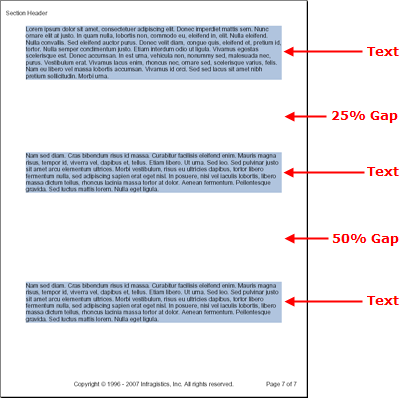

<!--
|metadata|
{
    "fileName": "documentengine-gap",
    "controlName": "Infragistics Document Library",
    "tags": ["Layouts","Reporting"]
}
|metadata|
-->

# Gap

The Gap element does exactly what its name implies -- adds gaps to your content. If you have different layout elements but want them vertically separated on the page by a specific amount of space, the Gap element is what you need to use.



Use the code below to add three Text elements divided by two Gap elements similar to the image above. This topic assumes that you already have a [Report](Infragistics.Web.Mvc.Documents.Reports~Infragistics.Documents.Reports.Report.Report.html "Link to the Web API Reference Guide to the Report member.") element defined, as well as at least one [ISection](Infragistics.Web.Mvc.Documents.Reports~Infragistics.Documents.Reports.Report.Section.ISection.html "Link to the Web API Reference Guide to the ISection interface.") element called `section1`.

The Gap element exposes only one property, the [`Height`](Infragistics.Web.Mvc.Documents.Reports~Infragistics.Documents.Reports.Report.IGap~Height.html "Link to the Web API Reference Guide to the Height member.") property. Through the Height property, you can set how high the Gap will be either in a fixed amount of points, or in a percentage of available space remaining.

## Fixed Height
When setting the height of a Gap element to a fixed height, you need to set the Height property to a new instance of the [`FixedHeight`](Infragistics.Web.Mvc.Documents.Reports~Infragistics.Documents.Reports.Report.FixedHeight.html "Link to the Web API Reference Guide to the FixedHeight member.") class. Pass the amount of points you wish the gap to span to the constructor of the `FixedHeight` class.

## Relative Height
Using a relative height for the Gap element involves setting the Height property to an instance of the [`RelativeHeight`](Infragistics.Web.Mvc.Documents.Reports~Infragistics.Documents.Reports.Report.RelativeHeight.html "Link to the Web API Reference Guide to the RelativeHeight member.") class; this will allow you to specify the height of the gap in a percentage of available space remaining. Therefore, a Gap element added to the beginning of a page with the same value of a Gap element added towards the end of the page will end up being a much larger gap. The reason for this is that the first Gap element has much more of the page left after it, so the percentage ends up being a larger number. You can see this concept in action through the image to the right. The first Gap element is using 25% of the page at the point where it was added. The second Gap element is using 50% of the page at the point where it was added but is still about the same size as the first Gap element.

**In Visual Basic:**

```vb
Imports Infragistics.Documents.Reports.Report
...

Dim gapText As Infragistics.Documents.Reports.Report.Text.IText = section1.AddText()
gapText.Background = New Background(Brushes.LightSteelBlue)
gapText.AddContent("Paragraph one text...")

Dim gap As Infragistics.Documents.Reports.Report.IGap = section1.AddGap()
gap.Height = New RelativeHeight(25)

gapText = section1.AddText()
gapText.Background = New Background(Brushes.LightSteelBlue)
gapText.AddContent("Paragraph two text...")

gap = section1.AddGap()
gap.Height = New RelativeHeight(50)

gapText = section1.AddText()
gapText.Background = New Background(Brushes.LightSteelBlue)
gapText.AddContent("Paragraph three text...")
```

**In C#:**

```csharp
using Infragistics.Documents.Reports.Report;
...

Infragistics.Documents.Reports.Report.Text.IText gapText = section1.AddText();
gapText.Background = new Background(Brushes.LightSteelBlue);
gapText.AddContent("Paragraph one text...");
                        
Infragistics.Documents.Reports.Report.IGap gap = section1.AddGap();
gap.Height = new RelativeHeight(25);

gapText = section1.AddText();
gapText.Background = new Background(Brushes.LightSteelBlue);
gapText.AddContent("Paragraph two text...");

gap = section1.AddGap();
gap.Height = new RelativeHeight(50);

gapText = section1.AddText();
gapText.Background = new Background(Brushes.LightSteelBlue);
gapText.AddContent("Paragraph three text...");
```