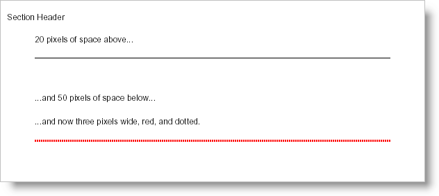

<!--
|metadata|
{
    "fileName": "documentengine-rule",
    "controlName": "Infragistics Document Library",
    "tags": ["Layouts","Reporting"]
}
|metadata|
-->

# Rule

The Rule element is very similar to the Horizontal Rule tag in HTML both in design and purpose. The Rule element is a simple line that spans the width of its parent element with default settings such as solid, black, and 1 pixel wide. Although the Rule element doesn't have to be just a simple line, you can change several properties that can make it a powerful content dividing tool.

The width of the Rule element, by definition, is not how far the line spans horizontally; the line will always span the entire width of its parent container. The width of the Rule element is how thick the line is, so it might be easier to think of the Width property as the element's height (since we normally consider height to be the vertical distance).




You can use the following code to create a page in a section that looks similar to the image above. The following code assumes you already have a [Report](Infragistics.Web.Mvc.Documents.Reports~Infragistics.Documents.Reports.Report.Report.html "Link to the Web API Reference Guide to the Report member.") element defined with at least one [ISection](Infragistics.Web.Mvc.Documents.Reports~Infragistics.Documents.Reports.Report.Section.ISection.html "Link to the Web API Reference Guide to the ISection interface.") element added and named section1.

**In C#:**

```csharp
using Infragistics.Documents.Reports.Report;
.
.
.
section1.AddQuickText("20 pixels of space above...");

// Define a Rule element and provide an extra 20 pixels
// of space above and 50 pixels of space below.
Infragistics.Documents.Reports.Report.IRule rule = section1.AddRule();
rule.Margins.Top = 20;
rule.Margins.Bottom = 50;

section1.AddQuickText("...and 50 pixels of space below...");

// The Gap element helps space content out. This gap 
// is specifically set to provide 20 pixels of space.
Infragistics.Documents.Reports.Report.IGap ruleGap = section1.AddGap();
ruleGap.Height = new FixedHeight(20);

section1.AddQuickText("...and now three pixels wide, red, and dotted.");

// Add another Rule element to the section.
rule = section1.AddRule();
// The Rule's color will be Red.
rule.Pen = new Pen(new Color(255, 0, 0));
// The Rule will be 3 pixels wide.
rule.Pen.Width = 3;
// The Rule will be a dotted line.
rule.Pen.Style = DashStyle.Dot;
// The Rule will have 20 pixels of space above it and
// 50 pixels of space below.
rule.Margins.Top = 20;
rule.Margins.Bottom = 50;
```

