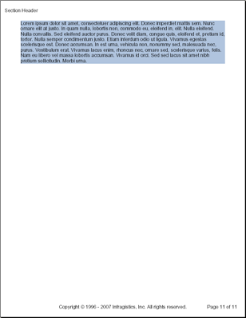
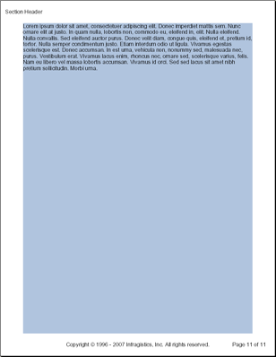

<!--
|metadata|
{
    "fileName": "documentengine-stretcher",
    "controlName": "Infragistics Document Library",
    "tags": ["Layouts","Reporting"]
}
|metadata|
-->

# Stretcher
The `Stretcher` element is a non-visible layout element whose only purpose is to stretch content to the end of a page. Normally, a layout element will resize to fit the content it encapsulates. This may be an undesired effect if the layout element includes a background color or image. When you call the `AddStretcher` method off a layout element, that element will stretch to the end of the page, even if its content does not. The two images below show how an element with its background color set to `LightSteelBlue` would look like without and with a Stretcher element.

Without Stretcher | With Stretcher
--- | ---
 | 