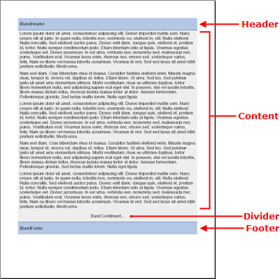

<!--
|metadata|
{
    "fileName": "documentengine-band",
    "controlName": "Infragistics Document Library",
    "tags": ["Layouts","Reporting"]
}
|metadata|
-->

# Band

The Band element is a standard content section with both basic and advanced features that can handle any report scenario -- small or large. For a complete list of layout elements that you can add to the Band element, see Layout Element Comparison Table.

The Band element is unique in its ability to have repeatable headers, footers, and dividers. These headers and footers decorate the band, not the page, so the headers and footers appear above and below the content of the band. You can also insert any number of pattern content, as well as set several additional settings.

The following content layout sections are unique to the Band element:

- **Header**: The Header element decorates the top of the content area beginning on each new page. Set the [`Header`](Infragistics.Web.Mvc.Documents.Reports~Infragistics.Documents.Reports.Report.Band.IBand~Header.html) property of the [`IBand`](Infragistics.Web.Mvc.Documents.Reports~Infragistics.Documents.Reports.Report.Band.IBand.html) object to a new [`IBandHeader`](Infragistics.Web.Mvc.Documents.Reports~Infragistics.Documents.Reports.Report.Band.IBandHeader.html) object in order to take advantage of this feature. Of course, if you do not need a header, you do not need to set the property.
- **Divider**: The [`Divider`](Infragistics.Web.Mvc.Documents.Reports~Infragistics.Documents.Reports.Report.Band.IBand~Divider.html) element displays at the bottom of the content area, before the footer on all pages but the last. This makes the element perfect for identifying that the section continues on to the next page. Set the Divider property of the IBand object to a new [`IBandDivider`](Infragistics.Web.Mvc.Documents.Reports~Infragistics.Documents.Reports.Report.Band.IBandDivider.html) object in order to take advantage of this feature. As with the Header, you do not need to set this property if you do not wish to use a Divider.
- **Footer**: The Footer element decorates the bottom of the content area. If the Band ends before the bottom of the page, the footer will display at the end of the band, not the page. However, you can set the [`Stretch`](Infragistics.Web.Mvc.Documents.Reports~Infragistics.Documents.Reports.Report.Band.IBand~Stretch.html) property of the Band object to True if you want the band to occupy the entire page (applies to each page, not only the last page).



## Creating a PDF File that Has a Single Band

The following steps will guide you through the process of creating a PDF file containing a single Band with headers, dividers, and footers.

### What You Will Accomplish

The code in this walkthrough will allow you to produce a PDF report very similar to the screenshot at the top of this topic. All that's left is to publish your report. For more information on publishing your report, see [Publish a Report](DocumentEngine-Publish-a-Report.html "Explains how to publish a generate report.").

### Follow these steps

1.  **Create the report and add a section.**

    Each report you create begins as a Report object. Once instantiated, you can add as many sections to it as needed through the AddSection method. You can add only a section to the main Report. Once a section is created, you can add all of the other types of content to it. The following code creates a report, adds a section, and sets several page-specific properties for the section.

    **In Visual Basic:**

    ```vb
    '
    ' Create the report and add a section.
    '
    Dim report As Infragistics.Documents.Reports.Report.Report = _
      New Infragistics.Documents.Reports.Report.Report()

    Dim section1 As Infragistics.Documents.Reports.Report.Section.ISection = _
      report.AddSection()

    section1.PagePaddings = _
      New Infragistics.Documents.Reports.Report.Paddings(50)
    ```

    **In C#:**

    ```csharp
    //
    // Create the report and add a section.
    //
    Infragistics.Documents.Reports.Report.Report report = 
      new Infragistics.Documents.Reports.Report.Report();

    Infragistics.Documents.Reports.Report.Section.ISection section1 =
      report.AddSection();

    section1.PagePaddings = 
      new Infragistics.Documents.Reports.Report.Paddings(50);
    ```

2.  **Add the band to the section.**

    Adding a band, or any content section, to the main section is accomplished by calling a method. In this case, you will call the AddBand method off the Section object. AddBand will return a reference to a new IBand object created from the section. Therefore, you need to assign that reference to a new IBand object. The following code creates a new IBand object and sets its Background to gray.

    **In Visual Basic:**

    ```vb
    '
    ' Add the band to the section. 
    '
    Dim band As Infragistics.Documents.Reports.Report.Band.IBand = _
      section1.AddBand()

    band.Background = _
      New Infragistics.Documents.Reports.Report.Background _
      (Infragistics.Documents.Reports.Graphics.Colors.LightGray)
    ```

    **In C#:**

    ```csharp
    //
    // Add the band to the section. 
    //
    Infragistics.Documents.Reports.Report.Band.IBand band = 
      section1.AddBand();

    band.Background = 
      new Infragistics.Documents.Reports.Report.Background
      (Infragistics.Documents.Reports.Graphics.Colors.LightGray);
    ```

3.  **Add a header to the band.**

    Adding the band to the section involved a method call, adding a header to the band is done a little differently. Headers, dividers, and footers for the band already exist; you are just retrieving a reference to them. Create a new Header and set it to the Header property off the Band object. Once you've retrieved this reference, you can modify its properties. The following code will get the Band's header, set several layout and visual properties, and add some content to the header.

    **In Visual Basic:**

    ```vb
    '
    ' Add a header to the band.
    '

    ' Retrieve a reference to the band's header
    ' and assign it to the bandHeader object.
    Dim bandHeader As Infragistics.Documents.Reports.Report.Band.IBandHeader = _
      band.Header

    ' Cause the header to repeat on every page.
    bandHeader.Repeat = True

    ' The height of the header will be 5% of
    ' the page's height. 
    bandHeader.Height = _
      New Infragistics.Documents.Reports.Report.FixedHeight(30)

    ' The header's background color will be light blue.
    bandHeader.Background = _
      New Infragistics.Documents.Reports.Report.Background _
      (Infragistics.Documents.Reports.Graphics.Colors.SteelBlue)

    ' Set the horizontal and vertical alignment of the header.
    bandHeader.Alignment = _
      New Infragistics.Documents.Reports.Report.ContentAlignment _
      ( _
        Infragistics.Documents.Reports.Report.Alignment.Left, _
        Infragistics.Documents.Reports.Report.Alignment.Middle _
      )

    ' The bottom border of the band will be a 
    ' solid, dark blue line.
    bandHeader.Borders.Bottom = _
      New Infragistics.Documents.Reports.Report.Border _
      (Infragistics.Documents.Reports.Graphics.Pens.DarkBlue)

    ' Add 5 pixels of padding around the left and right edges.
    bandHeader.Paddings.Horizontal = 5

    ' Add textual content to the header.
    Dim bandHeaderText As Infragistics.Documents.Reports.Report.Text.IText = _
      bandHeader.AddText()
    bandHeaderText.AddContent("IBandHeader")
    ```

    **In C#:**

    ```csharp
    //
    // Add a header to the band.
    //
                            
    // Retrieve a reference to the band's header
    // and assign it to the bandHeader object.
    Infragistics.Documents.Reports.Report.Band.IBandHeader bandHeader = 
      band.Header;

    // Cause the header to repeat on every page.
    bandHeader.Repeat = true;
                            
    // The height of the header will be 5% of
    // the page's height. 
    bandHeader.Height = 
      new Infragistics.Documents.Reports.Report.FixedHeight(30);
                            
    // The header's background color will be light blue.
    bandHeader.Background = 
      new Infragistics.Documents.Reports.Report.Background
      (Infragistics.Documents.Reports.Graphics.Colors.SteelBlue);
                            
    // Set the horizontal and vertical alignment of the header.
    bandHeader.Alignment = 
      new Infragistics.Documents.Reports.Report.ContentAlignment
      (
        Infragistics.Documents.Reports.Report.Alignment.Left, 
        Infragistics.Documents.Reports.Report.Alignment.Middle
      );
                            
    // The bottom border of the band will be a 
    // solid, dark blue line.
    bandHeader.Borders.Bottom = 
      new Infragistics.Documents.Reports.Report.Border
      (Infragistics.Documents.Reports.Graphics.Pens.DarkBlue);
                            
    // Add 5 pixels of padding around the left and right edges.
    bandHeader.Paddings.Horizontal = 5;
                            
    // Add textual content to the header.
    Infragistics.Documents.Reports.Report.Text.IText bandHeaderText = 
      bandHeader.AddText();
    bandHeaderText.AddContent("IBandHeader");
    ```

4.  **Add the band's divider.**

    You can use a divider for several purposes. Since the divider always shows at the end of a page, before the footer, you can use it to signify that the band continues on to the next page, or you can use it as a kind of page-numbering system to identify how many pages the actual band is (in addition to any page-numbering device you may have in the main footer of the page). Just as you had to retrieve a reference from the band's header, you need to do the same to the divider. The following code does just that, as well as modifies standard properties and adds content.

    **In Visual Basic:**

    ```vb
    '
    ' Add the band's divider. 
    '

    ' Retrieve a reference to the band's Divider.
    Dim bandDivider As Infragistics.Documents.Reports.Report.Band.IBandDivider = _
      band.Divider

    ' Set the height to 5% of the page's height.
    bandDivider.Height = _
      New Infragistics.Documents.Reports.Report.FixedHeight(30)

    ' Align the content in the middle of the divider.
    bandDivider.Alignment = _
      New Infragistics.Documents.Reports.Report.ContentAlignment _
      (Infragistics.Documents.Reports.Report.Alignment.Middle)

    ' Add text to the divider and center it on the page.
    Dim bandDividerText As Infragistics.Documents.Reports.Report.Text.IText = _
      bandDivider.AddText()
    bandDividerText.AddContent("Band Continued...")
    bandDividerText.Alignment = _
      New Infragistics.Documents.Reports.Report.TextAlignment _
      (Infragistics.Documents.Reports.Report.Alignment.Center)
    ```

    **In C#:**

    ```csharp
    //
    // Add the band's divider. 
    //

    // Retrieve a reference to the band's Divider.
    Infragistics.Documents.Reports.Report.Band.IBandDivider bandDivider = 
      band.Divider;
                            
    // Set the height to 5% of the page's height.
    bandDivider.Height = 
      new Infragistics.Documents.Reports.Report.FixedHeight(30);

    // Align the content in the middle of the divider.
    bandDivider.Alignment = 
      new Infragistics.Documents.Reports.Report.ContentAlignment
      (Infragistics.Documents.Reports.Report.Alignment.Middle);

    // Add text to the divider and center it on the page.
    Infragistics.Documents.Reports.Report.Text.IText bandDividerText = 
      bandDivider.AddText();
    bandDividerText.AddContent("Band Continued...");
    bandDividerText.Alignment = 
      new Infragistics.Documents.Reports.Report.TextAlignment
      (Infragistics.Documents.Reports.Report.Alignment.Center);
    ```

5.  **Add the band's footer.**

    The band's footer behaves the same way as the header, except at the bottom of the page. As with the header, you can choose whether the footer will display on every page, or just the last page.

    **In Visual Basic:**

    ```vb
    '
    ' Add the band's footer.
    '

    ' Retrieve a reference to the band's footer.
    Dim bandFooter As Infragistics.Documents.Reports.Report.Band.IBandFooter = _
      band.Footer

    ' The band will NOT repeat on every page; 
    ' it will only be seen on the last page.
    bandFooter.Repeat = False

    ' The footer's background color will be light blue.
    bandFooter.Background = _
      New Infragistics.Documents.Reports.Report.Background _
      (Infragistics.Documents.Reports.Graphics.Colors.LightSteelBlue)

    ' The footer's height will be 5% of the page's height.
    bandFooter.Height = _
      New Infragistics.Documents.Reports.Report.FixedHeight(30)

    ' Align the footer's content horizontally and vertically.
    bandFooter.Alignment = _
      New Infragistics.Documents.Reports.Report.ContentAlignment _
      ( _
        Infragistics.Documents.Reports.Report.Alignment.Left, _
        Infragistics.Documents.Reports.Report.Alignment.Middle _
      )

    ' The top border of the footer will be a
    ' solid, dark blue line. 
    bandFooter.Borders.Top = _
      New Infragistics.Documents.Reports.Report.Border _
      (Infragistics.Documents.Reports.Graphics.Pens.DarkBlue)

    ' Add 5 pixels of padding on the left and right.
    bandFooter.Paddings.Horizontal = 5

    ' Add textual content to the footer.
    Dim bandFooterText As Infragistics.Documents.Reports.Report.Text.IText = _
      bandFooter.AddText()
    bandFooterText.AddContent("IBandFooter")
    ```

    **In C#:**

    ```csharp
    //
    // Add the band's footer.
    //

    // Retrieve a reference to the band's footer.
    Infragistics.Documents.Reports.Report.Band.IBandFooter bandFooter = 
      band.Footer;

    // The band will NOT repeat on every page; 
    // it will only be seen on the last page.
    bandFooter.Repeat = false;

    // The footer's background color will be light blue.
    bandFooter.Background = 
      new Infragistics.Documents.Reports.Report.Background
      (Infragistics.Documents.Reports.Graphics.Colors.LightSteelBlue);
                            
    // The footer's height will be 5% of the page's height.
    bandFooter.Height = 
      new Infragistics.Documents.Reports.Report.FixedHeight(30);
                            
    // Align the footer's content horizontally and vertically.
    bandFooter.Alignment = 
      new Infragistics.Documents.Reports.Report.ContentAlignment
      (
        Infragistics.Documents.Reports.Report.Alignment.Left, 
        Infragistics.Documents.Reports.Report.Alignment.Middle
      );

    // The top border of the footer will be a 
    // solid, dark blue line.
    bandFooter.Borders.Top = 
      new Infragistics.Documents.Reports.Report.Border
      (Infragistics.Documents.Reports.Graphics.Pens.DarkBlue);

    // Add 5 pixels of padding on the left and right.
    bandFooter.Paddings.Horizontal = 5;

    // Add textual content to the footer.
    Infragistics.Documents.Reports.Report.Text.IText bandFooterText = 
      bandFooter.AddText();
    bandFooterText.AddContent("IBandFooter");
    ```

6.  **Add content to the band.**

    Now that you have the header, divider, and footer set, you'll need to add the actual content of the band. If all you need to add to the band is simple text, then using the AddText method off the Band object is what you need. For this example, we will use the following sample text:

    > Lorem ipsum dolor sit amet, consectetuer adipiscing elit. Donec
    > imperdiet mattis sem. Nunc ornare elit at justo. In quam nulla,
    > lobortis non, commodo eu, eleifend in, elit. Nulla eleifend. Nulla
    > convallis. Sed eleifend auctor purus. Donec velit diam, congue
    > quis, eleifend et, pretium id, tortor. Nulla semper condimentum
    > justo. Etiam interdum odio ut ligula. Vivamus egestas scelerisque
    > est. Donec accumsan. In est urna, vehicula non, nonummy sed,
    > malesuada nec, purus. Vestibulum erat. Vivamus lacus enim, rhoncus
    > nec, ornare sed, scelerisque varius, felis. Nam eu libero vel
    > massa lobortis accumsan. Vivamus id orci. Sed sed lacus sit amet
    > nibh pretium sollicitudin. Morbi urna.

    Create a new string and set its content to the text above. This will
    make your code easier to read once you get into more complex
    scenarios involving FOR loops. Create a new IText object but don't
    set it yet. Set the IText object in a FOR loop, this way you will
    keep reusing the same object rather than creating new objects at
    each iteration through the loop. The FOR loop creates the same
    paragraph of text 20 times, giving your band a full body.

    **In Visual Basic:**

    ```vb
    '
    ' Add content to the band.
    '
    Dim string1 As String = "Lorem ipsum..."

    Dim bandText As Infragistics.Documents.Reports.Report.Text.IText

    For i As Integer = 0 To 19
      bandText = band.AddText()
      bandText.AddContent(string1)
      bandText.Paddings.All = 5
    Next i
    ```

    **In C#:**

    ```csharp
    //
    // Add content to the band.
    //
    string string1 = "Lorem ipsum...";

    Infragistics.Documents.Reports.Report.Text.IText bandText;

    for (int i = 0; i < 20; i++)
    {
      bandText = band.AddText();
      bandText.AddContent(string1);
      bandText.Paddings.All = 5;
    }
    ```
