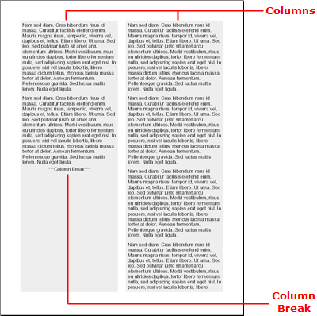

<!--
|metadata|
{
    "fileName": "documentengine-flow",
    "controlName": "Infragistics Document Library",
    "tags": ["Layouts","Reporting"]
}
|metadata|
-->

# Flow

The Flow element is very useful for defining columns in your reports. There are two objects specific to the Flow element that help define columns:



## IFlowColumn Interface
The [IFlowColumn](Infragistics.Web.Mvc.Documents.Reports~Infragistics.Documents.Reports.Report.Flow.IFlowColumn.html "Link to the Web API Reference Guide to the IFlowColumn interface.") interface defines a column in your flow. You can add as many columns as you want. Columns are added in the order that you create them. Each column does not represent a separate section itself; it simply represents how the Flow element's content should flow through the section. Therefore, you cannot add separate content to individual columns. However, you can control, to an extent, what content displays in which column with the [AddColumnBreak](Infragistics.Web.Mvc.Documents.Reports~Infragistics.Documents.Reports.Report.Flow.IFlow~AddColumnBreak.html "Link to the Web API Reference Guide to the AddColumnBreak member.") method.

## AddColumnBreak Method
Calling this method off the [IFlow](Infragistics.Web.Mvc.Documents.Reports~Infragistics.Documents.Reports.Report.Flow.IFlow.html "Link to the Web API Reference Guide to the IFlow interface.") object will insert a column break at that specific location in the flow. Using this method, you can split different content types added to the flow. You can add some text, then a column break, then an image, another column break, and more text. This pattern would ensure that the image is always in the center column without text.


## Creating a Flow Element
This walkthrough guides you through creating a Flow element with two columns. The Flow element will contain five paragraphs of text, each added in a FOR loop. A column break will be added after the second paragraph (accomplished by an IF statement). The logic in this FOR loop and IF statement can be applied to your own report if you have several similar items in a collection, but you need to add a column break after specific items.

## Follow these Steps
1.  **Create the report and main section.**

    Every report starts off by instantiating a Report object. Once you have a Report element, you can add a Section element to it. The Section element will contain the Flow element.

    **In Visual Basic:**

    ```vb
    Imports Infragistics.Documents.Reports.Report
    .
    .
    .
    ' Create a new report.
    Dim report As Infrgistics.Documents.Reports.Report.Report = New Report()

    ' Create the main Section and add 50 pixels
    ' of padding on each edge.
    Dim section1 As Infragistics.Documents.Reports.Report.Section.ISection = report.AddSection()
    section1.PagePaddings.All = 50
    ```

    **In C#:**

    ```csharp
    using Infragistics.Documents.Reports.Report;
    .
    .
    .
    // Create a new report.
    Infragistics.Documents.Reports.Report.Report report = new Report();

    // Create the main Section and add 50 pixels
    // of padding on each edge.
    Infragistics.Documents.Reports.Report.Section.ISection section1 = report.AddSection();
    section1.PagePaddings.All = 50;
    ```

2.  **Create the Flow element and columns.**

    Instantiate a Flow element by calling the AddFlow method off the Section object. The AddFlow method will return a new Flow object. Do the same for a Column element by calling the AddColumn method off the Flow object. This adds a new column to the Flow element. You will then create another column for a total of two columns.

    **In Visual Basic:**

    ```vb
    ' Add a Flow element to the main section
    Dim flow As Infragistics.Documents.Reports.Report.Flow.IFlow = section1.AddFlow()

    ' Create a column in the Flow element.
    Dim column As Infragistics.Documents.Reports.Report.Flow.IFlowColumn = flow.AddColumn()
    ' The column's width will be 50% of
    ' the page's width
    column.Width = New RelativeWidth(50)
    ' Add space to the right edge to simulate
    ' a gutter.
    column.Margins.Right = 10
    ' Color the background of the column gray.
    column.Background = New Background(New Color(238, 238, 238))
            
    ' Add another column to the Flow element.
    column = flow.AddColumn()
    ' The column's width will be 50% of
    ' the page's width
    column.Width = New RelativeWidth(50)
    ' Add space to the left edge to simulate
    ' a gutter.
    column.Margins.Left = 10
    ' Color the background of the column gray.
    column.Background = New Background(New Color(238, 238, 238))
    ```

	**In C#:**

    ```csharp
    // Add a Flow element to the main section
    Infragistics.Documents.Reports.Report.Flow.IFlow flow = section1.AddFlow();
                            
    // Create a column in the Flow element.
    Infragistics.Documents.Reports.Report.Flow.IFlowColumn column = flow.AddColumn();
    // The column's width will be 50% of the page's width.
    column.Width = new RelativeWidth(50);
    // Add space to the right edge to simulate a gutter.
    column.Margins.Right = 10;
    // Color the background of the column gray.
    column.Background = new Background(new Color(238, 238, 238));

    // Add another column to the Flow element.
    column = flow.AddColumn();
    // The column's width will be 50% of the page's width.
    column.Width = new RelativeWidth(50);
    // Add space to the left edge to simulate a gutter.
    column.Margins.Left = 10;
    // Color the background of the column gray.
    column.Background = new Background(new Color(238, 238, 238));
    ```

3.  **Add the content to the Flow element.**

    Now that there are two columns, add some text to the columns. You will add five paragraphs of text through a FOR loop. In the FOR loop, you will use an IF statement to insert a column break after the second paragraph.

    Use the following text to set the the `string1` variable:

    > Lorem ipsum dolor sit amet, consectetuer adipiscing elit. Donec
    > imperdiet mattis sem. Nunc ornare elit at justo. In quam nulla,
    > lobortis non, commodo eu, eleifend in, elit. Nulla eleifend. Nulla
    > convallis. Sed eleifend auctor purus. Donec velit diam, congue
    > quis, eleifend et, pretium id, tortor. Nulla semper condimentum
    > justo. Etiam interdum odio ut ligula. Vivamus egestas scelerisque
    > est. Donec accumsan. In est urna, vehicula non, nonummy sed,
    > malesuada nec, purus. Vestibulum erat. Vivamus lacus enim, rhoncus
    > nec, ornare sed, scelerisque varius, felis. Nam eu libero vel
    > massa lobortis accumsan. Vivamus id orci. Sed sed lacus sit amet
    > nibh pretium sollicitudin. Morbi urna.

    **In Visual Basic:**

	```vb
    Dim string1 As String = "Lorem ipsum..."

    ' Create a Text element.
    Dim [text] As Infragistics.Documents.Reports.Report.Text.IText

    ' Create a FOR loop that iterates five times.
    For i As Integer = 0 To 4
            ' On the third iteration, add a column break.
            If i = 2 Then
                    Dim columnBreak As Infragistics.Documents.Reports.Report.Text.IText = flow.AddText()
                    columnBreak.Alignment = _
                      New TextAlignment(Alignment.Center, Alignment.Middle)
                    columnBreak.AddContent("***Column Break***")
                    flow.AddColumnBreak()

                    [text] = flow.AddText()
                    [text].Paddings = New Paddings(5)
                    [text].AddContent(string1)
            Else
                    [text] = flow.AddText()
                    [text].Paddings = New Paddings(5)
                    [text].AddContent(string1)
            End If
    Next i

    ' Stretch the Flow element (not the content)
    ' to the bottom of the page.
    flow.AddStretcher()
	```

	**In C#:**

	```csharp
    string string1 = "Lorem ipsum...";

    // Create a Text element.
    Infragistics.Documents.Reports.Report.Text.IText text;

    // Create a FOR loop that iterates five times.
    for (int i = 0; i < 5; i++)
    {
            // On the third iteration, add a column break.
            if (i == 2)
            {
                    Infragistics.Documents.Reports.Report.Text.IText columnBreak = 
                      flow.AddText();
                    columnBreak.Alignment = 
                      new TextAlignment(Alignment.Center, Alignment.Middle);
                    columnBreak.AddContent("***Column Break***");
                    flow.AddColumnBreak();

                    text = flow.AddText();
                    text.Paddings = new Paddings(5);
                    text.AddContent(string1);
            }
            else
            {
                    text = flow.AddText();
                    text.Paddings = new Paddings(5);
                    text.AddContent(string1);
            }
    }

    // Stretch the Flow element (not the content)
    // to the bottom of the page.
    flow.AddStretcher();
    ```