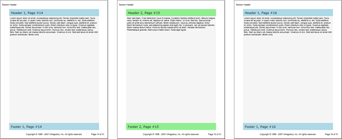

<!--
|metadata|
{
    "fileName": "documentengine-segment",
    "controlName": "Infragistics Document Library",
    "tags": ["Layouts","Reporting"]
}
|metadata|
-->

# Segment


The Segment element is aptly named for the several complete segments (or pages) of content it can produce. Similar to the Section element, the Segment element can have different header/footer combinations for each individual page (as long as the number of pages does not exceed the number of headers/footers, see the Segment Headers and Footers section below for more information). But, unlike the Section element, you can't set a Segment's size; Segments depend on the size of their containing Section element. The Segment and Section elements both have an [AddStretcher](Infragistics.Web.Mvc.Documents.Reports~Infragistics.Documents.Reports.Report.Segment.ISegment~AddStretcher.html "Link to the Web API Reference Guide to the AddStretcher member.") method to stretch content on individual pages; however, the Segment element also has the [Stretch](Infragistics.Web.Mvc.Documents.Reports~Infragistics.Documents.Reports.Report.Segment.ISegment~Stretch.html "Link to the Web API Reference Guide to the Stretch member.") property to stretch all content on every page.

The Segment element is very similar in function to the Section, Band, and Group elements. Refer to the table below for the main differences between these four elements.

Feature | Segment | Section | Band | Group
---- | --- | --- |--- | --- |
Headers, Footers, and Dividers | No dividers. Repeatable collection of headers and footers. | No dividers. Separate headers and footers can be added for each individual page. | One set of headers, footers, and dividers for the entire Band. | None
Height and Width | Cannot be set. | Can be set. | Can be set. | Can be set.
Stretching Content | Each individual page can be stretched as well as the entire element as a whole. | Each individual page can be stretched. | Each individual page can be stretched as well as the entire element as a whole. | Each individual page can be stretched.

## Segment Headers and Footers
The most prominent feature of the Segment element is how it uses headers and footers. You can add as many headers and footers to the Segment as needed. The collection of headers and footers will be used in a specific order, based on the order you add them. Each page in the segment will have a separate header and footer (if more than one header and footer are added to the segment). For example, if you add two Header elements to your segment, and then add two Footer elements, the first page will contain the first header/footer while the second page will contain the second header/footer. The third page, however, will contain the first header/footer while the fourth page contains the second header/footer. The pattern will continue for as many pages as are in the segment. The image below illustrates this concept.



* * * * *

The following example code defines a Segment element with two different Header and Footer elements. There will be two page breaks, producing three separate pages. On the third page, the first header/footer is used because the header/footer collection loops back to the beginning when the number of pages exceeds the number of Header and Footer elements.

1.  **Define a Segment.**

	**In C#:**
	
	```csharp
	using Infragistics.Documents.Reports.Report;
	.
	.
	.
	// Add a Segment to the Section.
	Infragistics.Documents.Reports.Report.Segment.ISegment segment =   section1.AddSegment();
	segment.Background = new Background(Brushes.WhiteSmoke);
	segment.Stretch = true;
	```

2.  **Define two Segment Headers.**

	**In C#:**
	
	```csharp
	// Add the first Header to the Segment.
	Infragistics.Documents.Reports.Report.Segment.ISegmentHeader segmentHeader1 =   segment.AddHeader();
	segmentHeader1.Background = new Background(Brushes.LightBlue);
	segmentHeader1.Height = new FixedHeight(40);
	segmentHeader1.Paddings = new Paddings(10);
	
	Infragistics.Documents.Reports.Report.Text.IText segmentHeaderText =   segmentHeader1.AddText();
	segmentHeaderText.Style = mainStyle1;
	
	segmentHeaderText.AddContent("Header 1, Page #");
	segmentHeaderText.AddPageNumber(PageNumberFormat.Decimal);
	
	// Add the second Header to the Segment.
	Infragistics.Documents.Reports.Report.Segment.ISegmentHeader segmentHeader2 =   segment.AddHeader();
	segmentHeader2.Background = new Background(Brushes.LightGreen);
	segmentHeader2.Height = new FixedHeight(40);
	segmentHeader2.Paddings = new Paddings(10);
	
	segmentHeaderText = segmentHeader2.AddText();
	segmentHeaderText.Style = mainStyle1;
	segmentHeaderText.AddContent("Header 2, Page #");
	segmentHeaderText.AddPageNumber(PageNumberFormat.Decimal);
	```

3.  **Define two Segment Footers.**

	**In C#:**
	
	```csharp
	// Add the first Footer to the Segment.
	Infragistics.Documents.Reports.Report.Segment.ISegmentFooter segmentFooter1 =   segment.AddFooter();
	segmentFooter1.Background = new Background(Brushes.LightBlue);
	segmentFooter1.Height = new FixedHeight(40);
	segmentFooter1.Paddings = new Paddings(10);
	
	Infragistics.Documents.Reports.Report.Text.IText segmentFooterText =   segmentFooter1.AddText();
	segmentFooterText.Style = mainStyle1;
	
	segmentFooterText.AddContent("Footer 1, Page #");
	segmentFooterText.AddPageNumber(PageNumberFormat.Decimal);
	
	// Add the second Footer to the Segment.
	Infragistics.Documents.Reports.Report.Segment.ISegmentFooter segmentFooter2 =   segment.AddFooter();
	segmentFooter2.Background = new Background(Brushes.LightGreen);
	segmentFooter2.Height = new FixedHeight(40);
	segmentFooter2.Paddings = new Paddings(10);
	
	segmentFooterText = segmentFooter2.AddText();
	segmentFooterText.Style = mainStyle1;
	
	segmentFooterText.AddContent("Footer 2, Page #");
	segmentFooterText.AddPageNumber(PageNumberFormat.Decimal);
	```

4.  **Add text to the first page and break to the next page.**

	Use the following text to set the the `string1` variable:
	
	> Lorem ipsum dolor sit amet, consectetuer adipiscing elit. Donec imperdiet mattis sem. Nunc ornare elit at justo. In quam nulla, lobortis non, commodo eu, eleifend in, elit. Nulla eleifend. Nulla convallis. Sed eleifend auctor purus. Donec velit diam, congue quis, eleifend et, pretium id, tortor. Nulla semper condimentum justo. Etiam interdum odio ut ligula. Vivamus egestas scelerisque est. Donec accumsan. In est urna, vehicula non, nonummy sed, malesuada nec, purus. Vestibulum erat. Vivamus lacus enim, rhoncus nec, ornare sed, scelerisque varius, felis. Nam eu libero vel massa lobortis accumsan. Vivamus id orci. Sed sed lacus sit amet nibh pretium sollicitudin. Morbi urna.
	
	**In C#:**
	
	```csharp
	// Add text to the Segment. The first page of the
	// Segment will use the first Header and Footer.
	Infragistics.Documents.Reports.Report.Text.IText segmentText1 = segment.AddText();
	string string1 = "Lorem ipsum...";
	segmentText1.AddContent(string1);
	segmentText1.Paddings.All = 5;
	
	// Break to the next page.
	segment.AddPageBreak();
	```

5.  **Add text to the second page and break to the next page.**

	**In C#:**
	
	```csharp
	// Add more text to the Segment. The second page of
	// the Segment will use the second Header and Footer.
	segmentText1 = segment.AddText();
	segmentText1.AddContent(string2);
	segmentText1.Paddings.All = 5;
	
	// Break to the third page.
	segment.AddPageBreak();
	```

6.  **Add text to the third page.**

	**In C#:**
	
	```csharp
	// Add more text to the Segment. The third page of
	// the Segment will use the first Header and Footer.
	segmentText1 = segment.AddText();
	segmentText1.AddContent(string1);
	segmentText1.Paddings.All = 5;
	```