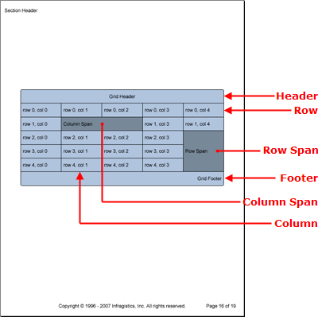

<!--
|metadata|
{
    "fileName": "documentengine-grids",
    "controlName": "Infragistics Document Library",
    "tags": ["Layouts","Reporting"]
}
|metadata|
-->

# Grids

The Grid element displays content in a layout of columns and rows. Each cell in a grid is bound to a layout that is determined by how many columns and rows you add. For example, a cell's width is determined by the column's width, and its height is determined by the row's height.



Each cell also has a [`ColSpan`](Infragistics.Web.Mvc.Documents.Reports~Infragistics.Documents.Reports.Report.Grid.IGridCell~ColSpan.html "Link to the Web API Reference Guide to the ColSpan member.") and [`RowSpan`](Infragistics.Web.Mvc.Documents.Reports~Infragistics.Documents.Reports.Report.Grid.IGridCell~RowSpan.html "Link to the Web API Reference Guide to the RowSpan member.") property, allowing the cell to span as many columns and rows as needed. Therefore, if you needed a heading for your grid, you would need to add the first cell in the row and set its ColSpan property to as many columns as are in your grid.

The Grid element also contains Header, Footer, and Divider elements. These elements consist of only one row and the number of columns you add to your grid using the [`AddColumn`](Infragistics.Web.Mvc.Documents.Reports~Infragistics.Documents.Reports.Report.Grid.IGrid~AddColumn.html "Link to the Web API Reference Guide to the AddColumn member.") method off the IGrid interface. These elements also behave in the same manner as the Header, Footer, and Divider elements of the Band element. Headers display at the top of the grid on every page or only the first page, depending on the [`Repeat`](Infragistics.Web.Mvc.Documents.Reports~Infragistics.Documents.Reports.Report.Grid.IGridHeader~Repeat.html "Link to the Web API Reference Guide to the Repeat member.") property; the same goes for footers, but applying to the last page. Dividers display at the end of every page where the grid spills over to the next page.

Being a member of the [pattern content](DocumentEngine-Pattern-Content.html "Explains the pattern content available in the document engine.") family, you can modify the style of different grid elements by applying patterns at different levels of the grid:

*   **Grid Pattern**&nbsp;-- Styles the grid as a whole and provides access to all other patterns except the cell pattern (the [GridPattern](Infragistics.Web.Mvc.Documents.Reports~Infragistics.Documents.Reports.Report.Grid.GridPattern.html "Link to the Web API Reference Guide to the GridPattern member.") class applies styles to the [IGrid](Infragistics.Web.Mvc.Documents.Reports~Infragistics.Documents.Reports.Report.Grid.IGrid.html "Link to the Web API Reference Guide to the IGrid interface.") interface).
*   **Header Pattern**&nbsp;-- Styles the header element of your grid (the [GridHeaderPattern](Infragistics.Web.Mvc.Documents.Reports~Infragistics.Documents.Reports.Report.Grid.GridHeaderPattern.html "Link to the Web API Reference Guide to the GridHeaderPattern member.") class applies styles to the [IGridHeader](Infragistics.Web.Mvc.Documents.Reports~Infragistics.Documents.Reports.Report.Grid.IGridHeader.html "Link to the Web API Reference Guide to the IGridHeader interface.") interface).
*   **Divider Pattern**&nbsp;-- Styles the divider element of your grid (the [GridDividerPattern](Infragistics.Web.Mvc.Documents.Reports~Infragistics.Documents.Reports.Report.Grid.GridDividerPattern.html "Link to the Web API Reference Guide to the GridDividerPattern member.") class applies styles to the&nbsp; [IGridDivider](Infragistics.Web.Mvc.Documents.Reports~Infragistics.Documents.Reports.Report.Grid.IGridDivider.html "Link to the Web API Reference Guide to the IGridDivider interface.") interface).
*   **Footer Pattern**&nbsp;-- Styles the footer element of your grid (the [GridFooterPattern](Infragistics.Web.Mvc.Documents.Reports~Infragistics.Documents.Reports.Report.Grid.GridFooterPattern.html "Link to the Web API Reference Guide to the GridFooterPattern member.") class applies styles to the&nbsp; [IGridFooter](Infragistics.Web.Mvc.Documents.Reports~Infragistics.Documents.Reports.Report.Grid.IGridFooter.html "Link to the Web API Reference Guide to the IGridFooter interface.") interface).
*   **Column Pattern**&nbsp;-- Styles each column in your grid (the [GridColumnPattern](Infragistics.Web.Mvc.Documents.Reports~Infragistics.Documents.Reports.Report.Grid.GridColumnPattern.html "Link to the Web API Reference Guide to the GridColumnPattern member.") class applies styles to the&nbsp; [IGridColumn](Infragistics.Web.Mvc.Documents.Reports~Infragistics.Documents.Reports.Report.Grid.IGridColumn.html "Link to the Web API Reference Guide to the IGridColumn interface.") interface).
*   **Row Pattern**&nbsp;-- Styles each row in your grid (the [GridRowPattern](Infragistics.Web.Mvc.Documents.Reports~Infragistics.Documents.Reports.Report.Grid.GridRowPattern.html "Link to the Web API Reference Guide to the GridRowPattern member.") class applies styles to the [IGridRow](Infragistics.Web.Mvc.Documents.Reports~Infragistics.Documents.Reports.Report.Grid.IGridRow.html "Link to the Web API Reference Guide to the IGridRow interface.") interface).
*   **Cell Pattern**&nbsp;-- Styles each individual cell for granular detail (the [GridCellPattern](Infragistics.Web.Mvc.Documents.Reports~Infragistics.Documents.Reports.Report.Grid.GridCellPattern.html "Link to the Web API Reference Guide to the GridCellPattern member.") class applies styles to the&nbsp; [IGridCell](Infragistics.Web.Mvc.Documents.Reports~Infragistics.Documents.Reports.Report.Grid.IGridCell.html "Link to the Web API Reference Guide to the IGridCell interface.") interface).

****

The following code creates a grid that consists of five columns by five rows with a header and footer. Once the cell-creation loop encounters cell 2 x 2, it will span that cell by two columns; when the loop encounters cell 5 x 3, it will span that cell by three rows.

1.  **Create a pattern for the grid as a whole and then for each cell.**

    **In Visual Basic:**

    ```vb
    Imports Infragistics.Documents.Reports.Report
    .
    .
    .
    ' Create a new pattern for the grid as a whole.
    Dim gridPattern As New Infragistics.Documents.Reports.Report.Grid.GridPattern()
    gridPattern.Borders = New Borders(New Pen(New Color(0, 0, 0)), 5)
    gridPattern.Background = New Background(Brushes.LightSteelBlue)

    ' Create a new pattern for each cell.
    Dim cellPattern As New Infragistics.Documents.Reports.Report.Grid.GridCellPattern()
    cellPattern.Paddings = New Paddings(5, 10)
    cellPattern.Borders = New Borders(New Pen(New Color(0, 0, 0)))
    'cellPattern.Background = new Background(brush3);
    cellPattern.Alignment = _
      New ContentAlignment(Alignment.Center, Alignment.Middle)
    ```

    **In C#:**

    ```csharp
    using Infragistics.Documents.Reports.Report;
    .
    .
    .
    // Create a new pattern for the grid as a whole.
    Infragistics.Documents.Reports.Report.Grid.GridPattern gridPattern = 
      new GridPattern();
    gridPattern.Borders = new Borders(new Pen(new Color(0, 0, 0)), 5);

    // Create a new pattern for each cell.
    Infragistics.Documents.Reports.Report.Grid.GridCellPattern cellPattern = new GridCellPattern();
    cellPattern.Paddings = new Paddings(5, 10);
    cellPattern.Borders = new Borders(new Pen(new Color(0, 0, 0)));
    cellPattern.Background = new Background(Brushes.LightSteelBlue);
    cellPattern.Alignment = 
      new ContentAlignment(Alignment.Center, Alignment.Middle);
    ```

2.  **Create the grid and apply the grid pattern.**

    **In Visual Basic:**

    ```vb
    ' Create the grid and apply the GridPattern
    Dim grid As Infragistics.Documents.Reports.Report.Grid.IGrid = section1.AddGrid()
    grid.ApplyPattern(gridPattern)

    ' Declare a Row, and Cell object 
    ' for object creation.
    Dim gridRow As Infragistics.Documents.Reports.Report.Grid.IGridRow
    Dim gridCell As Infragistics.Documents.Reports.Report.Grid.IGridCell
    ```

    **In C#:**

    ```csharp
    // Create the grid and apply the GridPattern
    Infragistics.Documents.Reports.Report.Grid.IGrid grid = section1.AddGrid();
    grid.ApplyPattern(gridPattern);

    // Declare a Row, and Cell object 
    // for object creation.
    Infragistics.Documents.Reports.Report.Grid.IGridRow gridRow;
    Infragistics.Documents.Reports.Report.Grid.IGridCell gridCell;
    ```

3.  **Define the columns.**

    **In Visual Basic:**

    ```vb
    ' Add five columns to the grid.
    For i As Integer = 0 To 4
            grid.AddColumn()
    Next i
    ```

    **In C#:**

    ```csharp
    // Add five columns to the grid.
    for (int i = 0; i < 5; i++)
    {
            grid.AddColumn();
    }
    ```

4.  **Add the header and footer.**

    **In Visual Basic:**

    ```vb
    ' Add a header to the grid.
    Dim gridHeader As Infragistics.Documents.Reports.Report.Grid.IGridHeader = grid.Header
    Dim headerCell As Infragistics.Documents.Reports.Report.Grid.IGridCell = _
      gridHeader.AddCell()
    headerCell.ColSpan = 5
    cellPattern.Apply(headerCell)
    Dim headerCellText As IText = headerCell.AddText()
    headerCellText.Alignment = _
      New TextAlignment(Alignment.Center, Alignment.Middle)
    headerCellText.AddContent("Grid Header")

    ' Add a footer to the grid.
    Dim gridFooter As Infragistics.Documents.Reports.Report.Grid.IGridFooter = grid.Footer
    Dim footerCell As Infragistics.Documents.Reports.Report.Grid.IGridCell = _
      gridFooter.AddCell()
    footerCell.ColSpan = 5
    cellPattern.Apply(footerCell)
    Dim gridFooterText As Infragistics.Documents.Reports.Report.Text.IText = _
      footerCell.AddText()
    gridFooterText.Alignment = _
      New TextAlignment(Alignment.Right, Alignment.Middle)
    gridFooterText.AddContent("Grid Footer")
    ```

    **In C#:**

    ```csharp
    // Add a header to the grid.
    Infragistics.Documents.Reports.Report.Grid.IGridHeader gridHeader = grid.Header;
    Infragistics.Documents.Reports.Report.Grid.IGridCell headerCell = 
      gridHeader.AddCell();
    headerCell.ColSpan = 5;
    cellPattern.Apply(headerCell);
    Infragistics.Documents.Reports.Report.Text.IText headerCellText = headerCell.AddText();
    headerCellText.Alignment = 
      new TextAlignment(Alignment.Center, Alignment.Middle);
    headerCellText.AddContent("Grid Header");

    // Add a footer to the grid.
    Infragistics.Documents.Reports.Report.Grid.IGridFooter gridFooter = grid.Footer;
    Infragistics.Documents.Reports.Report.Grid.IGridCell footerCell = 
      gridFooter.AddCell();
    footerCell.ColSpan = 5;
    cellPattern.Apply(footerCell);
    Infragistics.Documents.Reports.Report.Text.IText gridFooterText = 
      footerCell.AddText();
    gridFooterText.Alignment = 
      new TextAlignment(Alignment.Right, Alignment.Middle);
    gridFooterText.AddContent("Grid Footer");
    ```

5.  **Add five rows and five cells to each row.**

    **In Visual Basic:**

    ```vb
    For i As Integer = 0 To 4
            gridRow = grid.AddRow()

            ' Add five cells to each row.
            For j As Integer = 0 To 4

                    If i = 1 AndAlso j = 1 Then
                            gridCell = gridRow.AddCell()
                            cellPattern.Apply(gridCell)
                            gridCell.Background = _
                              New Background(Brushes.LightSlateGray)
                            gridCell.AddQuickText("Column Span")

                            gridCell.ColSpan = 2

                            j += 1
                    ElseIf i = 2 AndAlso j = 4 Then
                            gridCell = gridRow.AddCell()
                            cellPattern.Apply(gridCell)
                            gridCell.Background = _
                              New Background(Brushes.LightSlateGray)
                            gridCell.AddQuickText("Row Span")

                            gridCell.RowSpan = 3
                    Else
                            gridCell = gridRow.AddCell()
                            cellPattern.Apply(gridCell)
                            gridCell.AddQuickText( _
                              ("row " + i.ToString() + ", col " + j.ToString()))
                    End If
            Next j
    Next i
    ```

    **In C#:**

    ```csharp
    // Add five rows to the grid.
    for (int i = 0; i < 5; i++)
    {
            gridRow = grid.AddRow();

            // Add five cells to each row.
            for (int j = 0; j < 5; j++)
            {

                    if (i == 1 && j == 1)
                    {
                            gridCell = gridRow.AddCell();
                            cellPattern.Apply(gridCell);
                            gridCell.Background = 
                              new Background(Brushes.LightSlateGray);
                            gridCell.AddQuickText("Column Span");

                            gridCell.ColSpan = 2;

                            j++;
                    }
                    else if (i == 2 && j == 4)
                    {
                            gridCell = gridRow.AddCell();
                            cellPattern.Apply(gridCell);
                            gridCell.Background = 
                              new Background(Brushes.LightSlateGray);
                            gridCell.AddQuickText("Row Span");

                            gridCell.RowSpan = 3;
                    }
                    else
                    {
                            gridCell = gridRow.AddCell();
                            cellPattern.Apply(gridCell);
                            gridCell.AddQuickText( 
                              "row " + i + ", col " + j);
                    }
            }
    }
    ```
