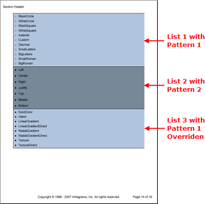

<!--
|metadata|
{
    "fileName": "documentengine-lists",
    "controlName": "Infragistics Document Library",
    "tags": ["Layouts","Reporting"]
}
|metadata|
-->

# Lists

The List element is extremely useful when presenting a group of items either in numbered or bulleted format. Lists can be as simple or complex as you need them to be, depending on your report's flow. Your list can be a simple list of textual items, or it can be a complex array of separate layout elements ranging from Bands to Images to Quick Text.

An interesting feature of the List element is its ability to apply patterns to lists. These patterns then apply style modifications to the list. You can apply several patterns to a single list. You can also override a pattern by setting a specific style property after you have applied the pattern.

You can create a list by calling the AddList method off most layout elements. Once you've created a List, you can add items to the list by calling the AddItem method off the IList interface. You can then add most layout items to each individual list item through their respective Add methods, including another List element

The following code is divided into four steps. The first step creates two list patterns that modify specific styles in a list. The second step creates a list and applies the first pattern. The third step creates another list and applies the second pattern. The final step demonstrates how you can override a pattern by setting a style property that has already been set by a list pattern. When you publish a report with code similar to the following, you will see a page that resembles the screen shot.



1.  **Create two list patterns.**

    **In C#:**

    ```csharp
    using Infragistics.Documents.Reports.Report;
    .
    .
    .
    // Create a list pattern. A list pattern is basically a style
    // that you want to apply to a specific list.
    Infragistics.Documents.Reports.Report.List.ListPattern listPattern1 = new ListPattern();
    listPattern1.Background = new Background(Brushes.LightSteelBlue);
    listPattern1.Bullets = 
      new Infragistics.Documents.Reports.Report.List.Bullets(BulletType.WhiteCircle);
    listPattern1.Borders = new Borders(new Pen(new Color(0, 0, 0)));
    listPattern1.Paddings = new Paddings(5);

    // Create a second list pattern.
    Infragistics.Documents.Reports.Report.List.ListPattern listPattern2 = new ListPattern();
    listPattern2.Background = new Background(Brushes.LightSlateGray);
    listPattern2.Bullets = 
      new Infragistics.Documents.Reports.Report.List.Bullets(BulletType.BlackCircle);
    listPattern2.Borders = new Borders(new Pen(new Color(0, 0, 0)));
    listPattern2.Paddings = new Paddings(5);
    listPattern2.Interval = 10;
    ```

2.  **Create a list and apply the first pattern.**

    **In C#:**

    ```csharp
    // Create a list and apply the first pattern to it.
    Infragistics.Documents.Reports.Report.List.IList sectionList1 = section1.AddList();
    sectionList1.ApplyPattern(listPattern1);

    // Create a list item.
    Infragistics.Documents.Reports.Report.List.IListItem sectionListItem1;

    // For each name in the BulletType enum, add a new list item.
    foreach (string s in Enum.GetNames(typeof(BulletType)))
    {
            sectionListItem1 = sectionList1.AddItem();
            sectionListItem1.AddQuickText(s);
    }
    ```

3.  **Create another list and apply the second pattern.**

    **In C#:**

    ```csharp
    Infragistics.Documents.Reports.Report.List.IList sectionList2 = section1.AddList();
    listPattern2.Apply(sectionList2);

    Infragistics.Documents.Reports.Report.List.IListItem sectionListItem2;

    foreach (string s in Enum.GetNames(typeof(Alignment)))
    {
            sectionListItem2 = sectionList2.AddItem();
            sectionListItem2.AddQuickText(s);
    }
    ```

4.  **Create a third list and apply the first pattern to it.**

    Once you apply the pattern, set the **Bullets** property to a new Bullets object; this will override the setting in the pattern. A pattern is simply a collection of style property changes, so if you apply the pattern again after modifying an individual property, the pattern could possibly override your individual style modifications.

    **In C#:**

    ```csharp
    Infragistics.Documents.Reports.Report.List.IList sectionList3 = section1.AddList();
    listPattern1.Apply(sectionList3);
    // Override the Pattern's style for the Bullet property.
    sectionList3.Bullets = 
      new Infragistics.Documents.Reports.Report.List.Bullets(BulletType.BlackCircle);

    Infragistics.Documents.Reports.Report.List.IListItem sectionListItem3;

    foreach (string s in Enum.GetNames(typeof(BrushType)))
    {
            sectionListItem3 = sectionList3.AddItem();
            sectionListItem3.AddQuickText(s);
    }
    ```