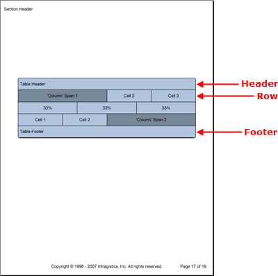

<!--
|metadata|
{
    "fileName": "documentengine-tables",
    "controlName": "Infragistics Document Library",
    "tags": ["Layouts","Reporting"]
}
|metadata|
-->

# Tables

                

The Table element is a grid-type element that allows you to construct a grid that relies on rows and cells rather than rows and columns, such as the Grid element. The Table element doesn't have specific columns that determine the width of cells like the Grid element.

The Table element allows you to customize the width of every cell if needed, giving you absolute control of how your data is presented. The two drawbacks to this grid design have to do with column and row spanning. You have to "fake" a column span by doubling the width of a particular cell, and you cannot span rows.

Being a member of the [pattern content](DocumentEngine-Pattern-Content.html "Explains the pattern content available in the document engine.") family, you can modify the style of different Table elements by applying patterns at different levels of the table:

*   **Table Pattern**&nbsp;-- Styles the table as a whole and provides access to all other patterns except the cell pattern (the [TablePattern](Infragistics.Web.Mvc.Documents.Reports~Infragistics.Documents.Reports.Report.Table.TablePattern.html "Link to the Web API Reference Guide to the TablePattern member.") &nbsp;class applies styles to the [ITable](Infragistics.Web.Mvc.Documents.Reports~Infragistics.Documents.Reports.Report.Table.ITable.html "Link to the Web API Reference Guide to the ITable interface.") interface).
*   **Header Pattern**&nbsp;-- Styles the header element of your table (the [TableHeaderPattern](Infragistics.Web.Mvc.Documents.Reports~Infragistics.Documents.Reports.Report.Table.TableHeaderPattern.html "Link to the Web API Reference Guide to the TableHeaderPattern member.") class applies styles to the&nbsp; [ITableHeader](Infragistics.Web.Mvc.Documents.Reports~Infragistics.Documents.Reports.Report.Table.ITableHeader.html "Link to the Web API Reference Guide to the ITableHeader interface.") interface).
*   **Divider Pattern**&nbsp;-- Styles the divider element of your table (the [TableDividerPattern](Infragistics.Web.Mvc.Documents.Reports~Infragistics.Documents.Reports.Report.Table.TableDividerPattern.html "Link to the Web API Reference Guide to the TableDividerPattern member.") class applies styles to the&nbsp; [ITableDivider](Infragistics.Web.Mvc.Documents.Reports~Infragistics.Documents.Reports.Report.Table.ITableDivider.html "Link to the Web API Reference Guide to the ITableDivider interface.") interface).
*   **Footer Pattern**&nbsp;-- Styles the footer element of your table (the [TableFooterPattern](Infragistics.Web.Mvc.Documents.Reports~Infragistics.Documents.Reports.Report.Table.TableFooterPattern.html "Link to the Web API Reference Guide to the TableFooterPattern member.") class applies styles to the [ITableFooter](Infragistics.Web.Mvc.Documents.Reports~Infragistics.Documents.Reports.Report.Table.ITableFooter.html "Link to the Web API Reference Guide to the ITableFooter interface.") interface).
*   **Row Pattern**&nbsp;-- Styles each row in your table (the [TableRowPattern](Infragistics.Web.Mvc.Documents.Reports~Infragistics.Documents.Reports.Report.Table.TableRowPattern.html "Link to the Web API Reference Guide to the TableRowPattern member.") class applies styles to the&nbsp; [ITableRow](Infragistics.Web.Mvc.Documents.Reports~Infragistics.Documents.Reports.Report.Table.ITableRow.html "Link to the Web API Reference Guide to the ITableRow interface.") interface).
*   **Cell Pattern**&nbsp;-- Styles each individual cell for granular detail (the[TableCellPattern](Infragistics.Web.Mvc.Documents.Reports~Infragistics.Documents.Reports.Report.Table.TableCellPattern.html "Link to the Web API Reference Guide to the TableCellPattern member.") class applies styles to the [ITableCell](Infragistics.Web.Mvc.Documents.Reports~Infragistics.Documents.Reports.Report.Table.ITableCell.html "Link to the Web API Reference Guide to the ITableCell interface.") interface).

The Table element also contains Header, Footer, and Divider elements. These elements consist of only one row. These elements also behave in the same manner as the Header, Footer, and Divider elements of the Band element. Headers display at the top of the table on every page or only the first page, depending on the [Repeat](Infragistics.Web.Mvc.Documents.Reports~Infragistics.Documents.Reports.Report.Table.ITableHeader~Repeat.html "Link to the Web API Reference Guide to the Repeat member.") property; the same goes for footers, but applying to the last page. Dividers display at the end of every page where the table spills over to the next page.



The following code creates a table with three rows, including a header and footer. The first and third rows simulate a column span by manipulating the width of specific cells to be twice the width of the standard cell width. The middle row demonstrates the Table element’s ability to create completely custom rows by modifying the cell width to each be one-third the width of the table.

1.  **Create the table and cell patterns.**

    **In C#:**

    ```csharp
    using Infragistics.Documents.Reports.Report;
    .
    .
    .
    // Create a new pattern for the table as a whole.
    Infragistics.Documents.Reports.Report.Table.TablePattern tablePattern = 
      new Infragistics.Documents.Reports.Report.Table.TablePattern();
    tablePattern.Background = new Background(Brushes.LightSteelBlue);
    tablePattern.Borders = new Borders(new Pen(new Color(0, 0, 0)), 5);

    // Create a new pattern for the cells.
    Infragistics.Documents.Reports.Report.Table.CellPattern tableCellPattern = 
      new Infragistics.Documents.Reports.Report.Table.TableCellPattern();
    tableCellPattern.Borders = new Borders(new Pen(new Color(0, 0, 0)));
    tableCellPattern.Background = new Background(Brushes.LightSteelBlue);
    tableCellPattern.Paddings = new Paddings(5, 10);
    ```

2.  **Create the table and apply the table pattern.**

    **In C#:**

    ```csharp
    // Create the table and apply the table pattern.
    Infragistics.Documents.Reports.Report.Table.ITable table = section1.AddTable();
    table.Width = new RelativeWidth(100);
    table.ApplyPattern(tablePattern);
    ```

3.  **Create the header and footer.**

    **In C#:**

    ```csharp
    // Create the table header.
    Infragistics.Documents.Reports.Report.Table.ITableHeader tableHeader = 
      table.Header;
    Infragistics.Documents.Reports.Report.Table.ITableCell tableHeaderCell = 
      tableHeader.AddCell();
    tableCellPattern.Apply(tableHeaderCell);
    tableHeaderCell.AddQuickText("Table Header");

    // Create the table footer.
    Infragistics.Documents.Reports.Report.Table.ITableFooter tableFooter = 
      table.Footer;
    Infragistics.Documents.Reports.Report.Table.ITableCell tableFooterCell = 
      tableFooter.AddCell();
    tableCellPattern.Apply(tableFooterCell);
    tableFooterCell.AddQuickText("Table Footer");
    ```

4.  **Create the first row.**

    **In C#:**

    ```csharp
    Infragistics.Documents.Reports.Report.Table.ITableRow tableRow;
    Infragistics.Documents.Reports.Report.Table.ITableCell tableCell;
    tableRow = table.AddRow();

    tableCell = tableRow.AddCell();
    tableCell.Width = new RelativeWidth(100);
    tableCellPattern.Apply(tableCell);
    tableCell.Background = new Background(Brushes.LightSlateGray);
    IText tableCellText = tableCell.AddText();
    tableCellText.Alignment = 
      new TextAlignment(Alignment.Center, Alignment.Middle);
    tableCellText.AddContent("'Column' Span 1");

    tableCell = tableRow.AddCell();
    tableCell.Width = new RelativeWidth(50);
    tableCellPattern.Apply(tableCell);
    tableCellText = tableCell.AddText();
    tableCellText.Alignment = 
      new TextAlignment(Alignment.Center, Alignment.Middle);
    tableCellText.AddContent("Cell 2");

    tableCell = tableRow.AddCell();
    tableCell.Width = new RelativeWidth(50);
    tableCellPattern.Apply(tableCell);
    tableCellText = tableCell.AddText();
    tableCellText.Alignment = 
      new TextAlignment(Alignment.Center, Alignment.Middle);
    tableCellText.AddContent("Cell 3");
    ```

5.  **Create the second row.**

    **In C#:**

    ```csharp
    tableRow = table.AddRow();

    tableCell = tableRow.AddCell();
    tableCell.Width = new RelativeWidth(33);
    tableCellPattern.Apply(tableCell);
    tableCellText = tableCell.AddText();
    tableCellText.Alignment = 
      new TextAlignment(Alignment.Center, Alignment.Middle);
    tableCellText.AddContent("33%");

    tableCell = tableRow.AddCell();
    tableCell.Width = new RelativeWidth(33);
    tableCellPattern.Apply(tableCell);
    tableCellText = tableCell.AddText();
    tableCellText.Alignment = 
      new TextAlignment(Alignment.Center, Alignment.Middle);
    tableCellText.AddContent("33%");

    tableCell = tableRow.AddCell();
    tableCell.Width = new RelativeWidth(33);
    tableCellPattern.Apply(tableCell);
    tableCellText = tableCell.AddText();
    tableCellText.Alignment = 
      new TextAlignment(Alignment.Center, Alignment.Middle);
    tableCellText.AddContent("33%");
    ```

6.  **Create the third row.**

    **In C#:**

    ```csharp
    tableRow = table.AddRow();

    tableCell = tableRow.AddCell();
    tableCell.Width = new RelativeWidth(50);
    ableCellPattern.Apply(tableCell);
    tableCellText = tableCell.AddText();
    tableCellText.Alignment = 
      new TextAlignment(Alignment.Center, Alignment.Middle);
    tableCellText.AddContent("Cell 1");

    tableCell = tableRow.AddCell();
    tableCell.Width = new RelativeWidth(50);
    tableCellPattern.Apply(tableCell);
    tableCellText = tableCell.AddText();
    tableCellText.Alignment = 
      new TextAlignment(Alignment.Center, Alignment.Middle);
    tableCellText.AddContent("Cell 2");

    tableCell = tableRow.AddCell();
    tableCell.Width = new RelativeWidth(100);
    tableCellPattern.Apply(tableCell);
    tableCell.Background = new Background(Brushes.LightSlateGray);
    tableCellText = tableCell.AddText();
    tableCellText.Alignment = 
      new TextAlignment(Alignment.Center, Alignment.Middle);
    tableCellText.AddContent("'Column' Span 2");
    ```