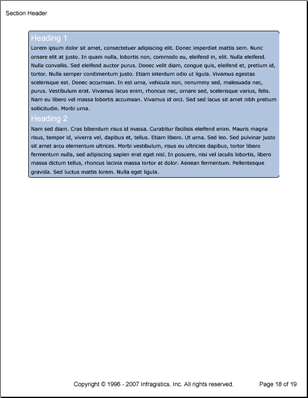

<!--
|metadata|
{
    "fileName": "documentengine-text",
    "controlName": "Infragistics Document Library",
    "tags": ["Reporting"]
}
|metadata|
-->

# Text
                

The Text element adds highly customized paragraph content to your reports. The Text element includes several text-specific properties that will make your content stand out no matter what the occasion. Several of these properties can be found in the [report graphics](DocumentEngine-Report-Graphics.html "Explains the graphic items available for reports created using document engine.") section, but there are a few properties that are specific to text:

*   **First Letter**&nbsp;-- Determines whether the first letter in the paragraph is a drop cap.
*   **Heading**&nbsp;-- Offers several different styles of headings for text.
*   **Indents**&nbsp;-- Determines the values of text indentations.
*   **Interval**&nbsp;-- Allows you to add extra space in between each line of text.
*   **Line Numbering**&nbsp;-- Allows you to number each line of text to help your reader locate a specific sentence.
*   **Style**&nbsp;-- Helps you repeatedly set the same font and color for different text elements.

The Text element also exposes several methods that help you insert all kinds of textual content. A few of these methods are listed below:

*   **AddContent**&nbsp;-- The most commonly used method with numerous overloads. You can simply enter a string in one overload, or apply a style element in another; there are several possible combinations to suit your needs.
*   **AddDateTime**&nbsp;-- Allows you to add the current date and time in several standard formats.
*   **AddLeader**&nbsp;-- Allows you to add leader lines to your text.
*   **AddLineBreak**&nbsp;-- Adds a line break so your content isn't bunched up on continued lines.
*   **AddPageNumber**&nbsp;-- Adds the page number of the current page in decimal, letters, or roman numerals.
*   **AddRichContent**&nbsp;-- Adds limited rich content with tags similar to HTML.



The following code will create a single Text element. A pattern is applied to the entire Text element, and two styles are applied to individual content elements.

1.  **Create the styles.**

    **In C#:**

    ```csharp
    using Infragistics.Documents.Reports.Report;
    using Infragistics.Documents.Reports.Report.Text;
    using Infragistics.Documents.Reports.Graphics;
    .
    .
    .
    Style style1 = new Style(new Font("Arial", 16), Brushes.White);
    Style style2 = new Style(new Font("Verdana", 10), Brushes.Black);
    ```

2.  **Create the text pattern.**

    **In C#:**

    ```csharp
    TextPattern textPattern = new TextPattern();
    textPattern.Margins = new Margins(5, 10);
    textPattern.Paddings = new Paddings(5);
    textPattern.Interval = 5;
    textPattern.Borders = new Borders(new Pen(new Color(0, 0, 0)), 5);
    textPattern.Background = new Background(Brushes.LightSteelBlue);
    ```

3.  **Create the Text element and add content to it.**

Use the following text to set the `string1` variable:

> Lorem ipsum dolor sit amet, consectetuer adipiscing elit. Donec imperdiet mattis sem. Nunc ornare elit at justo. In quam nulla, lobortis non, commodo eu, eleifend in, elit. Nulla eleifend. Nulla convallis. Sed eleifend auctor purus. Donec velit diam, congue quis, eleifend et, pretium id, tortor. Nulla semper condimentum justo. Etiam interdum odio ut ligula. Vivamus egestas scelerisque est. Donec accumsan. In est urna, vehicula non, nonummy sed, malesuada nec, purus. Vestibulum erat. Vivamus lacus enim, rhoncus nec, ornare sed, scelerisque varius, felis. Nam eu libero vel massa lobortis accumsan. Vivamus id orci. Sed sed lacus sit amet nibh pretium sollicitudin. Morbi urna.

    **In C#:**

    ```csharp
    IText sectionText = section1.AddText();
    sectionText.ApplyPattern(textPattern);

    string string1 = "Lorem ipsum...";

    sectionText.AddContent("Heading 1", style1);
    sectionText.AddLineBreak();
    sectionText.AddContent(string1, style2);
    sectionText.AddLineBreak();
    sectionText.AddContent("Heading 2", style1);
    sectionText.AddLineBreak();
    sectionText.AddContent(string1, style2);
    ```