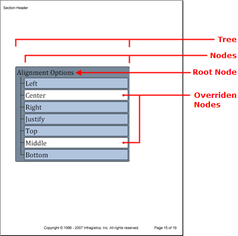

<!--
|metadata|
{
    "fileName": "documentengine-trees",
    "controlName": "Infragistics Document Library",
    "tags": ["Layouts","Reporting"]
}
|metadata|
-->

# Trees
The Tree element is useful for displaying hierarchical relationships by showing how parent nodes, especially the root node, own their child nodes and all nodes beneath them in the hierarchy. The Tree element's object model consists of a main tree object with a [Root](Infragistics.Web.Mvc.Documents.Reports~Infragistics.Documents.Reports.Report.Tree.ITree~Root.html "Link to the Web API Reference Guide to the Root member.") property to identify the root node of the tree. Once you've gotten a reference to the root node (which is of type [INode](Infragistics.Web.Mvc.Documents.Reports~Infragistics.Documents.Reports.Report.Tree.INode.html "Link to the Web API Reference Guide to the INode interface.") ), you can call the [AddNode](Infragistics.Web.Mvc.Documents.Reports~Infragistics.Documents.Reports.Report.Tree.INode~AddNode.html "Link to the Web API Reference Guide to the AddNode member.") method off the INode interface to add additional nodes to the tree. You can add as many or as few nodes as you like, but there will only be one root node.

As with all [pattern content](DocumentEngine-Pattern-Content.html "Explains the pattern content items available in the document engine."), you can implement style changes by adding patterns to the following tree elements:

*   the tree as a whole (the [TreePattern](Infragistics.Web.Mvc.Documents.Reports~Infragistics.Documents.Reports.Report.Tree.TreePattern.html "Link to the Web API Reference Guide to the TreePattern member.") class applies a style to the [ITree](Infragistics.Web.Mvc.Documents.Reports~Infragistics.Documents.Reports.Report.Tree.ITree.html "Link to the Web API Reference Guide to the ITree interface.") interface)
*   the tree nodes, not their content (the [TreeNodePattern](Infragistics.Web.Mvc.Documents.Reports~Infragistics.Documents.Reports.Report.Tree.TreeNodePattern.html "Link to the Web API Reference Guide to the TreeNodePattern member.") class applies a style to the [INode](Infragistics.Web.Mvc.Documents.Reports~Infragistics.Documents.Reports.Report.Tree.INode.html "Link to the Web API Reference Guide to the INode interface.") interface)
*   the caption of the tree nodes (the [TreeCaptionPattern](Infragistics.Web.Mvc.Documents.Reports~Infragistics.Documents.Reports.Report.Tree.TreeCaptionPattern.html "Link to the Web API Reference Guide to the TreeCaptionPattern member.") class applies a style to the [ICaption](Infragistics.Web.Mvc.Documents.Reports~Infragistics.Documents.Reports.Report.Tree.ICaption.html "Link to the Web API Reference Guide to the ICaption interface.") interface)

As you can see from the list above, each pattern applies to a more granular level of the tree; and if that’s not enough, you can override each pattern by setting specific properties on each node.



The following code creates a tree with one root node and seven child nodes. You will first create patterns for the tree, nodes, and captions, create the tree, and then add the nodes.

1.  **Create patterns for the tree, nodes, and captions.**

    **In C#:**

    ```csharp
    using Infragistics.Documents.Reports.Report;
    .
    .
    .
    // Create a new pattern for the tree as a whole.
    Infragistics.Documents.Reports.Report.Tree.TreePattern treePattern = new TreePattern();
    treePattern.Background = new Background(Brushes.LightSlateGray);
    treePattern.Paddings = new Paddings(5);
    treePattern.Borders = new Borders(new Pen(new Color(0, 0, 0)), 5);

    // Create a new pattern for tree nodes.
    Infragistics.Documents.Reports.Report.Tree.TreeNodePattern treeNodePattern = 
      new TreeNodePattern();
    treeNodePattern.Lines = new Lines(new Pen(new Color(0, 0, 0)));
    treeNodePattern.Interval = 5;
    treeNodePattern.Indent = 25;

    // Create a new pattern for captions.
    Infragistics.Documents.Reports.Report.Tree.TreeCaptionPattern treeCaptionPattern = 
      new TreeCaptionPattern();
    treeCaptionPattern.Background = new Background(Brushes.LightSteelBlue);
    treeCaptionPattern.Borders = new Borders(new Pen(new Color(0, 0, 0)), 3);
    treeCaptionPattern.Paddings = new Paddings(3);
    ```

2.  **Create the tree, apply the tree pattern, and then add a caption for the root node.**

    **In C#:**

    ```csharp
    // Create the tree and get a reference to the
    // tree's root node.
    Infragistics.Documents.Reports.Report.Tree.ITree tree = section1.AddTree();
    tree.ApplyPattern(treePattern);
    tree.Width = new RelativeWidth(75);
                            
    Infragistics.Documents.Reports.Report.Tree.INode rootNode = tree.Root;
    treeNodePattern.Apply(rootNode);

    Infragistics.Documents.Reports.Report.QuickText.IQuickText nodeText;
                            
    // Add a caption to the root node.
    Infragistics.Documents.Reports.Report.Tree.ICaption rootCaption = rootNode.Caption;
    nodeText = rootCaption.AddQuickText("Alignment Options");
    nodeText.Font = new Infragistics.Documents.Reports.Graphics.Font("Verdana", 24);
    ```

3.  **Create the child nodes.**

    The following code loops through the [Alignment](Infragistics.Web.Mvc.Documents.Reports~Infragistics.Documents.Reports.Report.Alignment.html "Link to the Win API Reference Guide to the Alignment member.") [Alignment](Infragistics.Web.Mvc.Documents.Reports~Infragistics.Documents.Reports.Report.Alignment.html "Link to the Web API Reference Guide to the Alignment member.") [Alignment](Infragistics.Web.Mvc.Documents.Reports~Infragistics.Documents.Reports.Report.Alignment.html "Link to the Win API Reference Guide to the Alignment member.") [Alignment](Infragistics.Web.Mvc.Documents.Reports~Infragistics.Documents.Reports.Report.Alignment.html "Link to the Web API Reference Guide to the Alignment member.") enumeration and retrieves the strings to populate the tree nodes. When the loop encounters the strings "Center" or "Middle", it will override the pattern for those nodes and change the background color to white.

    **In C#:**

    ```csharp
    INode childNode;
    ICaption childNodeCaption;

    foreach (string s in Enum.GetNames(typeof(Alignment)))
    {
            if (s == "Center" || s == "Middle")
            {
                    childNode = rootNode.AddNode();
                    childNodeCaption = childNode.Caption;
                    treeCaptionPattern.Apply(childNodeCaption);
                                            
                    // Override the Background of the TreeCaptionPattern
                    childNodeCaption.Background = new Background(Brushes.White);
                                            
                    nodeText = childNodeCaption.AddQuickText(s);
                    nodeText.Font = 
                      new Infragistics.Documents.Reports.Graphics.Font("Verdana", 24);
            }
            else
            {
                    childNode = rootNode.AddNode();
                    childNodeCaption = childNode.Caption;
                    treeCaptionPattern.Apply(childNodeCaption);
                    nodeText = childNodeCaption.AddQuickText(s);
                    nodeText.Font = 
                      new Infragistics.Documents.Reports.Graphics.Font("Verdana", 24);
            }
    }
    ```