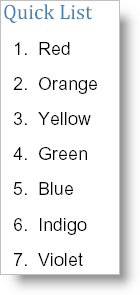

<!--
|metadata|
{
    "fileName": "documentengine-quick-list",
    "controlName": "Infragistics Document Library",
    "tags": ["Layouts","Reporting"]
}
|metadata|
-->

# Quick List

Using the Quick List element is the easiest way to add a simple bulleted or numbered list to your report. Quick List has only the essential features to maintain its light-weight presence. If you need a much more customizable list element, see [Lists](DocumentEngine-Lists.html). As with the other [quick content](DocumentEngine-Quick-Content.html) elements, you create a Quick List by calling the AddQuickList method of most layout elements. Unlike the Quick Image and Quick Text elements, there is one more step required to create the list; you need to add items. However, adding items to the list isn't difficult at all; call the [AddItem](Infragistics.Web.Mvc.Documents.Reports~Infragistics.Documents.Reports.Report.QuickList.IQuickList~AddItem.html) method off the [IQuickList](Infragistics.Web.Mvc.Documents.Reports~Infragistics.Documents.Reports.Report.QuickList.IQuickList.html) interface and supply it with a string. There are other options available to you such as the [Numbered](Infragistics.Web.Mvc.Documents.Reports~Infragistics.Documents.Reports.Report.QuickList.IQuickList~Numbered.html) property which identifies whether the list will be bulleted or numbered. Another useful property is the [Interval](Infragistics.Web.Mvc.Documents.Reports~Infragistics.Documents.Reports.Report.QuickList.IQuickList~Interval.html) property which sets the space in-between each item.

The following code creates a list of seven items. The list will be numbered and each item will have 10 pixels of space between them. This topic assumes that you have a Report element defined with at least one Section element added to it. See [Report](DocumentEngine-Report.html "Explains the report object that's available in the document engine.") and [Section](DocumentEngine-Section.html "Explains the section element available in the document engine.") for more information.



**In C#:**

```csharp
// Add a quick list
section1.AddQuickText("Quick List");
Infragistics.Documents.Reports.Report.QuickList.IQuickList quickList =   section1.AddQuickList();
quickList.Numbered = true;
quickList.Interval = 10;

// Add items to the list
quickList.AddItem("Red");
quickList.AddItem("Orange");
quickList.AddItem("Yellow");
quickList.AddItem("Green");
quickList.AddItem("Blue");
quickList.AddItem("Indigo");
quickList.AddItem("Violet");
```