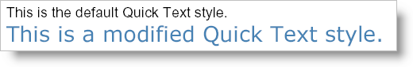

<!--
|metadata|
{
    "fileName": "documentengine-quick-text",
    "controlName": "Infragistics Document Library",
    "tags": ["Reporting"]
}
|metadata|
-->

# Quick Text


The Quick Text element is the simplest of the [Quick Content](DocumentEngine-Quick-Content.html "Explains the quick content that's available in the document engine.") elements in that you do not need to customize the element at all. The Quick Text element was designed in such a way that all you need to do is pass a string to the AddQuickText method to quickly add text to your report. Of course, you can also get a reference to the element and modify a few standard properties such as [Alignment](Infragistics.Web.Mvc.Documents.Reports~Infragistics.Documents.Reports.Report.QuickText.IQuickText~Alignment.html "Link to the Web API Reference Guide to the Alignment member.") , [Brush](Infragistics.Web.Mvc.Documents.Reports~Infragistics.Documents.Reports.Report.QuickText.IQuickText~Brush.html "Link to the Web API Reference Guide to the Brush member.") , and [Font](Infragistics.Web.Mvc.Documents.Reports~Infragistics.Documents.Reports.Report.QuickText.IQuickText~Font.html "Link to the Web API Reference Guide to the Font member.") ; but if you need a full-fledged Text element, see [Text](DocumentEngine-Text.html "Explains the Text element available in the document engine.") for more information. The basic use-case for the Quick Text element is to add default text (Arial, 12pt) with no regard to its placement or appearance.



* * * * *

Use the following code to first add a Quick Text element with default style, and then retrieve a reference to a new Quick Text element and modify its style by changing the color and font. This topic assumes that you have a Report element defined with at least one Section element added to it. See [Report](DocumentEngine-Report.html "Explains the report object in the document engine.") and [Section](DocumentEngine-Section.html "Explains the section element in the document engine.") for more information.

**In C#:**

```csharp
section1.AddQuickText("This is the default Quick Text style.");
                        
Infragistics.Documents.Reports.Report.QuickText.IQuickText quickText =   section1.AddQuickText("This is a modified Quick Text style.");
quickText.Brush = Infragistics.Documents.Reports.Graphics.Brushes.SteelBlue;
quickText.Font = new Infragistics.Documents.Reports.Graphics.Font("Verdana", 18);
```

