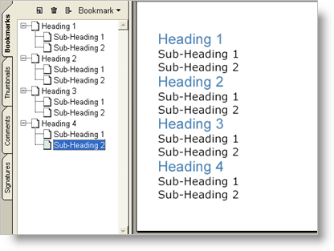

<!--
|metadata|
{
    "fileName": "documentengine-bookmarks",
    "controlName": "Infragistics Document Library",
    "tags": ["Navigation","Reporting"]
}
|metadata|
-->

# Bookmarks

Bookmarks are a feature of the Adobe® Acrobat® Reader and serve no purpose on printed media; however, they are extremely useful to your reader when viewing your report in Acrobat Reader. The Report element uses the [`TextHeading`](Infragistics.Web.Mvc.Documents.Reports~Infragistics.Documents.Reports.Report.TextHeading.html) enumeration to help generate the bookmarks. The Text element exposes a [`Heading`](Infragistics.Web.Mvc.Documents.Reports~Infragistics.Documents.Reports.Report.Text.IText~Heading.html) property, which allows you to choose a heading based on the TextHeading enumeration. These headings are seen by the Report element as hierarchical. The Report element will gather all Text elements in your report that have their Heading property set and compile a list of bookmarks based on them. H1 headings will become first-level bookmarks while H2 headings will be included in their corresponding H1 bookmarks – this logic is applied all the way through the heading hierarchy to H9. For more information, see [Table of Contents](DocumentEngine-Table-of-Contents.html), as much of this logic is very similar.

- [TextHeading](Infragistics.Web.Mvc.Documents.Reports~Infragistics.Documents.Reports.Report.TextHeading.html):  Link to the Web API Reference Guide to the TextHeading member.
- [Heading](Infragistics.Web.Mvc.Documents.Reports~Infragistics.Documents.Reports.Report.Text.IText~Heading.html): Link to the Web API Reference Guide to the Heading member.
- [Table of Contents](DocumentEngine-Table-of-Contents.html): Explains the table of contents navigation helper available in document engine.





Add the following code to the code in the Table of Contents topic and you will have bookmarks matching your headings similar to the screen shot above.

**In Visual Basic:**

```vb
' Assuming 'report' is your main Report element.
' Passing true as AddLevel's parameter displays
' the bookmark's second level, if it exists.
report.Bookmarks.AddLevel(True)
report.Bookmarks.AddLevel()
```

**In C#:**

```csharp
// Assuming 'report' is your main Report element.
// Passing true as AddLevel's parameter displays
// the bookmark's second level, if it exists.
report.Bookmarks.AddLevel(true);
report.Bookmarks.AddLevel();
```
