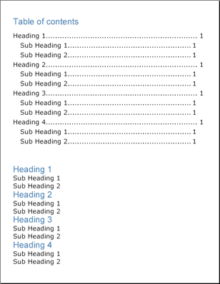

<!--
|metadata|
{
    "fileName": "documentengine-table-of-contents",
    "controlName": "Infragistics Document Library",
    "tags": ["Navigation","Reporting"]
}
|metadata|
-->

# Table of Contents
Creating a table of contents (TOC) is much simpler than most would think. If you've already been writing reports with the Infragistics Document Engine™, you may already be halfway on the way to writing a table of contents. The TOC element creates a table of contents based on the structure of your report; so it is important that you build your report properly in order to take advantage of the TOC element.

The Text element exposes a [Heading](Infragistics.Web.Mvc.Documents.Reports~Infragistics.Documents.Reports.Report.Text.IText~Heading.html "Link to the Web API Reference Guide to the Heading member.") property, which can be set to the [TextHeading](Infragistics.Web.Mvc.Documents.Reports~Infragistics.Documents.Reports.Report.TextHeading.html "Link to the Web API Reference Guide to the TextHeading member.") enumeration. Some of the values of this enumeration are H1, H2, H3, and so on. When you set the heading of a Text element, you are letting the TOC element know how to generate the table of contents. The [ITOC](Infragistics.Web.Mvc.Documents.Reports~Infragistics.Documents.Reports.Report.TOC.ITOC.html "Link to the Web API Reference Guide to the ITOC interface.") interface includes an [AddLevel](Infragistics.Web.Mvc.Documents.Reports~Infragistics.Documents.Reports.Report.TOC.ITOC~AddLevel.html "Link to the Web API Reference Guide to the AddLevel member.") method, which you can use in conjunction with the different headings. The first level that you add to the table of contents corresponds to the first level of headings, or H1. Adding another level to the table of contents will correspond to H2, continuing on to the final heading, H9. Therefore, if you label your headings properly, you won't have to do much extra work to generate a table of contents.

The [ILevel](Infragistics.Web.Mvc.Documents.Reports~Infragistics.Documents.Reports.Report.TOC.ILevel.html "Link to the Web API Reference Guide to the ILevel interface.") interface exposes a few properties that are typical when dealing with a table of contents.

*   **Indents**&nbsp;-- You can control the indentation of the TOC level by setting vertical, horizontal, top, bottom, left, right, and all indents. This helps with readability by allowing you to specify different indents for different heading levels.
*   **Style**&nbsp;-- Setting a Style object to this property will determine how the heading, leader, and page number look.
*   **Leader**&nbsp;-- The leader line is the dotted line seen in most tables of contents. This line helps the reader associate the heading and the page number by following the line to the other side of the page. The [LeaderFormat](Infragistics.Web.Mvc.Documents.Reports~Infragistics.Documents.Reports.Report.LeaderFormat.html "Link to the Web API Reference Guide to the LeaderFormat member.") enumeration allows you to set this line to be dashes, dots, lines, or spaces.



The following code generates a table of contents with four headings and two sub-headings beneath each heading. The headings are H1 and the sub-headings are H2.

1.  **Declare two Style objects for the heading and sub-heading styles.**

    **In C#:**

    ```csharp
    using Infragistics.Documents.Reports.Report;
    .
    .
    .
    Infragistics.Documents.Reports.Report.Text.Style mainStyle1 = 
      new Infragistics.Documents.Reports.Report.Text.Style( 
      new Font("Verdana", 18), Brushes.Black);
    Infragistics.Documents.Reports.Report.Text.Style mainStyle2 = 
      new Infragistics.Documents.Reports.Report.Text.Style( 
      new Font("Arial", 24), Brushes.SteelBlue);
    ```

2.  **Create a new section to place the TOC in.**


	**In C#:**

	```csharp
    // Create a new section and set the page size and margins.
    Infragistics.Documents.Reports.Report.Section.ISection tocSection = report.AddSection();
    tocSection.PageSize = PageSizes.Letter;
    tocSection.PageMargins.All = 35;
    ```

3.  **Create the TOC and define its two levels.**

	**In C#:**

	```csharp
    // Create a title for the TOC.
    Infragistics.Documents.Reports.Report.Text.IText tocText = tocSection.AddText();
    tocText.Style = mainStyle2;
    tocText.Margins.Top = 10;
    tocText.Margins.Bottom = 15;
    tocText.AddContent("Table of contents");

    // Create a new TOC.
    Infragistics.Documents.Reports.Report.TOC.ITOC toc = tocSection.AddTOC();

    // Add a first level to the TOC
    // (corresponding to H1)
    Infragistics.Documents.Reports.Report.TOC.ILevel tocLevel = toc.AddLevel();
    tocLevel.Indents.Right = 20;
    tocLevel.Indents.Bottom = 5;
    tocLevel.Style = mainStyle1;
    tocLevel.Leader = LeaderFormat.Dots;

    // Add a second level to the TOC
    // (corresponding to H2)
    tocLevel = toc.AddLevel();
    tocLevel.Indents.Left = 20;
    tocLevel.Indents.Right = 40;
    tocLevel.Indents.Bottom = 5;
    tocLevel.Style = mainStyle1;
    tocLevel.Leader = LeaderFormat.Dots;
    ```

4.  **Add a Gap element to separate the table of contents from the contents.**

	**In C#:**
	```csharp
    Infragistics.Documents.Reports.Report.IGap tocGap = tocSection.AddGap();
    tocGap.Height = new FixedHeight(50);
    ```

5.  **Add a few headings and sub-headings to see the table of contents generated.**

	**In C#:**

	```csharp
    // Create headings to demonstrate TOC.

    Infragistics.Documents.Reports.Report.Text.IText sampleHeading;
    Infragistics.Documents.Reports.Report.Text.IText sampleSubHeading;

    for (int i = 1; i < 5; i++)
    {
            sampleHeading = tocSection.AddText();
            sampleHeading.Heading = TextHeading.H1;
            sampleHeading.Style = mainStyle2;
            sampleHeading.AddContent("Heading " + i);

            for (int j = 1; j < 3; j++)
            {
                    sampleSubHeading = tocSection.AddText();
                    sampleSubHeading.Heading = TextHeading.H2;
                    sampleSubHeading.Style = mainStyle1;
                    sampleSubHeading.AddContent("Sub-Heading " + j);
            }
    }
    ```