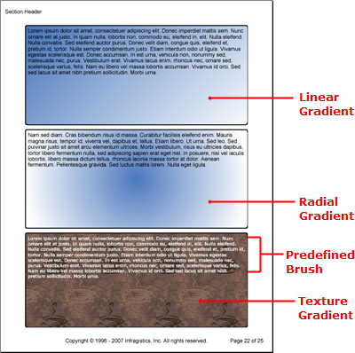

<!--
|metadata|
{
    "fileName": "documentengine-brushes",
    "controlName": "Infragistics Document Library",
    "tags": ["Reporting","Styling"]
}
|metadata|
-->

# Brushes

Just as an artist uses a brush to add paint to his canvas, you can use the [`Brush`](Infragistics.Web.Mvc.Documents.Reports~Infragistics.Documents.Reports.Graphics.Brush.html) class to add color and gradients to your report’s content. There are several classes that use a brush to add color, such as Background, Borders, and Pen. The Brush class offers you an assortment of options when filling content with color.

Brushes come in two types: Direct and Indirect.

- Direct brushes can apply a specific gradient with color blends and stops in a *defined* area, such as a [`Rectangle`](Infragistics.Web.Mvc.Documents.Reports~Infragistics.Documents.Reports.Graphics.Rectangle.html) . Direct brushes also include hatches, textures, and solid colors.
- Indirect brushes are used more commonly as backgrounds for report content that you may not know the exact dimension of while you are creating your report.

All brushes are eventually converted to direct brushes when the Infragistics Document Engine™ generates the report; this is because once the report is generated, the width and height of all content is finalized and direct brushes can be applied to everything.

Below is a listing of all brushes, including predefined brushes, that you can apply to backgrounds, shapes, fills, etc.



## Indirect Brushes

The [IndirectBrush](Infragistics.Web.Mvc.Documents.Reports~Infragistics.Documents.Reports.Graphics.IndirectBrush.html) class is derived from the Brush class and is an abstract class, which means you cannot directly instantiate it. There are three classes derived from the IndirectBrush class that you can instantiate.

-   [LinearGradientBrush](Infragistics.Web.Mvc.Documents.Reports~Infragistics.Documents.Reports.Graphics.LinearGradientBrush.html "Link to the Web API Reference Guide to the LinearGradientBrush member.") -- A brush that creates a gradient of two colors in the form of a line from one side of the parent object to the other side. The gradient is always a smooth 50% transition from the first color to the second color. (Because it is an indirect brush, you can't specify where you want the transition to take place along the line.) You also have the option of modifying the angle of the gradient.
-   [RadialGradientBrush](Infragistics.Web.Mvc.Documents.Reports~Infragistics.Documents.Reports.Graphics.RadialGradientBrush.html "Link to the Web API Reference Guide to the RadialGradientBrush member.") -- A brush that creates a gradient of two colors; the first color begins in the center of the parent object and radiates outwardly in a perfect circle while transitioning to the second color. You can also specify the rotation angle of the gradient.
-   [TextureBrush](Infragistics.Web.Mvc.Documents.Reports~Infragistics.Documents.Reports.Graphics.TextureBrush.html "Link to the Web API Reference Guide to the TextureBrush member.") -- A texture brush applies an image to the painting surface while repeating the image horizontally and vertically until all space is used up. Your Windows® desktop uses the same concept to tile wallpaper. The TextureBrush constructors allow you to specify the angle of the image as well as the horizontal and vertical scale and offset.

## Direct Brushes

The [`DirectBrush`](Infragistics.Web.Mvc.Documents.Reports~Infragistics.Documents.Reports.Graphics.DirectBrush.html "Link to the Web API Reference Guide to the DirectBrush member.") class is derived from the Brush class and is an abstract class, similar to the IndirectBrush class. Use a direct brush when you know the bounds of the containing object such as a Rectangle or other [`Shape`](Infragistics.Web.Mvc.Documents.Reports~Infragistics.Documents.Reports.Report.Shapes.IShapes.html "Link to the Web API Reference Guide to the IShapes interface."). There are five types of direct brushes that derive from the DirectBrush class:

-   [HatchBrush](Infragistics.Web.Mvc.Documents.Reports~Infragistics.Documents.Reports.Graphics.HatchBrush.html "Link to the Web API Reference Guide to the HatchBrush member."): Create a hatch design with the hatch brush. You can specify the     design by using the HatchStyle enumeration. You can also specify a     foreground and background color.
-   [LinearGradientDirectBrush](Infragistics.Web.Mvc.Documents.Reports~Infragistics.Documents.Reports.Graphics.LinearGradientDirectBrush.html "Link to the Web API Reference Guide to the LinearGradientDirectBrush member."): The direct linear gradient brush allows you to create a linear gradient with more than two colors using the     [ColorBlend](Infragistics.Web.Mvc.Documents.Reports~Infragistics.Documents.Reports.Graphics.ColorBlend.html "Link to the Web API Reference Guide to the ColorBlend member.") object. You also need to specify the binding Rectangle as well as a transformation matrix. For more information on blending colors, see [Colors](DocumentEngine-Colors.html "Explains how to use the colors available in document engine.").
-   [RadialGradientDirectBrush](Infragistics.Web.Mvc.Documents.Reports~Infragistics.Documents.Reports.Graphics.RadialGradientDirectBrush.html "Link to the Web API Reference Guide to the RadialGradientDirectBrush member."): Same as the LinearGradientDirectBrush class but creates a radial gradient. You can also specify the center point of the gradient as well as x and y radius distances.
-   [SolidColorBrush](Infragistics.Web.Mvc.Documents.Reports~Infragistics.Documents.Reports.Graphics.SolidColorBrush.html "Link to the Web API Reference Guide to the SolidColorBrush member."): The solid color brush is the simplest form of brush available. You can set the brush's color to a Color object.
-   [TextureDirectBrush](Infragistics.Web.Mvc.Documents.Reports~Infragistics.Documents.Reports.Graphics.TextureDirectBrush.html "Link to the Web API Reference Guide to the TextureDirectBrush member."): The texture direct brush applies an image as a background, much like its indirect counterpart. The difference is that the direct form includes a transformation matrix that you can apply.

## Brushes Class

The [`Brushes`](Infragistics.Web.Mvc.Documents.Reports~Infragistics.Documents.Reports.Graphics.Brushes.html "Link to the Web API Reference Guide to the Brushes member.") class is a set of predefined brushes that derive from SolidColorBrush. If all your report content needs is a grayish background, you can set the Brush property off the Background class of most layout elements to the [`Brushes.Gray`](Infragistics.Web.Mvc.Documents.Reports~Infragistics.Documents.Reports.Graphics.Brushes~Gray.html "Link to the Web API Reference Guide to the Brushes.Gray member.") property.

* * * * *

The following code creates several indirect brushes and applies them to the background of Text elements. Also notice the use of the Brushes class when setting the text style of the third paragraph. Keep in mind, though, that each brush in the Brushes class is sealed and you cannot modify the color or [`BrushType`](Infragistics.Web.Mvc.Documents.Reports~Infragistics.Documents.Reports.Graphics.BrushType.html "Link to the Web API Reference Guide to the BrushType member.").

Use the following text to set the the `string1` variable:

> Lorem ipsum dolor sit amet, consectetuer adipiscing elit. Donec imperdiet mattis sem. Nunc ornare elit at justo. In quam nulla, lobortis non, commodo eu, eleifend in, elit. Nulla eleifend. Nulla convallis. Sed eleifend auctor purus. Donec velit diam, congue quis,
> eleifend et, pretium id, tortor. Nulla semper condimentum justo. Etiam interdum odio ut ligula. Vivamus egestas scelerisque est. Donec accumsan. In est urna, vehicula non, nonummy sed, malesuada nec, purus. Vestibulum erat. Vivamus lacus enim, rhoncus nec, ornare sed, scelerisque varius, felis. Nam eu libero vel massa lobortis accumsan. Vivamus id orci. Sed sed lacus sit amet nibh pretium sollicitudin. Morbi urna.

**In Visual Basic:**

```vb
Imports Infragistics.Documents.Reports.Report
Imports Infragistics.Documents.Reports.Graphics
.
.
.
Dim string1 As String = "Lorem ipsum..."

' Indirect Brushes
Dim brush1 As New LinearGradientBrush( _
        New Color(68, 115, 187), _
        Colors.White, _
        45)
Dim brush2 As New RadialGradientBrush( _
        New Color(68, 115, 187), _
        Colors.White, _
        45)
Dim brush3 As New TextureBrush( _
        New Image(Application.StartupPath + "..Coffee Bean.bmp"))

' Linear gradient brush
Dim brushText As Infragistics.Documents.Reports.Report.Text.IText = section1.AddText()
brushText.Background = New Background(brush1)
brushText.Height = New RelativeHeight(33)
brushText.Borders = New Borders(New Pen(Colors.Black, 3), 5)
brushText.Margins = New Margins(5, 5)
brushText.Paddings = New Paddings(5, 5)
brushText.AddContent(string1)

' Radial gradient brush
brushText = section1.AddText()
brushText.Background = New Background(brush2)
brushText.Height = New RelativeHeight(50)
brushText.Borders = New Borders(New Pen(Colors.Black, 3), 5)
brushText.Margins = New Margins(5, 5)
brushText.Paddings = New Paddings(5, 5)
brushText.AddContent(string1)

' Texture brush in the background with a predefined
' solid brush on the text.
brushText = section1.AddText()
brushText.Background = New Background(brush3)
brushText.Height = New RelativeHeight(100)
brushText.Borders = New Borders(New Pen(Colors.Black, 3), 5)
brushText.Margins = New Margins(5, 5)
brushText.Paddings = New Paddings(5, 5)
brushText.Style = New Style(New Font("Verdana", 10), Brushes.White)
brushText.AddContent(string1)
```

**In C#:**

```csharp
using Infragistics.Documents.Reports.Report;
using Infragistics.Documents.Reports.Graphics;
.
.
.
string string1 = "Lorem ipsum...";

// Indirect Brushes
LinearGradientBrush brush1 = new LinearGradientBrush(
  new Color(68, 115, 187),
  Colors.White,
  45);
RadialGradientBrush brush2 = new RadialGradientBrush(
  new Color(68, 115, 187),
  Colors.White,
  45);
TextureBrush brush3 = 
  new TextureBrush(new Image(Application.StartupPath + @"..Coffee Bean.bmp"));

// Linear gradient brush
Infragistics.Documents.Reports.Report.Text.IText brushText = section1.AddText();
brushText.Background = new Background(brush1);
brushText.Height = new RelativeHeight(33);
brushText.Borders = new Borders(new Pen(Colors.Black, 3), 5);
brushText.Margins = new Margins(5, 5);
brushText.Paddings = new Paddings(5, 5);
brushText.AddContent(string1);

// Radial gradient brush
brushText = section1.AddText();
brushText.Background = new Background(brush2);
brushText.Height = new RelativeHeight(50);
brushText.Borders = new Borders(new Pen(Colors.Black,3), 5);
brushText.Margins = new Margins(5, 5);
brushText.Paddings = new Paddings(5, 5);
brushText.AddContent(string1);

// Texture brush in the background with a predefined
// solid brush on the text.
brushText = section1.AddText();
brushText.Background = new Background(brush3);
brushText.Height = new RelativeHeight(100);
brushText.Borders = new Borders(new Pen(Colors.Black, 3), 5);
brushText.Margins = new Margins(5, 5);
brushText.Paddings = new Paddings(5, 5);
brushText.Style = new Style(new Font("Verdana", 10), Brushes.White);
brushText.AddContent(string1);
```
