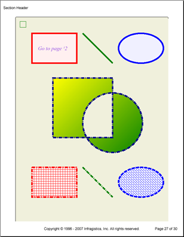

<!--
|metadata|
{
    "fileName": "documentengine-canvas",
    "controlName": "Infragistics Document Library",
    "tags": ["Reporting"]
}
|metadata|
-->

# Canvas

The Canvas element is a versatile painting surface. With the Canvas element, you can draw a vast amount of shapes while manipulating them in several different ways. The Canvas element exposes several standard properties, such as [Background](Infragistics.Web.Mvc.Documents.Reports~Infragistics.Documents.Reports.Report.ICanvas~Background.html "Link to the Web API Reference Guide to the Background member.") , [Borders](Infragistics.Web.Mvc.Documents.Reports~Infragistics.Documents.Reports.Report.ICanvas~Borders.html "Link to the Web API Reference Guide to the Borders member.") , and [Margins](Infragistics.Web.Mvc.Documents.Reports~Infragistics.Documents.Reports.Report.ICanvas~Margins.html "Link to the Web API Reference Guide to the Margins member.") , that you will encounter in other layout elements. Also, the Canvas element implements the [IGraphics](Infragistics.Web.Mvc.Documents.Reports~Infragistics.Documents.Reports.Graphics.IGraphics.html "Link to the Web API Reference Guide to the IGraphics interface.") interface, which is where the element derives its visual prowess. The IGraphics interface is very similar to the System.Drawing.Graphics object.



## Standard Layout Element Properties
The Canvas element exposes its own set of standard layout properties that are essential in positioning the canvas as a whole; but there are a few properties exposed through the IGraphics interface that affect what is actually drawn. Two important properties exposed by the IGraphics interface are [Pen](Infragistics.Web.Mvc.Documents.Reports~Infragistics.Documents.Reports.Graphics.IGraphics~Pen.html "Link to the Web API Reference Guide to the Pen member.") and [Brush](Infragistics.Web.Mvc.Documents.Reports~Infragistics.Documents.Reports.Graphics.IGraphics~Brush.html "Link to the Web API Reference Guide to the Brush member.") (normally exposed by the element itself). Each of these properties affects the stroke and fill of all objects created by the IGraphics interface. Another important concept to understand is that all drawings are created in a linear fashion, which means that you can change the pen and brush while drawing shapes and have the same shape with the same dimensions, but drawn differently.

## IGraphics Interface
The IGraphics Interface is where you will be doing most of your graphics implementation in your reports. Through this interface, you can add hyperlinks anywhere on a page, draw any shape, fill and clip those shapes, and even scale, skew, or transform the shapes.

## Hyperlinks
You can add a hyperlink area by specifying the coordinates of the upper-left corner of the area's bounding rectangle and then the rectangle's height and width. The following methods allow you to manipulate hyperlinks on the canvas:

<table class="table table-striped">
	<thead>
		
	</thead>
	<tbody>
        <tr>
            <td valign="top">
                <ul>
                    <li>
[AddHyperlinkArea](Infragistics.Web.Mvc.Documents.Reports~Infragistics.Documents.Reports.Graphics.IGraphics~AddHyperlinkArea.html)
					</li>

                    <li>
[StartHyperlink](Infragistics.Web.Mvc.Documents.Reports~Infragistics.Documents.Reports.Graphics.IGraphics~StartHyperlink.html)
					</li>

                    <li>
[PauseHyperlink](Infragistics.Web.Mvc.Documents.Reports~Infragistics.Documents.Reports.Graphics.IGraphics~PauseHyperlink.html)
					</li>
                </ul>
            </td>

            <td valign="top">
                <ul>
                    <li>
[ResumeHyperlink](Infragistics.Web.Mvc.Documents.Reports~Infragistics.Documents.Reports.Graphics.IGraphics~ResumeHyperlink.html)
					</li>

                    <li>
[EndHyperlink](Infragistics.Web.Mvc.Documents.Reports~Infragistics.Documents.Reports.Graphics.IGraphics~EndHyperlink.html)
					</li>
                </ul>
            </td>
        </tr>
    </tbody>
</table>

## Drawing
You can create each of the following shapes/drawings by calling their respective `Draw` method (e.g., call the `DrawRectangle` method to draw a rectangle); you only need to pass in the required Point objects to create them. Other drawing properties (such as pen and brush) are set on the Canvas element itself and affect all drawings.

<table class="table table-striped">
	<tbody>
        <tr>
            <td valign="top">
                <ul>
                    <li>Arc</li>
                    <li>Bezier</li>
                    <li>Chord</li>
                    <li>Closed Curve</li>
                    <li>Curve</li>
                    <li>Ellipse</li>
                    <li>Image</li>
                </ul>
            </td>

            <td valign="top">
                <ul>
                    <li>Line</li>
                    <li>Pie</li>
                    <li>Polygon</li>
                    <li>Rectangle</li>
                    <li>Rounded Rectangle</li>
                    <li>Spacing</li>
                    <li>String</li>
                </ul>
            </td>
        </tr>
    </tbody>
</table>

## Filling and Clipping
You can either fill or clip regions with each of the shapes below. The Canvas will use its Brush property to fill the shapes. When using a shape to clip a region, you will only be able to see the portion of the shapes behind the clipping shape that are inside the clipping shapes' bounding rectangle. Use the shape's respective Clip or Fill method (e.g., `ClipRectangle` to form a rectangular clipping region and `FillRectangle` to fill the rectangle) to perform the respective action on the shape.

<table class="table table-striped">
	<thead>
		
	</thead>
	<tbody>
        <tr>
            <td valign="top">
                <ul>
                    <li>
Arc
					</li>

                    <li>
Bezier
					</li>

                    <li>
Chord
					</li>

                    <li>
Closed Curve
					</li>

                    <li>
Ellipse
					</li>
                </ul>
            </td>

            <td valign="top">
                <ul>
                    <li>
Pie
					</li>

                    <li>
Polygon
					</li>

                    <li>
Rectangle
					</li>

                    <li>
Rounded Rectangle
					</li>
                </ul>
            </td>
        </tr>
    </tbody>
</table>

The following code adds a Canvas element to a section and then draws several shapes using several styles.

1.  **Add a canvas to a section.**

    **In Visual Basic:**

    ```vb
    Imports Infragistics.Documents.Reports.Report
    Imports Infragistics.Documents.Reports.Graphics
    .
    .
    .
    ' Add a canvas to the section.
    Dim canvas1 As Infragistics.Documents.Reports.Report.ICanvas = section1.AddCanvas()
    canvas1.Borders = New Borders(Pens.Black, 5)
    canvas1.Margins.Vertical = 5
    canvas1.Paddings.All = 5
    canvas1.Background = New Background(New SolidColorBrush(New Color(240, 240, 220)))
    ```

    **In C#:**

    ```csharp
    using Infragistics.Documents.Reports.Report;
    using Infragistics.Documents.Reports.Graphics;
    .
    .
    .
    // Add a canvas to the section.
    Infragistics.Documents.Reports.Report.ICanvas canvas1 = section1.AddCanvas();
    canvas1.Borders = new Borders(Pens.Black, 5);
    canvas1.Margins.Vertical = 5;
    canvas1.Paddings.All = 5;
    canvas1.Background = new Background(new SolidColorBrush(new Color(240, 240, 220)));
    ```

2.  **Create a System.Drawing.Graphics object and create a rectangle.**

    **In Visual Basic:**

    ```vb
    ' Create a System Graphics object and use it
    ' to draw a rectangle
    canvas1.CreateGraphics().DrawRectangle( _
            System.Drawing.Pens.Green, _
            New System.Drawing.Rectangle(10, 10, 20, 20))
    ```

    **In C#:**

    ```csharp
    // Create a System Graphics object and use it
    // to draw a rectangle
    canvas1.CreateGraphics().DrawRectangle
    (
            System.Drawing.Pens.Green,
            new System.Drawing.Rectangle(10, 10, 20, 20)
    );
    ```

3.  **Draw a rectangle.**

    **In Visual Basic:**

    ```vb
    ' Draw a Rectangle with a Hyperlink inside.
    canvas1.StartHyperlink(1, 0, 10)
    canvas1.Pen = New Pen(Colors.Red, 5)
    canvas1.Brush = New SolidColorBrush(New Color(255, 240, 240))
    canvas1.DrawRectangle(50, 50, 150, 100, PaintMode.FillStroke)
    canvas1.AddHyperlinkArea(50, 50, 150, 100)
    canvas1.EndHyperlink()

    ' Add text to the rectangle (more accurately, overtop the rectangle).
    canvas1.Font = New Font("Times New Roman", 18, FontStyle.Italic)
    canvas1.Brush = Brushes.BlueViolet
    canvas1.DrawString(70, 90, "Go to page 2")
    ```

    **In C#:**

    ```csharp
    // Draw a Rectangle with a Hyperlink inside.
    canvas1.StartHyperlink(1, 0, 10);
    canvas1.Pen = new Pen(Colors.Red, 5);
    canvas1.Brush = new SolidColorBrush(new Color(255, 240, 240));
    canvas1.DrawRectangle(50, 50, 150, 100, PaintMode.FillStroke);
    canvas1.AddHyperlinkArea(50, 50, 150, 100);
    canvas1.EndHyperlink();

    // Add text to the rectangle (more accurately, overtop the rectangle).
    canvas1.Font = new Font("Times New Roman", 18, FontStyle.Italic);
    canvas1.Brush = Brushes.BlueViolet;
    canvas1.DrawString(70, 90, "Go to page ¹2");
    ```

4.  **Draw a green slanted line.**

    **In Visual Basic:**

    ```vb
    ' Draw a green line 5px thick. 
    canvas1.Pen = New Pen(Colors.Green, 5)
    canvas1.DrawLine(220, 50, 320, 150)
    ```

    **In C#:**

    ```csharp
    // Draw a green line 5px thick. 
    canvas1.Pen = new Pen(Colors.Green, 5);
    canvas1.DrawLine(220, 50, 320, 150);
    ```

5.  **Draw an ellipse.**

    **In Visual Basic:**

    ```vb
    ' Draw an ellipse and outline it with a blue, 5px line
    ' and fill it with a light blue color.
    canvas1.Pen = New Pen(Colors.Blue, 5)
    canvas1.Brush = New SolidColorBrush(New Color(240, 240, 255))
    canvas1.DrawEllipse(340, 50, 150, 100, PaintMode.FillStroke)
    ```

    **In C#:**

    ```csharp
    // Draw an ellipse and outline it with a blue, 5px line
    // and fill it with a light blue color.
    canvas1.Pen = new Pen(Colors.Blue, 5);
    canvas1.Brush = new SolidColorBrush(new Color(240, 240, 255));
    canvas1.DrawEllipse(340, 50, 150, 100, PaintMode.FillStroke);
    ```

6.  **Change the Canvas' pen and brush style.**

    **In Visual Basic:**

    ```vb
    ' Change the Canvas' pen and brush.
    canvas1.Pen = New Pen(Colors.DarkBlue, 5, DashStyle.DashDot)
    canvas1.Brush = New LinearGradientBrush(Colors.Yellow, Colors.Green, 45.0F)
    ```

    **In C#:**

    ```csharp
    // Change the Canvas' pen and brush.
    canvas1.Pen = new Pen(Colors.DarkBlue, 5, DashStyle.DashDot);
    canvas1.Brush = new LinearGradientBrush(Colors.Yellow, Colors.Green, 45F);
    ```

7.  **Create a compound shape.**

    **In Visual Basic:**

    ```vb
    ' Because both shapes are being created as one (using
    ' StartShape and EndShape), the intersection of the 
    ' two shapes is considered not a part of the shape 
    ' and not filled in. Also, the gradient will traverse
    ' the entire shape, not both individually.
    canvas1.StartShape(PaintMode.FillStroke)
    canvas1.FillRectangle(120, 200, 200, 200)
    canvas1.DrawEllipse(220, 250, 200, 200)
    canvas1.EndShape()
    ```

    **In C#:**

    ```csharp
    // Because both shapes are being created as one (using
    // StartShape and EndShape), the intersection of the 
    // two shapes is considered not to be a part of the shape 
    // and not filled in. Also, the gradient will traverse
    // the entire shape, not both individually.
    canvas1.StartShape(PaintMode.FillStroke);
    canvas1.FillRectangle(120, 200, 200, 200);
    canvas1.DrawEllipse(220, 250, 200, 200);
    canvas1.EndShape();
    ```

8.  **Create another rectangle.**

    **In Visual Basic:**

    ```vb
    ' Draw another rectangle with a different pen and brush.
    canvas1.Pen = New Pen(Colors.Red, 5, DashStyle.DashDotDot)
    canvas1.Brush = New HatchBrush(HatchStyle.Cross, Colors.Red, Colors.White)
    canvas1.DrawRectangle(50, 500, 150, 100, PaintMode.FillStroke)
    ```

    **In C#:**

    ```csharp
    // Draw another rectangle with a different pen and brush.
    canvas1.Pen = new Pen(Colors.Red, 5, DashStyle.DashDotDot);
    canvas1.Brush = new HatchBrush(HatchStyle.Cross, Colors.Red, Colors.White);
    canvas1.DrawRectangle(50, 500, 150, 100, PaintMode.FillStroke);
    ```

9.  **Create another line.**

    **In Visual Basic:**

    ```vb
    ' Draw another line, this time with a different dash style.
    canvas1.Pen = New Pen(Colors.Green, 5, DashStyle.DashDot)
    canvas1.DrawLine(220, 500, 320, 600)
    ```

    **In C#:**

    ```csharp
    // Draw another line, this time with a different dash style.
    canvas1.Pen = new Pen(Colors.Green, 5, DashStyle.DashDot);
    canvas1.DrawLine(220, 500, 320, 600);
    ```

10. **Create another ellipse.**

    **In Visual Basic:**

    ```vb
    ' Draw another ellipse with a different pen and brush.
    canvas1.Pen = New Pen(Colors.Blue, 5, DashStyle.Dash)
    canvas1.Brush = _
      New HatchBrush(HatchStyle.DiagonalBrick, Colors.Blue, Colors.White)
    canvas1.DrawEllipse(340, 500, 150, 100, PaintMode.FillStroke)
    ```

    **In C#:**

    ```csharp
    // Draw another ellipse with a different pen and brush.
    canvas1.Pen = new Pen(Colors.Blue, 5, DashStyle.Dash);
    canvas1.Brush = 
      new HatchBrush(HatchStyle.DiagonalBrick, Colors.Blue, Colors.White);
    canvas1.DrawEllipse(340, 500, 150, 100, PaintMode.FillStroke);
    ```


