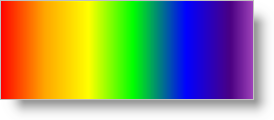

<!--
|metadata|
{
    "fileName": "documentengine-colors",
    "controlName": "Infragistics Document Library",
    "tags": ["Reporting","Styling"]
}
|metadata|
-->

# Colors

The [Color](Infragistics.Web.Mvc.Documents.Reports~Infragistics.Documents.Reports.Graphics.Color.html "Link to the Web API Reference Guide to the Color member.") class allows you to add any RGB color to your report content with little effort. The Color class has several constructors to account for several scenarios. You can even access a [Colors](Infragistics.Web.Mvc.Documents.Reports~Infragistics.Documents.Reports.Graphics.Colors.html "Link to the Web API Reference Guide to the Colors member.") object that contains 138 predefined colors that you can use rather than initializing a new instance of the Color class.

Using colors starts to get interesting when creating custom color blends for [direct gradient brushes](DocumentEngine-Brushes.html "Link to the brushes topic.") with the [ColorBlend](Infragistics.Web.Mvc.Documents.Reports~Infragistics.Documents.Reports.Graphics.ColorBlend.html "Link to the Web API Reference Guide to the ColorBlend member.") class. The ColorBlend class is a collection of colors mapped to locations on a line; otherwise known as a [ColorBlendEntry](Infragistics.Web.Mvc.Documents.Reports~Infragistics.Documents.Reports.Graphics.ColorBlendEntry.html "Link to the Web API Reference Guide to the ColorBlendEntry member.") . Each ColorBlendEntry has a [Color](Infragistics.Web.Mvc.Documents.Reports~Infragistics.Documents.Reports.Graphics.ColorBlendEntry~Color.html "Link to the Web API Reference Guide to the Color member.") property which can be set to a Color, and a [Position](Infragistics.Web.Mvc.Documents.Reports~Infragistics.Documents.Reports.Graphics.ColorBlendEntry~Position.html "Link to the Web API Reference Guide to the Position member.") property which can be set to a float that represents the position along the gradient's path. The Position property accepts values on a scale from 0F to 1.0F.



The following code instantiates several colors through the various constructors of the Color class. The code then defines a `ColorBlend` object, a rectangle, and a direct linear gradient brush. These objects are then used to draw a rectangle on a Canvas.

1.  **Define three colors: Red, Green, and Blue.**

    **In Visual Basic:**

    ```vb
    Imports Infragistics.Documents.Reports.Report
    Imports Infragistics.Documents.Reports.Graphics
    .
    .
    .
    ' Create a new System color
    Dim red As New Color(System.Drawing.Color.Red)
    ' Create a color from RGB values
    Dim green As New Color(0, 255, 0)
    ' Create a predefined color from the Colors class
    Dim blue As Color = Colors.Blue
    ```

    **In C#:**

    ```csharp
    using Infragistics.Documents.Reports.Report;
    using Infragistics.Documents.Reports.Graphics;
    .
    .
    .
    // Create a new System color
    Color red = new Color(System.Drawing.Color.Red);
    // Create a color from RGB values
    Color green = new Color(0, 255, 0);
    // Create a predefined color from the Colors class
    Color blue = Colors.Blue;
    ```

2.  **Create a custom color blend.**

    **In Visual Basic:**

    ```vb
    ' Create a new blend of colors
    Dim colorBlend As New ColorBlend()

    ' Add seven colors to the ColorBlend. Each ColorBlendEntry
    ' constructor accepts a color and a float representing the
    ' location on the line.
    colorBlend.Add(New ColorBlendEntry(red, 0.0F))
    colorBlend.Add(New ColorBlendEntry(Colors.Orange, 0.15F))
    colorBlend.Add(New ColorBlendEntry(Colors.Yellow, 0.3F))
    colorBlend.Add(New ColorBlendEntry(green, 0.45F))
    colorBlend.Add(New ColorBlendEntry(blue, 0.6F))
    colorBlend.Add(New ColorBlendEntry(Colors.Indigo, 0.75F))
    colorBlend.Add(New ColorBlendEntry(Colors.Violet, 0.9F))
    ```

    **In C#:**

    ```csharp
    // Create a new blend of colors
    ColorBlend colorBlend = new ColorBlend();

    // Add seven colors to the ColorBlend. Each ColorBlendEntry
    // constructor accepts a color and a float representing the
    // location on the line.
    colorBlend.Add(new ColorBlendEntry(red, 0F));
    colorBlend.Add(new ColorBlendEntry(Colors.Orange, .15F));
    colorBlend.Add(new ColorBlendEntry(Colors.Yellow, .3F));
    colorBlend.Add(new ColorBlendEntry(green, .45F));
    colorBlend.Add(new ColorBlendEntry(blue, .60F));
    colorBlend.Add(new ColorBlendEntry(Colors.Indigo, .75F));
    colorBlend.Add(new ColorBlendEntry(Colors.Violet, .9F));
    ```

3.  **Define a Rectangle.**

    **In Visual Basic:**

    ```vb
    ' Create a rectangle that will bind the linear gradient.
    Dim rect As New Rectangle(New Point(0, 100), New Size(600, 200))
    ```

    **In C#:**

    ```csharp
    // Create a rectangle that will bind the linear gradient.
    Rectangle rect = new Rectangle(new Point(0,100), new Size(600, 200));
    ```

4.  **Define a LinearGradientDirectBrush.**

    **In Visual Basic:**

    ```vb
    ' Create a direct linear gradient brush that uses the ColorBlend.
    Dim linearDirect As New LinearGradientDirectBrush( _
            colorBlend, rect, New Matrix())
    ```

    **In C#:**

    ```csharp
    // Create a direct linear gradient brush that uses the ColorBlend.
    LinearGradientDirectBrush linearDirect =
      new LinearGradientDirectBrush(colorBlend, rect, new Matrix());
    ```

5.  **Create a canvas and draw the rectangle.**

    **In Visual Basic:**

    ```vb
    Dim canvas As ICanvas = section1.AddCanvas()

    ' Set a few properties on the canvas to help is stand out more.
    canvas.Height = New RelativeHeight(100)
    canvas.Width = New RelativeWidth(100)
    canvas.Borders = New Borders(New Pen(Colors.Black, 3), 5)
    canvas.Background = New Background(Brushes.GhostWhite)

    ' If the PaintMode is Fill, the canvas' brush is used; 
    ' if the PaintMode is Stroke, the pen is used. FillStroke
    ' is a combination of both. 
    canvas.Pen = New Pen(Colors.Black)
    ' Set the canvas' brush to the direct linear gradient
    ' created earlier.
    canvas.Brush = linearDirect

    ' Draw the rectangle.
    canvas.DrawRectangle(0, 100, 600, 200, PaintMode.Fill)
    ```

    **In C#:**

    ```csharp
    // Add a canvas to the section.
    ICanvas canvas = section1.AddCanvas();

    // Set a few properties on the canvas to help it stand out more.
    canvas.Height = new RelativeHeight(100);
    canvas.Width = new RelativeWidth(100);
    canvas.Borders = new Borders(new Pen(Colors.Black, 3), 5);
    canvas.Background = new Background(Brushes.GhostWhite);
                            
    // If the PaintMode is Fill, the canvas' brush is used; 
    // if the PaintMode is Stroke, the pen is used. FillStroke
    // is a combination of both. 
    canvas.Pen = new Pen(Colors.Black);
    // Set the canvas' brush to the direct linear gradient
    // created earlier.
    canvas.Brush = linearDirect;
                            
    // Draw the rectangle.
    canvas.DrawRectangle(0, 100, 600, 200, PaintMode.Fill);
    ```