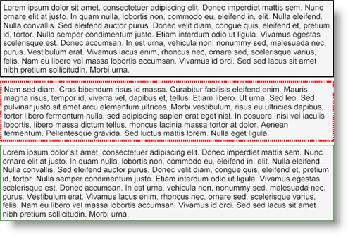

<!--
|metadata|
{
    "fileName": "documentengine-pens",
    "controlName": "Infragistics Document Library",
    "tags": ["Reporting"]
}
|metadata|
-->

# Pens

Pens are used to define the characteristics of lines. You will find lines in several aspects of the Infragistics Document Engine™ including Borders, Shapes, Rectangles, and several shapes drawn by the Canvas element. Some of the line characteristics that a pen can manipulate are:

-   Color
-   Width
-   Dash Style
-   Line Cap
-   Line Join
-   Miter Limit

You can also use the [Pens](Infragistics.Web.Mvc.Documents.Reports~Infragistics.Documents.Reports.Graphics.Pens.html "Link to the Web API Reference Guide to the Pens member.") class, a collection of predefined pens, to quickly add a colored pen with default style attributes to a line. Each pen in the Pens class is a solid pen with a width of 1px. 


Use the following code to define two Pen objects and use them to draw the borders of a Text element. The third Text element uses a predefined pen to draw its borders.

Use the following text to set the the `string1` variable:

> Lorem ipsum dolor sit amet, consectetuer adipiscing elit. Donec imperdiet mattis sem. Nunc ornare elit at justo. In quam nulla, lobortis non, commodo eu, eleifend in, elit. Nulla eleifend. Nulla convallis. Sed eleifend auctor purus. Donec velit diam, congue quis, eleifend et, pretium id, tortor. Nulla semper condimentum justo. Etiam interdum odio ut ligula. Vivamus egestas scelerisque est. Donec accumsan. In est urna, vehicula non, nonummy sed, malesuada nec, purus. Vestibulum erat. Vivamus lacus enim, rhoncus nec, ornare sed, scelerisque varius, felis. Nam eu libero vel massa lobortis accumsan. Vivamus id orci. Sed sed lacus sit amet nibh pretium sollicitudin. Morbi urna.

**In C#:**

```csharp
using Infragistics.Documents.Reports.Report;
using Infragistics.Documents.Reports.Graphics;
.
.
.
string string1 = "Lorem ipsum...";

// Define two Pen objects
Pen pen1 = new Pen(Colors.Black, 3, DashStyle.Solid);
Pen pen2 = new Pen(Colors.Red, 5, DashStyle.Dot);

// The pen used for the border in this Text element
// will be solid, black, 3px.
Infragistics.Documents.Reports.Report.Text.IText penText1 = section1.AddText();
penText1.Paddings = new Paddings(3, 3);
penText1.Margins = new Margins(3, 3);
penText1.Borders = new Borders(pen1);
penText1.Background = new Background(Brushes.WhiteSmoke);
penText1.AddContent(string1);

// The pen used for the border in this Text element
// will be dotted, red, 5px.
penText1 = section1.AddText();
penText1.Paddings = new Paddings(3, 3);
penText1.Margins = new Margins(3, 3);
penText1.Borders = new Borders(pen2);
penText1.Background = new Background(Brushes.WhiteSmoke);
penText1.AddContent(string1);

// The pen used for the border in this Text element
// is a predefined, green pen.
penText1 = section1.AddText();
penText1.Paddings = new Paddings(3, 3);
penText1.Margins = new Margins(3, 3);
penText1.Borders = new Borders(Pens.Green);
penText1.Background = new Background(Brushes.WhiteSmoke);
penText1.AddContent(string1);
```