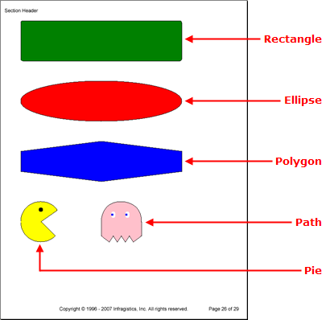

<!--
|metadata|
{
    "fileName": "documentengine-shapes",
    "controlName": "Infragistics Document Library",
    "tags": ["Formatting","Reporting","Resource Strings"]
}
|metadata|
-->

# Shapes
The Site element is an intriguing element that can place objects anywhere in its binding rectangle as well as rotate them. Another feature that makes the Site element very useful is the [Shapes](Infragistics.Web.Mvc.Documents.Reports~Infragistics.Documents.Reports.Report.Shapes.IShapes.html "Link to the Web API Reference Guide to the IShapes interface.") factory. Just as the name implies, the Shapes factory allows you to produce numerous kinds of shapes and add them to the Site element.

You can easily access each shape off the Shapes object by calling a method specific to that shape (e.g., to add a rectangle, call the [AddRetangle](Infragistics.Web.Mvc.Documents.Reports~Infragistics.Documents.Reports.Report.Shapes.IShapes~AddRectangle.html "Link to the Web API Reference Guide to the AddRectangle member.") method). The method will return a reference to the newly created shape and you can set that reference to a new shape object.

Below is a list of the shapes you can add to the Site element.

*   **Arc**&nbsp;-- Provide the arc with a start and end angle, and the arc does the rest. You can specify the height and width of the bounding rectangle, as well as the x- and y-coordinates of the upper-left corner.
*   **Ellipse**&nbsp;-- The ellipse is created in much the same way as a rectangle. Provide the height and width of the bounding rectangle as well as the x- and y-coordinates to determine the size and location. The ellipse will then be based on the rectangle and automatically formed.
*   **Label**&nbsp;-- You can specify the x- and y-coordinates of the upper-left corner of the font’s bounding rectangle in order to place it on the site. Once the [Font](Infragistics.Web.Mvc.Documents.Reports~Infragistics.Documents.Reports.Report.Shapes.ILabel~Font.html "Link to the Web API Reference Guide to the Font member.") and [Text](Infragistics.Web.Mvc.Documents.Reports~Infragistics.Documents.Reports.Report.Shapes.ILabel~Text.html "Link to the Web API Reference Guide to the Text member.") properties are set, the size of the rectangle is automatically determined.
*   **Line**&nbsp;-- The line has X1 and Y1 coordinates to determine the starting point of the line, and X2 and Y2 coordinates to determine the ending point. You can also specify a brush to modify the appearance of the line.
*   **Path**&nbsp;-- The path has a few methods that are helpful in creating completely custom shapes. You can think of a path as moving a pen across a piece of paper in a particular direction.
     *   **Move To** -- The [MoveTo](Infragistics.Web.Mvc.Documents.Reports~Infragistics.Documents.Reports.Report.Shapes.IPath~MoveTo.html "Link to the Web API Reference Guide to the MoveTo member.") method moves the active point to the specified coordinates; it doesn't actually draw anything. In the pen and paper analogy, this would be the equivalent of removing the pen from the paper, moving the pen to the new point, and placing the pen back on the paper without drawing a single line.
     *   **Line To** -- The [LineTo](Infragistics.Web.Mvc.Documents.Reports~Infragistics.Documents.Reports.Report.Shapes.IPath~LineTo.html "Link to the Web API Reference Guide to the LineTo member.") method draws a line from the starting coordinates to the ending coordinates.
     *   **Curve To** -- The [CurveTo](Infragistics.Web.Mvc.Documents.Reports~Infragistics.Documents.Reports.Report.Shapes.IPath~CurveTo.html "Link to the Web API Reference Guide to the CurveTo member.") method draws a line from a starting coordinate, uses a middle coordinate to create the curve, and ends on the ending coordinate.
     *   **Close Path** -- You can manually close the path with the [ClosePath](Infragistics.Web.Mvc.Documents.Reports~Infragistics.Documents.Reports.Report.Shapes.IPath~ClosePath.html "Link to the Web API Reference Guide to the ClosePath member.") method.

    Each method you call will generally pass the ending coordinates of the previous method as the starting coordinates of the currently being called method; this creates a continuous path and eventually defines the shape. You can also specify a brush to fill the path, and a pen to draw the path.

*   **Pie**&nbsp;-- The pie is very similar to the arc in that you need to supply starting and ending angles. The difference between the pie and arc is that the arc simply creates a curve, whereas the pie creates an entire pie or a slice of the pie.
*   **Polygon**&nbsp;-- You can create polygons with as many sides as needed with the [Polygon](Infragistics.Web.Mvc.Documents.Reports~Infragistics.Documents.Reports.Report.Shapes.IPolygon.html "Link to the Web API Reference Guide to the IPolygon interface.") shape. Set the [Points](Infragistics.Web.Mvc.Documents.Reports~Infragistics.Documents.Reports.Report.Shapes.IPolygon~Points.html "Link to the Web API Reference Guide to the Points member.") property to an array of [Point](Infragistics.Web.Mvc.Documents.Reports~Infragistics.Documents.Reports.Graphics.Point.html "Link to the Web API Reference Guide to the Point member.") objects in order to define the polygon. The polygon will be drawn in the order that you provide points, so be careful when providing points and draw them consecutively, similar to tracing an outline.
*   **Polyline**&nbsp;-- The polyline is very similar to the polygon in that you also provide an array of Point objects for the line to follow.
*   **Rectangle** -- Provide the height and width of the bounding rectangle as well as the x- and y-coordinates to determine size and location. You can also specify a brush to fill the rectangle, and a pen to draw the outline. The [Radius](Infragistics.Web.Mvc.Documents.Reports~Infragistics.Documents.Reports.Report.Shapes.IRectangle~Radius.html "Link to the Web API Reference Guide to the Radius member.") property allows you to round the corners of the rectangle.



The following code adds a rectangle, ellipse, polygon, pie, and path to a Site element. This topic assumes that you have defined a Report element and have at least one Section element added to it. For more information, see [Report](DocumentEngine-Report.html "Explains the report object available in document engine.") and [Section](DocumentEngine-Section.html "Explains the section element in document engine.").

1.  **Add a Site element to a section.**

    **In C#:**

    ```csharp
    using Infragistics.Documents.Reports.Report;
    using Infragistics.Documents.Reports.Graphics;
    .
    .
    .
    // Add a new Site element to the section.
    Infragistics.Documents.Reports.Report.ISite shapesSite = section1.AddSite();
    ```

2.  **Add a Rectangle to the Site element.**

    **In C#:**

    ```csharp
    // Add a new Rectangle to the Site's shape factory.
    Infragistics.Documents.Reports.Report.Shapes.IRectangle rectangle =   shapesSite.Shapes.AddRectangle();
    // Fill the rectangle with the color green.
    rectangle.Brush = Brushes.Green;
    // The outline of the rectangle will be black.
    rectangle.Pen = Pens.Black;
    // Set the height and width of the rectangle.
    rectangle.Height = 100;
    rectangle.Width = 400;
    // Round the corners of the rectangle.               
    rectangle.Radius = 5;
    // Place the rectangle on the Site at the coordinates 0,0.
    // This will place the rectangle's upper-left point here.
    // The same goes for all other binding rectangles of shapes.
    rectangle.X = 0;
    rectangle.Y = 0;
    ```

3.  **Add an Ellipse to the Site element.**

    **In C#:**

    ```csharp
    // Add a new Ellipse to the Site's shape factory.
    Infragistics.Documents.Reports.Report.Shapes.IEllipse ellipse =   shapesSite.Shapes.AddEllipse();
    // Fill the ellipse with the color red and color the 
    // borders black.
    ellipse.Brush = Brushes.Red;
    ellipse.Pen = Pens.Black;
    // Set the height and the width of the binding rectangle.
    ellipse.Height = 100;
    ellipse.Width = 400;
    // Place the ellipse's binding rectangle's upper-left
    // corner at the coordinates 0,150.
    ellipse.X = 0;
    ellipse.Y = 150;
    ```

4.  **Add a six-sided polygon (hexagon) to the Site element.**

    **In C#:**

    ```csharp
    // Add a new Polygon to the Site's shape factory.
    Infragistics.Documents.Reports.Report.Shapes.IPolygon polygon =   shapesSite.Shapes.AddPolygon();
    // Fill the polygon with the color blye and color the
    // borders black.
    polygon.Brush = Brushes.Blue;
    polygon.Pen = Pens.Black;
    // Create a six-sided polygon (hexagon) by supplying
    // six points. The polygon will be drawn from each
    // point consecutively, so make sure you draw the 
    // border in the correct order (draw an outline).
    polygon.Points = new Point[6]
    {
            new Point(0,325),
            new Point(200, 300),
            new Point(400, 325),
            new Point(400, 375),
            new Point(200, 400),
            new Point(0,375)
    };
    ```

5.  **Add a Pie (Pac-man) to the Site element.**

    **In C#:**

    ```csharp
    // Add a new Pie to the Site's shape factory.
    Infragistics.Documents.Reports.Report.Shapes.IPie pie =   shapesSite.Shapes.AddPie();
    // Fill the pie with the color yellow and color the
    // border black.
    pie.Brush = Brushes.Yellow;
    pie.Pen = Pens.Black;
    // Begin the Pie at a 45 degree angle and end it at
    // a 325 degree angle.
    pie.StartAngle = 45;
    pie.EndAngle = 325;
    // Set the height and width of the pie.
    pie.Height = 100;
    pie.Width = 100;
    // Place the upper-left corner of the pie's binding
    // rectangle at coordinates 0,450.
    pie.X = 0;
    pie.Y = 450;

    // Give Pacman an eye.
    Infragistics.Documents.Reports.Report.Shapes.IEllipse ellipse2 =   shapesSite.Shapes.AddEllipse();
    ellipse2.Height = 10;
    ellipse2.Width = 10;
    ellipse2.Brush = Brushes.Black;
    ellipse2.X = 45;
    ellipse2.Y = 465;
    ```

6.  **Add a Path (Pinky) to the Site element.**

    **In C#:**

    ```csharp
    // Add a path to the Site element.
    Infragistics.Documents.Reports.Report.Shapes.IPath path =   shapesSite.Shapes.AddPath();
    // The inside of the path will be pink while the
    // path itself is drawn black.
    path.Brush = Brushes.Pink;
    path.Pen = Pens.Black;
    // Start the path at these coordinates.
    path.MoveTo(200, 535);
    // draw a line to these coordinates.
    path.LineTo(200, 500);
    // Curve from the previous coordinates to 250, 450.
    path.CurveTo(200, 500, 200, 450, 250, 450);
    // Curve from the previous coordinates to 300, 500.
    path.CurveTo(250, 450, 300, 450, 300, 500);
    // Draw several lines.
    path.LineTo(300, 535);
    path.LineTo(280, 550);
    path.LineTo(270, 535);
    path.LineTo(260, 550);
    path.LineTo(250, 535);
    path.LineTo(240, 550);
    path.LineTo(230, 535);
    path.LineTo(220, 550);
    path.LineTo(200, 535);

    // Give pinky a left eye.
    Infragistics.Documents.Reports.Report.Shapes.IEllipse ellipse3 =   shapesSite.Shapes.AddEllipse();
    ellipse3.Brush = Brushes.White;
    ellipse3.Height = 15;
    ellipse3.Width = 10;
    ellipse3.X = 225;
    ellipse3.Y = 475;

    ellipse3 = shapesSite.Shapes.AddEllipse();
    ellipse3.Brush = Brushes.Blue;
    ellipse3.Height = 5;
    ellipse3.Width = 5;
    ellipse3.X = 225;
    ellipse3.Y = 480;

    // give pinky a right eye.
    Infragistics.Documents.Reports.Report.Shapes.IEllipse ellipse4 =   shapesSite.Shapes.AddEllipse();
    ellipse4.Brush = Brushes.White;
    ellipse4.Height = 15;
    ellipse4.Width = 10;
    ellipse4.X = 260;
    ellipse4.Y = 475;

    ellipse4 = shapesSite.Shapes.AddEllipse();
    ellipse4.Brush = Brushes.Blue;
    ellipse4.Height = 5;
    ellipse4.Width = 5;
    ellipse4.X = 260;
    ellipse4.Y = 480;
    ```