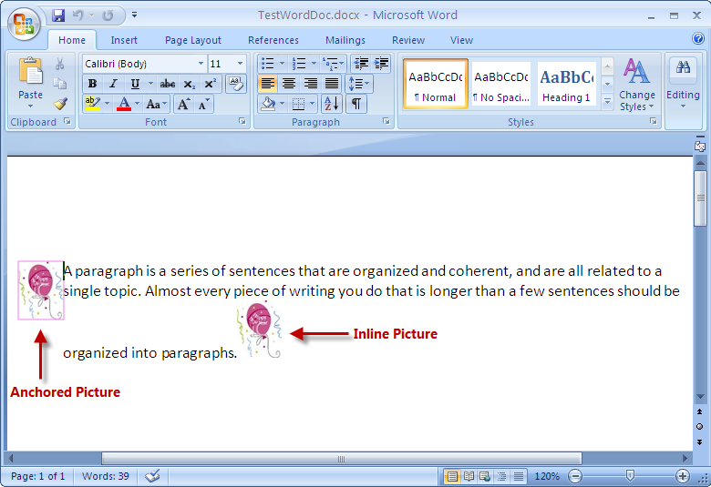

<!--
|metadata|
{
    "fileName": "word-add-images-to-word-document",
    "controlName": "Infragistics Word Library",
    "tags": ["How Do I"]
}
|metadata|
-->

# Word Add Images to Word Document

Infragistics® Word library supports two kinds of images that can be added to a new Word document using the [WordDocumentWriter](Infragistics.Web.Mvc.Documents.IO~Infragistics.Documents.Word.WordDocumentWriter.html) streamer object: anchored and inline image (also referred to here as a picture).

Anchored are pictures “anchored” to a specific location within the document with adjacent text flowing around its boundaries. By contrast, “inline” pictures move with the adjacent content within the paragraph.

The following screenshot shows a Word document created with an anchored and an inline picture.



> **Note:** The code to add anchored and inline images must be between the [StartParagraph](Infragistics.Web.Mvc.Documents.IO~Infragistics.Documents.Word.WordDocumentWriter~StartParagraph.html) and [EndParagraph](Infragistics.Web.Mvc.Documents.IO~Infragistics.Documents.Word.WordDocumentWriter~EndParagraph.html) methods of the WordDocumentWriter object.

## Adding Anchored Pictures
To add an anchored picture to the current paragraph, you use an instance of the WordDocumentWriter class to call the [CreateAnchoredPicture](Infragistics.Web.Mvc.Documents.IO~Infragistics.Documents.Word.WordDocumentWriter~CreateAnchoredPicture.html) method which returns an instance of AnchoredPicture. This reference is passed as a parameter to the [AddAnchoredPicture](Infragistics.Web.Mvc.Documents.IO~Infragistics.Documents.Word.WordDocumentWriter~AddAnchoredPicture.html) method of the WordDocumentWriter object.

**In C#:**

```csharp
//  Create a new instance of the WordDocumentWriter class using the
//  static 'Create' method.
WordDocumentWriter docWriter = WordDocumentWriter.Create(@"C:TestWordDoc.docx");
// Get Image
Image img = Image.FromFile(@"....Ballon_New_Year.jpg");
// Create an Anchored Image
AnchoredPicture anchPic = docWriter.CreateAnchoredPicture(img);
docWriter.AddAnchoredPicture(anchPic);
```

**In Visual Basic:**

```vb
'  Create a new instance of the WordDocumentWriter class using the
'  static 'Create' method.
Dim docWriter As WordDocumentWriter = WordDocumentWriter.Create("C:\TestWordDoc.docx")
' Get Image
Dim img As Image = Image.FromFile("..\..\Ballon_New_Year.jpg")
' Create an Anchored Image
Dim anchPic As AnchoredPicture = docWriter.CreateAnchoredPicture(img)
docWriter.AddAnchoredPicture(anchPic)
```

## Adding Inline Pictures
To add inline pictures to a paragraph, you use the the [AddInlinePicture](Infragistics.Web.Mvc.Documents.IO~Infragistics.Documents.Word.WordDocumentWriter~AddInlinePicture.html) method of the WordDocumentWriter object.

**In C#:**

```csharp
//  Create a new instance of the WordDocumentWriter class using the
//  static 'Create' method.
WordDocumentWriter docWriter = WordDocumentWriter.Create(@"C:TestWordDoc.docx");
// Get Image
Image img = Image.FromFile(@"....Ballon_New_Year.jpg");
// Add an Inline picture
docWriter.AddInlinePicture(img);
```

**In Visual Basic:**

```vb
'  Create a new instance of the WordDocumentWriter class using the
'  static 'Create' method.
Dim docWriter As WordDocumentWriter = WordDocumentWriter.Create("C:\TestWordDoc.docx")
' Get Image
Dim img As Image = Image.FromFile("..\..\Ballon_New_Year.jpg")
' Add an Inline picture
docWriter.AddInlinePicture(img)
```

> **Note:** Before the AddAnchoredPicture or AddInlinePicture method is used you must begin a paragraph using the StartParagraph method, or an exception is thrown.

To define properties of the outline that is displayed around an anchored picture you can use the PictureOultlineProperties class. The [CreatePictureOutlineProperties](Infragistics.Web.Mvc.Documents.IO~Infragistics.Documents.Word.WordDocumentWriter~CreatePictureOutlineProperties.html) method of the WordDocumentWriter object returns an instance which contains reference to the PictureOutlineProperties class. This reference exposes the various outline properties. These properties can be defined only for anchored pictures.

**In C#:**

```csharp
// Define the picture outline properties
PictureOutlineProperties picOutlineProps = docWriter.CreatePictureOutlineProperties();
picOutlineProps.Color = Color.Violet;
picOutlineProps.Style = PictureOutlineStyle.Single;
picOutlineProps.LineWidth = 1;
' Get Image
Image img = Image.FromFile(@"....Ballon_New_Year.jpg");
// Create an Anchored Image
AnchoredPicture anchPic = docWriter.CreateAnchoredPicture(img);
anchPic.AlternateTextDescription = "Word Image";
anchPic.Outline.Color = picOutlineProps.Color;
anchPic.Outline.Style = picOutlineProps.Style;
anchPic.Outline.LineWidth = picOutlineProps.LineWidth;
```

**In Visual Basic:**

```vb
' Define the picture outline properties
Dim picOutlineProps As PictureOutlineProperties = docWriter.CreatePictureOutlineProperties()
picOutlineProps.Color = Color.Violet
picOutlineProps.Style = PictureOutlineStyle.[Single]
picOutlineProps.LineWidth = 1
' Get Image
Dim img As Image = Image.FromFile("..\..\Ballon_New_Year.jpg")
' Create an Anchored Image
Dim anchPic As AnchoredPicture = docWriter.CreateAnchoredPicture(img)
' Assign the picture outline properties for anchored image
anchPic.AlternateTextDescription = "Word Image"
anchPic.Outline.Color = picOutlineProps.Color
anchPic.Outline.Style = picOutlineProps.Style
anchPic.Outline.LineWidth = picOutlineProps.LineWidth
```

## Mixing Anchored and Inline Pictures
**In C#:**

```csharp
//  Create a new instance of the WordDocumentWriter class using the
//  static 'Create' method.
WordDocumentWriter docWriter = WordDocumentWriter.Create(@"C:TestWordDoc.docx");

docWriter.StartDocument();
docWriter.StartParagraph();
docWriter.AddTextRun("A paragraph is a series of sentences that are organized and coherent, and are all related to a single topic. Almost every piece of writing you do that is longer than a few sentences should be organized into paragraphs.");

// Define the picture outline properties
PictureOutlineProperties picOutlineProps = docWriter.CreatePictureOutlineProperties();
picOutlineProps.Color = Color.Violet;
picOutlineProps.Style = PictureOutlineStyle.Single;
picOutlineProps.LineWidth =1;
// Get Image
Image img = Image.FromFile(@"....Ballon_New_Year.jpg");

// Create an Anchored Image
AnchoredPicture anchPic = docWriter.CreateAnchoredPicture(img);
// Assign the picture outline properties for anchored image
anchPic.AlternateTextDescription = "Word Image";
anchPic.Outline.Color = picOutlineProps.Color;
anchPic.Outline.Style = picOutlineProps.Style;
anchPic.Outline.LineWidth = picOutlineProps.LineWidth;
docWriter.AddAnchoredPicture(anchPic);

// Add an Inline picture
docWriter.AddInlinePicture(img);

docWriter.EndParagraph();
docWriter.EndDocument();
docWriter.Close();
```

**In Visual Basic:**

```vb
'  Create a new instance of the WordDocumentWriter class using the
'  static 'Create' method.
Dim docWriter As WordDocumentWriter = WordDocumentWriter.Create("C:\TestWordDoc.docx")
docWriter.StartDocument()
docWriter.StartParagraph()
docWriter.AddTextRun("A paragraph is a series of sentences that are organized and coherent, and are all related to a single topic. Almost every piece of writing you do that is longer than a few sentences should be organized into paragraphs.")

' Define the picture outline properties
Dim picOutlineProps As PictureOutlineProperties = docWriter.CreatePictureOutlineProperties()
picOutlineProps.Color = Color.Violet
picOutlineProps.Style = PictureOutlineStyle.[Single]
picOutlineProps.LineWidth =1
' Get Image
Dim img As Image = Image.FromFile("..\..\Ballon_New_Year.jpg")

' Create an Anchored Image
Dim anchPic As AnchoredPicture = docWriter.CreateAnchoredPicture(img)
' Assign the picture outline properties for anchored image
anchPic.AlternateTextDescription = "Word Image"
anchPic.Outline.Color = picOutlineProps.Color
anchPic.Outline.Style = picOutlineProps.Style
anchPic.Outline.LineWidth = picOutlineProps.LineWidth
docWriter.AddAnchoredPicture(anchPic)

' Add an Inline picture
docWriter.AddInlinePicture(img)

docWriter.EndParagraph()
docWriter.EndDocument()
docWriter.Close()
```

## Related Topics
-   [Creating a Word Document](Word-Create-a-Word-Document.html)
-   [Applying Formatting to Word Document](Word-Apply-Formatting-to-Word-Document.html)
-   [Adding Table to Word Document](Word-Add-Table-to-Word-Document.html)
-   [Headers Footers and Page Numbers](Word-Headers-Footers-and-Page-Numbers.html)
-   [Understanding Infragistics Word Library](Word-Understanding-Infragistics-Word-Library.html)

 

 


