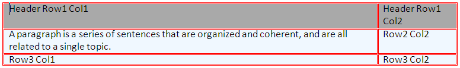
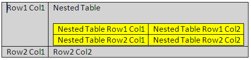

<!--
|metadata|
{
    "fileName": "word-add-table-to-word-document",
    "controlName": "Infragistics Word Library",
    "tags": ["How Do I","Layouts"]
}
|metadata|
-->

# Adding Table to Word Document

This document demonstrates with examples how to add to a Word document a table with a heading row and a nested table.

The topic is organized as follows:

-   [Introduction](#Intro)
-   [Requirements](#Req)
-   [Formatting Tables - Overview](#FormatTable)
-   [Examples](#Ex)
-   [Related Topics](#relatedTopics)

## <a id="Intro"></a> Introduction
Infragistics® Word library enables you to insert tables in your Word document. A table will help you align columns and rows of text with ease.

## <a id="Req"></a> Requirements
A reference to the Infragsitics3.Documents.IO assembly is required.

## <a id="FormatTable"></a> Formatting Tables - Overview
Formatting table, table rows, and table cells is handled by various classes, such as:

-   [TableProperties](Infragistics.Web.Mvc.Documents.IO~Infragistics.Documents.Word.TableProperties.html)
-   [TableRowProperties](Infragistics.Web.Mvc.Documents.IO~Infragistics.Documents.Word.TableRowProperties.html)
-   [TableCellProperties](Infragistics.Web.Mvc.Documents.IO~Infragistics.Documents.Word.TableCellProperties.html)
-   [TableBorderProperties](Infragistics.Web.Mvc.Documents.IO~Infragistics.Documents.Word.TableBorderProperties.html)

## <a id="Ex"></a> Examples
### Example: Creating a Table With a Header Row
The code below creates a table with two columns and three rows using the [WordDocumentWriter](Infragistics.Web.Mvc.Documents.IO~Infragistics.Documents.Word.WordDocumentWriter.html) streamer object. The first row is set as a header row using the [IsHeaderRow](Infragistics.Web.Mvc.Documents.IO~Infragistics.Documents.Word.TableRowProperties~IsHeaderRow.html) property of the TableRowProperties object.

## Preview
Following is a preview of the final result:



### Figure 1: A table with headers in Word document as created by the example code

## Code Sample
**In C#:**

```csharp
using Infragistics.Documents.Word;

// Create a new instance of the WordDocumentWriter class using the
// static 'Create' method.
// This instance must be closed once content is written into Word.
WordDocumentWriter docWriter = WordDocumentWriter.Create(@"C:TestWordDoc.docx");
docWriter.StartDocument();

// Create border properties for Table
TableBorderProperties borderProps = docWriter.CreateTableBorderProperties();
borderProps.Color = Color.Red;
borderProps.Style = TableBorderStyle.Double;
// Create table properties
TableProperties tableProps = docWriter.CreateTableProperties();
tableProps.Alignment = ParagraphAlignment.Center;
tableProps.BorderProperties.Color = borderProps.Color;
tableProps.BorderProperties.Style = borderProps.Style;
// Create table row properties
TableRowProperties rowProps = docWriter.CreateTableRowProperties();
//Make the row a Header
rowProps.IsHeaderRow = true;
// Create table cell properties
TableCellProperties cellProps = docWriter.CreateTableCellProperties();
cellProps.BackColor = Color.DarkGray;
cellProps.TextDirection = TableCellTextDirection.LeftToRightTopToBottom;

// Begin a table with 2 columns, and apply the table properties
docWriter.StartTable(2, tableProps);
// Begin a Row and apply table row properties
// This row will be set as the Header row by the row properties
// HEADER ROW
docWriter.StartTableRow(rowProps);
// Cell Value for 1st row 1st column
// Start a Paragraph and add a text run to the cell
docWriter.StartTableCell(cellProps);
docWriter.StartParagraph();
docWriter.AddTextRun("Header Row1 Col1");
docWriter.EndParagraph();
docWriter.EndTableCell();
// Cell value for 1st row 2nd column
docWriter.StartTableCell(cellProps);
docWriter.StartParagraph();
docWriter.AddTextRun("Header Row1 Col2");
docWriter.EndParagraph();
docWriter.EndTableCell();
// End the Table Row
docWriter.EndTableRow();

// Reset the cell properties, so that the
// cell properties are different from the header cells.
cellProps.Reset();
cellProps.BackColor = Color.AliceBlue;

// DATA ROW
docWriter.StartTableRow();
// Cell Value for 2nd row 1st column
docWriter.StartTableCell(cellProps);
docWriter.StartParagraph();
docWriter.AddTextRun("A paragraph is a series of sentences that are organized and coherent, and are all related to a single topic. ");
docWriter.EndParagraph();
docWriter.EndTableCell();
// Cell Value for 2nd row 2nd column
docWriter.StartTableCell(cellProps);
docWriter.StartParagraph();
docWriter.AddTextRun("Row2 Col2");
docWriter.EndParagraph();
docWriter.EndTableCell();
docWriter.EndTableRow();
// DATA ROW
docWriter.StartTableRow();
// Cell Value for 3rd row 1st column
docWriter.StartTableCell(cellProps);
docWriter.StartParagraph();
docWriter.AddTextRun("Row3 Col1");
docWriter.EndParagraph();
docWriter.EndTableCell();
// Cell Value for 3rd row 2nd column
docWriter.StartTableCell(cellProps);
docWriter.StartParagraph();
docWriter.AddTextRun("Row3 Col2");
docWriter.EndParagraph();
docWriter.EndTableCell();
docWriter.EndTableRow();
docWriter.EndTable();
docWriter.EndDocument();
// Close the WordDocumentWriter instance.
docWriter.Close();
```
## Example: Creating a Nested Table
Nested Table is a table appearing inside another table. The following code creates a primary table with two columns, two rows and a nested table with two columns, two rows. The first row second column of the primary table holds the nested table.

## Preview
Following is a preview of the final result:



###### Figure 2: A nested table in Word document as created by the example code

## Code Sample
**In C#:**

```csharp
// Create a new instance of the WordDocumentWriter
// class using the static 'Create' method.
// This instance must be closed once content is written into Word.
WordDocumentWriter docWriter = WordDocumentWriter.Create(@"C:TestWordDoc.docx");

TableCellProperties cellProps = docWriter.CreateTableCellProperties();
cellProps.BackColor = Color.LightGray;
docWriter.StartDocument();
// Begin a Table with 2 columns
docWriter.StartTable(2);
// Begin a table row
docWriter.StartTableRow();
// Begin Table cell for first row first column
docWriter.StartTableCell(cellProps);
docWriter.StartParagraph();
docWriter.AddTextRun("Row1 Col1");
docWriter.EndParagraph();
docWriter.EndTableCell();
// Begin Table cell for first row second column
docWriter.StartTableCell(cellProps);

#region // Nested Table
docWriter.StartParagraph();
docWriter.AddTextRun("Nested Table");
docWriter.AddNewLine();
docWriter.EndParagraph();
docWriter.StartTable(2);
docWriter.StartTableRow();
cellProps.Reset();
cellProps.BackColor = Color.Yellow;
docWriter.StartTableCell(cellProps);
docWriter.StartParagraph();
docWriter.AddTextRun("Nested Table Row1 Col1");
docWriter.EndParagraph();
docWriter.EndTableCell();
docWriter.StartTableCell(cellProps);
docWriter.StartParagraph();
docWriter.AddTextRun("Nested Table Row1 Col2");
docWriter.EndParagraph();
docWriter.EndTableCell();
docWriter.EndTableRow();
docWriter.StartTableRow();
docWriter.StartTableCell(cellProps);
docWriter.StartParagraph();
docWriter.AddTextRun("Nested Table Row2 Col1");
docWriter.EndParagraph();
docWriter.EndTableCell();
docWriter.StartTableCell(cellProps);
docWriter.StartParagraph();
docWriter.AddTextRun("Nested Table Row2 Col2");
docWriter.EndParagraph();
docWriter.EndTableCell();
docWriter.EndTableRow();
// For nested tables at least one paragraph must be added after adding the table within the cell.
// The EndTable method exposes an overload that adds an empty paragraph. 
docWriter.EndTable(true);
#endregion // Nested Table

docWriter.EndTableCell();
docWriter.EndTableRow();
docWriter.StartTableRow();
cellProps.Reset();
cellProps.BackColor = Color.LightGray;
docWriter.StartTableCell(cellProps);
docWriter.StartParagraph();
docWriter.AddTextRun("Row2 Col1");
docWriter.EndParagraph();
docWriter.EndTableCell();
docWriter.StartTableCell(cellProps);
docWriter.StartParagraph();
docWriter.AddTextRun("Row2 Col2");
docWriter.EndParagraph();
docWriter.EndTableCell();
docWriter.EndTableRow();
docWriter.EndTable();
docWriter.EndDocument();
// Close the WordDocumentWriter instance.
docWriter.Close();
```

## <a id="relatedTopics"></a> Related Topics
-   [Creating a Word Document](Word-Create-a-Word-Document.html)
-   [Applying Formatting to Word Document](Word-Apply-Formatting-to-Word-Document.html)
-   [Word Add Images to Word Document](Word-Add-Images-to-Word-Document.html)
-   [Headers Footers and Page Numbers](Word-Headers-Footers-and-Page-Numbers.html)
-   [Understanding Infragistics Word Library](Word-Understanding-Infragistics-Word-Library.html)

 

 


