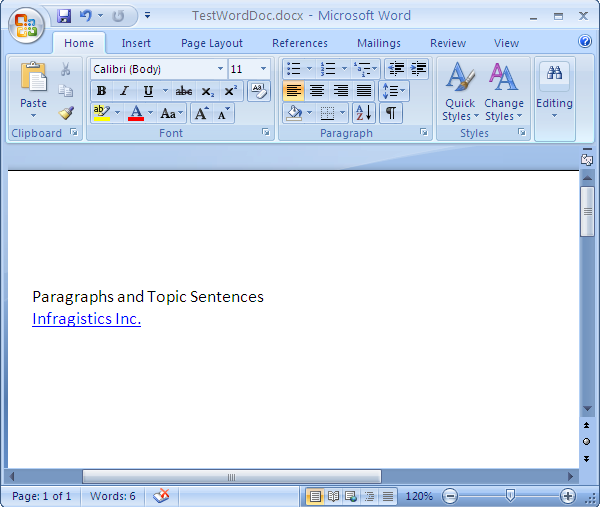

<!--
|metadata|
{
    "fileName": "word-create-a-word-document",
    "controlName": "Infragistics Word Library",
    "tags": ["Formatting","Getting Started","How Do I"]
}
|metadata|
-->

# Creating a Word Document

This topic illustrates how to create a Word document using the forward-only [WordDocumentWriter](Infragistics.Web.Mvc.Documents.IO~Infragistics.Documents.Word.WordDocumentWriter.html) streamer object. The static Create method of the `WordDocumentWriter` object creates a new Word document.

The following screenshot shows a Word document created with text and hyperlink:



The various properties of the document such as `Author`, `Title`, `Subject` etc., can be set using the [DocumentProperties](Infragistics.Web.Mvc.Documents.IO~Infragistics.Documents.Word.WordDocumentWriter~DocumentProperties.html) property of the `WordDocumentWriter` object. These information can be accessed in Word 2007 by clicking the Office Button and navigating to Prepare > Properties section. Similarly in Word 2010 by clicking the File tab the document properties can be accessed from the right side of the backstage view.

In order to start writing into the Word document use the [StartDocument](Infragistics.Web.Mvc.Documents.IO~Infragistics.Documents.Word.WordDocumentWriter~StartDocument.html) method that must be balanced with a corresponding call to the [EndDocument](Infragistics.Web.Mvc.Documents.IO~Infragistics.Documents.Word.WordDocumentWriter~EndDocument.html) method.

A Paragraph provides the ability to display a block of text which can be aligned or indented. Use the [StartParagraph](Infragistics.Web.Mvc.Documents.IO~Infragistics.Documents.Word.WordDocumentWriter~StartParagraph.html) method to begin a paragraph. The [AddTextRun](Infragistics.Web.Mvc.Documents.IO~Infragistics.Documents.Word.WordDocumentWriter~AddTextRun.html) method provides a way to add content to the paragraph. Once content is added the paragraph must be closed using the [EndParagraph](Infragistics.Web.Mvc.Documents.IO~Infragistics.Documents.Word.WordDocumentWriter~EndParagraph.html) method.

> **Note:** A reference to the `Infragistics.Web.Mvc.Documents.IO` assembly is required for the following code.

> **Note:** When using the `WordDocumentWriter` object for creating Word documents the streamer object must be disposed or closed using either the Dispose or Close method.

**In C#:**

```csharp
using Infragistics.Documents.Word;

// Create a new instance of the WordDocumentWriter class
// using the static 'Create' method.
WordDocumentWriter docWriter = WordDocumentWriter.Create(@"C:TestWordDoc.docx");
// Use inches as the unit of measure
docWriter.Unit = UnitOfMeasurement.Inch;
// Set the document properties, such as title, author, etc.
docWriter.DocumentProperties.Title = "Sample Document";
docWriter.DocumentProperties.Author = string.Format("Infragistics.{0}", SystemInformation.UserName);
// Start the document...note that each call to
// StartDocument must be balanced with a corresponding call to EndDocument.
docWriter.StartDocument();
//  Start a paragraph
docWriter.StartParagraph();
//  Add a text run for the title
docWriter.AddTextRun("Paragraphs and Topic Sentences");
// Add a new line
docWriter.AddNewLine();
//  Add a Hyperlink
docWriter.AddHyperlink("http://www.infragistics.com", "Infragistics Inc.");
//  End the paragraph
docWriter.EndParagraph();
//  End Document
docWriter.EndDocument();
// Close the writer
docWriter.Close();
```

## Related Topics
-   [Applying Formatting to Word Document](Word-Apply-Formatting-to-Word-Document.html)
-   [Adding Table to Word Document](Word-Add-Table-to-Word-Document.html)
-   [Word Add Images to Word Document](Word-Add-Images-to-Word-Document.html)
-   [Headers Footers and Page Numbers](Word-Headers-Footers-and-Page-Numbers.html)
-   [Understanding Infragistics Word Library](Word-Understanding-Infragistics-Word-Library.html)

 

 


