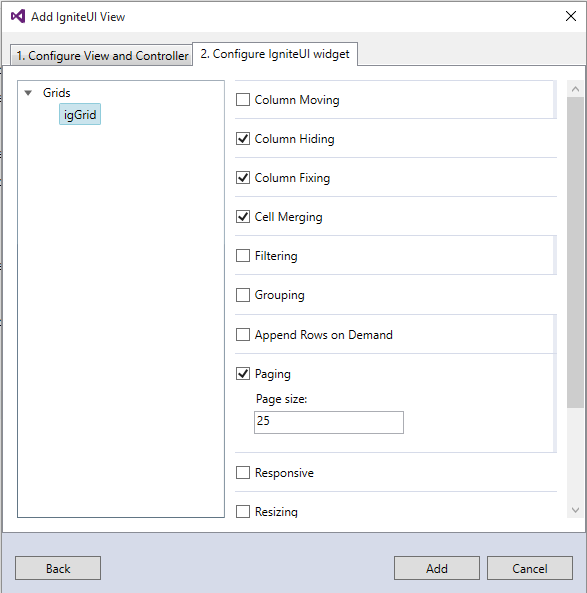

<!--
|metadata|
{
    "fileName": "scaffoldertopic",
    "controlName": "",
    "tags": ["ASP.NET MVC","Getting Started"]
}
|metadata|
-->
# Ignite UI Scaffolder Visual Studio extension

### Introduction

With the 2015.2 Release, we introduce the **Ignite UI** Scaffolder Extension.

It allows the developer to easily generate MVC wrapper widget declarations, as well as related Controller action methods.
This saves a lot of time for manual setup, referencing and coding.

At present, included in the Scaffolding mechanism is the **igGrid** component, with plans to add many more components in the upcoming releases.

### Usage

In order to take advantage of the Scaffolding mechanism, just follow the steps outlined below:

1. Open Visual Studio and the project that you want to use, or a new one.
2. In the *Solution Explorer*, right click on the project node, or on any of the folders in the solution.
3. Click on the "Add" menu item and then on "New Scaffolder Item..." option.
This set of steps is demonstrated in the screenshot below:

4. Next, you will be prompted to choose the type of Scaffolding item you want - this can be an "Ignite UI View" or an "Ignite UI Controller with View".
These selection options are demonstrated in the screenshot below:

The difference between these two options is that one adds a simple View, whereas the other one creates a View, along with a controller.
5. The next Scaffolder setup steps are optimized for the fasted possible utilization and consist of two easy steps.
In the first tab you set the overall properties for the scaffolded control, such as View Name and Theme.
In the second and last tab, you can choose which properties to enable in the component, such as *Paging*, *Column Hiding*, etc.
This is demonstrated in the screenshot below:

6. Once we are done with the settings for the component that we are adding, we click on the "Add" button. This automatically adds a view, containing the widget wrapper definition, along with all the settings that we have enabled.
You can further customize it, add or remove properties and methods, as you would normally do in a standard view, containing an Ignite UI widget wrapper.
