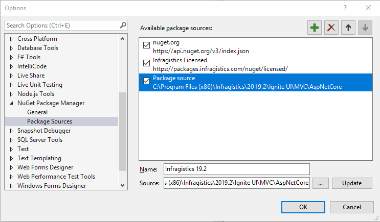
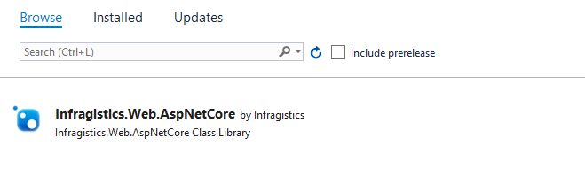

<!--
|metadata|
{
    "fileName": "mvc-aspnet-core3",
    "controlName": "",
    "tags": ["ASP.NET MVC","Getting Started"]
}
|metadata|
-->

# Using %%ProductName%% controls in ASP.NET Core 3.0

## Topic Overview

This topic explains how to get started with %%ProductName%%™ components in an ASP.NET Core Web Application built with ASP.NET Core 3.0.

### In this topic

This topic contains the following sections:

-   [Referencing the Infragistics Web MVC NuGet package](#nuget)
-   [Configuring the igUpload Middleware for file upload handling](#middleware)
-   [Related Content](#related)

## <a id="nuget"></a> Referencing the Infragistics Web MVC NuGet package

### <a id="nuget-local"></a> Using local feed
With the new ASP.NET most modules are now wrapped as NuGet packages. This allows you to retrieve and use only the specific modules you need for your application, without having to depend on a common assembly. All dependencies of the specific module will be restored out of the box.


As such our new MVC wrappers built on top of ASP.NET Core will also ship as a NuGet package. 
The NuGet package can be found in the installation directory of the %%ProductName%% product under "MVC\AspNetCore". In the folder there is a zip file that contains the NuGet package. You need to unzip it first.

To add that directory (where you unzipped the file) as a package source for the NuGet package manager you can open the package manager and open the settings via the gear button.


	 
From the options window add a new package source and change the source path to point to the NuGet package in the installation directory. The result should look similar to the following screenshot.


	 
Once the source is configured you can select it as the currently active package source and you'll find the NuGet package in the "Browse" tab.



You can install it via the "Install" button.

Control's declaration follows the same syntax as the previous MVC versions. You can refer to the following topic for more information and examples: [Adding Controls to an MVC Project](Adding-NetAdvantage-Controls-to-an-MVC-Project.html)

### <a id="nuget-licensed"></a> Using online private feed

You can also install Infragistics Web MVC NuGet package using the Infragistics hosted NuGet server. Checkout [Installing Ignite UI packages from the online private feed](using-ignite-ui-nuget-packages.html#privateFeedInstallation) topic for more information.

## <a id="middleware"></a> Configuring the igUpload Middleware for file upload handling

In the old ASP.NET in order to handle more robust file uploading capabilities as multiple file uploads, large file uploads and reporting of the progress of an upload you would have to implement an HttpModule and/or HttpHandler in order to plug into the HTTP Request process.  
ASP.NET Core introduces a new request pipeline built around a new middleware definition. 
The %%ProductName%% file upload fully utilizes the new middleware definition model and can be directly plugged into the pipeline.
There are two middleware modules - one for handling uploads and one for receiving commands from the client and returning status feedback to the client. 
In order to add them to the pipeline they need to be include in the Configure method of the Startup.cs class before the MVC module.  

**In C#:**

```csharp
	 public void Configure(IApplicationBuilder app, IHostingEnvironment env, ILoggerFactory loggerFactory) 
        { 
			... 
            app.UseUploadModuleMiddleware(); 
            app.UseUploadHandlerMiddleware(); 
 
            app.UseMvc(routes => 
            { 
                routes.MapRoute( 
                    name: "default", 
                    template: "{controller=Home}/{action=Index}/{id?}"); 
            }); 
			
			...
		}
```

Additional settings for the upload can be set in the ConfigureServices method. The options can either be set declaratively or retrieved from the configurations file.


**In C#:**

```csharp
	public void ConfigureServices(IServiceCollection services)
        {
        	...
			services.Configure<UploadAppSettings>(options => {
                options.FileUploadPath = Configuration["UploadAppSettings:fileUploadPath"]; 
            });
		}
```


## <a id='related'></a> Related Content
- [Adding Controls to an MVC Project](Adding-NetAdvantage-Controls-to-an-MVC-Project.html)