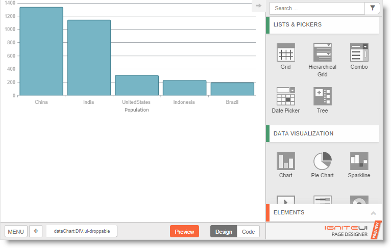
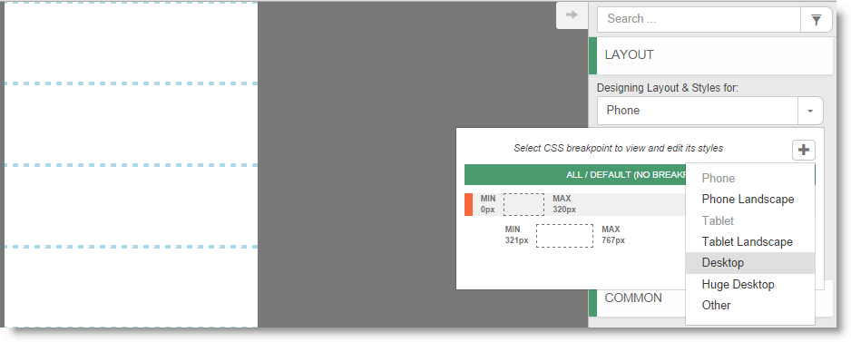
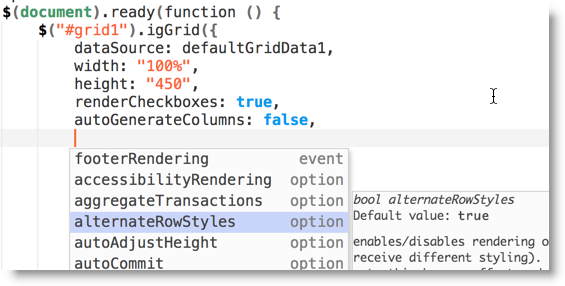
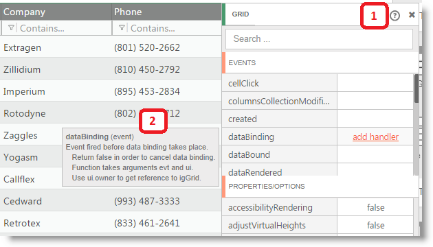
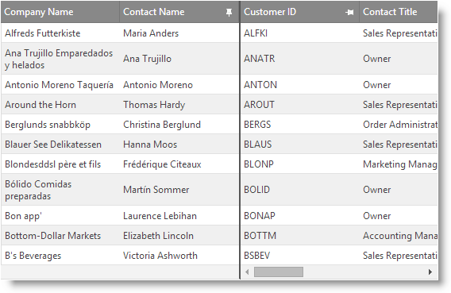
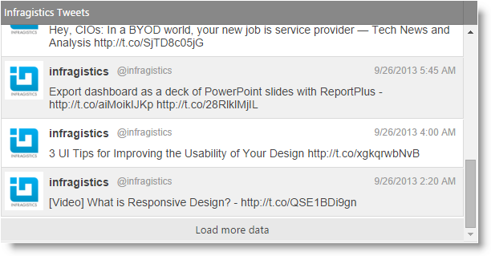
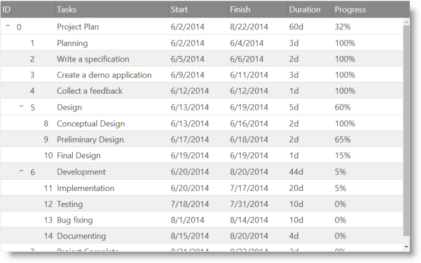
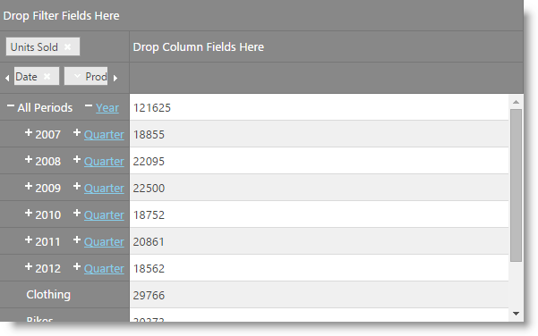
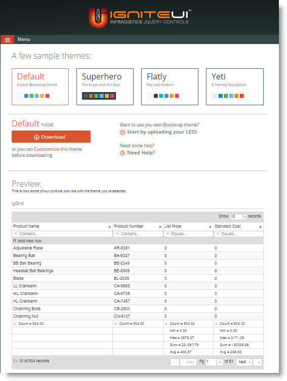
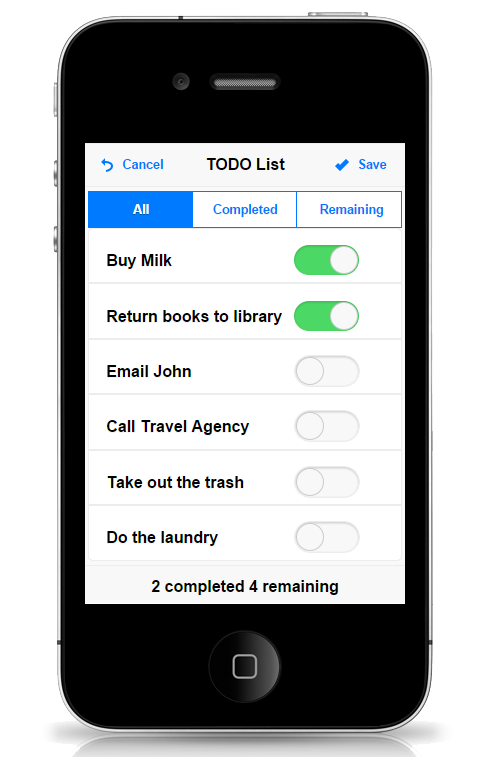

<!--
|metadata|
{
    "fileName": "whats-new-in-2014-volume2",
    "controlName": [],
    "tags": []
}
|metadata|
-->

#What's New in 2014 Volume 2

This topic presents the controls and the new and enhanced features for the Ignite UI™ 2014 Volume 2 release.

##What’s New Summary

The following summarizes what’s new in 2014 Volume 2. Additional details follow.

### General

Feature | Description
---|---
[AngularJS directives](#angular-directives) | Now Ignite UI controls feature custom directives for AngularJS.

### Ignite UI Page Designer

Feature | Description
---|---
[WYSIWYG for HTML5](#wysiwyg) | New drag-n-drop UI design surface for Modern Web using Ignite UI controls.
Responsive Web Design (RWD) | Visualize and manage breakpoints to make responsive design easier.
Clean Code Editor | See, edit, and copy clean code to incorporate into your projects.
Easier Data Access | Easily configure Ignite UI data source components to connect your controls to your data.
Integrated API Help | See help for API members in both the component editor and in the code editor.

### Client-Side Excel Library

Feature | Description
---|---
[New Library (CTP)](#new-library)|100% pure JavaScript client-side Excel library that can be used for creating, loading, and editing Excel documents in the browser.

### igGrid

Feature | Description
---|---
[Column Fixing works with row virtualization](#column-fixing-row-virtualization) | Now you can enable both Column Fixing and row virtualization in the grid.
[Append Rows on Demand (RTM)](#append-rows-on-demand) | Load on Demand feature is RTM and renamed to Append Rows on Demand.
[Selection feature improvements](#selection-feature-improvements) |Selection feature codebase is completely reworked.

### igTreeGrid

Feature | Description
---|---
[New Control (CTP)](#new-control) | The igTreeGrid™ control allows you to visualize hierarchical data with common data schema into a single set of columns.

### igPivotGrid

Feature | Description
---|---
[Tree layout](#tree-layout)|The `igPivotGrid`™ control now allows you to visualize the row hierarchies in a tree-like structure.

### Theming

Feature | Description
---|---
[Bootstrap theming](#bootstrap-theming) | Ignite UI controls now support Bootstrap theming.
[New theme (RTM)](#new-theme) | The iOS 7-style theme is now RTM and renamed to just iOS theme—replaces prior iOS6-style theme. The theme also added support for the jQuery Mobile 1.4 + controls.
[Updated themes to support jQuery UI 1.11+](#update-themes) | New theme files are added in order to support jQuery UI 1.11+ own controls.

##General

### AngularJS directives

We launched a preview of AngularJS directives last release on our GitHub repo; they are now officially in the product as well and are considered RTM.

All of the Ignite UI controls can be instantiated declaratively with custom tags or from the controller or via controller options. Further, the following controls support two-way data binding:

-   igGrid
-   igCombo
-   igEditors
-   igTree
-   igDataChart

#### Related Content

[AngularJS Directives](AngularJS-Directives.html)

[Ignite UI directives for AngularJS on GitHub](https://github.com/IgniteUI/igniteui-angular)

#### Related Samples

[Ignite UI directives for AngularJS samples](http://igniteui.github.io/igniteui-angular/)

##Ignite UI Page Designer

### WYSIWYG for HTML5

Leverage common HTML elements, Bootstrap components, and of course Ignite UI components to lay out and jumpstart your modern LOB pages. It’s the best way to learn to use Ignite UI and more quickly configure Ignite UI controls to then copy into your projects.

**Use it now at [%%DesignerUrl%%](%%DesignerUrl%%) !**

### Responsive Web Design (RWD)

Visualize and edit your responsive CSS breakpoints and jump into editing the CSS for breakpoints easily. You can also use Bootstrap row components or Ignite UI layout components to easily defing a grid layout for your responsive page.

### Clean Code Editor

We built on top of the world-class ACE code editor to help you see, edit, and copy clean code for your projects as well as help you define component options.

### Easier Data Access

The Ignite UI data source components make it easier to connect your controls to your data, and the Page Designer makes those easier to use with custom component editors and letting you easily set your data sources on components that use them. You can pick a data source from a list in the component editor or just drop a data source onto controls like the grid to get started.

### Integrated API Help

Throughout the designer, we incorporate API help so that you don’t have to go digging for it. We do it in the code editor as well as in the component editor:

1.  For Ignite UI componets, you can click the ? link in the component editor to go directly to the API docs for that component.
2.  When hovering over properties and events, we show you the related API docs right there.

##Client-Side Excel Library

### New Library (CTP)

Our new Excel Library is a 100% pure JavaScript client-side library that supports loading and saving in Excel 2003 and later formats in the browser. From JavaScript you have the ability to control cell formats and styles, formula solving, merged cells, tables, data validations, and more.

#### Related Topics

-   [Ignite UI Client-Side Excel Library Overview](JavaScript-Excel-Library-Overview.html)
-   [Using the Ignite UI Client-Side Excel Library](Using-the-JavaScript-Excel-Library.html)

## igGrid

### Column Fixing works with row virtualization

Now you can enable fixed or continuous virtualization along with column fixing.

### Append Rows on Demand (RTM)

The previously known Load on Demand feature is now renamed to Append Rows on Demand in order to better communicate what it does and differentiate from the features with the similar names in other controls.

#### Related Topics

[Append Rows on Demand Overview (igGrid)](Append-Rows-On-Demand-Overview.html)

### Selection feature improvements

The `igGrid`™ Selection feature is completely reworked. As a result the codebase is reduced with 30% and some of the most resource intensive operations like selecting all the rows in a grid are optimized and now take less time to complete.

##igTreeGrid

### New Control (CTP)

The `igTreeGrid`™ control allows you to visualize a hierarchical data with common data schema into a single set of columns. We’d love your feedback, so please let us know what you think!

Supported features in the CTP are:

-   Column Fixing
-   Hiding
-   Filtering
-   Sorting
-   Updating
-   Paging
-   Resizing
-   Selection
-   Tooltips
-   Multi-Column Headers

#### Related Topics

-   [igTreeGrid Overview](igTreeGrid-Overview.html)

#### Related Samples

-   [File Explorer](%%NewSamplesUrl%%/tree-grid/file-explorer)
-   [Balance Sheet](%%NewSamplesUrl%%/tree-grid/balance-sheet)

##igPivotGrid

### Tree layout

The `igPivotGrid`™ control now allows you to visualize the row hierarchies in a tree-like structure. When multiple hierarchies are added, the members of each hierarchy are listed above or below each of the members of the previous hierarchy.

#### Related Samples

-   [Layout Modes](%%NewSamplesUrl%%/pivot-grid/layout-modes)

##Theming

### Bootstrap theming

This release adds a mechanism to apply any Bootstrap theme (which uses LESS variables defined by Bootstrap) look and feel to the Ignite UI controls. The resulting themes are standalone and can be used with or without Bootstrap.

The product comes with four preset themes “Bootstrap” (equivalent to the default Bootstrap theme), “Superhero”, “Yeti”, “Flatly” which are compiled against the respective themes taken from [bootswatch.com](http://bootswatch.com/) site.

There is also a new site which helps you create and customize themes.

Note: The four preset themes as well as the LESS files used to generate them are compatible only with jQuery UI 1.11+ controls (This is because jQuery UI 1.11 introduced some breaking changes in the CSS structure of their controls).

#### Related content

-   [Bootstrap Theme Generator](%%NewSamplesUrl%%/bootstrap-theme-generator)

### New theme (RTM)

The previously named iOS7 theme has been renamed to just iOS and replaces the prior iOS6-style theme. The iOS theme is now RTM and adds support for the Ignite UI Mobile Controls.

>**Note:** The mobile iOS theme supports jQuery Mobile 1.4.2+. The igListView control doesn’t support jQuery Mobile 1.4 and is not compatible with this theme.

#### Related samples

-   [iOS theme](%%NewSamplesUrl%%/themes/ios)

### Updated themes to support jQuery UI 1.11+

We updated our themes to support the jQuery UI 1.11+ own controls. However, because there are some breaking changes in the CSS structure in jQuery UI, you may see some minor issues in the look and feel of native jQuery UI controls when using Ignite UI themes.

                    