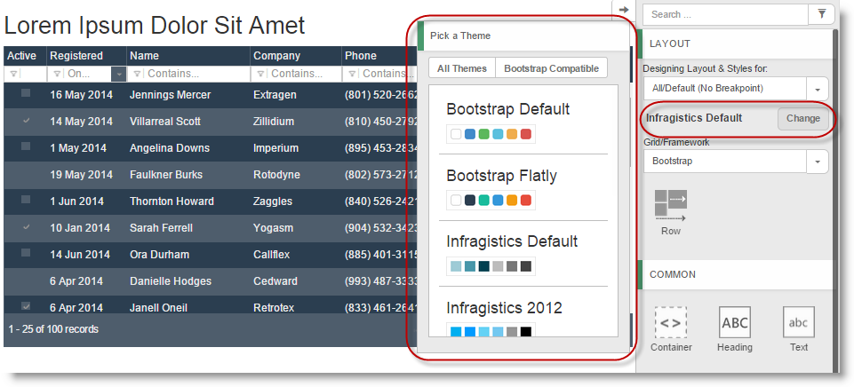
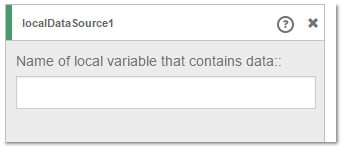
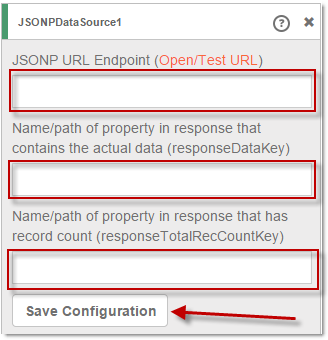
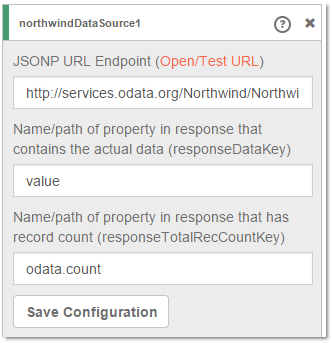
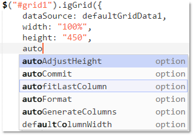
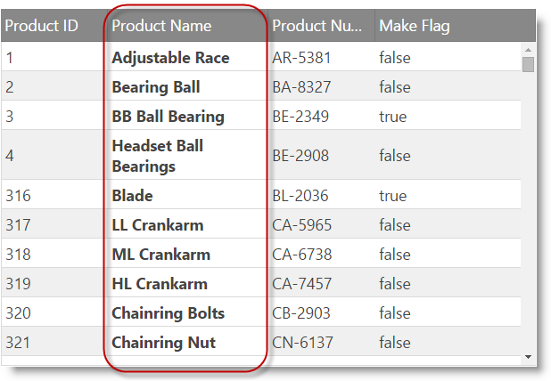
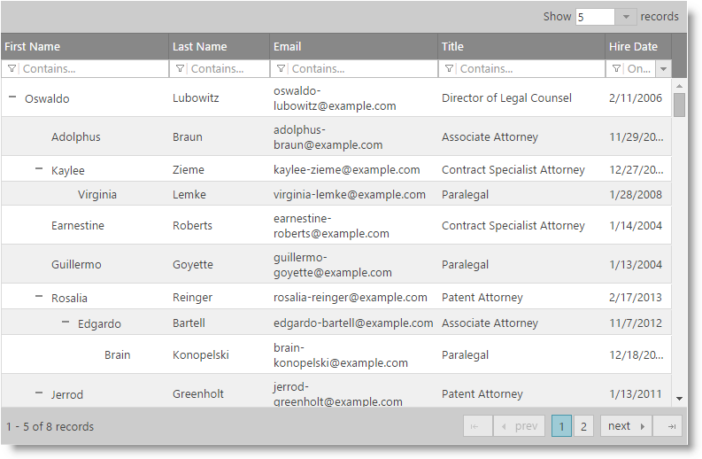
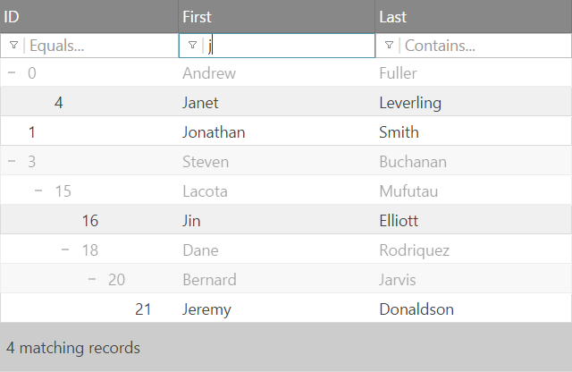
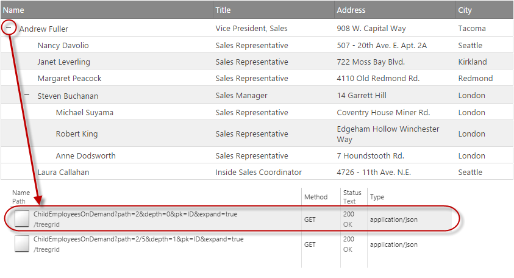

<!--
|metadata|
{
    "fileName": "whats-new-in-2015-volume1",
    "controlName": [],
    "tags": []
}
|metadata|
-->

#What's New in 2015 Volume 1

This topic presents the controls and the new and enhanced features for the Ignite UI™ 2015 Volume 1 release.

##What’s New Summary

The following summarizes what’s new in 2015 Volume 1. Additional details follow.

### General

Feature | Description
---|---
[New Ignite UI Help Viewer](#help-viewer) | We have a brand new, modernized help viewer for Ignite UI.

### Ignite UI Page Designer

Feature | Description
---|---
[Out-of-the-Box Theming Support](#page-designer-theming-support) | Added support for other Ignite UI themes and common Bootstrap-based themes that you can easily select with the built-in theme picker.
[Improved Data Sources Experience](#page-designer-datasource-expirience) | Added explicit support for JSONP data source and local data source as well as a new data source editor.
[Intellisense support for Ace](#page-designer-intellisense-support)  | Added support for showing intellisense when the designer is in code view and the user starts typing
[Remote data source – user friendly errors](#page-designer-remote-dataSource) | Web designer now has user interface for showing detailed information for the possible problem, while connecting to the remote data source

### Infragistics JavaScript Excel Library

Feature | Description
---|---
[New Library (RTM)](#new-javascript-excel-library)|100% pure JavaScript client-side Excel library that can be used for creating, loading, and editing Excel documents in the browser.

### igGrid

Feature | Description
---|---
[JavaScript-based Excel Grid Exporter (CTP)](#grid-excel-exporter) | You can export what users are looking at into an Excel file without any round-tripping to the server.
Column Fixing works with Column Moving | Now you can enable both Column Fixing and Column Moving in the grid.
Improved Column Fixing API | Now you can fix a column at specific position in the grid by supplying the target key of the column to its destination position in the grid.
More Flexibility in the Selection Feature | Multiple region selection is now possible with the Ctrl + Mouse Drag action. Selection regions may be non-contiguous.
Paging Persistence | The persist option is now added to the Paging feature.
[Responsive Feature Improvements](#grid-responsive-feature-improvements) | A new single column template mode  is added.
[Column Styling](#grid-column-styling) | We’ve added a new settings so that you can specify custom header and column CSS classes for igGrid columns configuration.

### igTreeGrid

Feature | Description
---|---
[New Control (RTM)](#tree-grid) | The igTreeGrid™ control is now RTM. The igTreeGrid™ control allows you to visualize hierarchical data with common data schema into a single set of columns.
[Tree-Specific Filtering](#tree-grid-filtering) | The igTreeGrid features a specialized filtering visualization that clearly shows context in filter results in the grid.
Tree-Specific Paging | When paging data in the grid, you have the option to page either visible data at just the root level or all visible levels.
Enhanced Expansion Options | In order to maintain flexibility, the tree grid features a configurable expansion indicator, which can be rendered inline in the first data column or in a standalone column. The expansion indicator can also be customized with a different look-and-feel to achieve custom visualizations.
Virtualization | The igTreeGrid includes continuous virtualization which allows you to bind the grid to large sets of hierarchical data while maintaining a high-performance experience.
[Remote Load on Demand](#tree-grid-remote-load-on-demand) | Sometimes large sets of data are rendered in the grid and you only want to supply the page with small sets of data at a time. By using remote load on demand, the igTreeGrid is able to add portions of the overall data to the grid as requested by the user.
Local Load on Demand | To further maintain a high-performance grid, the igTreeGrid features local load on demand which ensures that only expanded nodes are rendered in the browser. As a user expands a parent node, then new elements are created on-the-fly in the page to support new data shown to the user.

### igCombo

Feature | Description
---|---
[Rewritten Control](#combo)| In 15.1, we are shipping a brand new combo that is built with great UX and reliability as top priority.
Improved Styling| The new combo does not use inline CSS styling for positioning and sizing, which means it can rely on browser rendering optimizations more.
Improved Defaults| In some areas we have changed the defaults to provide a better UX out of the box, which also reduces the code necessary on your part to get to those optimal experiences for your end users.
New Keyboard Interactions| The old combo had the basics, but we have dramatically expanded what you can do with the keyboard, which makes it more efficient and natural for end users to navigate, select, expand, etc. without having to switch back and forth between the mouse and keys.
Improved Reliability| We've stripped down the size of the Combo with 44% reducing the code complexity as well as increasing the automation code coverage much higher.
API Improvements| We also took this opportunity to revisit some less-than-optimal API choices to improve discoverability and understandability of the API.
[Knockout Extension Improvements](#combo_ko)| Now the igCombo has a fully functional Knockout Extension which supports two-way data binding between a Knockout observable collection and the igCombo list, as well as two-way data binding for selected items in the combo.

### Mobile Controls

Feature | Description
---|---
jQuery Mobile 1.4+ Support | Ignite UI mobile controls are now compatible with the most recent version of jQuery Mobile, 1.4+.

##General

### New Ignite UI Help Viewer

We have a brand new, modernized help viewer for Ignite UI. This makes it much easier to navigate through and share individual topics, and you can also easily switch between product versions (for version 14.1 and up) directly in a topic.
Beyond making the experience easier to use, the actual topics themselves are now available on GitHub in Markdown. This means that you can easily report issues on topics or perhaps even submit additions or changes to a topic via a GitHub pull request.

#### Related Content

-   [Ignite UI Help Topics on GitHub](https://github.com/IgniteUI/help-topics)

##Ignite UI Page Designer

### Out-of-the-Box Theming Support
Selecting a theme from the list changes the theme for all the components already dropped on the design surface. 

### Improved Data Sources Experience
Page designer contains three predefined data source types - local, remote and Northwind. Both local and remote types provide different adorners for configuration settings. The NorthWind data source is a remote data source with predefined configuration pointing to the Northwind odata service requesting Customers with specific columns. 

####Local data source

####Remote data source

####NorthWind data source

### Intellisense support for Ace
The web designer now supports intellisense when the designer is in code mode and the cursor is inside a component. When the user starts typing the suggestions based on predefined options related to the widget

### Remote data source - user friendly errors
When data source is bound to a remote data, an error coming from the remote request may occur. Web designer now has user interface for showing detailed information for the possible problem, while connecting to the remote data source. The user can find important information for the response status, error, data type and content, without the need to investigate the problem using the browser tools.

##Infragistics JavaScript Excel Library

### New Library (RTM)

In 14.2, we CTP’d the first version of the "Client-Side Excel Library" which is now named "Infragistics JavaScript Excel Library". The RTM version includes smaller file size as well as enhanced browsers compatibility.

#### Related Topics

-   [Understanding the Infragistics JavaScript Excel Library](understanding-the-infragistics-javascript-excel-library.html)
-   [Using the Ignite UI JavaScript Excel Library](Using-The-JavaScript-Excel-Library.html)

#### Related Samples

-   [Excel Table](%%NewSamplesUrl%%/javascript-excel-library/excel-table)
-   [Excel Formatting](%%NewSamplesUrl%%/javascript-excel-library/excel-formatting)
-   [Excel Formulas](%%NewSamplesUrl%%/javascript-excel-library/excel-formulas)

## igGrid

### JavaScript-based Excel Grid Exporter (CTP)

The igGridExcelExporter component allows you to export data from the igGrid into a Microsoft Excel document. The export can support themes and workbook customization while reflecting data manipulated in the grid through features sorting, filtering, paging, etc. The following screenshot demonstrates what an exported igGrid looks like in Excel.

#### Related Topics

-   [Grid Excel Exporter Overview](igGridExcelExporter-Overview.html)

#### Related Samples

-   [Export Basic Grid to Excel](%%NewSamplesUrl%%/grid/export-basic-grid)
-   [Exporting Grid to Excel with Features](%%NewSamplesUrl%%/grid/export-feature-rich-grid)
-   [Customizing Grid Excel Export](%%NewSamplesUrl%%/grid/export-client-events)
-   [Exporting Grid to Excel with Progress Indicator](%%NewSamplesUrl%%/grid/export-grid-loading-indicator)

### Responsive Feature Improvements

А new option [`singleColumnTemplate`](%%jQueryApiUrl%%/ui.iggridresponsive#options:singleColumnTemplate) is added to the Responsive Web Design Mode enabling you to define a single column template for a specific profile.

#### Related Samples

-   [Responsive Single Column Template](%%NewSamplesUrl%%/grid/responsive-single-column-template)

### Column Styling
With the new [`columnCssClass`](%%jQueryApiUrl%%/ui.iggrid#options:columns.columnCssClass) and [`headerCssClass`](%%jQueryApiUrl%%/ui.iggrid#options:columns.headerCssClass) column settings you can apply CSS classes to both the header and the column data cells as shown in the screenshot below.

##igTreeGrid

### New Control (RTM)

The `igTreeGrid`™ control allows you to visualize a hierarchical data with common data schema into a single set of columns.

Supported features in the RTM are:

-   Column Fixing
-   Hiding
-   Filtering
-   Sorting
-   Updating
-   Paging
-   Selection
-   Tooltips
-   Multi-Column Headers

#### Related Topics

-   [Overview (igTreeGrid)](igTreeGrid-Overview.html)

#### Related Samples

-   [JSON Binding](%%NewSamplesUrl%%/tree-grid/json-binding)
-   [Balance Sheet](%%NewSamplesUrl%%/tree-grid/balance-sheet)

### Tree-Specific Filtering

The igTreeGrid specific filtering gives you fine control on how the matching results are presented to the user. The  new [`displayMode`](%%jQueryApiUrl%%/ui.igtreegridfiltering#options:displayMode) property controls how filtered results appear in the grid. The default is `"showWithAncestors"` which renders matches in full opacity along with their parent nodes with lower opacity (See image below). 
The other available mode is `"showWithAncestorsAndDescendants"` which in addition to the default also renders child records, even if child records don't match the filtering conditions.

#### Related Topics

-   [Filtering (igTreeGrid)](igTreeGrid-Filtering.html)

#### Related Samples

-   [File Explorer](%%NewSamplesUrl%%/tree-grid/file-explorer)

### Remote Load on Demand

The Load on Demand functionality enables the tree grid to request the data for the child nodes from the server as the user interacts with the grid (expands a node). This type of interaction allows for a faster page load, faster Tree Grid binding, a lighter initial footprint and potential for presenting the the most up-to-date data.

#### Related Topics

-   [Load on Demand (igTreeGrid)](igTreeGrid-Load-On-Demand.html)

#### Related Samples

-   [Load on Demand](%%NewSamplesUrl%%/tree-grid/load-on-demand)

##igCombo

### Rewritten Control

Our original jQuery-based combo that we shipped almost four years ago was very functional, but over the years we’ve seen that it started showing its age. In 15.1, we are shipping a brand new combo that is built with great UX and reliability as top priority. While it has much improved, we’ve also minimized API changes so that you can drop and replace with minimal effort to start benefitting from the new combo.

#### Related Topics

-   [igCombo Overview](igCombo-Overview.html)
-   [Migrating to the new combo](igCombo-Migrating-to-the-new-combo.html)

#### Related Samples

-   [JSON Binding](%%NewSamplesUrl%%/combo/json-binding)
-   [Selection and Checkboxes](%%NewSamplesUrl%%/combo/selection-and-checkboxes)
-   [Filtering](%%NewSamplesUrl%%/combo/filtering)
-   [Load-On-Demand](%%NewSamplesUrl%%/combo/load-on-demand)
-   [Keyboard Navigation](%%NewSamplesUrl%%/combo/keyboard-navigation)

### Rewritten Knockout Extension

The Knockout extension for the igCombo was adapted to meet the requirements of the new igCombo. This means that some of the options were removed and other were introduced. All the changes help the user to easily configure the igCombo, when it is bound to Knockout View-Model.  

#### Related Samples

-   [KnockoutJS Binding](%%NewSamplesUrl%%/combo/bind-combo-with-ko)
