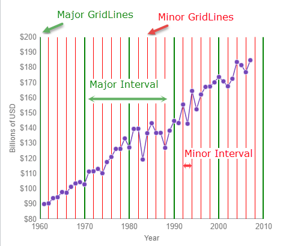

<!--
|metadata|
{
    "fileName": "whats-new-in-2015-volume2",
    "controlName": [],
    "tags": []
}
|metadata|
-->

#What's New in 2015 Volume 2

This topic presents the controls and the new and enhanced features for the Ignite UI™ 2015 Volume 2 release.

##What’s New Summary

The following summarizes what’s new in 2015 Volume 2. Additional details follow.

### General

Feature | Description
---|---
[New Ignite UI Scaffolder for MVC](#igniteui-scaffolder) | New scaffolder for Ignite UI widgets.
Full support for ASP.NET MVC 6 for all Ignite UI widgets | The Infragistics.Web.Mvc.dll now includes version build against ASP.NET MVC 6.
Ignite UI TypeScript 1.5 definitions | The Ignite UI TypeScript definitions now support TypeScript 1.5. Intellisense is added for widget methods.

### igCombo
Feature | Description
---|---
Auto complete | Typing in the combo will now suggests the first matching result from the list. [View sample](%%SamplesUrl%%/combo/filtering)
[Grouping](#combo-grouping) | You can now group items in the combo list. [View sample](%%SamplesUrl%%/combo/grouping)
Header and Footer Templates | Header and footer can now be configured in the combo using templates. [View sample](%%SamplesUrl%%/combo/templates) 
RTL Support | Added support for right-to-left languages.
[Dropdown Orientation](#combo-dd-orientation) | By default the dropdown list will automatically display on top or bottom depending on the available space. You can also explicilty configure its behavior with the `dropDownOrientation` option. 
Custom Values | The option `allowCustomValue` to set custom values in combo’s text input was dropped in 15.1, but we listened to your feedback and we are enabling this back in this release. [View sample](%%SamplesUrl%%/combo/editing)
Performance Improvements | We ensure all interactions with the combo work smoothly with more than 10 000 records. Initial loading time, dropdown opening and closing animations, selection, typing with auto complete and auto select – it all works blazing fast. 

### igDataChart

Feature | Description
---|---
[New Axis Intervals](#chart-axis-intervals) | The Major and Minor intervals feature of the `igDataChart` control allows you to apply intervals with the specified color and thickness to the x and y axes of the `igDataChart` control.

### Editors

Feature | Description
---|---
[New editors](#new-editors)| In 15.2, we are shipping a brand new editors that are more robust, feature rich and performant.

### igGrid

Feature | Description
---|---
[Refactored Updating](#grid-refactored-updating) | The refactored grid Updating feature takes advantage of the new editors and validation mechanisms and offers a re-designed dialog edit mode experience.
Column Auto Sizing | Grid columns now support automatic resizing based on the width of cell content. To enable auto-sizing use the `*` as a value of a column's [`width`](%%jQueryApiUrl%%/ui.iggrid#options:columns.width) option.
[Filtering Improvements](#grid-filtering-improvements) | You can now add a custom filter condition and choose the filtering conditions for a specific column.
Improved KnockoutJS support | Responsive Vertical Column rendering is now supported with KnockoutJS.
JavaScript-based Excel Grid Exporter (RTM) | JavaScript-based Excel Grid Exporter is now RTM and supports igGrid, igTreeGrid and igHierarchicalGrid.
ARIA support | We now comply with the W3C WAI-ARIA specification to ensure our customers can provide their disabled users with satisfactory experience.
[RowSelectors Improvements](#grid-row-selectors-improvements)  | You can now enabled selection across all pages when Row Selectors with checkboxes and Paging are enabled.

### igHierarchicalGrid

Feature | Description
---|---
JavaScript-based Excel Grid Exporter (RTM) | JavaScript-based Excel Grid Exporter is now RTM and supports igGrid, igTreeGrid and igHierarchicalGrid.
ARIA support | We now comply with the W3C WAI-ARIA specification to ensure our customers can provide their disabled users with satisfactory experience.

### igTreeGrid

Feature | Description
---|---
[Row Selectors](#treegrid-row-selectors) | TreeGrid Row Selectors feature inherits the functionality from the igGrid Row Selectors feature and add additional tri-state mode.
[Remote Sorting, Paging, Filtering and Load on Demand in the TreeGrid MVC Wrapper](#treegrid-remote-mvc-features) | All the standard sorting, paging, filtering and load on deamand functionalities now work out of the box within the MVC wrapper in a remote scenario.
Column Moving | TreeGrid now features Column Moving feature which inherits from its igGrid counterpart.
Resizing | TreeGrid now features Resizing feature which inherits from its igGrid counterpart.
Keyboard Navigation | Keyboard navigation in TreeGrid is improved. 
[Paging Context Row](#treegrid-paging-context-row) | Paging context row is added to communicate the context of a leaf level row.
JavaScript-based Excel Grid Exporter (RTM) | JavaScript-based Excel Grid Exporter is now RTM and supports igGrid, igTreeGrid and igHierarchicalGrid.
ARIA support | We now comply with the W3C WAI-ARIA specification to ensure our customers can provide their disabled users with satisfactory experience.

### igNotifier
Feature | Description
---|---
[New component](#notifier) | The Notifier component is an extension of the popover component, which specializes in providing the end user with notification information.

### igValidator
Feature | Description
---|---
[Refactored Validator](#validator) | The Validator is reworked to allow flexible validation on an array of Ignite UI components, as well as standard input form elements

### igUpload

Feature | Description
---|---
Sending additional data between the client and server during file uploading | You can now transmit data between client and server during the file uploading process.

##General

###  New Ignite UI Scaffolder for MVC

We release a brand new Scaffolder for Ignite UI widgets. With this we boost developer productivity greatly by providing code generation and templates to quickly target standard data scenarios like creating, reading, updating and deleting data. With a few clicks you can completely configure a Grid, generate a controller and save time on manual coding. Configuring other widgets as HierarchicalGrid, TreeGrid, Data Chart and others are already in the works.
Along with the standard templates for create, edit, delete, details and list that ship with ASP.NET MVC, we provide customized Ignite UI templates that use the new editor widgets.

#### Related Topics

-   [Ignite UI Scaffolder Visual Studio extension](MVC-Scaffolding.html)

## igCombo
### 
####Grouping
All new Grouping functionality will provide a way items to be grouped and distinguished according to categories they belong, like an employee and the department that he belongs to.

### 
####DropDown orientation
By default the dropdown orientation is set to 'auto' and this means that according to the available space above and below the combo, the dropdown position will be calculated automatically. You can set the value to be 'bottom' in order to open in below, and 'top' for above.

#### Related Samples

-   [Auto Complete](%%SamplesUrl%%/combo/filtering) 
-   [Grouping](%%SamplesUrl%%/combo/grouping)
-   [Header and Footer Templates](%%SamplesUrl%%/combo/templates)
-   [Custom Values](%%SamplesUrl%%/combo/editing)

## igDataChart

###  New Axis Intervals

The igDataChart now allows you to implement both Major and Minor intervals for all Numeric and Category type axes, via the Interval and MinorInterval properties. This feature also includes the ability to customize the color and thickness for intervals via the MajorStroke, MajorThickness, MinorStroke and MinorThickness properties, exposed from the chart axes.

The following example demonstrates the use of Major and Minor Axis Intervals on the NumericX Axis of an igDataChart LineSeries.

This example demonstrates the use of Major and Minor Axis Intervals on the NumericY Axis of an igDataChart LineSeries.

#### Related Topics

-   [igDataChart Overview](igDataChart-Overview.html)
-   [Configuring Axis Intervals (igDataChart)](igdatachart-configuring-axis-intervals.html)

#### Related Samples

-   [NumericAxesIntervals](igDataChart-Axis-Intervals.html#preview) : This sample demonstrates the use of Major and Minor Axis Intervals on the ScatterLineSeries, using NumericX and NumericY Axes.
-   [CategoryXAxisIntervals](igDataChart-Axis-Intervals.html#categoryxexample) : This sample demonstrates the use of Major and Minor Axis Intervals on the ColumnSeries, using CategoryXAxis.

## Editors

###  New Editors

One of our main goals with this release was to provide you with more robust, feature rich and excellent performing editor widgets. Our editor components offer a lot of functionality, backed by a significant amount of code. This latest release marked another major development campaign for the editor suite, since our dev teams re-architected all editors to optimize their usability and also added a new component – the Checkbox widget.
Here are some of the main goals of the new editors:
 - Superior User Experience - We revisited the whole UX of every editor so now we provide much better experience out of the box. We include HTML5 editing benefits, modern look and feel and touch-friendly interface. We took care of every detail from label positioning to validation and interaction in different states.
 - More Intuitive API - No need to look at the help topics again. We made it so intuitive, so discoverable that you basically sit and code like it was you who wrote the control. The new API talks more for itself and is freed from unnecessary methods and options.
 - Improved Reliability - Reduced code complexity, increased performance and high testability are just part of the overall higher quality we ship with this new release.

For information on how to migrate to the new editors see the "Related Topics" section below.

#### Related Topics

-   [Migrating to the new igCurrencyEditor](migrating-to-the-new-igcurrencyeditor.html)
-   [Migrating to the new igDateEditor](migrating-to-the-new-igdateeditor.html)
-   [Migrating to the new igMaskEditor](migrating-to-the-new-igmaskeditor.html)
-   [Migrating to the new igNumericEditor](migrating-to-the-new-ignumericeditor.html)
-   [Migrating to the new igPercentEditor](migrating-to-the-new-igpercenteditor.html)
-   [Migrating to the new igTextEditor](migrating-to-the-new-igtexteditor.html)
-   [Migrating to the new igDatePicker](migrating-to-the-new-igdatepicker.html)

#### Related Samples

-   [New Text Editor](%%SamplesUrl%%/editors/text-editor)
-   [Credit](%%SamplesUrl%%/editors/credit)
-   [Numeric Editor](%%SamplesUrl%%/editors/numeric-editor)
-   [Mask Editor](%%SamplesUrl%%/editors/mask-editor)
-   [Checkbox Editor](%%SamplesUrl%%/editors/checkbox-editor)
-   [Date Editor](%%SamplesUrl%%/editors/date-editor)

## igGrid

###  Refactored Updating
The newly refactored grid Updating feature takes advantage of the new Editors and validation mechanisms. Also new is the refactored dialog edit mode (now renamed to "Row Edit Dialog" to better reflect its purpose), which offers a redesigned look and a new architecture, which makes it very easy to customize it. See [Migrating to the new Updating (igGrid)](iggrid-updating-migrating-to-the-new-updating.html) for information on how to migrate to the refactored Updating feature. 
Last, but not least, the new updating functionality of the grid component has been refactored to make the code lighter, more flexible and optimized.

 
#### Related Topics
-   [Migrating to the new Updating (igGrid)](iggrid-updating-migrating-to-the-new-updating.html)
-   [Row Edit Dialog Overview (igGrid)](iggrid-updating-roweditdialog.html)
-   [Configuring the Row Edit Dialog (igGrid)](iggrid-updating-roweditdialog-configuring.html)

#### Related Samples
-   [Row Edit Dialog](%%SamplesUrl%%/grid/row-edit-dialog)
-   [Editing: Custom Editor Provider](%%SamplesUrl%%/grid/editing-custom-editor-provider)

###  Filtering Improvements

You can now add a custom filter condition and choose the filtering conditions for a specific column.

Two new options are introduced in the Filtering feature:
- [`customConditions`](%%jQueryApiUrl%%/ui.iggridfiltering#options:columnSettings.customConditions) - an array of objects defining custom condtions per column basis.

- [`conditionList`](%%jQueryApiUrl%%/ui.iggridfiltering#options:columnSettings.conditionList) - an array of consitions to be enabled per column basis.

#### Related Samples
-   [Filtering](%%SamplesUrl%%/grid/custom-conditions-filtering)

###  RowSelectors Improvements
When Paging feature is enabled in combination with Row Selectors an additional UI is introduced to allow users to select all rows across all pages.

This functionality can be enabled via the [enableSelectAllForPaging](%%jQueryApiUrl%%/ui.iggridrowselectors#options:enableSelectAllForPaging) option together with [enableCheckBoxes](%%jQueryApiUrl%%/ui.iggridrowselectors#options:enableCheckBoxes) and [multipleSelection](%jQueryApiUrl%%/ui.iggridselection#options:multipleSelection) options.

#### Related Topics
-   [Configuring Row Selectors(igGrid)](iggrid-configuring-row-selectors.html)

## igTreeGrid

###  Row Selectors

The Row Selectors feature for the igTreeGrid is extended from the igGrid RowSelectors. 
The feature is customized to ease selection in hierarchical data by introducing two new functionalities: hierarchical numbering mode and tri-state checkboxes.
In hierarchical numbering mode row number includes the counters for each level in the hierarchy. The functionality is controlled by the [`rowSelectorNumberingMode`](%%jQueryApiUrl%%/ui.igtreegridrowselectors#options:rowSelectorNumberingMode) option.

 
Tri-state checkboxes introduces a partially checked state to indicate that a partent row has checked child rows. The functionality is controlled by the [`checkBoxMode`](%%jQueryApiUrl%%/ui.igtreegridrowselectors#options:checkBoxMode) option.

Additionally when Paging feature is enabled in combination with Row Selectors an additional UI is introduced to allow users to select all rows across all pages.

 
#### Related Topics
-   [Row Selectors (igTreeGrid)](igtreegrid-row-selectors.html)

#### Related Samples
-   [Row Selectors](%%SamplesUrl%%/tree-grid/row-selectors)

###  Remote Sorting, Paging, Filtering and Load on Demand in the TreeGrid MVC Wrapper

TreeGrid MVC Wrapper now handles the Sorting, Paging, Filtering and Load on Demand remote operations out of the box.
You just need to decorate the action that handles the remote features with the `TreeGridDataSourceAction` attribute.  
 
#### Related Topics
-   [Remote Features (igTreeGrid)](igtreegrid-remote-features.html)

#### Related Samples
-   [Remote Features](%%SamplesUrl%%/tree-grid/remote-features)

###  Paging Context Row

With large hierarchical data sets sometimes you might find yourself in trouble figuring out where you are in the hierarchy. We add a new paging context row to communicate the context of a leaf level row. This shows a trail representing the full path of the leaf through all ancestors. The available contexts are:
    - none - context row is not rendered.
    - parent - renders a read-only representation of the immediate parent row.
    - breadcrumb - renders a read-only breadcrumb trail representing the full path through all ancestors.
The functionality is controlled by the [`contextRowMode`](%%jQueryApiUrl%%ui.igtreegridpaging#options:contextRowMode) option.

#### Related Topics
-   [Paging (igTreeGrid)](igtreegrid-paging.html)

#### Related Samples
-   [Paging](%%SamplesUrl%%/tree-grid/paging)

## igNotifier

###  New component

The Notifier component is an extension of the Popover component, which specializes in providing the end user with notification information. There are four predefined states of notification - success, info, warning, and error. 
The component supports a popover mode, as well as simple inline-style messaging. In addition to this, there is automatic pairing with editor widgets to allow detection of erroneous input, which is outside of the predefined range. 
Whether used with an Ignite UI widget or on its own, the Notifier component provides an easy and intuitive way to improve user experience.

#### Related Topics
-   [igNotifier Overview](ignotifier-overview.html)

#### Related Samples
-   [Basic Usage](%%SamplesUrl%%/notifier/basic-usage)
-   [Inline messages](%%SamplesUrl%%/notifier/inline-messages)
-   [Notifier with igEditors](%%SamplesUrl%%/editors/with-igEditors)

## igValidator

###  Refactored Validator

The refactored igValidator component allows flexible validation on an array of Ignite UI components, as well as standard input form elements. The mechanism uses the igNotification component capabilities to both handle the validation process and display flexible and visually appealing notifications to the end user. See [Migrating to the new igValidator control](igvalidator-migration-topic.html) for information on how to migrate to the refactored igValidator.

#### Related Topics
-   [igValidator Overview](igvalidator-overview.html)
-   [Migrating to the new igValidator control](igvalidator-migration-topic.html)

#### Related Samples
-   [Basic Usage](%%SamplesUrl%%/validator/basic-usage)
