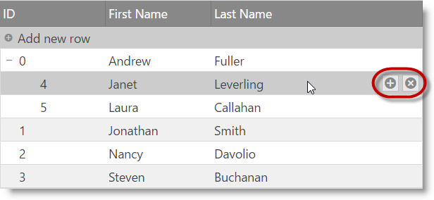
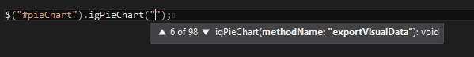
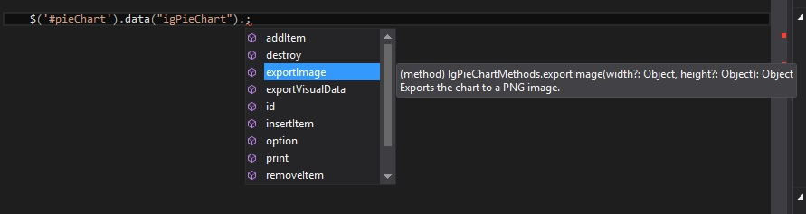

<!--
|metadata|
{
    "fileName": "whats-new-in-2016-volume1",
    "controlName": [],
    "tags": []
}
|metadata|
-->

#What's New in 2016 Volume 1

This topic presents the controls and the new and enhanced features for the %%ProductName%%™ 2016 Volume 1 release.

##What’s New Summary

The following summarizes what’s new in 2016 Volume 1. Additional details follow.

### General

Feature | Description
---|---
New Bootstrap 4 theme | A new Bootstrap 4 compatible theme is now shipped with %%ProductName%% - [view sample](%%SamplesUrl%%/themes/bootstrap4-default).
Angular 2 Components (CTP) | %%ProductName%% widgets have component wrappers for Angular 2. For detailed information visit [%%ProductName%% Angular 2 GitHub](https://github.com/IgniteUI/igniteui-angular-wrappers) page.|
New scalable font icons | The default Infragistics theme now uses [jQuery UI font icons](https://github.com/mkkeck/jquery-ui-iconfont) instead of image icons. |
Modernizr 3.x support | %%ProductName%% uses Modernizr library to detect touch environments (see [Touch Support for %%ProductName%% Controls](Touch-Support-for-NetAdvantage-for-jQuery-Controls.html)). [Mordernizr 3.x](https://modernizr.com/) is now supported along with older Modernizr versions. |

### igTileManager

Feature | Description
---|---
Splitter Options| `splitterOptions` now replaces the `showSplitter` option. Besides showing and hiding, additional functionalities are added. You can configure the splitter to be collapsible as well as attach to its collapsed/expanded events. Since `showSplitter` option will no longer be available, you can refer to the following sample to see how the new option can be used - [view sample](%%SamplesUrl%%/tile-manager/collapsible-splitter).

### igDataSource

Feature | Description
---|---
New field option - `mapper`| For field with dataType="object" we now allow setting a [`mapper`](%%jQueryApiUrl%%/ui.iggrid#options:columns.mapper) function, which can be used for complex data extraction from complex objects, whose return value will be used for all data operations executed on the specific field.    You can find more detailed information in the following topic: [igDataSource Overview](igDataSource-igDataSource-Overview.html#schema-fields-mapper)|

### igGrid

Feature | Description
---|---
New column option - mapper| For columns with dataType="object" we now allow setting a mapper function, which can be used for complex data extraction from complex objects, whose return value will be used for all data operations executed on the specific column.- [view sample](%%SamplesUrl%%/grid/handling-complex-objects).   You can find more detailed information in the following topic: [Columns and Layout](igGrid-Columns-and-Layout.html#defining-mapper)|
The ColumnFixing feature now works with grid width set in percentage| The ColumnFixing feature now works when the grid width is set in percentage.   **Note**: The column widths should still be defined in pixels units (either explicitly or using the [defaultColumnWidth](%%jQueryApiUrl%%/ui.iggrid#options:defaultColumnWidth) option).|
[Multi-Row Layout feature](#multi-row-layout)| The Multi-Row Layout feature enables you to create complex grid record layouts, that contain multiple rows with cells in them spanning multiple columns and rows. |
[Checkbox Appearance](#checkbox-appearance)| Checkbox column visual appearance have changed to indicate that the checkmarks are not interactable in display mode. |
Paste from Excel sample| A new sample is added that demonstrates pasting Excel clipboard data into igGrid - [view sample](%%SamplesUrl%%/grid/paste-from-excel). |

### igTreeGrid

Feature | Description
---|---
[Improved Updating feature](#treegrid-updating) | igTreeGrid Updating feature now adds the UI for adding root and child level rows.

### TypeScript Support

Starting with 16.1 release %%ProductName%% the minimum supported TypeScript version is 1.4.

Feature | Description
---|---
[Support for union types](#union-types) | widget members now support union types which greatly improves type checking.
[Intellisense improvements](#intellisense-improvements) | Intellisense is improved for options and methods.
[Member descriptions](#member-descriptions) | All members now have a description.

## igGrid

###  Multi-Row Layout feature

The Multi-Row Layout feature enables you to create complex grid record layouts, that contain multiple rows with cells in them spanning multiple columns and rows. Such structure allows for greater rendering flexibility for grids with many columns that would otherwise require a horizontal scrollbar or when the data shown is better presented in a non-tabular fashion.
Initializing the Multi-Row Layout is done entirely through the igGrid's column collection. Four new properties are added to the column definition that specify the position and size of the column - [`rowIndex`](%%jQueryApiUrl%%/ui.iggrid#options:columns.rowIndex), [`columnIndex`](%%jQueryApiUrl%%/ui.iggrid#options:columns.columnIndex), [`rowSpan`](%%jQueryApiUrl%%/ui.iggrid#options:columns.rowSpan) and [`colSpan`](%%jQueryApiUrl%%/ui.iggrid#options:columns.colSpan).

 
#### Related Topics
-   [Grid Multi-Row Layout](igGrid-MultiRowLayout.html)

#### Related Samples
-   [Multi-Row Layout](%%SamplesUrl%%/grid/multi-row-layout)

###  Checkbox Appearance
Checkbox column visual appearance have changed and it's square box is not going to be rendered when the grid is in display mode. What would be provided is only a plain checkmark. This change is due to refinement of the experience for the end-users, who naturally perceived that this was an interactive element, which they can click to toggle.

#### Related Topics
-   [Rendering Checkboxes on a Column](igGrid-Columns-and-Layout.html#checkboxes)

#### Related Samples
-   [Checkbox Column](%%SamplesUrl%%/grid/checkbox-column)

## igTreeGrid

###  Improved Updating feature

The "Add new row" user interface is now enabled and along with it TreeGrid Updating supports adding new records not only directly to the root level, but also adding a child records to a specified level as through the UI, as well through the API.
The "Add child row" button is available next to the "Delete row" button when a row is hoovered with the mouse or swiped left or right when on touch enabled device.

The add new row UI is rendered inline next to its parent.

#### Related Topics
-   [Updating (igTreeGrid)](igTreeGrid-Updating.html)

#### Related Samples
-   [Updating](%%SamplesUrl%%/tree-grid/updating)

## TypeScript Support

###  Support for union types

[Union types](https://github.com/Microsoft/TypeScript/blob/master/doc/spec.md#3.4) introduced in TypeScript 1.4	allows for a variable or a member to have one of a set of several types. Previously members that were declared as type `any` now use union types to declare a more specific type. 

###  Intellisense improvements

Intellisense is improved for options and methods to suggest all widget`s overloads.

#### Option overloads

All possible options with getters and setters are now listed in the intellisense.

#### Method overloads

All possible methods with their parameters are now listed in the intellisense.

#### Methods intellisense on the widget's `data`
In jQuery UI syntax the widget methods can be invoked from the widget's data: $(".selector").data('widgetName'). This is now possible with the %%ProductName%% TypeScript directives.

###  Member descriptions

Widget options, events and methods now feature descriptions. The description can be seen in intellisense suggestions for improved usability of the widgets.

