<!--
|metadata|
{
    "fileName": "jquery-whats-new-12-1-landing-page",
    "controlName": [],
    "tags": []
}
|metadata|
-->

# What's New in 2012 Volume 1

## New Features

The following table summarizes the new features of Ignite UI™ 2012 Volume 1 release. Additional details are available after the summary table.

- [Hierarchical grid GroupBy](#hierarchical-grid-grouping): The grouping functionality available for flat grids is now fully supported for hierarchical grids.

- [Hierarchical grid selection](#hierarchical-grid-selection): The selection functionality available for flat grids is now fully supported for hierarchical grids.

- [Hierarchical grid row selectors](#hierarchical-grid-row-selectors): The row selection functionality for flat grids is now fully supported for hierarchical grids.

- [Checkbox editor for igGrid](#checkbox-editor): Checkbox editors are now available for the `igGrid`™ control for Boolean data type columns.

- [Grid net transactions](#grid-net-transactions): The grid editing functionality has been optimized to report only net transactions from the control when data is updated, added or deleted.

- [Grid Virtualization](#grid-virtualization): Virtualization is now supported for hierarchical grids and in GroupBy mode to allow better user interface performance.

- [AutoGenerateColumns property in the Grid MVC wrapper](#autogeneratecolumns-mvc): The behavior of the AutoGenerateColumns property is changed: if set to true along with explicitly defined columns with individual column options the Grid MVC wrapper first renders the defined columns and then automatically binds new columns to all the data source fields, and renders them after the defined columns.

- [igHierarchicalGrid binding to OData](#hierarchical-grid-odata): When binding `igHierarchicalGrid` to OData service you do not need to use JSONPDataSource as middle layer and instead you can directly set the OData Service URL as grid data source.

- [Charting](#charting): The `igDataChart`™, `igPieChart`™ and `igChartLegend`™ controls are new charting controls rendering rich data visualizations on an HTML5 canvas.

- [Charts Motion Framework](#charts-motion-framework): The charting controls support the new Motion Framework which allows chart contents to be animated in different ways.

- [Templating engine for jQuery controls](#templating-engine): The new `igTemplating`™ engine has been added to the Ignite UI bundle. The `igTemplating` engine exposes powerful capabilities to create templates for dynamic text rendering inside jQuery controls.

- [Mobile list view control](#mobile-list): The new `igListView`™ control provides list display and interaction functionality for jQuery Mobile platform.

- [Mobile rating control](#mobile-rating): The new `igRating`™ control for mobile devices has been implemented separately from the existing `igRating` control to address unique requirements of mobile and touch device environments.

- [iOS theme for mobile controls](#mobile-ios-theme): The new iOS theme for iPhone applications has been added to the Ignite UI library to provide better looks for mobile device applications.

- [Touch support](#touch-support): All controls in the Ignite UI library had been designed and tested to support touch interface for mobile devices.

- [Combo box load on demand](#combo-load-on-demand): Combo box load on demand is a new feature which improves `igCombo`™ performance by loading large sets of remote data on batches and not all at once.

- [Support for MVC validation](#mvc-validation): Support for MVC validation using data annotations has been incorporated into combo and editor controls.

- [New jQuery themes & JavaScript resources structure](#themes-resources-structure): All JavaScript and CSS resources in the Ignite UI library have been organized in a new folder structure and some of them have been renamed so that it is easier for developers using the library to figure out the purpose and location of each item. Note that this is a breaking change.

- [CSS/JS resources loader](#resources-loader): The new `igLoader` control has been added to allow easier JavaScript and CSS resources loading into web pages and in relation to the new resources structure.

- [Metro theme](#metro-theme): The new Metro theme has been added to allow better integration of Ignite UI controls into the new Metro UI for upcoming versions of Microsoft® Windows®.

##  Hierarchical grid GroupBy

The grouping functionality available for flat grids is now fully supported for hierarchical grids. It allows flexible grouping of rows based on one or more columns, calculation of summary values (subtotals) and configuring UI elements like expand/collapse button tooltips, group header row template and others. On the screenshot below you can see highlighted the main elements of the GroupBy feature: the grouping area at the top, and group header rows on root and child level. Note how grouped columns in child layouts are prefixed by the child layout name in the group-by area.

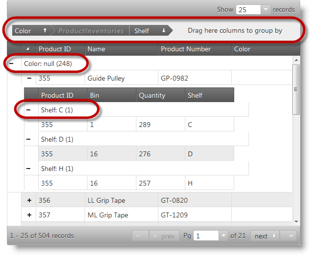

### Related Topics:

-   [igHierarchicalGrid Grouping Overview](igHierarchicalGrid-Grouping-Overview.html)

##  Hierarchical grid selection

The selection feature enables the selection of the rows and cells in the `igHierarchicalGrid`™ control. Its functionality closely follows the Microsoft® Windows Explorer™ and Microsoft® Excel™ selection and activation behaviors. It is possible to configure single only or multiple item selection. If multiple selection is enabled in a hierarchical grid the user can select multiple items in a single layout only. On the screenshot below you can see a hierarchical grid with some selected cells.

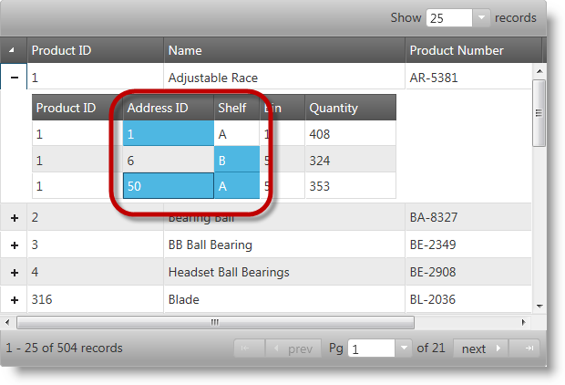

### Related Topics:

-   [igHierarchicalGrid Selection Overview](jQuery-igHierarchical-Grid-Selection-Overview.html)

##  Hierarchical grid row selectors

The row selection feature provides the user with the functionality to select entire rows by clicking on the row selector column placed on the left side of the first grid column. This functionality is provided by the `igRowSelectors`™ widget. In addition, to this main functionality, the widget provides optional row numbering and checkboxes for row selection. This widget works closely with the Selection feature but can also be used separately for its row numbering capability. There is a new option `showCheckBoxesOnFocus` which when enabled allows checkbox behavior to be modified: checkboxes do not appear initially and when the user clicks to select a row checkboxes show to make multiple selection easier. On the screenshot below you can see a grid with row selection column highlighted and one row selected.

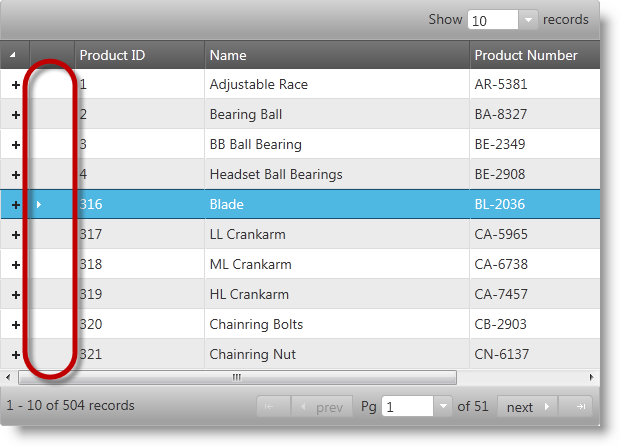

### Related Topics:

-   [Enabling Row Selectors for igHierarchicalGrid](igHierarchicalGrid-Enabling-RowSelectors.html)

##  Checkbox editor for igGrid

Boolean data columns can be rendered with checkboxes in flat and hierarchical grids. This provides user-friendly experience for dealing with Boolean type data. On the screenshot below you can see a grid with a Boolean column with checkbox editors.

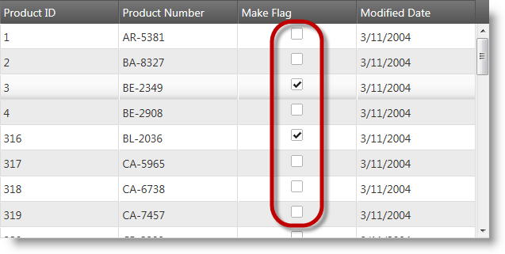

### Related Topics:

-   [igGrid Columns and Layout](igGrid-Columns-and-Layout.html)
-   [igHierarchicalGrid Columns and Layouts](igHierarchicalGrid-Columns-and-Layouts.html)

##  Grid net transactions

The grid editing functionality has been improved to report only net transactions from the grid control when data is updated, added or deleted. That means transactions which mutually cancel each other will not be reported and the client applications will get only the effective changes on the underlying data. For example. If a row is added and then deleted neither insert, nor delete transaction will be reported. On the picture below you can see a grid with an updated and deleted row.

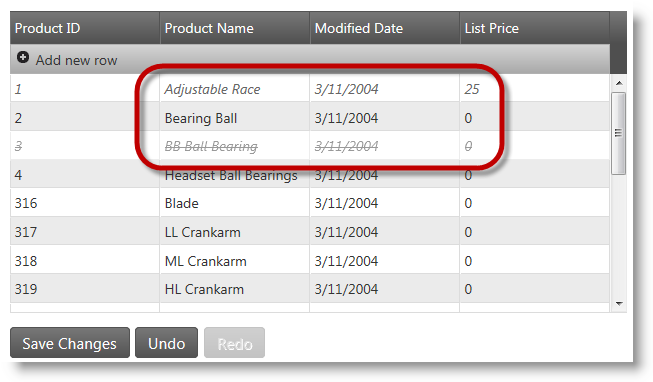

### Related Topics:

-   [igGrid Updating](igGrid-Updating.html)

##  Grid Virtualization

The virtualization technology used for better performance when displaying large data sets has been improved to support hierarchical grids and GroupBy mode for hierarchical grids. Now there are two virtualization modes: fixed and continuous. Fixed mode is the existing virtualization embedded in Ignite UI controls. Continuous mode is a new development that supports hierarchical grid and the group by feature to handle situations with variable child row count.

### Related Topics:

-   [igGrid Virtualization Overview](igGrid-Virtualization-Overview.html)
-   [igHierarchicalGrid Virtualization Overview](igHierarchicalGrid-Virtualization-Overview.html)

##  AutoGenerateColumns property in the Grid MVC wrapper

Now the `AutoGenerateColumns` property in the MVC wrapper behaves the in the same way as the corresponding property in the `igGrid` widget. If you have `AutoGenerateColumns` property set to true along with defined columns settings array describing the individual column options the Grid MVC wrapper first renders the explicitly defined columns and then automatically binds all other columns to all the data source fields, and renders them after the defined columns. This is different from the Grid MVC behavior from the previous 11.2 release. There if you have definition of column settings and `AutoGenerateColumns` property set to true, only the defined columns are taken in an account.

Note: This change is present from the 11.2 Service Release.

##  igHierarchicalGrid binding to OData

When binding `igHierarchicalGrid` to OData service you do not need to use `JSONPDataSource` as middle layer and instead you can directly set OData Service URL as a grid data source. If you are not using this approach it is possible to encounter some of the following problems due to the complex nested schema:

-   Root remote feature does not work
-   Children from second level may not appear at all, accompanied by JavaScript error.

Note: This change is present from the 11.2 Service Release.

##  Charting

A new set of controls: `igDataChart`™, `igPieChart`™ and `igChartLegend`™ have been added to the library to address needs for working with charts in web pages. The controls are based on the HTML5 Canvas element and Canvas API.

-   `igDataChart` -allows various types of data series to be represented like financial, bar/column, scatter, polar and radial.
-   `igPieChart` -designed to provide pie charts
-   `igChartLegend` - used internally to produce legends for charts.

On the screenshot below you can see a column chart with three data series.

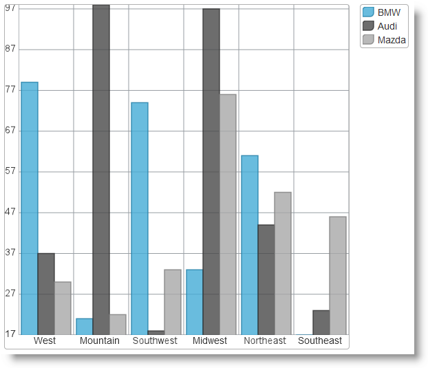

### Related Topics:

-   [igDataChart Overview](igDataChart-Overview.html)
-   [igPieChart Overview](igPieChart-Overview.html)

##  Charts Motion Framework

The Motion Framework for charts allows developers using the Ignite UI chart controls to animate the contents of a chart to increase visual appeal and imply trends or other meaning behind the data. The basic principle behind the framework is that whenever data behind the chart is updated the corresponding API method of the `igDataChart` control is called to initiate chart animation.

### Related Topics:

-   [Motion Framework for Charts](igDataChart-Motion-Framework.html)

##  Templating engine for jQuery controls

The new `igTemplating` engine exposes to developers powerful capabilities to create templates for dynamic content rendering inside Ignite UI controls. This engine is used throughout the Ignite UI library instead of the jQuery templating plugin wherever the text in UI elements can be customized to display contents dynamically. On the screenshot below a template is applied on the first two columns of a data grid.

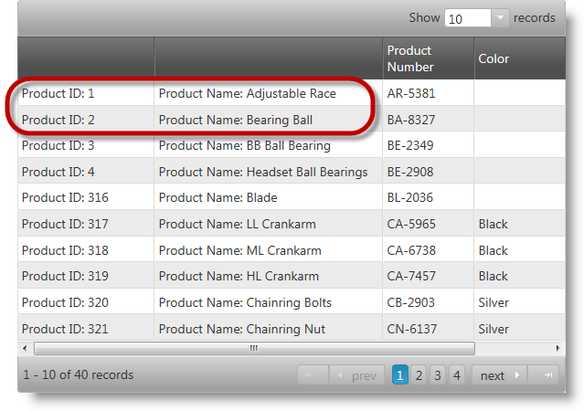

### Related Topics:

-   [igTemplating Overview](igTemplating-Overview.html)

##  Mobile list view control

The new `igListView`™ control provides list display and interaction functionality for jQuery Mobile platform. The mobile list view control can be bound to all the data sources available to `igDataSource` as well as to UL or OL HTML elements. The control supports hierarchical navigation following the jQuery Mobile navigation concepts. Templates can be used to customize the display and layout of list elements. Sorting, filtering and grouping functionality are also available. The mobile list view control supports load on demand to improve performance at runtime.

### Related Topics:

-   [igListView Overview](igListView-Overview.html)

##  Mobile rating control

The new `igRating` control for mobile devices has been implemented to support mobile and touch applications when customer ratings of items are a requirement. This is a separate control from the existing `igRating` control and its target is mobile devices with touch capability.

### Related Topics:

-   [igRating (Mobile) Overview](igRating%28Mobile%29-Overview.html)

##  iOS theme for mobile controls

The new iOS theme for the mobile Ignite UI controls has been implemented to target mobile devices. Its purpose is to provide more consistent look and better integration into iPhone and iPad mobile and touch capable applications.

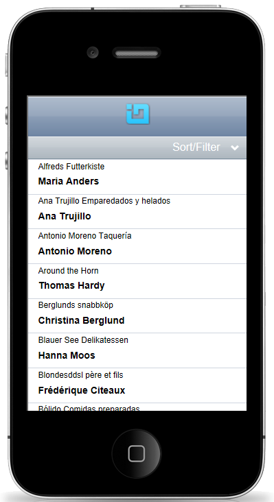

##  Touch support

All the Infragistics jQuery controls support touch interaction. New features and components have been added so that all the controls are touch interface compatible. The concept behind Infragistics jQuery controls is that they should look and behave the same way under Desktop and Touch platforms.

### Related Topics:

-   [Touch Support for Ignite UI Controls](Touch-Support-for-NetAdvantage-for-jQuery-Controls.html)

##  Combo box load on demand

The `igCombo` control supports configurable Load-on-Demand feature. Enabling load-on-demand significantly reduces the bandwidth and processing overhead on both the server and the client.

If Load-on-Demand is enabled, the user should first be able to see a scrollbar in the drop-down container, and if they scroll to the end of the list more items are fetched and appended at the bottom of the list through asynchronous callbacks.

### Related Topics:

-   [Load-on-Demand (igCombo)](igCombo-Load-on-Demand.html)

##  Support for MVC validation

MVC style validation with data annotations is incorporated into combo and editor controls. That feature allows seamless integration of Ignite UI validation capabilities with existing applications using data annotations.

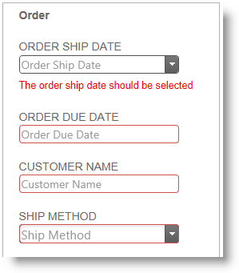

### Related Topics:

-   [Configuring ASP.NET MVC Validation](Configuring-ASP.NET-MVC-Validation.html)

##  New jQuery themes & JavaScript resources structure

All JavaScript and CSS resources in the Ignite UI library have been organized in a new folder structure and some of them have been renamed so that it is easier for developers using the library to figure out the purpose and location of each item. The new structure allows much faster script and resource loading by allowing applications to load only essentially required resources. Combined and minified version of the resources is still available.

Note:This is a breaking change.

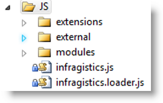

### Related Topics:

-   [JavaScript Files in Ignite UI](Deployment-Guide-JavaScript-Files.html)
-   [Upgrading Projects to the Latest Ignite UI Version](Manually-Updating-Previous-Versions.html)

##  CSS/JS resources loader

The new `igLoader` control has been added to allow easier JavaScript and CSS resources loading into web pages and in relation to the new resources structure. The control automates loading necessary resources and requires the application to specify the location of the Ignite UI JavaScript and CSS files. For pure HTML/jQuery pages it is required to specify which controls and which features will be instantiated on the page, for example. “`igGrid`.*” for all features of the flat grid, or “`igDataChart.Category`” for plotting category charts only. The MVC counterpart of the loader does not require applications to specify needed resources as it automatically detects which scripts and CSS files must be loaded.

The `igLoader` control is the easiest and recommended way to upgrade from previous versions and prevents the need to specify multiple JS and CSS files in the head part of web pages.

### Related Topics:

-   [Upgrading Projects to the Latest Ignite UI Version](Manually-Updating-Previous-Versions.html)

##  Metro theme

The new Metro theme is a result of research efforts to give native Metro UI look and feel to Ignite UI controls for upcoming versions of Microsoft® Windows®. It aims not only styling and colors but also behavior and touch friendly user interface. On the picture below you can see a flat grid with the Metro theme applied.

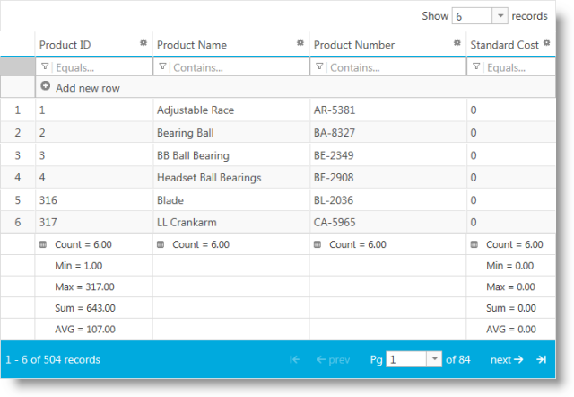

### Related Topics:

-   [Styling and Theming in Ignite UI](Deployment-Guide-Styling-and-Theming.html)

 

 

